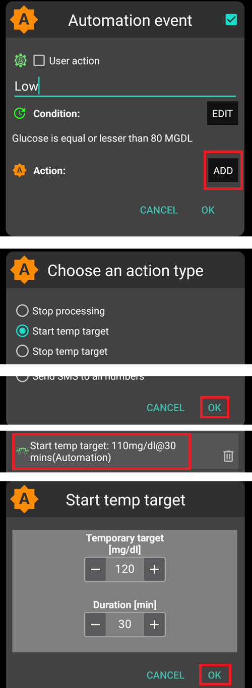

# Автоматизация

## Что такое автоматизация?

"**Automation**" is a feature which can automate task for AAPS.

Automations performs specific actions based on one or more conditions or triggers. Triggers can include irregular events like low or high blood glucose (BG) levels, or a set amount of negative insulin on board (IOB). Automations can also handle recurring events, such as meals or exercise at certain times of day, or when the user is within a specific distance of a GPS location or a WIFI SSID area. Automation can execute AAPS settings backups based on a schedule or on every Pod change.

Automations rules are created and modified from the Automations tab. Each rule is defined by two properties:

- One or more conditions or 'triggers' that start an action.

    Think of a certain time schedule, an event or properties value in AAPS

- One or more actions to perform.

    Such as an alarm or settings a profile percentage or exporting the AAPS settings on Pod change.


There are a wide range of Automation options, and users are encouraged to study these within the AAPS app, in the Automation section. You can also search the AAPS user groups on  and  for Automation examples from other users.

## Как может помочь автоматизация

1. **Automate reoccurring tasks:** Automatically executing programmed actions without user interaction.

1. **Уменьшить стресс при принятии решений:** Основное преимущество **автоматизаций** заключается в освобождении пользователя от необходимости ручной корректировки работы **AAPS**. [Исследования](https://www.ncbi.nlm.nih.gov/pmc/articles/PMC6286423/#ref4) показывают, что людям с сахарным диабетом 1 типа, приходится принимать в среднем 180 дополнительных решений в день. **Автоматизация** может уменьшить эту нагрузку, высвобождая умственную энергию пользователя для других аспектов жизни.

1. **Потенциально улучшить контроль за СК:** например, **автоматизация** может обеспечить установку **временных целей** при необходимости, даже в напряженный рабочий день или моменты забывчивости. Для примера, если ребенок-диабетик имеет запланированные занятия спортом в школе по вторникам в 10:00 и четвергам в 14:00, имея необходимость в высокой **временной цели** за 30 минут перед активностью, то данную потребность покроет **автоматизация**.

1. **Дает возможность тонкой настройки AAPS**, чтобы он был более агрессивным или наоборот в конкретных случаях, зависящих от настроек пользователя. Например, срабатывание временно уменьшенного процента **профиля** на установленный период времени при появлении отрицательного активного инсулина **(IOB)** посреди ночи, показывающего возможную чрезмерную агрессивность установленного **профиля**.

Приводимый ниже пример показывает, как **автоматизация** может помочь устранить лишние ручные действия.

Пользователь упражняется каждое утро в 6 утра: ему необходимо каждый раз помнить об установке за час до этого временной цели для активности.


Пользователь настроил **автоматизацию**, чтобы в 5 утра включать временную цель для активности, чтобы убедиться в том, что его **СК** и активный инсулин **(IOB)** оптимальны для упражнений в 6 часов утра:


## Основные соображения перед началом применения автоматизации

1. Before setting up certain Automations, you should have reasonable **BG** control with **AAPS**. Automations should not be used to compensate for sub-optimal basal, **ISF** or **CR** settings (discussed further below). Избегайте автоматизации **смены профиля** для компенсации вылетов **ГК** вследствие, _например_, приема пищи, для этого лучше использовать другие методы (микроболюсы SMB и т.д.).

1. Как и любая другая техника, **НМГ**, **помпы** и телефоны не безупречны: Технические проблемы или ошибки сенсоров могут нарушать работу **автоматизаций**, требуя возможного ручного вмешательства.

1. **Требования к автоматизациям** могут меняться в течение жизни. При смене периодов работы/учебы/отдыха, устанавливайте себе напоминание о проверке того, какие **автоматизации** у вас на данный момент активны (их легко включить и выключить). Например, если у вас начались каникулы или отпуск, то автоматизации для школьных занятий спортом или ежедневных упражнений вы либо выключите, либо скорректируете время.

1. **Автоматизации** могут конфликтовать друг с другом, так что их рекомендуется проверять в безопасной обстановке с пониманием того, какие из них сработали с ожидаемым результатом, а какие - нет.

1. Если вы используете Autosens, то попробуйте использовать **временные цели** вместо **смены профилей**. **Временные цели TT** не сбрасывают Autosens на 0. **Переключатели профиля** сбрасывают Autosens.

1. Большинство **автоматизаций** следует устанавливать лишь на **определенный промежуток времени**, после которого **AAPS** сможет снова, если потребуется, повторить **автоматизацию**. Например, "установить временную цель 7.0 ммоль/л на 30 мин" или "установить **профиль 110%** на 10 мин" _и_ "установить временную цель 5.0 ммоль/л на 10 мин". Использование **автоматизаций** для внесения постоянных изменений (например, смены профиля) влечет за собой риск гипогликемии.

## Когда начать применять Автоматизацию?

**Автоматизации** могут быть созданы в **цели 10**.

## Где находятся настройки автоматизации в AAPS?

Depending on your [Config builder > General](../SettingUpAaps/ConfigBuilder.md) settings, **Automation** is located either in the ‘hamburger’ menu or as a tab with **AAPS**.

## Как настроить автоматизацию?

Чтобы настроить **Automation** создайте правило **AAPS** следующим образом:


* дайте название вашему "правилу";
* выберите хотя бы одно "условие";


* выберите одно "действие";



* убедитесь, что галочка в правой части **автоматизации** установлена, чтобы она выполнялась:


Чтобы отключить правило **Automation**, снимите галочку с поля слева от названия правила **Automation**. Пример ниже показывает **автоматизацию** "ВЦ Гипо" включенной и выключенной.


При настройке **автоматизации**, вы можете cначала проверить ее, используя действие "уведомление" внутри нее. Это заставляет**AAPS** сначала вывести уведомление, а не автоматизировать действие. Когда вы убедитесь, что уведомление запущено в правильное время/ при правильных условиях, правило **Автоматизации** может быть обновлено, с заменой "Уведомления" на ‘Действие’.


```{admonition} Important note
:class: note

**Автоматизации** активны даже при отключенном цикле!
```


## Ограничения безопасности

Для **Автоматизации** установлены ограничения безопасности:

* Значение ГК должно составлять от 72 до 270 мг/дл или от 4 до 15 ммоль/л).
* **Процент профиля** должен быть между 70% и 130%.
* Существует 5-минутный промежуток времени между выполнениями **Автоматизации** (и ее первым выполнением).

## Правильное использование отрицательных значений

```{admonition} Warning
:class: warning

Будьте осторожны при установке отрицательного значения в **автоматизации**
```

Необходимо соблюдать осторожность при выборе «отрицательного значения» в «Условиях», как например «менее чем» в **Automations**. Например:


**Пример 1:** Создание условия **"меньше чем"** -0.1 ммоль/л (или -2 мг/дл)

Запустит **автоматизацию** для любого числа, которое **строго меньше, чем** -0,1 (-2). Сюда войдут такие числа, как -0.2, -0.3, -0.4 (-4, -6, -8) и так далее. Помните, что само -0,1 (-2) **не** включено в это условие. (Условие "больше чем или равно -0.1 ммоль/л (-2 мг/дл)" _включает_ -0.1 ммоль/л или -2 мг/дл).

**Пример 2:** Создание условия "больше чем" -0,1 ммоль/л (или -2 мг/дл)

Запустит **автоматизацию** для любого числа, которое **строго больше, чем** -0,1 ммоль/л (-2 мг/дл). Сюда входят такие числа, как 0, 0.2, 0.4 ммоль/л (0, 4, 8 мг/дл) и любые другие положительные числа.

Важно тщательно учитывать точное назначение **автоматизации** при выборе этих условий и значений.

(automations-automation-triggers)=
## Automation Triggers


There are various ‘Triggers’ that can be selected by the user. Triggers are the conditions that must be met in order for the automation to execute. Приводимый ниже перечень не исчерпывающий:

**Trigger:** connect conditions

**Варианты:**

Несколько условий могут быть связаны при помощи
* “И”
* “Или”
* * "Исключительно либо" (что означает, что если применяется одно - и только одно из этих условий, то действие (действия) произойдет

**Trigger:** time vs. recurring time

**Варианты:**

* время = одно событие времени
* периодическое время = то, что происходит регулярно (т.е. раз в неделю, каждый рабочий день и т. д.)

**Trigger:** location

**Варианты:**

* в **конфигураторе** (Автоматизация) пользователь может выбрать необходимую ему службу определения местоположения.

**Trigger:** location service

**Варианты:**

* Использовать пассивное расположение: **AAPS** принимает локацию только в том случае, если ее запрашивают другие приложения.
* Использовать сетевую геолокацию: расположение вашего Wi-Fi.
* Используйте локатор GPS (Внимание! Может привести к чрезмерной разрядке аккумулятора!)

**Triggers** : pump and sensor data

* Cannula age trigger: Available for all pumps
* Insulin age trigger: Available for supported pumps
* Battery age trigger: Available for supported pumps
* Sensor age trigger: always available
* Pod Activation trigger: Available for patch pumps

Note that for all age related triggers the equal comparison is unlikely to trigger, so in that case two triggers are required to create a range

* Reservoir level trigger: Available for all pumps, comparison "NOT\_AVAILABLE" is not working for this trigger as the value is always filled in **AAPS**
* Pump battery level trigger: Available for supported pumps, comparison "NOT\_AVAILABLE" is not working for this trigger as the value is always filled in **AAPS**

## Действие


**Действия:** начать **Временную цель**

**Варианты:**

* **ГК** должна быть между 72 мг/дл и 270 мг/дл (4 ммоль/л и 15 ммоль/л)
* **ВЦ** работает только в том случае, если нет предыдущей временной цели

**Действия:** остановить **временную цель**

**Варианты:**

отсутствуют

**Действия:** **Установить процент профиля**

**Варианты:**

* **Профиль** должен быть между 70% и 130%
* Работает только в том случае, если предыдущий процент составляет 100%

После добавления «Действия» значения по умолчанию должны быть изменены на желаемую величину путем нажатия и изменения значения по умолчанию.


(Automations-the-order-of-the-automations-in-the-list-matters)=
## Порядок **автоматизаций** в списке играет роль
 <**AAPS** автоматизирует правила в порядке предпочтения, начиная с верхней части списка **Автоматизация**. Например, если **автоматизация** "Low" - самая важная, стоящая выше всех правил, то эта **автоматизация** должна находиться в самом верху списка **автоматизаций**, как показано ниже:


Для изменения приоритета **автоматизаций**, нажмите и удерживайте 4-строчную кнопку в правой части экрана. Меняйте порядок  **Автоматизаций**, перемещая правила вверх или вниз.


## Как удалить правила автоматизации

Для удаления правила **автоматизации** нажмите на значок корзины.


## Examples of Automations

Ниже приведены примеры **Автоматизаций**. Обсуждение **Автоматизаций** и того, как пользователи индивидуализировали свою  **Automation** можно найти в группах Facebook или в Discord. Приведенные ниже примеры не следует воспроизводить без хорошего понимания пользователем того, как будет работать **Автоматизация**.

### Временная Цель Низкая ГК

Эта **Автоматизация** запускает автоматическую  "Временную Цель Гипо", когда низкая **ГК** находится на определенном пороговом уровне.


### Временная цель Обеденный перерыв (с "Локацией")


Эта **Автоматизация** была создана для пользователя, который обедает на работе примерно в одно и то же время каждый будний день, но запускается только в том случае, если пользователь находится в пределах заданного ‘местоположения’.  Таким образом, если пользователя вдруг не будет на работе, эта **автоматизация** НЕ будет активирована.

Эта **автоматизация** установит низкую **временную цель** (ожидаемый прием пищи) в 13:00, чтобы снизить уровень СК до 5 ммоль/л (90 мг/дл) в качестве подготовки к обеду.

"Инициирующее" местоположение устанавливается путем ввода GPS-координат широты и долготы, как показано ниже:


Из-за союза "И" **Автоматизация** происходит только в "выбранное" время при нахождении пользователя на предопределенном месте.

Данная **автоматизация** не будет активирована ни в какое другое время в этом месте или же в это время за пределами 50 метров от установленных GPS-координат.

### Автоматизация по локации SSID WIFI

Использование SSID WI-Fi - хороший вариант для запуска **автоматизации** по нахождению в зоне действия определенной сети Wi-Fi (по сравнению с GPS), он достаточно точен, потребляет меньше заряда батареи и работает в закрытых помещениях, где GPS и другие службы определения местоположения могут быть недоступны.

Еще один пример установки **Временной Цели** на рабочие дни только перед завтраком (1).


Автоматизация **** запустится в 05:30am только в понедельник-пятницу (2)  
и при подключении к домашней сети wifi (3).


Затем она установит **временную цель** 75 мг/дл (4.1 ммоль/л) на 30 минут (4). Одно из преимуществ включения местоположения заключается в том, что правило не будет срабатывать, если пользователь путешествует в отпуске, например.


Ниже приведен скриншот с подробным описанием триггеров **автоматизации**:

1) Внутри основного "И" (оба условия должны быть соблюдены) 1) Повторяющееся время = Пн, Вт, Ср, Чт, Пт в 05:30  
1) SSID (название сети) Wi-Fi = My_Home_WiFi_Name


(automating-preference-settings-export)=

## Automating Preference Settings Export

### Unattended Exports: scheduled (daily)

Screenshots detailing the Automation triggers:

1) Condition: Recurring time = M,T,W,T,F At 8:00am 1) Action: Settings Export (For "Text in treatments" enter "Daily")


Note: Export execution will be logged on Careportal

### Unattended Exports: Pod Activation (patch pump only)

Screenshots detailing the Automation triggers:

1) Condition: Pod Activation 1) Action: Settings Export (For "Text in treatments" enter "Pod Activation: settings export")


Note: Export execution will be logged on Careportal. Note : Automation will not trigger **at all** if you have not done a manual settings export before. See [Preferences > Maintenance](#preferences-maintenance-settings) for proper activation of unattended settings export.


## Automation Logs

В <**AAPS** ведется журнал недавно сработавших **автоматизаций** в нижней части экрана на вкладке **Автоматизация**.

В приведенном ниже примере журнал показывает:

(1) в 01:58 ночи активируется правило “Низкий ГК запускает временный профиль Гипо”
* уровень ГК менее 75 мг/дл;
* дельта отрицательна (т. е. ГК снижается);
* время в пределах 01:00 и 06:00 утра.

**Автоматизация**:
* установит **временную цель** 110mg/dl на 40 минут;
* запустит временный 50% **профиль** продолжительностью 40 минут.

(2) в 03:38 утра срабатывает правило "Много углеводов после низкой ГК ночью"
* время в пределах 01:05 и 06:00 утра;
* уровень ГК выше 110мг/дл.

**Автоматизация**:
* изменит **профиль** на LocalProfile1 (т. е. отменит временный профиль, если таковой имеется)
* остановит **Врем Цель Temp Target** (если есть)


## Устранение неполадок

* Проблема: __Мои автоматизации не запускаются в AAPS__

Установите флажок справа от события **Автоматизации**, чтобы убедиться, что правило активировано.

## Устранение неполадок


* Проблема: __ Мои автоматизации запускаются в неправильном порядке.__

Проверьте порядок расстановки приоритетов правил, как описано ранее.

## Alternatives to Automations

Для опытных пользователей есть и другие возможности автоматизации задач с помощью IFTTT или приложения других разработчиков Android под названием Automate. 
