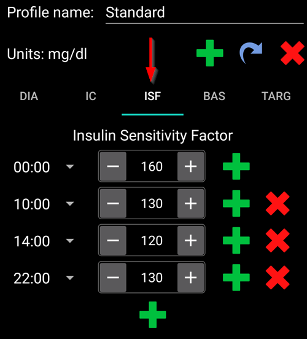
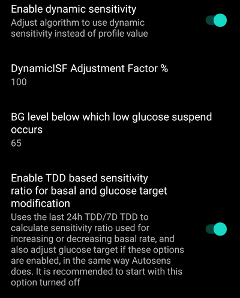

(возможности_Open-APS-DynamicISF)=
# Динамическое изменение коэффициента чувствительности к инсулину (DynISF)

До недавнего времени, фактор чувствительности к инсулину **ISF** в алгоритмах **AMA** и **SMB**, задавался в ** профиле** и был статичным для каждого конкретного времени суток. На самом деле, **ISF** человека не статичен и варьируется в зависимости от уровня **ГК**: на высоких сахарах пользователю понадобится больше инсулина, чтобы опустить **ГК** на 50мг/дл / 3ммоль/л по сравнению с тем, когда у него низкая **ГК**. Первый алгоритм, который попытался устранить эту сложность был [Autosens](#Open-APS-features-autosens) который корректировал **ISF** вне времени приема пищи.

Алгоритм **Динамической чувствительности к инсулину** (также сокращенно именуемый **DynISF**) служит этой же цели, но более совершенен, т. к. работает в любое время. Рекомендуется для опытных пользователей, которые хорошо разбираются в элементах управления и мониторинга своих **AAPS**. Ознакомьтесь с документом [ Что следует учитывать при работе с динамическим ISF](#dyn-isf-things-to-consider-when-activating-dynamicisf), приводимом ниже, прежде чем начать пользоваться этим алгоритмом.

```{admonition} CAUTION - Automations or Profile Percentage change
:класс: предупреждение

**Средства автоматизации** всегда следует использовать с осторожностью. Особенно это касается **Динамического ISF**.

При использовании **Динамической ISF** отключите любое временное изменение профиля, поскольку это может привести к чрезмерной агрессивности алгоритма** Динамической ISF** при коррекции болюса и привести к гипогликемии. Именно в этом заключается назначение динамической ISF, и поэтому нет необходимости сообщать AAPS о необходимости введения дополнительного инсулина с помощью автоматизации в случае высокой гликемии. Это особенно касается **Dynamic ISF**.

При использовании **Динамической ISF** отключите временное изменение профиля в настройках автоматизации, поскольку это может привести к чрезмерной агрессивности ** Динамической ISF** и гипогликемии. Именно в этом заключается назначение динамической ISF, и поэтому нет необходимости сообщать AAPS о необходимости введения дополнительного инсулина с помощью автоматизации в случае высокого уровня BGS.

```

Для работы **динамического ISF**, база данных **AAPS** должна иметь пользовательские данные минимум за 7 дней.

## Как работает Динамический ISF ?

**Динамический ISF** оперативно адаптирует коэффициент чувствительности к инсулину (**ISF**) в зависимости от потребностей пользователя:

- Суммарной суточной дозы инсулина (**TDD**) и
- текущего и прогнозируемого значения ГК.

При использовании **динамического ISF** значения **ISF**, введенные в **Профиле**, больше не используются, за исключением тех случаев, когда в **AAPS** недостаточно данных в базе TDD (*, напр.* при  новой переустановке приложения).

Алгоритмы **SMB/AMA** - пример ** профиля ** со статическим **ISF**, заданным пользователем.



Алгоритм **Динамического ISF** - пример **ISF**, который меняется в зависимости от работы этого алгоритма.


Участок, обведенный красным кружком, показывает: `ISF профиля` -> `ISF, рассчитанный с помощью DynISF`. <br/> При нажатии на этот участок отображается диалоговое окно с дополнительной информацией, такой как **ISF **для калькулятоа болюса и усвоения углеводов (см [ Другие варианты использования ISF](#dynisf-other-usages-of-isf) ниже).

Значение **DynISF** может быть показано на дополнительном графике, при активации «Переменной чувствительности». Она показана в виде белой линии (см. красную стрелку на изображении выше).

## Как рассчитывается динамическая чувствительность ISF?

**Dynamic ISF, Динамический ISF** использует модель Криса Уилсона для определения коэффициента чувствительности **ISF** вместо статического **ISF,** задаваемого пользователями в **Профиле**. Подробное объяснение можно найти здесь: [Крис Уилсон о чувствительности к инсулину (Коэффициент коррекции) в замкнутом цикле, 2/6/2022](https://www.youtube.com/watch?v=oL49FhOts3c).

Здесь применяется уравнение **динамического ISF**, которое выглядит следующим образом: `ISF = 1800 / ((TDD * коэффициент коррекции DynISF) * Ln ((текущая ГК /инсулин) + 1 ))`

Переменные, используемые в этом уравнении, приведены ниже.<br/> Примечание : `Ln` означает натуральный логарифм, математическую функцию.

Приведенное выше уравнение применяется для расчета текущего **ISF** и прогнозов oref1 [ относительно активного инсулина **IOB**, **ZT** (нулевого временного базала) и **непредвиденного приема пищи UAM**](#aaps-screens-prediction-lines). Оно используется и для расчета активных улеводов **COB**, а также в калькуляторе болюса (см. [Другие применения ISF](#dynisf-other-usages-of-isf) ниже).

### TDD (Общая суточная доза)
TDD использует комбинацию следующих значений:
1.  среднее значение **TDD** за 7 дней;
2.  **TDD **предыдущего дня; и
3.  средневзвешенное значение за последние восемь (8) часов применения инсулина, экстраполированное на 24 часа.

В приведенном уравнении значение **TDD**, взвешено на одну треть от каждого из приведенных выше значений.

### Настройка Коэффициента динамического диапазона чувствительности ISF

Он устанавливается в **настройках **для того, чтобы сделать **Динамический ISF** более или менее агрессивным. См. раздел [Настройки](#dyn-isf-preferences) ниже.

### Величина делителя Инсулина
Величина делителя инсулина зависит от пика используемого инсулина и обратно пропорциональна времени до пика. Для Люмжева его значение 75, для Фиаспа 65 и для обычных быстрых инсулинов 55.

### Коэффициент чувствительности инсулина ISF, основанный на прогнозируемой гликемии при принятии решений о дозировке

Динамическая чувствительность вычисляется с использованием текущего значения ** ГК** и отображается как текущий коэффициент чувствительности ISF в **AAPS**. Но при вычислении дозировок вместо этого алгоритм oref1 использует параметр **Future ISF**.

Это делается для того, чтобы предотвратить избыточные дозировки, когда **ГК** низка или прогнозируется низкой.

**Future ISF** использует ту же формулу, что и описанная выше, за исключением того, что в ней применяется **минимальная прогнозируемая гликемия** вместо **текущей ГК**. **Минимальная прогнозируемая ГК**, [рассчитанная в oref1](https://openaps.readthedocs.io/en/latest/docs/While%20You%20Wait%20For%20Gear/Understand-determine-basal.html), - это минимальное значение, которое, по прогнозам, достигнет гликемия в течение всего периода прогнозирования.

* Если текущее значение **ГК** превышает целевое значение <br/> ** и ** если уровни **ГК** не меняются в пределах +/-3 мг/дл: <br/>ГК в формуле имеет следующий вид: `среднее значение (минимальное прогнозируемое значение ГК, текущее значение ГК)`.
* Если конечный **уровень сахара в крови** превышает целевой, а уровень глюкозы повышается,<br/>  
  **или** возможная конечная **ГК** выше текущей **ГК**:<br/>то ГК в формуле выглядит так: `текущая ГК`.
* В иных случаях: <br/>ГК используется в формуле следующим образом: `минимальная прогнозируемая ГК`.

Для упрощения приводим снимок экрана, который иллюстрирует описанную выше ситуацию. Оранжевые точки отображают ** прогнозируемое значение ГК**, фиолетовые точки - **среднее значение (прогнозируемое значение ГК, текущее значение ГК)**, а синие точки **текущее значение ГК**.


(dynisf-other-usages-of-isf)=
## Другие примеры использования ISF

### ISF и усвоение активных углеводов COB

Как описано на странице [ Расчет активных углеводов COB](../DailyLifeWithAaps/CobCalculation.md), обычно поглощение углеводов рассчитывается по следующей формуле :   
`поглощенные_углеводы = отклонение * ic / isf`  
В алгоритме **Dynamic ISF**, **ISF** здесь - среднее значением динамического ISF за последние 24 часа.

### ISF в Калькуляторе болюса

В [ Калькуляторе болюса ](#aaps-screens-bolus-wizard) **ISF** применяется для коррекции, если **ГК** превышает целевое значение.

Алгоритм **Dynamic ISF** берет среднее значение динамического **ISF** за последние 24 часа.

(dyn-isf-preferences)=
## Настройки

Установите флажок **Включить динамическую чувствительность** в [Настройках > OpenAPS SMB](#Preferences-openaps-smb-settings) для активации алгоритма. После того как выбор сделан, становятся доступными новые настройки.



(dyn-isf-adjustment-factor)=
### Настройка Коэффициента динамического диапазона чувствительности ISF
**Dynamic ISF** работает на основе единого правила, которое подразумевает, что люди, имеющие одинаковую суточную дозу **TDD**, будут иметь одинаковую чувствительность. Поскольку у каждого человека своя индивидуальная чувствительность, корректирующий коэффициент ** Adjustment Facto** позволяет пользователю определить, является ли он более или менее чувствительным к инсулину, чем "обычный" человек.

Коэффициент **Adjustment Factor** есть величина между 1 и 300%. Он действует как множитель относительно суточной дозы **TDD**.

* Увеличение этого значения выше 100 % делает **DynISF** более агрессивным: значения **ISF** становятся * меньше* (_т.е._ требуется больше инсулина для снижения уровня **ГК** на небольшую величину)
* Понижение этого значения ниже 100% делает **DynISF** менее агрессивным: величина **ISF** растет (_, т.е. _ требуется меньше инсулина для небольшого понижения **ГК**).

**Корректирующий коэффициент ** также изменяется при активации [**Переключателя профиля ** в процентах](../DailyLifeWithAaps/ProfileSwitch-ProfilePercentage.md). Более низкий ** процент профиля** приведет к снижению ** корректирующего коэффициента**, а при более высоком ** проценте профиля**, наоборот.

Например, если **корректирующий коэффициент ** равен 80%, а в профиле ** установлен переключатель** на 80%, то корректирующий коэффициент **** будет равен `0.8*0.8=0.64`.

Это означает, что при работе алгоритма **DynISF** можно использовать **Процент профиля** для временной точной настройки чувствительности вручную. Может быть полезно при физической активности (более низкий процент), болезнях (более высокий процент) и т. д.

### Уровень ГК, ниже которого происходит остановка подачи инсулина

Значение **ГК**, ниже которого подача инсулина приостанавливается. По умолчанию используется стандартная целевая модель. Пользователь может установить это значение в диапазоне от 60 мг/дл (3,3 ммоль/л) до 100 мг/дл (5,5 ммоль/л). Значения ниже 65/3.6 приводят к использованию модели по умолчанию.

### Включить коэффициент чувствительности на основе суточной дозировки инсулина TDD для изменения базальной скорости и целевых значений гликемии

Эта настройка заменяет Autosens и базируется на суммарной суточной дозе **TDD** за последние 24 часа /7 ДНЕЙ **TDD** для увеличения и уменьшения базальной скорости, примерно так же, как и алгоритм Autosens. Эта вычисляемая величина также применяется для подстройки цели, если включены опции подстройки целей в зависимости от чувствительности. В отличие от Autosens, она не корректирует значения **ISF**.

(dyn-isf-things-to consider-when-activating-dynamicisf)=
## Что нужно учитывать при активации Dynamic ISF

* **Dynamic ISF** рекомендуется для опытных пользователей, которые хорошо разбираются в элементах управления и мониторинге своих **AAPS.**. В идеале, прежде чем переходить на **Dynamic ISF**, следует добиться хорошего контроля при помощи алгоритма **SMB**.
* Как отмечалось выше, отключите все [** настройки Автоматизации**](../DailyLifeWithAaps/Automations.md), которые активируют ** Процентное изменение профиля** относительно **ГК**, поскольку они агрессивны и могут привести к переизбытку инсулина! Они уже являются частью алгоритма **Dynamic ISF**.
* [Процент профиля](../DailyLifeWithAaps/ProfileSwitch-ProfilePercentage.md) учитывается в Dynamic ISF (см. [Корректирующий коэффициент Dynamic ISF](#dyn-isf-adjustment-factor) выше). Не рекомендуется менять **Процент Профиля** на отличный от 100% на длительное время. Если вы определите, что ваш ** профиль** изменился, создайте новый ** профиль** с измененными значениями, чтобы воспроизвести ** профиль** в определенном процентном соотношении.
* **Dynamic ISF** может кому-то не подойти. В частности, возможны неожиданные результаты, если возникнет одна из следующих ситуаций:
  * Непостоянный образ жизни (непоследовательный режим питания или физической активности)
  * Непостоянная суммарная суточная потребность TDD в инсулине или переменчивая чувствительность.
* Не существует точного руководства по установке начального значения ** Корректирующего коэффициента**. Однако, в качестве отправной точки: предполагая, что начальные параметры **Профиля** верны, когда вы в диапазоне и уровни **ГК** стабильны, значение **DynISF** должно быть примерно таким же, как у вас было в **Профиле** ранее.<br/>Если вы видите, что **Dynamic ISF** слишком агрессивен, уменьшите ** Корректирующий коэффициент**, и наоборот.
* Несмотря на то, что **DynISF** не использует **ISF** из Профиля, если ваша новая чувствительность сильно отличается от ранее сохраненной в **Профиле**, следует подумать о том, чтобы поддерживать ее в актуальном состоянии. Это может быть полезно на случай потери данных **AAPS** (_напр. _ новый телефон, новая версия **AAPS**...), поскольку ISF вашего ** профиля** будет использоваться в качестве резервной копии на следующие 7 дней.