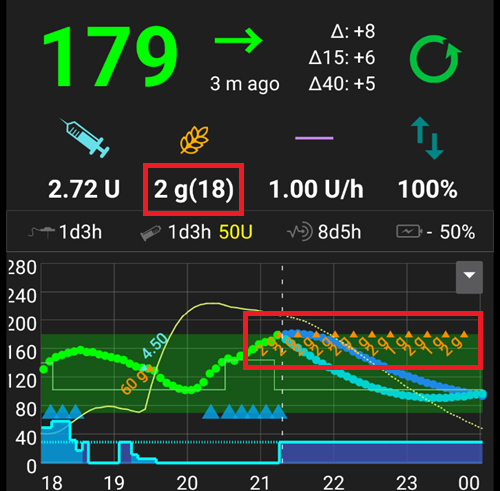

(Extended-Carbs-extended-carbs-ecarbs)=
# Пролонгированные (расширенные) углеводы / "eCarbs"

## Что такое eCarbs и когда они полезны?

При обычной помповой терапии пролонгированные болюcы-хороший способ справиться с жирной или медленно усваиваемой пищей, которая увеличивает уровень глюкозы в крови дольше, чем работает инсулин. Однако в контексте алгоритма ИПЖ пролонгированные болюсы не имеют большого смысла (и создают технические трудности), поскольку они представляют собой по сути, фиксированную высокую временную базальную скорость, которая идет вразрез с тем, как работает цикл ИПЖ, который должен динамически корректировать базальную скорость. Подробнее см [пролонгированный болюс](#extended-bolus-and-why-they-wont-work-in-closed-loop-environment) ниже.

Однако необходимость работать с такой едой все же существует. Именно поэтому AAPS начиная с версии 2.0 поддерживает так называемые пролонгированные/расширенные углеводы или eCarbs.

eCarbs-это углеводы, которые растягиваются на несколько часов. Для стандартного питания с бОльшим содержанием углеводов, чем жира/белка, введение углеводов заранее (и при необходимости уменьшение начального болюса), как правило, достаточно для предотвращения преждевременной подачи инсулина.  Но для медленно поглощающейся еды, при которой предварительное введение углеводов приводит к слишком большой величине активного инсулина IOB из-за микроболюсов SMB, eCarbs могут применяться для более точного моделирования того, как усваиваются углеводы и влияют на уровень глюкозы в крови. С помощью этой информации алгоритм может управлять микроболюсами SMB которые выступают как пролонгированный болюс на такие углеводы ( должно работать и без SMB, но, возможно, менее эффективно).

**Примечание** eCarbs не ограничиваются тяжелой пищей богатой жирами/белками: они могут помочь и в других случаях, когда увеличивается уровень сахара в крови, например, при приеме кортикостероидов.

## Механизмы использования eCarbs

Чтобы ввести eCarbs, в диалоговом окне *углеводы* на начальном экране установите общий объем углеводов и необязательный временной сдвиг (*цифры ниже являются только примерами, нужно попробовать свои собственные значения, чтобы получить удовлетворительный отклик гликемии*):

ECarbs на вкладке обзора, обратите внимание на углеводы в скобках в поле COB, в котором показаны углеводы в будущем:

______________________________________________________________________

Способ компенсации жиров и белков при помощи этой функции описан здесь: [https://adriansloop.blogspot.com/2018/04/page-margin-0.html](https://adriansloop.blogspot.com/2018/04/page-margin-0.html)

______________________________________________________________________

## Рекомендуемая настройка, пример сценария и важные заметки

Рекомендуется использовать модуль OpenAPS SMB APS, с поддержкой SMB, а также включенным параметром *разрешить микроболюсы SMB при активных углеводах COB*.

Например, на пиццу может быть применен такой сценарий: ввести (частично) болюс заранее через *калькулятор болюса*, а затем через 1 или 2 часа нажать кнопку *углеводы*, чтобы ввести оставшиеся углеводы на последующие 4-6 часов.

**Важное замечание:** Нужно попробовать и посмотреть, какие конкретные значения подходят именно вам, конечно. Можно также подстроить параметр *max minutes of basal для ограничения SMB*, тем самым делая алгоритм более (менее) агрессивным. При низком содержании углеводов, высоким содержании жиров и белков, eCarbs может быть достаточен, чтобы обойтись без дополнительного контроля болюсов (см. пост блога выше). При создании eCarbs в портале терапии создается также запись для документирования, упрощающая итерацию и ввод данных.

(extended-bolus-and-why-they-wont-work-in-closed-loop-environment)=
## Пролонгированный болюс и почему он не будет работать в среде замкнутого цикла?

Как упоминалось выше, пролонгированные или многоволновые болизы не работают в замкнутом цикле. Подробнее [см. ниже](#why-extended-boluses-wont-work-in-a-closed-loop-environment)

(Extended-Carbs-extended-bolus-and-switch-to-open-loop-dana-and-insight-pump-only)=
### Пролонгированный болюс и переключение на незамкнутый цикл - только для помп Dana и Insight

Некоторые пользователи просили предусмотреть пролонгированные болюсы в ААПС, так как хотели бы компенсировать специфические продукты питания привычным для себя образом.

Поэтому, начиная с версии 2.6, существует опция пролонгированного болюса для пользователей помп Dana и Insight.

- Замкнутый цикл автоматически будет остановлен и переключится на режим открытого цикла на время пролонгированных болюсов.
- Единицы болюса, время оставшееся и общее, будут показаны на гланом экране.
- На помпе Insight при работе *эмуляции временного базала TBR* пролонгированный болюс [не доступен](#Accu-Chek-Insight-Pump-settings-in-aaps).

(why-extended-boluses-won-t-work-in-a-closed-loop-environment)=
### Почему пролонгированные болюсы не будут работать в среде замкнутого цикла

1. Цикл определяет, что скорость базала должна быть 1.55 ед/ч. Для алгоритма неважно, подается при этом пролонгированный болюс или обычный временный базал TBR. На самом деле, на некоторых помпах возможен пролонгированный болюс. Что должно произойти в этом случае? Большинство драйверов помп останавливает пролонгированный болюс-> Можно было даже не пытаться его запустить.

2. Если в качестве входных данных задан пролонгированный болюс, что должно произойти?

   1. Будет ли алгоритм считать базу нейтральной и работать невзирая на нее? Должен ли он также уметь уменьшать болюс, например, при низкой ГК, когда "нейтральный" инсулин уже израсходован?
   2. Следует ли просто добавить пролонгированный болюс? То есть, алгоритму петли нужно просто позволить продолжить? Даже при жесточайшей гипо? Не думаю, что это правильно: предвидится гипогликемия, но не предотвращается?

3. Активный инсулин IOB, который создается пролонгированным болюсом, материализуется через 5 минут при следующем прохождении. Соответственно, цикл снизил бы базал. Поэтому не многое меняется... кроме того, что предпринимается попытка избежать гипо.
