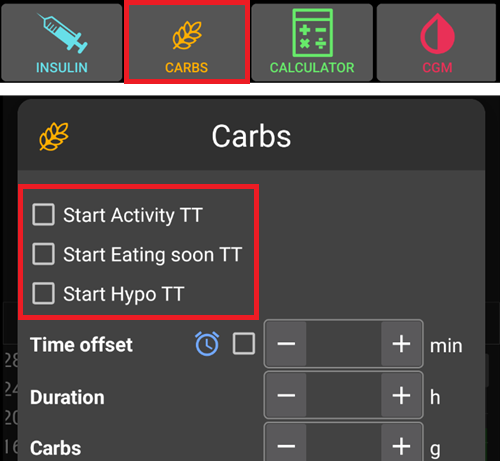

# Временные цели

## Что такое временные цели, где их можно задать и сконфигурировать?

A **Temp-Target** (or short **TT**) is an **AAPS** feature that allows the user to alter their [**BG** target range](#profile-glucose-targets) for planned activities. Это достигается за счет того, что **AAPS** вносит корректировки в расходование инсулина пользователем.

A glucose target, particularly if it is only short-term (less than 4 hours in duration), does not need to be the *actual value* you expect or want your glucose level to get to, rather, it is a good way to tell **AAPS** to be more or less aggressive, while still keeping your glucose levels in range.

Temporary targets can be defined within those boundaries :

|         | Временная цель         |
| ------- | ---------------------- |
| Minimum | 4 mmol/l or 72 mg/dL   |
| Maximum | 15 mmol/l or 225 mg/dL |

**AAPS** предусматривает три варианта ** временных целей **, подходящих для физических упражнений (**Временная цель- Нагрузка**), приема пищи (**Временная цель- Ожидаемый прием пищи**) и прогнозируемой гипогликемии (**Временная цель-Гипо**). **Временные цели** находятся на вкладке **Действия**.

Пользователи должны иметь реалистичные ожидания при выборе **Временной цели** в **AAPS**. Успех достижения желаемого целевого показателя **ГК** будет зависеть от множества факторов: точности настроек **AAPS**, общего контроля уровня **ГК**, **количества активного инсулиноа IOB**, параметра чувствительности к инсулину, резистентности к инсулину, интенсивности нагрузок и т. д.

Для достижения желаемого значения **ГК** может потребоваться около 30 минут или больше с момента активации **Временной Цели**. **AAPS** не в состоянии достичь целевой **ГК** немедленно, и пользователи должны помнить об этом при использовании **Врем-Цели**.

The table below summarizes the features of **Temp-Target- Activity**, **Temp-Target- Eating soon**, and **Temp-Target-Hypo**.

### TT - Activity

**BG Target (depending on users' settings)**

AAPS will aim to reach 8mmol/l or 144mg/dl for 40 minutes

**Other considerations users may wish to factor in when selecting**:

Depending on **BG** level, **AAPS** will "decrease" insulin usage in order to reach **BG** target. If **BG** target is not within range (i.e. above the users **Profile's** selected **BG** target), then **AAPS** may keep the basal on.

In closed loop mode, **SMB**:

- *may be* deactivated (discussed further below); and/or
- basal may be activated if **AAPS** is in negative **IOB** or <0.

Users may also wish to consider:

- *selecting* this **TT** 1-2 hours before the planned exercise to ensure reduced IOB (the correct timing for this TT will vary person to person); and
- *selecting* a temporary Profile (decrease) for the duration of the planned activity to ensure reduced **IOB**;
- *ensuring* **TT** is timed to be *deactivated* shortly before the exercise as reduced **IOB** as some users experience a rapid rise in **BG **post exercise.

### TT - Eating soon

**BG Target (depending on users' settings)**

AAPS will aim to reach 5mmol/l or 90mg/dl for 30 minutes

**Other considerations users may wish to factor in when selecting**:

In closed loop mode, **SMB**:

- will remain activated; and/or
- basal may be also activated depending on the user's **Profile's** settings.

Depending on **BG** level, **AAPS** will "increase" insulin usage within the user's **AAPS** setting parameters in order to achieve the desired **BG** target.

### TT - Hypo

**BG Target (depending on users' settings)**

AAPS will aim to reach 7mmol/l or 126mg/dl for 30 minutes

**Other considerations users may wish to factor in when selecting**:

In closed loop mode, **SMB**:

- *may be* deactivated (discussed further below); and/or
- basal may be activated if **AAPS** is in negative **IOB** or <0.

(TempTargets-where-can-i-select-a-temp-target)=

## Как выбрать временную цель?

In the **Actions** tab in **AAPS**.

1. выберите иконку **Временная Цель**; и затем
2. настройте желаемые параметры **Врем-Цели**

Or clicking on the "**BG Target**" located in the top right corner of **AAPS**.

- Выполните долгое нажатие в правом верхнем углу на главном экране или используйте оранжевую кнопку «Углеводы» внизу.

## Как изменить временную цель по умолчанию и переопределить её своими собственными значениями?

Чтобы изменить «целевой диапазон ГК» и «продолжительность», для настроек по умолчанию **Врем-Цель**, перейдите в меню **AAPS** в правом верхнем углу и

1. выберите **Настройки** 
2. прокрутите вниз до "Обзор" 
3. выберите 'Временные цели по умолчанию’
4. шаг 4 указывает (ниже), где изменить временной диапазон **ВЦ- Ожидаемый приём пищи**
5. шаг 5 указывает (ниже), где изменить **целевое значение ГК при ожидаемом приеме пищи eatingsoon** (и те же шаги можно повторить для **целевое значение ГК при физической нагрузке** и **целевое значение ГК при гипо**.

## Как отменить Врем-Цель?

To cancel a **Temp-Target** running:

Select the “Cancel” button in **Temporary Target** under the **Actions** tab as shown below.

Или коротко нажмите «Целевой ГК» в желто-зелёном поле, расположенном в правом верхнем углу **AAPS**, и выберите «Отмена», как показано ниже:

## Как выбрать "Временные цели по умолчанию"

In the **Actions** tab in **AAPS**.

1. выберите иконку **Временная Цель**; и затем
2. настройте желаемые параметры **Врем-Цели**

Or clicking on the "**BG Target**" located in the top right corner of **AAPS**.

Or in the **Carbs** button

1. selecting the desired **Temp-Target** in the shortcuts

(TempTargets-hypo-temp-target)=

## Временная цель Гипо 

**Временная-Цель Гипо** позволяет **AAPS** предотвратить снижение уровня сахара в крови пользователя за счет снижения потребления инсулина. Если пользователь прогнозирует, что его **ГК** снизится: обычно система **AAPS** должна самостоятельно справится с этим, но многое будет зависеть от правильности настроек пользователя **AAPS**. **Временная-Цель Гипо** позволяет **AAPS** снизить подачу инсулина до прогнозируемого минимума.

Иногда, при потреблении углеводов на купирование гипогликемии, может быстро повыситься **ГК** пользователя, и **AAPS** скорректирует быстрорастущую **ГК**, включив **СМБ**.

Некоторые пользователи не хотят включать подачу **СМБ** во время работы **Временной Цели Гипо**. Это достигается путем отключения настройки *Включить супер микро болюсы SMB с временными целями* в **Настройках** (см. ниже):

- В (настройках OpenAps SMB, дополнительно, по достижении цели 9): пользователь может включить настройку *«Высокая ВЦ повышает чувствительность»* для **Временных целей** 100 мг/дл или 5,5 ммоль/л и выше в OpenAPS СМБ, что сделает **AAPS** более чувствительным.

- В (Продвинутом уровне, цель 9): пользователь может деактивировать *«Включать супер микро болюс SMB при высоких значениях временных целей»*, так что даже если **AAPS** имеет COB > 0, «СМБ с Врем-Целью» или «СМБ всегда» включены и OpenAPS СМБ активен, **AAPS** не будет выдавать СМБ, пока активны Высокие ВЦ.

Примечание: если пользователь вводит углеводы с помощью кнопки Углеводы, а уровень глюкозы в крови составляет менее 72 мг/дл или 4 ммоль/л, **Врем-Цель Гипо** активируется **алгоритмом AAPS** автоматически.

(TempTargets-activity-temp-target)=

## Временная цель Нагрузка

До и во время фиических нагрузок пользователю может потребоваться более высокая цель, чтобы предотвратить гипогликемию во время тренировки.

Чтобы упростить управление временной целью **Нагрузка**, пользователь может настроить цель по умолчанию **Временная Цель Нагрузка** для повышения уровня **ГК** за счет снижения использования инсулина, чтобы замедлить падение **ГК** и избежать гипогликемии.

Новым пользователям **AAPS**, возможно, придется поэкспериментировать и персонализировать настройки по умолчанию для **Временной цели Нагрузка**, чтобы оптимизировать ее под свои потребности. Все люди разные, когда речь идет о достижении стабильного контроля уровня глюкозы во время тренировки. See also the [sports section in FAQ](#FAQ-sports). в часто задаваемых вопросах.

Некоторые пользователи предпочитают активировать **Смену профиля** (снижение профиля < 100 % для снижения количества инсулина с помощью **AAPS**) до и во время активной **Временной Цели Нагрузка**.

В настройках OpenAps SMB, дополнительно, по достижении цели 9: пользователи могут включить *"Высокая ВЦ повышает чувствительность"* для **ВЦ** выше или равного 100 мг/дл или 5,5 ммоль/л в OpenAPS ** СМБ**. В этом случае **AAPS** будет более чувствительным.

Кроме того, если *'Включать супер микро болюс SMB при высоких значениях временных целей'* деактивирована, **AAPS** не будет доставлять **СМБ**, даже если Активные углеводы COB > 0, * 'Включить супер микро болюсы SMB с временными целями'* или *'Всегда включать супер микро болюс SMB'* включены и OpenAPS **СМБ** активирован.

(TempTargets-eating-soon-temp-target)=

## Временная цель Ожидаемый прием пищи

**Временная цель Ожидаемый прием пищи** может помочь плавно снизить **ГК** и обеспечить достаточное количество **активного инсулина IOB** перед едой.

Это может быть важным инструментом для тех пользователей, которые не вводят предварительный болюс на еду, однако эффективность **Временной цели Ожидаемый прием пищи** будет зависеть от ряда факторов, в том числе: настроек пользователя, ниличия низкоуглеводной диеты и используют ли они быстродействующий инсулин (например, Fiasp или Lyjumjev), чтобы исключить необходимость предварительных болюсов. Обычно, пока пользователи не имеют опыта работы с **AAPS**, им следует рассчитывать на предварительный болюс при использовании **ВЦ – ожидаемый приём пищи**, и это особенно актуально, если они придерживаются диеты с высоким содержанием углеводов.

Подробнее о режиме «Ожидаемый прием пищи» можно прочитать в статье [Как пользоваться режимом «Ожидаемый прием пищи»](https://diyps.org/2015/03/26/how-to-do-eating-soon-mode-diyps-lessons-learned. /) или [здесь](https://diyps.org/tag/eating-soon-mode/).

Advanced, [objective 9](#objectives-objective9): If you use OpenAPS SMB and have *'Low temp target lowers sensitivity'*, **AAPS** works a little bit more aggressively. Для этого варианта требуется, чтобы **ВЦ** составляла менее 100 мг/дл или 5,5 ммоль/л.

## Как отключить СМБ во время активной Временной-Цели?

Для этого зайдите в **Настройки** > и деактивируйте *Включать супер микро болюс SMB при высоких значениях временных целей*.

This will ensure **AAPS** will not give **SMBs**, even with COB > 0, *'SMB with Temp-Target'* or *'SMB always'* enabled and OpenAPS SMB active.