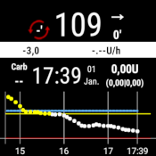

# Пример настройки: Samsung S7, DanaR, Dexcom G6 и Sony Smartwatch

## Описание

В этой комбинации смартфон Samsung Galaxy S7 используется в качестве центра управления циклом. Слегка модифицированное приложение Dexcom считывает значения ГК из CGM Dexcom G6. AndroidAPS управляет помпой Dana R корейского производителя SOOIL через Bluetooth. Дополнительные устройства не требуются.

Поскольку приложение Dexcom предлагает ограниченные параметры оповещений, приложение с открытым исходным кодом xDrip+ настраивается не только на высокие и низкие значения но и на другие оповещения под индивидуальные потребности.

По желанию можно использовать смарт-часы Android (в этой выборке применяется Sony Smartwatch 3 (SWR50)) для отображения значений глюкозы и параметров AndroidAPS на вашей руке. Часы могут даже применяться для контроля AndroidAPS (напр. для дискретной подачи болюса на еду).

Система работает в автономном режиме. Это означает, что для работы нет необходимости подключения смартфона к Интернету.

Тем не менее, данные автоматически загружаются в Nightscout "в облаке", когда соединение с интернетом присутствует. Эта опция позволяет предоставить полную картину ГК для врача или для членов семьи практически в любое время. Также можно отправлять данные в Nightscout только с (вами определенным) Wi-Fi соединением для создания различных отчетов.

## Обязательные компоненты

1. Samsung Galaxy S7
    
    * Альтернативы: см. [список проверенных телефонов и часов](https://docs.google.com/spreadsheets/d/1gZAsN6f0gv6tkgy9EBsYl0BQNhna0RDqA9QGycAqCQc/edit) для AndroidAPS

2. [DanaRS](http://www.sooil.com/eng/product/)
    
    * Альтернативы: 
    * [Помпа Accu Chek Combo](../Configuration/Accu-Chek-Combo-Pump.md)
    * [Accu-Chek Insight](../Configuration/Accu-Chek-Insight-Pump.md)
    * [DanaR](../Configuration/DanaR-Insulin-Pump.md)
    * [Некоторые старые помпы Medtronic (дополнительно требуются аппаратная часть: RileyLink/Gnarl, телефон Android с чипом bluetooth low Energy/BLE-chipset)](../Configuration/MedtronicPump.md)
    * В будущем возможны другие помпы, см. подробнее в [возможные будущие драйверы помп](Future-possible-Pump-Drivers.md).

3. [Dexcom G6](https://dexcom.com)
    
    * Alternatives: see list of possible [BG sources](../Configuration/BG-Source.md)

4. Дополнительно: Sony Smartwatch 3 (SWR50)
    
    * Альтернативы: Все [ часы с Google Wear OS ](https://wearos.google.com/intl/de_de/#find-your-watch) должны работать, см. [ список проверенных телефонов и часов ](https://docs.google.com/spreadsheets/d/1gZAsN6f0gv6tkgy9EBsYl0BQNhna0RDqA9QGycAqCQc/edit) для AndroidAPS (OS должна быть Android Wear)

## Настройки Nightscout

Подробнее см. [Настройка Nightscout](../Installing-AndroidAPS/Nightscout.md)

## Настройка компьютера

Чтобы создать приложение на Android из свободно распространяемого кода AAPS, вам нужно установить Android Studio на компьютере или ноутбуке (Windows, Mac, Linux). Подробная инструкция находится на [создание APK](../Installing-AndroidAPS/Building-APK.md).

Пожалуйста, будьте терпеливы при установке Android Studio так как программа загружает много дополнительных компонентов на вашем компьютере.

## Настройка смартфона

### Проверьте прошивку смартфона

* Меню > Настройки > Настройки > Информация о телефоне > Информация о Программном обеспечении: не ниже "Android-Version 8.0" (успешно протестирована до версии 8.0.0 Oreo - Samsung Experience Version 9.0) 
* Для обновления прошивки: меню > Настройки > Обновление программы

### Разрешите установку приложений из неизвестных источников

Меню > Настройки > Безопасность устройства > Неизвестные источники > ползунок справа (= active)

По соображениям безопасности эта настройка должна быть возвращена в неактивный режим по завершении установки всех описанных здесь приложений.

### Включите Bluetooth

1. Меню > Настройки > Подключения > Bluetooth > ползунок справа (= active)
2. Меню > Настройки > Подключения > Местоположение > ползунок справа (= active)

Службы местоположения ("GPS") должны быть активированы для корректной работы Bluetooth.

### Установить приложение Dexcom (модифицированная версия)

Оригинальное приложение Dexcom из Google Play Store не будет работать, так как оно не передает данные другим приложениям. Поэтому требуется немного модифицированная версия от нашего сообщества. Только это измененное приложение Dexcom может общаться с AAPS. Кроме того, модифицированное приложение Dexcom может работать со всеми смартфонами Android, а не только находящимися в списке совместимости [Dexcom](https://www.dexcom.com/dexcom-international-compatibility).

Для этого выполните следующие шаги на вашем смартфоне:

1. Если оригинальное приложение Dexcom уже установлено: 
    * Остановить сенсор
    * Удалить приложения через меню > Настройки > Приложения > Dexcom G6 Mobile > Удалить
2. Download and install the [BYODA Dexcom ap](../Hardware/DexcomG6.md#if-using-g6-with-build-your-own-dexcom-app)
3. Запустите модифицированное приложение Dexcom, активируйте/закалибруйте сенсор в соответствии с инструкциями и подождите, пока завершится процесс разогрева.
4. После того, как измененное приложение Dexcom покажет фактическое значение глюкозы, настройте оповещения (сэндвич-меню в левом верхнем углу экрана) следующим образом: 
    * Чрезвычайно низкий `55mg/dl` / `3.1mmol/l` (не может быть отключен)
    * Низкий `ВЫКЛ`
    * Высокий `ВЫКЛ`
    * Скорость подъема `ВЫКЛ`
    * Скорость понижения `ВЫКЛ`
    * Потеря сигнала `ВЫКЛ`

## Установите AndroidAPS

1. Follow the instructions to [build the APK](../Installing-AndroidAPS/Building-APK.md#generate-signed-apk)
2. [Transfer](../Installing-AndroidAPS/Building-APK.md#transfer-apk-to-smartphone) the generated APK to your phone
3. [Сконфигурируйте AndroidAPS](../Configuration/Config-Builder.md) в соответствии с Вашими потребностями, используя мастер настройки или вручную
4. В этом примере мы использовали (среди прочего)

* BG source: `Dexcom G6 App (patched)` -- click cock-wheel and activate `Upload BG data to NS` and `Send BG data to xDrip+` (see [BG source](../Configuration/BG-Source.md))

* NS клиент активирован (см. [Клиент NS и Настройки Nightscout](../Installing-AndroidAPS/Nightscout.md))

## Установите xDrip+

xDrip+ это великолепное приложение с открытым исходным кодом, предлагающее бесчисленные возможности. В этой компоновке, вопреки целям разработчиков xDrip+, оно не используется для получения данных ГК с Dexcom G6, а только для вывода оповещений и для отображения текущего значения Гк, включая кривую в виджете на домашнем экране Android. С xDrip+ оповещения могут быть настроены гораздо более индивидуально, чем с программным обеспечением Dexcom, AAPS или Nightscout (без ограничений в выборе звуков, сигналов для дня/ночи и т. д.).

1. Скачайте последнюю стабильную версию APK xDrip+ с помощью смартфона <https://xdrip-plus-updates.appspot.com/stable/xdrip-plus-latest.apk> - а не версию из Google Play Store!
2. Установите xDrip+ при помощи выбора загруженного файла APK.
3. Запустите xDrip+ и произведите следующие настройки (сэндвич-меню слева сверху) 
    * Настройки > Будильники и оповещения > Список оповещений об уровне ГК > Создание оповещений (высокое и низкое) в соответствии с Вашими потребностями.
    * Существующие оповещения могут быть изменены длинным нажатием на значок сигнала.
    * Настройки > Будильники и оповещения > Оповещения о калибровке: отключены (напоминание через измененное приложение Dexcom)
    * Настройки > Источник аппаратных данных > 640G/EverSense
    * Настройки > Настройки Inter-app > Принимать Калибровки > `включено`
    * Меню > Запуск сенсора (только "pro forma", не имеет ничего общего с работающим датчиком G6.). Необходимо включить иначе будет регулярно появляться сообщение об ошибке.) 

For more information about xDrip+, see here [BG source page](../Configuration/BG-Source.md).

### Пример настройки оповещения

"Чрезвычайно низкая ГК" (ниже 55 мг/дл. 3,1 ммол) является стандартным оповещением модифицированного приложения Dexcom, которое не может быть отключено.

Совет на случай переговоров / посещений церкви / кино и т. д..:

Если в Samsung Galaxy S7 активирован режим "Не беспокоить" (меню > Настройки > Звуки и вибрация > Не беспокоить: ползунок вправо сторону (= вкл)), телефон только вибрирует во время оповещения о чрезвычайно низкой ГК и не подает звукового сигнала. Для других оповещений, настроенных через xDrip+ можно выбрать, игнорировать ли звуковой режим.

## Отключите энергосбережение

На вашем Samsung Galaxy S7 перейдите в меню > Настройки > Поддержка устройства > Батарея > Неотслеживаемые приложения > + Добавить приложения: Выберите одно за другим приложения AndroidAPS, Dexcom G6 Mobile, xDrip+ и Android Wear (если используете)

## Дополнительно: настройте Sony Smartwatch 3 (SWR50)

С Android Wear жизнь с диабетом можно сделать еще более незаметной для окружающих. Часы могут использоваться для отображения текущего уровня глюкозы, состояния цикла и т. д. на запястье. Часы могут даже применяться для контроля AndroidAPS (напр. для дискретной подачи болюса на еду). Для этого дважды нажмите на значение ГК на циферблате AAPSv2. SWR50 обычно работает полный день до подзарядки (то же зарядное устройство, что и для Samsung Galaxy S7: microUSB).

Подробности о информации, отображаемой на экране часов, можно найти [здесь](../Configuration/Watchfaces.md).

* Установите приложение "Android Wear" на вашем смартфоне через Google Play Store и подключите смартфон в соответствии с инструкциями.
* В AAPS выберите сэндвич-меню (в верхнем левом углу) > Конфигуратор > Общее (в нижней части списка) > Wear > активировать, на левой стороне нажмите на шестеренку > Настройки Wear и активируйте `Управление c часов`
* На вашем смартфоне: Удерживайте дисплей для изменения циферблата и выберите `AAPSv2`
* При необходимости однократно перезапустите оба устройства.

## Настройки помпы

см [помпа DanaRS ](../Configuration/DanaRS-Insulin-Pump.md)