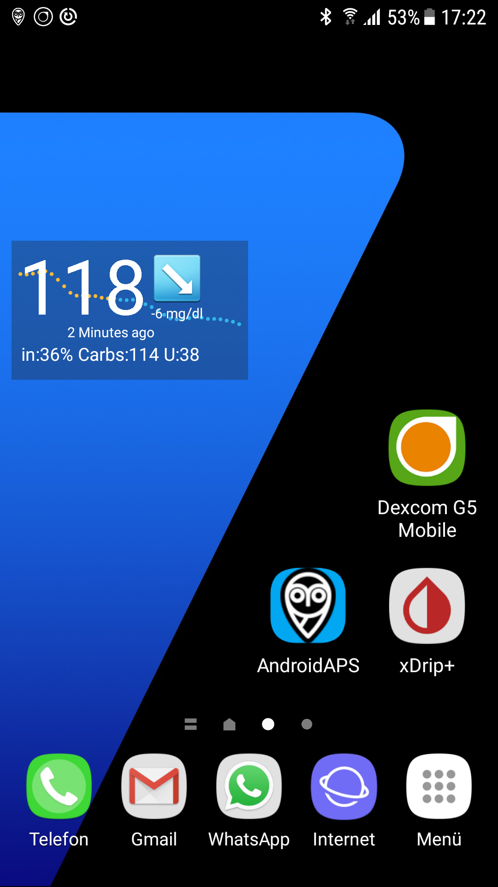

# Пример настройки: Samsung S7, DanaR, Dexcom G5 и Sony Smartwatch

## Описание

В этой комбинации смартфон Samsung Galaxy S7 используется в качестве центра управления циклом. Слегка модифицированное приложение Dexcom считывает значения ГК из CGM Dexcom G5. AndroidAPS управляет помпой Dana R корейского производителя SOOIL через Bluetooth. Дополнительные устройства не требуются.

Поскольку приложение Dexcom предлагает ограниченные параметры оповещений, приложение с открытым исходным кодом xDrip+ настраивается не только на высокие и низкие значения но и на другие оповещения под индивидуальные потребности.

По желанию можно использовать смарт-часы Android (в этой выборке применяется Sony Smartwatch 3 (SWR50)) для отображения значений глюкозы и параметров AndroidAPS на вашей руке. Часы могут даже применяться для контроля AndroidAPS (напр. для дискретной подачи болюса на еду).

Система работает в автономном режиме. Это означает, что для работы нет необходимости подключения смартфона к Интернету.

Тем не менее, данные автоматически загружаются в Nightscout "в облаке", когда соединение с интернетом присутствует. Эта опция позволяет предоставить полную картину ГК для врача или для членов семьи практически в любое время. Также можно отправлять данные в Nightscout только с (вами определенным) Wi-Fi соединением для создания различных отчетов.

## Обязательные компоненты

1. Samsung Galaxy S7
    
    * Альтернативы: см. [список проверенных телефонов и часов](https://docs.google.com/spreadsheets/d/1gZAsN6f0gv6tkgy9EBsYl0BQNhna0RDqA9QGycAqCQc/edit#gid=698881435) для AndroidAPS

2. Инсулиновая помпа [DanaR](http://www.sooil.com/eng/product/) или Dana RS
    
    * Альтернативы: 
    * [Помпа Accu Chek Combo](../Configuration/Accu-Chek-Combo-Pump.md)
    * Другие помпы могут быть доступны в будущем, см. [возможные будущие драйверы помп](Future-possible-Pump-Drivers.md) для подробной информации.

3. [Dexcom G5](https://dexcom.com)
    
    * Альтернативы: см. список возможных [ источников ГК](../Configuration/BG-Source.md)

4. Дополнительно: Sony Smartwatch 3 (SWR50)
    
    * Альтернативы: см. [список проверенных телефонов и часов](https://docs.google.com/spreadsheets/d/1gZAsN6f0gv6tkgy9EBsYl0BQNhna0RDqA9QGycAqCQc/edit#gid=698881435) для AndroidAPS (ОС должна быть Android Wear)

## Настройки Nightscout

Подробнее см. [Настройка Nightscout](../Installing-AndroidAPS/Nightscout.md)

## Настройка компьютера

Чтобы создать приложение на Android из свободно распространяемого кода AAPS, вам нужно установить Android Studio на компьютере или ноутбуке (Windows, Mac, Linux). Подробная инструкция находится на [создание APK](../Installing-AndroidAPS/Building-APK.md).

Пожалуйста, будьте терпеливы при установке Android Studio так как программа загружает много дополнительных компонентов на вашем компьютере.

## Настройка смартфона

### Проверьте прошивку смартфона

* Меню > Настройки > Настройки > Информация о телефоне > Информация о Программном обеспечении: не ниже "Android-Version 7.0" (успешно протестирована до версии 8.0.0 Oreo - Samsung Experience Version 9.0) 
* Для обновления прошивки: меню > Настройки > Обновление программы

### Разрешите установку приложений из неизвестных источников

Меню > Настройки > Безопасность устройства > Неизвестные источники > ползунок справа (= active)

По соображениям безопасности эта настройка должна быть возвращена в неактивный режим по завершении установки всех описанных здесь приложений.

### Включите Bluetooth

1. Меню > Настройки > Подключения > Bluetooth > ползунок справа (= active)
2. Меню > Настройки > Подключения > Местоположение > ползунок справа (= active)

Службы местоположения ("GPS") должны быть активированы для корректной работы Bluetooth.

### Установить приложение Dexcom (модифицированная версия)

Оригинальное приложение Dexcom из Google Play Store не будет работать, так как оно не передает данные другим приложениям. Поэтому требуется немного модифицированная версия от нашего сообщества. Только это измененное приложение Dexcom может общаться с AAPS. Кроме того, модифицированное приложение Dexcom может работать со всеми смартфонами Android, а не только находящимися в списке совместимости [Dexcom](https://www.dexcom.com/dexcom-international-compatibility). Версия mmol/l и версия mg/dl измененного приложения Dexcom доступны на https://github.com/dexcomapp/dexcomapp?files=1.

Для этого выполните следующие шаги на вашем смартфоне:

1. Если оригинальное приложение Dexcom уже установлено: 
    * Остановить сенсор
    * Удалить приложения через меню > Настройки > Приложения > Dexcom G5 Mobile > Удалить
2. Загрузить модифицированное приложение Dexcom (проверьте единицы измерения mg/dl или mmol/l в соответствии с потребностями): <https://github.com/dexcomapp/dexcomapp?files=1>
3. Install modified Dexcom app on your smartphone (= select the downloaded APK file)
4. Start modified Dexcom app, activate/calibrate the sensor according to the given instructions and wait until the warm-up phase is finished.
5. Once the first two calibrations have been entered successfully and the modified Dexcom app shows actual glucose value setup the warnings (hamburger menu on top left side of the screen) as follows: 
    * Urgent low `55mg/dl` / `3.1mmol/l` (cannot be disabled)
    * Low `OFF`
    * High `OFF`
    * Rise rate `OFF`
    * Fall rate `OFF`
    * Signal loss `OFF`

## Install AndroidAPS

1. Follow the instructions to [build the APK](../Installing-AndroidAPS/Building-APK#generate-signed-apk)
2. [Transfer](../Installing-AndroidAPS/Building-APK#transfer-apk-to-smartphone) the generated APK to your phone
3. [Configure AndroidAPS](../Configuration/Config-Builder.md) according to your needs using the setup assistant or manually
4. In this sample setup we used (among others)

* BG source: `Dexcom G5 App (patched)` -- click cock-wheel and activate `Upload BG data to NS` and `Send BG data to xDrip+` (see [BG source](../Configuration/BG-Source.md)

* NS Client activated (see [NS Client](../Configuration/Config-Builder#ns-profile) and [Nightscout setup](../Installing-AndroidAPS/Nightscout.md))

## Install xDrip+

xDrip+ is another mature open source app that offers countless possibilities. In this setup, contrary to what the developers first wrote the app for, xDrip+ is not used to collect glucose data from the Dexcom G5, but only to output alarms and to display the current glucose value including the curve on the Android home screen in the widget. With xDrip+ the alarms can be set much more individually than with the Dexcom software, AAPS or Nightscout (no limitation in the selection of sounds, different alarms depending on day/night time etc.).

1. Download the latest stable APK version of xDrip+ with your smartphone <https://xdrip-plus-updates.appspot.com/stable/xdrip-plus-latest.apk> - not the version from the Google Play Store!
2. Install xDrip+ by selecting the downloaded APK file.
3. Start xDrip+ and make the following settings (hamburger menu at top left) 
    * Settings > Alarms and Alerts > Glucose Level Alert List > Create Alerts (high and low) according to your needs. 
    * The existing alarms can be changed with a long press on the alarm.
    * Settings > Alarms and Alerts > Calibration Alerts: disabled (reminded via the modified Dexcom app)
    * Settings > Hardware Data Source > 640G/EverSense
    * Settings > Inter-app settings > Accept Calibrations > `ON`
    * Menu > Start sensor (is only "pro forma" and has nothing to do with the running G5 sensor. This is necessary otherwise an error message will appear regularly.) 

### Example of an alarm setup

The "Urgent low alarm" (below 55 mg/dl resp. 3,1 mmol) is a standard alarm from the modified Dexcom app that cannot be disabled.

Tip for meetings / church visits / cinema etc..:

If "Do not disturb" mode is activated in the Samsung Galaxy S7 (Menu > Settings > Sounds and vibration > Do not disturb: slider to right side (= active)), the phone only vibrates during urgent low alarm and does not issue an acoustic warning. For the other alarms set up via xDrip+ you can select whether the silent mode should be ignored (acoustic sound played) or not.

## Disable power saving option

On your Samsung Galaxy S7 go to Menu > Settings > Device Maintenance > Battery > Unmonitored Apps > + Add apps: Select the apps AndroidAPS, Dexcom G5 Mobile, xDrip+ and Android Wear (if smartwatch is used) one after the other

## Optional: Setup Sony Smartwatch 3 (SWR50)

With an Android Wear smartwatch life with diabetes can be made even more inconspicuous. The watch can be used to display the current glucose level, the status of the loop etc. on the wrist. The watch can even be used to control AndroidAPS (i.e. discreetly set a meal bolus). To do this, double tap the CGM value of the AAPSv2 watchface. The SWR50 usually runs for a full day until the battery needs to be recharged (same charger as the Samsung Galaxy S7: microUSB).

Details about the information displayed on the watchface can be found [here](../Configuration/Watchfaces.md).

* Install the app "Android Wear" on your smartphone via the Google Play Store and connect the smartwatch according to the instructions there.
* In AAPS choose hamburger menu (top left corner) > Config Builder > General (at the bottom of the list) > Wear > activate on left side, click cock wheel > Wear settings and activate `Controls from Watch`
* On your smartwatch: Long press display to change watchface and select `AAPSv2`
* If necessary restart both devices once.

## Pump setup

see [DanaR pump](../Configuration/DanaR-Insulin-Pump.md)