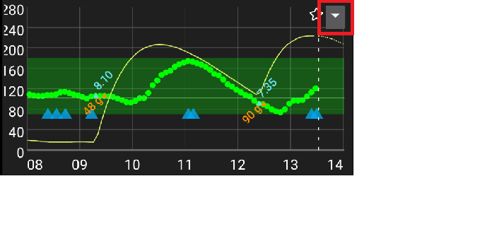

# Экраны AndroidAPS

## Главный экран

Это первый экран, который вы увидите, когда откроете AndroidAPS, и он содержит большую часть текущей информации.

### Раздел А - Вкладки

* Переход между различными модулями AndroidAPS.
* Также можно переходить между экранами свайпом влево или вправо.
* Displayed tabs can be selected in [config builder](../Configuration/Config-Builder.md#tab-or-hamburger-menu).

(section-b-profile-target)=

### Раздел B - Профиль & Цель

#### Текущий профиль

* Текущий профиль отображается на левой панели.
* Короткое нажатие открывает подробности о текущем профиле
* Long press profile bar to [switch between different profiles](../Usage/Profiles.md#profile-switch).
* Если профиль был изменен на время - в скобках отображается оставшееся время его активности в минутах.

#### Целевое значение ГК

* Текущее целевое значение глюкозы крови (ГК) отображается на правой панели.
* Короткое нажатие позволяет установить [временную цель](../Usage/temptarget.md).
* Если установлена временная цель - панель будет желтой, а в скобках отображается оставшееся время ее активности в минутах.

(visualization-of-dynamic-target-adjustment)=

#### Визуализация динамического изменения цели

* AAPS может динамически изменять установленную цель основываясь на чувствительности если используется алгоритм СМБ (SMB).
* Enable either one or both of the [following options](../Configuration/Preferences.md#openaps-smb-settings) 
   * "чувствительность повышает цель" и/или 
   * "сопротивляемость понижает цель" 
* Если AAPS обнаружит повышенную сопротивляемость или чувствительность - цель будет изменена. 
* При таком изменении панель будет зеленой.

### Раздел C - ГК & статус петли

#### Текущий уровень глюкозы крови

* Последнее значение ГК, переданное вашим НМГ, отображается в левой части экрана.
* Color of the BG value reflects the status to the defined [range](../Configuration/Preferences.md#range-for-visualization). 
   * зеленый = в заданном диапазоне
   * красный = ниже заданного диапазона
   * желтый = выше заданного диапазона
* Сероватый блок в центре экрана отображает изменение текущего уровня ГК относительно предыдущего чтения, и изменение за последние 15 и 40 минут.

(loop-status)=

#### Статус цикла

* Новые иконки отображают статус цикла:
   
   * зеленый круг = активна замкнутая петля
   * green circle with dotted line = [low glucose suspend (LGS)](../Usage/Objectives.md#objective-6-starting-to-close-the-loop-with-low-glucose-suspend)
   * красный круг = цикл деактивирован (постоянно отключен)
   * желтый круг = цикл приостановлен (временно приостановлен, но базальный инсулин будет подаваться) - оставшееся время паузы отображается под иконкой
   * серый круг = помпа отключена (временно отключена любая подача инсулина) - оставшееся время остановки отображается под иконкой
   * оранжевый круг = запущен суперболюс - оставшееся время отображаешься под иконкой
   * синий круг с пунктирной линией = активна открытая петля

* Короткое или длинное нажатие на иконку откроет диалоговое окно для переключения между режимами петли (Закрытая, Предотвращение низкой ГК, Открытая или Отключена), для отключения / возобновления цикла или отключения / подключения помпы обратно.
   
   * Если диалоговое окно было вызвано которким нажатием - после смены режима появится запрос на подтверждение. Если долгим нажатием - смена режима применится сразу.
   
   

(bg-warning-sign)=

#### предупреждающий знак ГК

Beginning with Android 3.0, you might get a warning signal beneath your BG number on the main screen.

*Note*: Up to 30h hours are taken into accord for AAPS calculations. So even after you solved the origin problem, it can take about 30 hours for the yellow triangle to disappear after the last irregular interval occurred.

To remove it immediately you need to manually delete a couple of entries from the Dexcom/xDrip+ tab.

However, when there are a lot of duplicates, it might be easier to

* [backup your settings](../Usage/ExportImportSettings.md),
* сбросить базу данных в меню обслуживания и
* [import your settings](../Usage/ExportImportSettings.md) again

##### Красный предупреждающий знак: Дублирующиеся данные ГК

The red warning sign is signaling you to get active immediately: You are receiving duplicate BG data, which does avoid the loop to do its work right. Therefore your loop will be disabled until it is resolved.

You need to find out why you get duplicate BGs:

* Активирован ли мост Dexcom на вашем сайте NS? Отключите мост, перейдя в Heroku (или к другому провайдеру хостинга), отредактируйте переменную «enable» и удалите "bridge". (Для Heroku [подробности можно найти здесь](https://nightscout.github.io/troubleshoot/troublehoot/#heroku-settings).)
* Имеется ли несколько источников передачи данных ГК в Nightscout (NS)? Если вы используете самостоятельно собранное приложение BYODA, включите загрузку в AAPS, но не включайте его в xDrip+.
* Есть ли подписчики, followers, которые могут получать вашу ГК и также снова передавать ее на ваш сайт NS?
* Последний вариант: В AAPS перейдите в настройки NS Client выберите настройки синхронизации и отключите опцию "Принимать данные CGM из NS".

##### Желтый предупреждающий знак

* Желтый сигнал предупреждения указывает, что значения вашей ГК получены через нерегулярные промежутки времени или имеются пропуски значений.
   
   

* Обычно предпринимать никаких действий не требуется. Замкнутый цикл продолжит работать!

* Так как замена сенсора изменяет поток данных, предупреждающий знак после смены - явление нормальное и не должно вызывать беспокойства.
* Специально для пользователей libre:
   
   * Каждый сенсор libre пропускает данные раз или два в несколько часов, а это означает, что идеального потока значений ГК не получится.
   * Непрерывный поток также нарушается скачками данных.
   * Поэтому желтый предупреждающий знак будет «всегда включен» для пользователей libre.

### Раздел D - IOB, COD, BR и AS

* Иконка шприца: инсулин "на борту" (IOB) - количество активного инсулина в теле
   
   * Значение активного инсулина Iob будет нулевым при подаче только стандартного базального и когда нет остатков от предыдущих болюсов. 
   * IOB может быть отрицательным если был период с пониженным относительно текущего профиля базалом.
   * Нажмите на иконку (только короткое нажатие), чтобы увидеть как IOB распределяется между базой и болюсом.

* Grain: [carbs on board (COB)](../Usage/COB-calculation.md) - yet unabsorbed carbs you have eaten before -> icon pulses if carbs are required

* Иконка с фиолетовой линией: базальная скорость - иконка изменяется в соответствии с текущими настройками базала (прямая линия при базе 100%) 
   * Нажмите на иконку (только короткое нажатие), чтобы увидеть подробности базала (значение текущего базала, время начала, остаток/общая продолжительность в минутах)
* Arrows up & down: indicating actual [autosens](../Usage/Open-APS-features.md#autosens) status (enabled or disabled) and value is shown below icon

#### Требуются углеводы

* Требование углеводов появляется, когда расчеты определяют их недостаток.
* Это происходит, когда алгоритм Oref думает: "Я не спасу тебя отключением всего инсулина и тебе необходимы углеводы, чтобы не загиповать". 
* Уведомления об углеводах значительно сложнее, чем уведомления калькулятора болюса. Вы можете увидеть требование углеводов даже когда калькулятор болюса не показывает их нехватку.
* При желании уведомления об углеводах могут быть переданы в Nightscout. В этом случае сработают стандартные настройки оповещения NS. 

### Раздел E- Индикаторы состояния

* Индикаторы состояния сообщают о 
   * Времени работы катетера помпы
   * Времени работы инсулина в резервуаре помпы
   * Уровне заполнения резервуара (единицы)
   * Времени, отработанном сенсором
   * Времени, отработанном батареей и о ее уровне (%)
* Если превышено пороговое значение, данные показываются желтым цветом.
* Если превышено критическое пороговое значение, значения будут показаны красным цветом.
* Settings can be made in [preferences](../Configuration/Preferences.md#status-lights).

(section-f-main-graph)=

### Раздел F - Основной график

* График показывает уровень глюкозы в крови (ГК) считываемый с мониторинга глюкозы (CGM). 
* Здесь показаны заметки, введенные на вкладке действия, такие как калибровка с глюкометра и записи углеводов, а также переключения профиля. 
* Длительное нажатие на графике изменит шкалу времени. Можно выбрать 6, 8, 12, 18 или 24 часа.
* Зеленая область отражает ваш целевой диапазон. It can be configured in [preferences](../Configuration/Preferences.md#range-for-visualization).
* Blue triangles show [SMB](../Usage/Open-APS-features.md#super-micro-bolus-smb) - if enabled in [preferences](../Configuration/Preferences.md#openaps-smb-settings).
* Дополнительная информация:
   
   * Прогнозирование
   * Базал
   * Активность-кривая действия инсулина

#### Активация необязательной информации

* Щелкните по треугольнику в правой части основного графика, чтобы выбрать, какая информация будет показана на главной диаграмме.
* Для главного графика доступны три варианта выше строки "\---\---- График 1 \---\----".
   
   

(prediction-lines)=

#### Линии прогнозирования

* **Orange** line: [COB](../Usage/COB-calculation.md) (colour is used generally to represent COB and carbs)
   
   Линия предсказания показывает, где будет ГК (а не сами активные углеводы COB) на основе текущих настроек помпы с учетом того, что отклонения вследствие усвоения углеводов останутся постоянными. Эта линия появляется только при известном наличии активных углеводов COB.

* **Темно-синяя ** линия: активный инсулин IOB (цвет обычно используется для отображения активного инсулина IOB и инсулина)
   
   Линия предсказания показывает, что будет происходить только под воздействием инсулина. Например, если вы ввели инсулин, а потом не ели никаких углеводы.

* ** Голубая ** линия: нулевой временный базал (предсказанная ГК, если будет установлена временная базальная скорость в 0%)
   
   В строке прогноза показано, как изменится линия траектории активного инсулина IOB, если помпа прекратит подачу инсулина (0% TBR).
   
   *This line appears only when the [SMB](../Configuration/Preferences.md#advanced-meal-assist-ama-or-super-micro-bolus-smb) algorithm is used.*

* **Dark yellow** line: [UAM](../Configuration/Sensitivity-detection-and-COB.md#sensitivity-oref1) (un-announced meals)
   
   Незапланированный прием пищи - обнаружение значительного повышения уровня глюкозы, как следствие приема пищи, выброса адреналина или других факторов. Линия предсказания аналогична оранжевой линии активных углеводов COB, но предполагает, что отклонения будут понижаться с постоянной скоростью (за счет увеличения текущей скорости сокращения).
   
   *This line appears only when the [SMB](../Configuration/Preferences.md#advanced-meal-assist-ama-or-super-micro-bolus-smb) algorithm is used.*

* **Dark orange** line: aCOB (accelerated carbohydrate absorption)
   
   Similar to COB, but assuming a static 10 mg/dL/5m (-0.555 mmol/l/5m) carb absorption rate. Deprecated and of limited usefulness.
   
   *This line appears only when the older [AMA](../Configuration/Preferences.md#advanced-meal-assist-ama-or-super-micro-bolus-smb) algorithm is used.*

Usually your real glucose curve ends up in the middle of these lines, or close to the one which makes assumptions that closest resemble your situation.

#### Базал

* **Сплошная синяя** линия показывает базальную скорость помпы и отражает фактическую подачу инсулина с течением времени.
* **пунктирная синяя** линия - это средняя скорость базы, если не было временных настроек базальной скорости (TBR).
* При стандартной базальной скорости область под кривой показывается в темно-синем цвете.
* Когда базальная скорость временно корректируется (увеличивается или уменьшается), область под кривой отображается в светло-синем цвете.

#### Нагрузка

* В **тонкая желтая** линия отображает активность инсулина. 
* Она основана на ожидаемом падении ГК из-за действия инсулина в системе, если не присутствуют другие факторы (например, углеводы).

### Раздел G - дополнительные графики

* Можно активировать до четырех дополнительных графиков ниже главного графика.
* To open settings for additional graphs click the triangle on the right side of the [main graph](../Getting-Started/Screenshots.md#section-f-main-graph) and scroll down.

* Для добавления дополнительного графика установите флажок с левой стороны его названия (например, \---\---- Граф 1 \---\----).

#### Абсолютный инсулин

* Активный инсулин, включая болюсный **и базальный**.

#### Активный инсулин (IOB)

* Показывает инсулин, который вы имеете на борту (= активный инсулин в вашем теле). Он включает инсулин болюсов и временного базала (**, но исключает базальную скорость, установленную в вашем профиле**).
* If there were no [SMBs](../Usage/Open-APS-features.md#super-micro-bolus-smb), no boluses and no TBR during DIA time this would be zero.
* Активный инсулин IOB может быть отрицательным, если у не осталось ни болюсов, ни нулевого/низкого временного базала в течение более длительного времени чем DIA.
* Decaying depends on your [DIA and insulin profile settings](../Configuration/Config-Builder.md#local-profile). 

#### Активные углеводы COB

* Показывает активные углеводы в организме (= еще не усвоенные углеводы). 
* Усвоение активного инсулина зависит от отклонений, замеченных алгоритмом. 
* Если он обнаружит более высокое поглощение углеводов, чем ожидалось, будет подан инсулин, и это увеличит количество активного инсулина IOB (с учетом настроек безопасности). 

#### Отклонения

* ** СЕРЫЕ ** столбцы показывают отклонение, вызванное углеводами. 
* ** ЗЕЛЕНЫЕ ** столбцы показывают, что ГК превышает уровень, ожидаемый алгоритмом. Green bars are used to increase resistance in [Autosens](../Usage/Open-APS-features.md#autosens).
* ** КРАСНЫЕ ** столбцы показывают, что ГК ниже величины, ожидаемой алгоритмом. Red bars are used to increase sensitivity in [Autosens](../Usage/Open-APS-features.md#autosens).
* ** ЖЕЛТЫЕ ** столбцы показывают отклонение, вызванное непредвиденным приемом пищи UAM.
* **ЧЕРНЫЕ** столбцы показывают небольшие отклонения, не принятые во внимание при расчете чувствительности

#### Чувствительность

* Shows the sensitivity that [Autosens](../Usage/Open-APS-features.md#autosens) has detected. 
* Чувствительность - это расчет чувствительности к инсулину в результате нагрузки, гормонов и т.д.

#### Нагрузка

* Показывает активность инсулина, рассчитанную на основе профиля инсулина (не производная от активного инсулина). 
* Значение выше ближе к пику времени действия.
* Это будет означать, что при снижении IOB величина будет отрицательной. 

#### Линия отклонения

* Внутреннее значение, используемое в алгоритме.

### Раздел H-Кнопки

* Кнопки инсулина, углеводов и калькулятора почти 'всегда активны'.
   
   * При потере подключения к помпе кнопка инсулина не видна.

* Other Buttons have to be setup in [preferences](../Configuration/Preferences.md#buttons).

#### Инсулин

* Чтобы подать определенное количество инсулина без использования [калькулятора болюса ](#bolus-wizard).
* By checking the box you can automatically start your [eating soon temp target](../Configuration/Preferences.md#default-temp-targets).
* Если не хотите подавать болюс с помпы, а только отметить количество инсулина (например, поданного шприц-ручкой), отметьте соответствующий флажок.

#### Углеводы

* Чтобы сделать запись об углеводах без подачи болюса.
* Certain [pre-set temporary targets](../Configuration/Preferences.md#default-temp-targets) can be set directly by checking the box.
* Смещение по времени: Когда будете употреблять/употребили в пищу углеводы (в минутах).
* Duration: To be used for ["extended carbs"](../Usage/Extended-Carbs.md)
* Можно использовать кнопки для быстрого приращения количества углеводов.
* Notes will be uploaded to Nightscout - depending on your settings for [NS client](../Configuration/Preferences.md#nsclient).

#### Калькулятор

* Смотрите раздел мастер болюса Bolus Wizard [ниже](#bolus-wizard)

#### Калибровки

* Отправляет калибровку в xDrip + или открывает диалог калибровки Dexcom.
* Must be activated in [preferences](../Configuration/Preferences.md#buttons).

#### CGM/Непрерывный мониторинг ГК

* Открывает xDrip +.
* Кнопка Назад возвращает в AAPS.
* Must be activated in [preferences](../Configuration/Preferences.md#buttons).

#### Мастер быстрых настроек

* Легко вводите количество углеводов и задайте основы расчетов.
* Details are setup in [preferences](../Configuration/Preferences.md#quick-wizard).

(bolus-wizard)=

## Мастер Болюса

When you want to make a meal bolus this is where you will normally make it from.

### Раздел I

* Поле ГК обычно уже заполнено данными с мониторинга. Если мониторинг ГК не работает, то поле будет пустым. 
* В поле УГЛЕВОДЫ вводим рассчитанное нами количество углеводов - или эквивалент - на которые хотим дать болюс. 
* Поле CORR-для корректировки - если вы по какой-либо причине хотите изменить конечную дозу.
* Поле CARB TIME предназначено для предварительной подачи болюса, так что вы можете сообщить системе о задержке в приеме углеводов. Вы можете добавить отрицательное число в это поле, если даете болюс на прошлые углеводы.

(eating-reminder)=

#### Напоминание о приеме пищи

* Для углеводов в будущем можно поставить галочку (ставится по умолчанию при вводе времени в будущем), чтобы напомнить о приеме введеных в AAPS углеводов
   
   

### Раздел J

* SUPER BOLUS - это когда базальный инсулин следующих двух часов добавляется к подаваемому болюсу, а следующие два часа подается нулевой временный базал TBR, чтобы поглотить лишний инсулин. The option only shows when "Enable [superbolus](../Configuration/Preferences.md#superbolus) in wizard" is set in the [preferences overview](../Configuration/Preferences.md#overview).
* Идея заключается в том, чтобы доставить инсулин по возможности раньше и, желательно, сократить пики.
* Подробная информация находится на сайте [diabetesnet.com](https://www.diabetesnet.com/diabetes-technology/blue-skying/super-bolus/).

### Раздел K

* Показывает рассчитываемый болюс. 
* Если количество активного инсулина превышает рассчитанный болюс, то оно просто покажет количество углеводов, которые еще требуются.
* Notes will be uploaded to Nightscout - depending on your settings for [NS client](../Configuration/Preferences.md#nsclient).

### Раздел L

* Подробности расчёта мастера болюса.
* Можно отменить выбор того, что не хотите включить, но обычно это не требуется.
* По соображениям безопасности блок **TT должен быть отмечен вручную**, если вы хотите, чтобы калькулятор болюса отталкивался от действующей временной цели.

#### Комбинации активных углеводов COB и активного инсулина IOB и что они означают

* По соображениям безопасности галочка активного инсулина IOB не может быть снята когда отмечены активные углеводы COB, из-за риска передозировки инсулина, так как AAPS не может заново пересчитать то, что уже дано.
* Если отметить галочками COB и IOB, то будут учтены неусвоенные углеводы которые еще не покрыты инсулином + все инсулины, которые были введены в качестве временного базала или супермикроболюса SMB.
* Если вы нажимаете IOB без COB, AAPS принимает в расчет уже поданный инсулин, но не углеводы, которые предстоит усвоить. Это приводит к уведомлению о "недостатке углеводов".
* Если подается болюс на ** дополнительную еду** вскоре после болюса на прием пищи (напр. дополнительный десерт) полезно **снять все галочки**. Таким образом, добавляются только новые углеводы а поскольку основная еда не еще не усвоена, то IOB не будет точно соответствовать углеводам COB вскоре после болюса на еду.

(wrong-cob-detection)=

#### Неверное обнаружение активных углеводов COB

* If you see the warning above after using bolus wizard, AndroidAPS has detected that the calculated COB value maybe wrong. 
* So, if you want to bolus again after a previous meal with COB you should be aware of overdosing! 
* For details see the hints on [COB calculation page](../Usage/COB-calculation.md#detection-of-wrong-cob-values).

(action-tab)=

## Вкладка "Действия"

### Действия-раздел M

* Button [profile switch](../Usage/Profiles.md#profile-switch) as an alternative to pressing the [current profile](../Getting-Started/Screenshots.md#section-b-profile-target) on homescreen.
* Button [temporary target](../Usage/temptarget.md#temp-targets) as an alternative to pressing the [current target](../Getting-Started/Screenshots.md#section-b-profile-target) on homescreen.
* Button to start or cancel a temporary basal rate. Please note that the button changes from “TEMPBASAL” to “CANCEL x%” when a temporary basal rate is set.
* Even though [extended boluses](../Usage/Extended-Carbs.md#extended-bolus-and-why-they-wont-work-in-closed-loop-environment) do not really work in a closed loop environment some people were asking for an option to use extended bolus anyway.
   
   * This option is only available for Dana RS and Insight pumps. 
   * Closed loop will automatically be stopped and switched to open loop mode for the time running extended bolus.
   * Make sure to read the [details](../Usage/Extended-Carbs.md) before using this option.

### Портал терапии-раздел N

* Displays information on
   
   * sensor age & level (battery percentage)
   * insulin age & level (units)
   * отработанное время (возраст) катетера помпы
   * время, отработанное батареей (аккумулятором) помпы & уровень заряда (процент

* Less information will be shown if [low resolution skin](../Configuration/Preferences.md#skin) is used.

(sensor-level-battery)=

#### Уровень заряда сенсора (батарея)

* Требуется xDrip+ ночная сборка от декабря 10, 2020 или новее.
* Работает в мониторинге с дополнительным передатчиком, например MiaoMiao 2. (Датчик должен послать информацию об уровне батареи на xDrip+.)
* Thresholds can be set in [preferences](../Configuration/Preferences.md#status-lights).
* Если уровень батареи сенсора совпадает с уровнем заряда аккумулятора телефона, то версия xDrip+, вероятно, слишком старая и нуждается в обновлении.
   
   

### Портал терапии-раздел О

* Контроль ГК, заполнение инфузионного набора, установка сенсора и замена батареи помпы - основные данные в [разделе N](#careportal-section-n).
* Кнопка Заполнение инфузионного набора позволяет регистрировать смену места катетера помпы, а также замену картриджа инсулина.
* Раздел O отражает состояние портала терапии сайта Nightscout. Так что упражнения, объявление и вопрос являются специальными формами заметок.

### Инструменты - раздел P

#### Просмотр логов

* Позволяет перемещаться по журналу AAPS.

#### TDD/общая суточная доза инсулина

* Общая суточная доза = болюс + базал за сутки
* Некоторые врачи рекомендуют - особенно для новых пользователей - соотношение базал-болюс 50:50. 
* Поэтому эта величина рассчитывается как суточная доза TDD / 2 * TBB (общая база = сумма базала в течение 24 часов). 
* Другие принимают за суточную базу TBB диапазон от 32% до 37% от суммарной суточной дозы TDD. 
* Как и большинство подобных подсказок они имеют ограниченное практическое значение. Примечание: Ваш диабет может быть иным!

(insulin-profile))=

## Профиль Инсулина

* This shows the activity profile of the insulin you have chosen in [config builder](../Configuration/Config-Builder.md#insulin). 
* ФИОЛЕТОВАЯ линия показывает, сколько инсулина остается после ввода по мере рассасывания, а СИНЯЯ линия показывает его активность.
* The important thing to note is that the decay has a long tail. 
* If you have been used to manual pumping you have probably been used to assuming that insulin decays over about 3.5 hours. 
* However, when you are looping the long tail matters as the calculations are far more precise and these small amounts add up when they are subjected to the recursive calculations in the AndroidAPS algorithm.

For a more detailed discussion of the different types of insulin, their activity profiles and why all this matters you can read an article here on [Understanding the New IOB Curves Based on Exponential Activity Curves](https://openaps.readthedocs.io/en/latest/docs/While%20You%20Wait%20For%20Gear/understanding-insulin-on-board-calculations.html#understanding-the-new-iob-curves-based-on-exponential-activity-curves)

And you can read an excellent blog article about it here: [Why we are regularly wrong in the duration of insulin action (DIA) times we use, and why it matters…](https://www.diabettech.com/insulin/why-we-are-regularly-wrong-in-the-duration-of-insulin-action-dia-times-we-use-and-why-it-matters/)

And even more at: [Exponential Insulin Curves + Fiasp](https://seemycgm.com/2017/10/21/exponential-insulin-curves-fiasp/)

## Статус помпы

* Different information on pump status. Displayed information depends on your pump model.
* See [pumps page](../Hardware/pumps.md) for details.

## Портал терапии

Careportal replicated the functions you will find on your Nightscout screen under the “+” symbol which allows you to add notes to your records.

### Просмотреть расчет углеводов

* If you have used the [Bolus Wizard](../Getting-Started/Screenshots.md#bolus-wizard) to calculate insulin dosage you can review this calculation later on ts tab.
* Just press the green Calc link. (Depending on pump used insulin and carbs can also be shown in one single line in ts.)

(carb-correction)=

### Коррекция углеводов

Treatment tab can be used to correct faulty carb entries (i.e. you over- or underestimated carbs).

1. Проверьте и запомните фактические активные углеводы COB и активный инсулин IOB на главном экране.
2. В зависимости от помпы углеводы на вкладке терапии могут быть показаны одной линией с инсулином или в виде отдельной записи (например, для Dana RS).
3. Удалите запись с неверным количеством углеводов.
4. Убедитесь, что углеводы удалены успешно, повторно проверив активные углеводы COB на главном экране.
5. Сделайте то же для активного инсулина IOB, если на вкладке терапии только одна линия для углеводов и инсулина.
   
   -> Если углеводы не удаляются должным образом, а вы добавили дополнительные углеводы, как описано здесь (6.), активных углеводов COB окажется слишком много, и это может привести к передозировке инсулина.

6. Введите правильное количество углеводов при помощи кнопки углеводов на главном экране и убедитесь, что точное время события также введено.

7. Если на вкладке терапии только одна линия для углеводов и инсулина, следует также добавить и запись о количестве инсулина. Убедитесь в том, чтобы установить правильное время событие и проверить активный инсулин IOB на главном экране после подтверждения новой записи.

## Замкнутый цикл, помощник болюса AMA / микроболюсы SMB

* These tabs show details about the algorithm's calculations and why AAPS acts the way it does.
* Calculations are each time the system gets a fresh reading from the CGM.
* For more details see [APS section on config builder page](../Configuration/Config-Builder.md#aps).

## Профиль

* Profile contains information on your individual diabetes settings:
   
   * DIA (Duration of Insulin Action)
   * IC or I:C: Insulin to Carb ratio
   * ISF: Коэффициент чувствительности к инсулину
   * Скорость базала
   * Цель: Уровень глюкозы крови для AAPS

* As of version 3.0 only [local profile](../Configuration/Config-Builder.md#local-profile) is possible. Локальный профиль может быть отредактирован на вашем смартфоне и синхронизирован с сайтом Nightscout.

(treatment)=

## Терапия

History of the following treatments:

* Bolus & carbs -> option to [remove entries](../Getting-Started/Screenshots.md#carb-correction) to correct history
* [Пролонгированный болюс](../Usage/Extended-Carbs.md#extended-bolus-and-switch-to-open-loop-dana-and-insight-pump-only)
* Временная базальная скорость
* [Временная цель](../Usage/temptarget.md)
* [Profile switch/смена профиля](../Usage/Profiles.md)
* [Careportal](../Usage/CPbefore26.md#careportal-discontinued) - notes entered through action tab and notes in dialogues

## Источник ГК - xDrip+, BYODA...

* В зависимости от заданного в параметрах источника ГК эта вкладка называется по-разному.
* Показывает хронологию показаний мониторинга и предлагает возможность удаления данных при сбое (например, при компрессии сенсора).

## клиент NS

* Показывает состояние соединения с сайтом Nightscout.
* Settings are made in [preferences](../Configuration/Preferences.md#nsclient). Вы можете открыть соответствующий раздел, щелкнув по значку шестеренки в верхней правой части экрана.
* Для устранения неполадок смотрите эту [страницу](../Usage/Troubleshooting-NSClient.md).