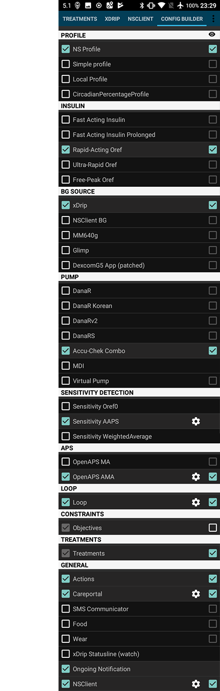

# Экраны AndroidAPS

## Главный экран

Это первый экран, который вы увидите, когда откроете AndroidAPS, и он содержит большую часть повседной информации.

### Секция A

* осуществляйте навигацию между модулями AndroidAPS свайпом влево или вправо

### Секция B

* изменить состояние цикла (открытый цикл, замкнутый цикл, приостановка цикла и т. д.)
* посмотреть текущий профиль и выполнить [переключение профиля](../Usage/Profiles.md)
* посмотреть текущий целевой уровень глюкозы в крови и установить [временные цели](../Usage/temptarget.md).

Нажмите и удерживайте любую из кнопок для изменения настройки. Например, удерживая темно-синюю целевую панель в верхнем правом углу ("110" на снимке экрана), можно задать временные цели.

### Секция С

* самые свежие данные ГК с мониторинга
* как давно они сняты
* изменения за последние 15 и 40 минут
* текущая скорость базала включая любой временный базал TBR заданный системой
* активный инсулин (IOB)
* активные углеводы COB - углеводы в процессе компенсации

Дополнительные [индикаторы состояния](../Configuration/Preferences#overview) (КАН| ИНС | РЕЗ | СЕН | БАТ) дают визуальное предупреждения о низком уровне резервуара, заряда батареи а также пропущенное время замены катетера.

Значение активного инсулина Iob будет нулевым при подаче только стандартного базального и когда нет остатков от предыдущих болюсов. Цифры в скобках показывают, сколько инсулина остается от предыдущих болюсов, и сколько - от временных базалов TBR, запрограммированных ААPS. Второй компонент может быть отрицательным, если перед этим были периоды подачи уменьшенной базы.

### Секция D

Нажмите на стрелку справа экрана в секции D, чтобы выбрать, какую информацию отображать на диаграммах ниже.

### Секция E

Это график, показывающий глюкозу крови (ГК), считанный мониторингом (CGM) он также показывает уведомления сайта Nightscout, такие как калибровки глюкометром и введенные углеводы.

Длительное нажатие на графике изменит шкалу времени. Можно выбрать 6, 8, 12, 18 или 24 часа.

Продолженные линии показывают тенденции ГК - если это выбрано в настройках.

* Оранжевая линия: активные углеводы COB (цвет обычно используется для отображения активных углеводов COB и углеводов)
* Темно-синяя линия: активный инсулин IOB (цвет обычно используется для отображения активного инсулина IOB и инсулина)
* Голубая линия: нулевой временный базал
* Темно-желтая линия: незапланированный прием пищи UAM

Эти линии отражают различные прогнозы, основанные на текущих усваиваемых углеводах (COB); инсулине (IOB); показывая, сколько времени понадобится ГК, чтобы понизиться до/выше заданного уровня, если не принимать во внимание отклонения и активировать нулевую временную базу, а также распознавание непредусмотренного питания, не введенного в систему пользователем (UAM).

Сплошная синяя линия показывает подачу базала помпой. Синяя точечная линия показывает какой была бы скорость подачи базала если бы не было временных корректировок базы TBR, а сплошная синяя линия показывает фактически поданный инсулин с течением времени.

### Секция F

Секция F: также настраивается с использованием опций в разделе D. В этом примере показан IOB (активный инсулин) - если бы не было временных базалов TBR и остатков болюсов он был бы равен нулю, чувствительности и отклонению. СЕРЫЕ столбцы показывают отклонение из-за углеводов, ЗЕЛЕНЫЕ - что ГК выше, чем ожидал алгоритм, и КРАСНЫЕ - что он ниже.

### Секция G

Секция G: позволяет подавать болюс (обычно кнопкой Калькулятора болюса) и добавлять калибровку мониторинга. Здесь также будет видна кнопка Quick Wizard, если она настроена в [ Конфигураторе](.../Configuration/Config-Builder#quickwizard-settings).

## Калькулятор

Когда необходимо дать болюс на еду, он обычно подается отсюда.

### Секция A

место, куда вы вводите информацию о желательном болюсе. Поле BG обычно уже заполнено данными с CGM. Если CGM не работает, то поле будет пустым. В поле УГЛЕВОДЫ вы добавляете рассчитанное вами количества углеводов - или эквивалента - на которые хотите дать болюс. Поле CORR/ИСПРАВ применимо если вы по какой-то причине хотите изменить конечную дозу, а поле CARB TIME нужно для предварительного болюса, чтобы сказать системе, что будет задержка приема углеводов и болюс будет отложен. Вы можете добавить отрицательное число в это поле, если даете болюс на прошлые углеводы.

SUPER BOLUS - это когда базальный инсулин следующих двух часов добавляется к подаваемому болюсу, а на следующие два часа подается нулевой временный базал TBR, чтобы поглотить лишний инсулин. Идея заключается в том, чтобы доставить инсулин по возможности раньше и, желательно, сократить пики.

### Секция B

показывает рассчитываемый болюс. Если количество активного инсулина превышает рассчитанный болюс, то оно просто покажет количество углеводов, которые еще требуются.

### Секция С

показывает различные элементы, которые были использованы для подсчета болюса. Можно отменить выбор тех, которые вы не хотите включить, но обычно это не требуется.

### Комбинации активных углеводов COB и активного инсулина IOB и что они означают

<ul>
    <li>Если вы отметите галочками COB и IOB, то будут учтены неусвоенные углеводы которые не покрыты инсулином + все инсулины, которые были введены в качестве временного базала или супермикроболюса СМБ</li>
    <li>Если вы отметите галочками COB без IOB, то рискуете получить слишком много инсулина поскольку AAPS не примет в расчет то, что уже доставлено. </li>
    <li>Если вы нажимаете IOB без COB, AAPS принимает в расчет уже поданный инсулин, но не углеводы, которые предстоит усвоить. Это приводит к уведомлению о "недостатке углеводов".
</ul>

Если вы даете болюс на дополнительную еду вскоре после болюса на прием пищи (напр. дополнительный десерт) полезно снять все галочки. Таким образом, добавляются только новые углеводы а поскольку основная еда не еще не усвоена, то IOB не будет точно соответствовать углеводам COB вскоре после болюса на еду.

### Медленное усвоение углеводов

Начиная с версии 2.4, AAPS предупреждает, обнаружено ли замедленное поглощение углеводов. После применения калькулятора на экране подтверждения появляется дополнительный текст. Риск заключается в переоценке активных углеводов COB и подаче чрезмерного количества инсулина.

В этом примере 41% времени использовалось значение [min_5m_carbimpact](..//Configuration/Config-Builder.html?highlight=min_5m_carbimpact#absorption-settings) вместо значения, рассчитанного из отклонений.

Здесь имеет смысл нажать "Отмена" и провести новый расчет с неотмеченными активными углеводами COB. Если из ручного расчета вы видите необходимость в корректирующем болюсе, внесите его вручную. Но следите за тем, чтобы не было передозировки!

## Профиль Инсулина

Показывает профиль активности выбранного вами инсулина. ФИОЛЕТОВАЯ линия показывает, сколько инсулина остается после ввода по мере рассасывания, а СИНЯЯ линия показывает его активность.

Обычно мы пользуемся одним из профилей Oref - и важно отметить, что рассасывание имеет длинный след. Если вы раньше управляли помпой вручную, то, вероятно, привыкли полагать, что инсулин рассасывается примерно за 3,5 часов. Однако, при включении цикла длинный след имеет большее значение поскольку расчеты здесь более точные и даже небольшие величины суммируются в рекурсивных вычислениях в алгоритме AndroidAPS.

Более подробное обсуждение различных типов инсулина, их профилей активности и почему это важно, см. здесь [Понимание новых кривых IOB на основе экспоненциальных кривых активности](https://openaps.readthedocs.io/en/latest/docs/While%20You%20Wait%20For%20Gear/understanding-insulin-on-board-calculations.html#understanding-the-new-iob-curves-based-on-exponential-activity-curves)

Отличная статья об этом: [Почему мы регулярно ошибались в определении длительности действия инсулина (DIA) и почему это имеет значение…](http://www.diabettech.com/insulin/why-we-are-regularly-wrong-in-the-duration-of-insulin-action-dia-times-we-use-and-why-it-matters/)

Еще на эту тему: [Экспоненциальные кривые инсулина + Fiasp](http://seemycgm.com/2017/10/21/exponential-insulin-curves-fiasp/)

## Статус помпы

Здесь мы видим статус инсулиновой помпы - в нашем случае Акку-Чек Комбо. Отображаемая информация не требует пояснений. Длительное нажатие на кнопку HISTORY/ИСТОРИЯ считывает данные из логов помпы, в том числе и ваш базальный профиль. Но помните, на помпе Combo поддерживается только один базальный профиль.

## Портал лечения/назначений

Здесь повторяются функции, которые вы найдете на экране Nightscout под символом "+", который позволяет добавлять заметки к лечению/назначениям. Такие функции, как регистрация изменения места установки катетера или замена картриджа инсулина понятны без пояснений. НО этот раздел не выдает команд на помпу. Так, если вы отметите подачу болюса на этом экране, помпа не получит никаких инструций, а в журнале Nightscout просто появится запись о болюсе.

## Состояние цикла/Loop, МА, АМА, SMB

Об этих показателях не нужно беспокоиться, они дают представление о работе алгоритма OpenAPS, который исполняется каждый раз, когда система получает свежее данные мониторинга CGM. Они обсуждаются в других местах.

## Профиль

AndroidAPS может работать с различными конфигурациями профиля. Обычно - как показано на снимке - профиль Nightscout загружается через встроенный клиент Nighscout и виден здесь в формате "только для чтения". Если вы хотите внести какие-либо изменения, вы сделаете это из пользовательского интерфейса Nightcut, а затем выполните [ Profile Switch ](../Usage/Profiles.md) in AndroidAPS для активации изменений. Такие данные, как профиль базала будут автоматически скопированы на вашу помпу.

**DIA:** означает Продолжительность действия инсулина и обсуждается выше в разделе профилей инсулина.

**IC:** is Insulin to Carb ratio. This profile has a number of different values set for different times of day.

**ISF:** is Insulin Sensitivity Factor - the amount by which one unit of insulin will reduce your blood glucose assuming that nothing else changes.

**Basal:** is the basal profile programmed into your pump.

**Target:** is the blood glucose level that you want the rig to be aiming for all the time. You can set different levels for differenttimes of day if you wish, and you can even set an upper and lower range so that the rig will only start to make changes when the predicted blood glucose value falls outside, but if you do that then the rig will respond more slowly and you are unlikely to achieve such stable blood sugars.

## Лечение/назначения, xDrip, NSClient

These are simply logs of treatments (boluses and carbs), xDrip messages and messages sent to Nightscout via the built-in Nightscout client. You don't normally need to worry about any of these unless there is a problem.

## Конфигуратор

This is where you will set up the configuraton of your AndroidAPS rig. This screenshot shows a pretty typical rig using a Combo pump, a Dexcom G5 CGM sensor being managed via xDrip+ and running with NovoRapid insulin on an Oref profile and connected to a Nightscout cloud based server.

The tick box on the right determines if that particular module will be displayed in the top menu bar (see section A at Homescreen) and the small gear wheel symbol allows access to the setting for that module, if there are any.

## Параметры и настройки

At the top right of the navigation bar you will find three small vertical dots. Pressing on these takes you to the app's preferences, history browser, setup wizard, about the app information and the exit button that will close AAPS.