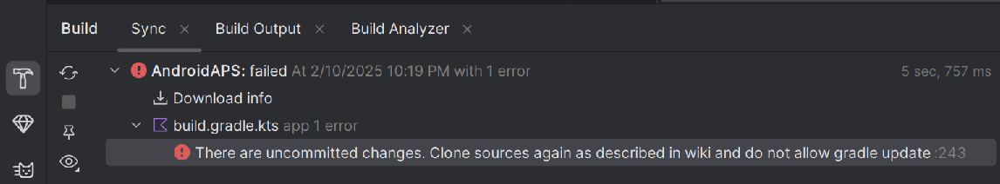
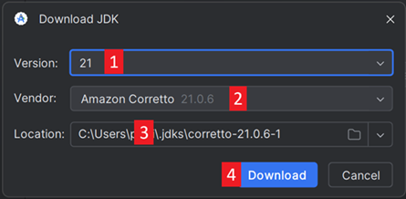

(troubleshooting_androidstudio-troubleshooting-android-studio)=
# Устранение неполадок Android Studio

(troubleshooting_androidstudio-lost-keystore)=
## Потеряно хранилище ключей
Если вы используете одно и то же хранилище ключей при обновлении AndroidAPS, вам не нужно деинсталлировать предыдущую версию на смартфоне. Поэтому рекомендуется хранилище ключей размещать в надежном месте.

Если вы пытаетесь установить apk, подписанный ключем, отличным от предыдущего, то получите сообщение об ошибке установки!

На случай, если вы не можете найти свое старое хранилище ключей, выполните следующие действия:

1. [Export settings](../Maintenance/ExportImportSettings.md) on your phone.
2. Скопируйте или загрузите файл настроек из телефона во внешнее местоположение (напр. компьютер, облачный сервис хранения данных...).
4. Generate signed apk of new version as described on the [Update guide](../Maintenance/UpdateToNewVersion) and transfer it to your phone.
5. Деинсталлируйте предыдущую версию AAPS.
6. Установите новую версию AAPS на телефон.
7. [Import settings](#ExportImportSettings-restoring-from-your-backups-on-a-new-phone-or-fresh-installation-of-aaps) to restore your objectives and configuration.

   Если не можете найти их, скопируйте из внешнего накопителя на ваш телефон.

8. Проверьте параметры оптимизации батареи и отключите их снова.
9. Продолжайте пользоваться системой AAPS.

## Ошибка синхронизации Gradle
Синхронизация Gradle может не работать по различным причинам. Когда выпадает сообщение о том, что синхронизация не удалась, откройте вкладку "Build" (1) в нижней части Android Studio и проверьте, какое отображается сообщение об ошибке (2).

  

Ниже перечислены обычные сбои в синхронизации:
* [Непринятые изменения](#uncommitted-changes)
* [Нет кэшированной версии...](#could-not-resolveno-cached-version)
* [Incompatible Gradle JVM](#incompatible-gradle-jvm)
* [Incompatible version of the Android Gradle plugin](#incompatible-version-of-android-gradle-plugin)

*Important*: After you have followed the instructions for your specific problem, you need to trigger the [gradle sync](#gradle-resync) again.

(troubleshooting_androidstudio-uncommitted-changes)=
### Непринятые изменения

Если получено такое сообщение об ошибке



#### Шаг 1 - Проверьте установку git
  * Откройте вкладку терминала (1) в нижней части Android Studio и скопируйте следующий текст и вставьте или введите в терминал.
    ```
    версия git
    ```

    

    Примечание: Между git и version есть пробел и два дефиса!

  * Вы получите сообщение о том, какая версия git установлена, как на снимке экрана выше. In this case, go to [Step 2](#troubleshooting-android-studio-check-for-uncommitted-changes).

  * Если вы получите сообщение
    ```
    Git: команда не найдена
    ```
    то Git установлен неправильно.

  * [Проверьте установку git](#BuildingAaps-steps-for-installing-git)

  * после установки Git в Windows и, нужно перезапустить компьютер или хотя бы раз выйти и снова войти в систему, чтобы сделать git глобально доступным

  * Если Git установлен, вы перезапустили его (если в Windows), и git все еще не найден:

  * Выполните поиск в компьютере файла "git.exe".

    Отметьте для себя, в каком он каталоге.

  * Перейдите к переменным окружения в окнах, выберите переменную «PATH» и нажмите «Редактировать». Добавьте каталог, где вы нашли вашу установку git.

  * Сохраните и закройте.

  * Перезапустите Android Studio.

(troubleshooting-android-studio-check-for-uncommitted-changes)=
#### Шаг 2: Проверьте незафиксированные изменения.

  * В Android Studio откройте вкладку Commit (1) слева. 
  * Вы увидите либо "Изменения по умолчанию" (2) или "Неверсионные файлы" (3):

    * Для "Default changeset" вы вероятно обновили gradle или по ошибке изменили содержимое файла.

    * Щелкните правой кнопкой мыши на "Изменения по умолчанию" и выберите "Отмена"

      

    * Файлы снова загрузятся с Git сервера. If there are no other changes in the commit tab, go to [Step 3](#gradle-resync).

  * Если вы видите "Неверсионные файлы", возможно вы храните вы файлы в каталоге источника кода, которым место где-то еще, например ваш файл ключа.

    * При помощи обычного файлового проводника на компьютере вырежьте и вставьте этот файл в другое место хранения.

    * Вернитесь к Android Studio и нажмите кнопку Обновить (4) на вкладке Commit, чтобы убедиться, что файл больше не хранится в каталоге AAPS.

      If there are no other changes in the commit tab, go to [Step 3](#gradle-resync).


(troubleshooting_androidstudio-step-3-gradle-resync)=

#### Шаг 3: Пересинхронизация Gradle (повторно)

Follow the instructions at [Gradle Resync](#gradle-resync).

(troubleshooting_androidstudio-android-gradle-plugin-requires-java-11-to-run)=

(incompatible-gradle-jvm)=
### Incompatible Gradle JVM

 If you experience the following error message, you need to download a correct JVM version before you can try again:
* Open the gradle view by clicking on the elephant (1) on the right side of Android Studio and open the settings (2) and select **Gradle Settings** (3):


* Open the **Gradle JDK** options, then select **Download JDK...**


* At **Version** (1), you need to select **17**. Then select the **JetBrains Runtime** from the **Vendor** (2) options. Do not change the **Location** (3).



* Close the **Settings** dialog with **OK**.
* You now need to restart the Gradle Sync. Follow the instructions at [Gradle Resync](#gradle-resync).

(incompatible-version-of-android-gradle-plugin)=
### Несовместимая версия плагина Android Gradle

  Если вы сталкиваетесь со следующими ошибками

  

  Вы используете устаревшую версию Android Studio. В меню перейдите в "Справка > Проверить наличие обновлений и установить любые обновления и расширения Android Studio.

(troubleshooting_androidstudio-could-not-resolve-no-cached-version)=
### Не удалось разрешить/Нет кэшированной версии

  Вы можете столкнуться с этой ошибкой:


  * С правой стороны откройте вкладку Gradle (1).

    Убедитесь, что кнопка, показанная на (2), *НЕ* выбрана.

    

  * Now you need to trigger a [Gradle Resync](#gradle-resync)

(troubleshooting_androidstudio-unable-to-start-daemon-process)=
### Не удается запустить демон процесс

  Если вы видите подобное сообщение об ошибке, вы, вероятно, используете ОС Windows 10, 32-bit. This is not supported by Android Studio 3.5.1 and above and unfortunately nothing the AAPS developer can do about!

  В интернете множество рекомендаций, как определить, у вас 32-или 64-битная ОС- например [эта](https://support.microsoft.com/en-us/windows/32-bit-and-64-bit-windows-frequently-asked-questions-c6ca9541-8dce-4d48-0415-94a3faa2e13d).

  

(gradle-resync)=
### Повторная синхронизация Gradle

  Если вы все еще видите сообщение о том, что синхронизация gradle не удалась, выберите "Повторить попытку". 


  Если это сообщение исчезло, можете запустить его вручную:

  * Откройте вкладку Gradle (1) на правой границе Android Studio.

    

  * Щелкните правой кнопкой мыши по AAPS (2)

  * Нажмите на "Перезагрузить Gradle Project" (3)

## Generate Signed APK успешно сгенерировано с 0 вариантами сборки

Когда генерируете подписанное приложение, то можете получить уведомление об успешном завершении, но вариантов сборки - 0:


Это неверное предупреждение. Check the directory your selected as "Destination folder" for generation (step [Generate Signed APK](#Building-APK-generate-signed-apk)) and you will find the generated apk there!


## Приложение было создано с предупреждениями компилятора/kotlin

Если ваша сборка успешно завершена, но получено предупреждения компилятора или kotlin (обозначенные желтым или синим восклицательным знаком), то эти предупреждения можно просто проигнорировать.

 

Приложение собрано успешно и может быть перенесено на телефон!


## Ключ создан с ошибками

При создании нового хранилища ключей для сборки подписанного APK в Windows может появиться следующее сообщение об ошибке


Это, кажется, ошибка в Android Studio 3.5.1 и в среде Java в Windows. Ключ создается правильно, но рекомендация выводится как ошибка. В настоящее время это можно игнорировать.


## AAPS не получает данные мониторинга CGM

* Если вы используете пропатченное приложение Dexcom G6: это приложение устарело. Use the [BYODA](#DexcomG6-if-using-g6-with-build-your-own-dexcom-app) app instead.

* In case you are using xDrip+: Identify receiver as described on [xDrip+ settings page](#xdrip-identify-receiver).


## Приложение не установлено


* Убедитесь, что вы передали файл «full-release.apk» на телефон.
* Если на телефоне появилось сообщение "приложение не установлено", то выполните следующее:

1. [Export settings](../Maintenance/ExportImportSettings.md) (in AAPS version already installed on your phone)
2. Удалите AAPS с телефона.
3. Включите режим самолета & выключите bluetooth.
4. Установите новую версию («app-full-release.apk»)
5. [Выполните импорт настроек](../Maintenance/ExportImportSettings.md)
6. Снова включите Bluetooth и отключите режим самолета

## Приложение установлено, но старая версия

If you built the app successfully, transferred it to your phone and installed it successfully but the version number stays the same then you might have missed to [update your local copy](#Update-to-new-version-update-your-local-copy)

## Ничего из вышеперечисленного не сработало

Если вышеперечисленные советы не помогли попробуйте заново начать сборку приложения:

1. [Export settings](../Maintenance/ExportImportSettings.md) (in AAPS version already installed on your phone)

2. Подготовьте пароль ключа и пароль хранилища. В случае, если вы забыли пароли, вы можете попытаться найти их в файлах проекта, как описано [здесь](https://youtu.be/nS3wxnLgZOo).

    Или просто создайте новый файл хранения ключей.

3. Build app from scratch as described [here](#Building-APK-download-AAPS-code).

4. Когда вы успешно собрали APK, удалите существующее приложение с телефона, перенесите новое приложение на телефон и установите.
5. [Import settings](../Maintenance/ExportImportSettings.md) again to restore your objectives and settings.
6. Проверьте параметры оптимизации батареи и отключите их снова.

## Сценарий худшего варианта

Если даже создание приложения с нуля не решает проблему, попробуйте полностью удалить Android Studio. Некоторые пользователи сообщили, что это решило проблему.

**Деинсталлируйте все файлы, связанные с Android Studio.**Если не полностью удалить Android Studio со всеми скрытыми файлами, деинсталляция может привести к новым проблемам, а не к решению существующих. Руководства по полной деинсталляции можно найти в Интернете, напр.

[https://stackoverflow.com/questions/39953495/how-to-completely-uninstall-android-studio-from-windowsv10](https://stackoverflow.com/questions/39953495/how-to-completely-uninstall-android-studio-from-windowsv10).

Install Android Studio from scratch as described [here](#Building-APK-install-android-studio).
