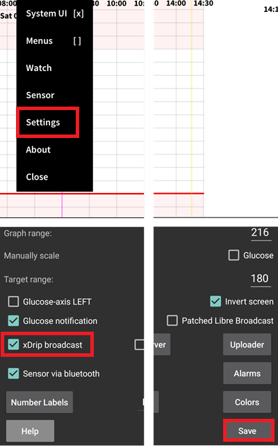

# Freestyle Libre 2

The Freestyle Libre 2 sensor is now a real CGM even with the official app. Still, LibreLink cannot send data to AAPS. There are several solutions to use it with AAPS.

## 1. Use a Bluetooth bridge and OOP

Bluetooth transmitters can be used with the Libre 2 (EU) and an [out of process algorithm](https://drive.google.com/file/d/1f1VHW2I8w7Xe3kSQqdaY3kihPLs47ILS/view) app. You can receive blood sugar readings every 5 minutes like with the [Libre 1](../Libre1).

Check the bridge and app you want to use are compatible with your sensor and xDrip+ (older Blucon and recent ones won't work, Miaomiao 1 needs firmware 39 and Miaomiao 2 firmware 7).

The Libre2 OOP is creating the same BG readings as with the original reader or the LibreLink app via NFC scan. AAPS with Libre 2 do a 10 to 25 minutes smoothing to avoid certain jumps. See below [Value smoothing & raw values](#value-smoothing-raw-values). OOP generates readings every 5 minutes with the average of the last 5 minutes. Therefore the BG readings are not that smooth but match the original reader device and faster follow the "real" BG readings. If you try to loop with OOP please enable all smoothing settings in xDrip+.

There are some good reasons to use a Bluetooth transmitter:

-   You can choose various OOP2 calibration strategies (1): have the reader values using "no calibration", or calibrate the sensor like a Libre 1 using "calibrate based on raw" or ultimately calibrate the the readers like values with "calibrate based on glucose".  
  Make sure to leave OOP1 disabled (2).

    → Hamburger Menu → Settings → Less common settings → Other misc. options

-   The Libre 2 sensor can be used 14.5 days as the Libre 1
-   8 hours backfilling is fully supported

Remark: The transmitter can be used in parallel to the LibreLink app without interfering with it.

## 2. Use xDrip+ direct connection

:::{admonition} Libre 2 EU only :class: warning xDrip+ doesn't support direct connection to Libre 2 US and AUS.  
:::

- Follow [these instructions](https://www.minimallooper.com/post/how-to-setup-freestyle-libre-2-and-oop2-to-use-a-native-bluetooth-connection-in-xdrip) to setup xDrip+ but make sure to download [this latest OOP2](https://drive.google.com/file/d/1f1VHW2I8w7Xe3kSQqdaY3kihPLs47ILS/view) as the one in the document is obsolete.
- Follow setup instructions on [xDrip+ settings page](../Configuration/xdrip.md).

-   В качестве источника данных гликемии в конфигураторе (настройки AAPS) выберите xDrip+.

## 3. Use Diabox

- Установите [Diabox](https://t.me/s/DiaboxApp). В Настройках, Интеграция, включите "Делиться данными с другими приложениями".

- В качестве источника данных гликемии в конфигураторе (настройки AAPS) выберите xDrip+.

## 4. Use Juggluco

- Скачайте и установите приложение Juggluco [отсюда](https://www.juggluco.nl/Juggluco/download.html).
- Follow the instructions [here](https://www.juggluco.nl/Juggluco/index.html)
- In Settings, enable xDrip+ broadcast (which doesn't send data to xDrip+ but to AAPS).

- В качестве источника данных гликемии в конфигураторе (настройки AAPS) выберите xDrip+.

:::{admonition} Use with xDrip+ :class: note You can set Juggluco to broadcast to xDrip+ with Patched Libre Broadcast (you should disable xDrip+ broadcast), in order to calibrate (see here) and avoid 1 minute readings to be sent to AAPS.  
  
You will then need to set xDrip+ data source to Libre 2 Patched App to receive data from Juggluco.  
:::

## 5. Use the patched LibreLink app with xDrip+

:::{admonition} Libre 2 EU only :class: warning The patched app is an old version (22/4/2019) and might not be compatible with recent Android releases.  
:::

### Step 1: Build the patched app

For legal reasons, "patching" has to be done by yourself. Используйте поисковые системы для поиска соответствующих ссылок. There are two variants: The recommended original patched app blocks any internet traffic to avoid tracking. The other variant supports LibreView.

Вместо оригинального приложения следует установить модифицированное. Следующий датчик, установленный с его помощью, будет передавать текущие значения гликемии приложению xDrip+, работающему на смартфоне через Bluetooth.

Важно: чтобы избежать возможных проблем, рекомендуем сначала установить и затем деинсталлировать оригинальное приложение на смартфон с поддержкой NFC. NFC должен быть включен. Он не требует дополнительной энергии. Затем установите модифицированное приложение.

Исправленное приложение можно определить с помощью уведомления об авторизации в главном режиме. The foreground authorization service improves the connection stability compared to the original app which does not use this service.

Other indications could be the Linux penguin logo in the three dot menu -> Info or the font of the patched app (2) different from the original app (1). Эти критерии необязательны и зависят от выбранного источника скачивания приложения.

Убедитесь, что NFC активирована дайте разрешения на обращение к памяти и геолокации, включите автоматическое время и часовой пояс и задайте хотя бы одно оповещение в этом приложении.

### Step 2: Start the sensor with the patched app

Теперь запустите сенсор Libre2 при помощи модифицированного приложения, просто сканируя сенсор. Убедитесь, что заданы все параметры.

Обязательные параметры для успешного запуска сенсора:

-   NFC включен/BT включен
-   включено разрешение на память и геолокацию
-   Включена служба определения местоположения
-   автоматическое определение времени и часового пояса
-   задать хотя бы одно оповещение в модифицированном приложении

Обратите внимание, что служба определения расположения является центральным параметром. Это не разрешение на доступ к геолокации в приложении, которое также должно быть активировано!

Once the sensor started with the patched app, you won't be able to connect it to another app/phone. If you uninstall the patched app, you will lose alarms and continuous BG readings.

Первая установка соединения с сенсором имеет решающее значение. Приложение LibreLink пытается установить беспроводное соединение с сенсором каждые 30 секунд. Если один или несколько обязательных параметров отсутствуют, их надо скорректировать. У вас нет ограничений по времени для этого. Сенсор постоянно пытается установить соединение. Даже если это длится несколько часов. Be patient and try different settings before even thinking of changing the sensor.

Если вы видите красный восклицательный знак ("!") on the upper left corner of the LibreLink start screen there is no connection or some other setting blocks LibreLink to signal alarms. Проверьте, включен ли звук и отключены ли все виды блокировок уведомлений от приложений. Когда восклицательный знак исчезнет, соединение будет установлено и значения гликемии отправятся на смартфон. Это должно произойти не более чем через 5 минут.

Если восклицательный знак остается или сприходят ообщения об ошибке, это может иметь несколько причин:

-   Android location service is not granted - please enable it in system settings
-   automatic time and time zone not set - please change settings accordingly
-   activate alarms - at least one of the three alarms must be activated in LibreLink
-   Bluetooth выключен - включите
-   звук заблокирован
-   уведомления приложений заблокированы
-   неактивные уведомления на экране заблокированы

Перезапуск телефона помогает, возможно, придется перезапустить несколько раз. Как только соединение будет установлено, красный восклицательный знак исчезнет и самый важный этап - сопряжение - пройден. Может случиться так, что в зависимости от системных настроек восклицательный знак остается, но данные идут. В обоих случаях нет причин беспокоиться. Сенсор и телефон теперь сопряжены, каждую минуту передаются данные ГК.

Иногда может помочь очистка кэша bluetooth и/или сброс всех сетевых соединений через меню системы. Это удалит все подключенные устройства bluetooth и, возможно восстановит правильное соединение. That procedure is safe as the started sensor is remembered by the patched LibreLink app. Ничего дополнительного здесь не требуется. Просто подождите подключения модифицированного приложения к сенсору.

После успешного подключения при необходимости можно изменить настройки смартфона. Это не рекомендуется, но вы можете захотеть экономить энергию. Служба определения местоположения может быть отключена, громкость установлена на ноль, сигналы снова отключены. Данные сахара крови в любом случае передаются.

Однако, при запуске следующего сенсора, все параметры должны быть установлены снова!

Замечание: чтобы включить соединение, приложению требуются обязательные настройки, установленные в течение часа после разогрева,. Они не нужны в течение 14-дневного периода работы. В большинстве случаев при проблемах с запуском сенсора была выключена служба определения местоположения. На Android это необходимо для правильной работы Bluetooth. См. документацию Google Android.

В течение 14 дней для сканирования при работе с приложением LibreLink можно использовать параллельно один или несколько смартфонов с NFC (не ридер!). Для того чтобы начать сканирование нет ограничений по времени. Можно начать сканирование еще одним телефоном, например, на пятый или любой другой день. Второй телефон (телефоны) может передавать значения сахара крови в Abbott Cloud (LibreView). LibreView может генерировать отчеты для специалистов.

Обратите внимание, что модифицированное приложение не имеет подключения к Интернету, чтобы избежать отслеживания.

Однако существует вариант модифицированного приложения с включенным доступом в Интернет для поддержки LibreView. В этом случае имейте в виду, что данные передаются в облако. But your endo team reporting is fully supported then. С помощью такого варианта можно также перенести оповещения сенсора на другое устройство, которое не запускало сенсор. Подробно о том, как это сделать, можно найти поиском google на немецких диабетических форумах.

### Step 3: Install and configure xDrip+ app

Значения гликемии передаются на смартфон приложением xDrip+.

-   You can safely download the [latest APK (stable)](https://xdrip-plus-updates.appspot.com/stable/xdrip-plus-latest.apk) unless you need recent features, in which case you should use the latest [Nightly Snapshot](https://github.com/NightscoutFoundation/xDrip/releases).
-   Set xDrip+ with the [patched app data source](../Configuration/xdrip.md#lbre-2-patched-app).
-   Follow setup instructions on [xDrip+ settings page](../Configuration/xdrip.md).

### Step 4: Start sensor

- → Hamburger Menu (1) → Start sensor (2) → Start sensor (3) → Answer "Not Today" (4).

This will not physically start any Libre2 sensor or interact with them in any case. Это нужно для того, чтобы указать xDrip+, что новый сенсор начал передавать ГК. Если доступно, введите два замера крови для начальной калибровки. Теперь значения глюкозы крови должны отображаться в xDrip+ каждые 5 минут. Пропущенные данные, например из-за того, что вы были далеко от телефона, не будут восстановлены.

После смены сенсора xDrip+ автоматически определит новый и удалит все данные калибровки. You may check you blood glucose after activation and make a new initial calibration.

### Step 5: Configure AAPS (for looping only)

-   В AAPS перейдите в Конфигуратор > Источник ГК и выберите 'xDrip+'
-   Если AAPS не получает значения ГК, когда телефон находится в режиме авиаперелета пользуйтесь функцией "Установить получателя" в соответствии с описанием [настроек xDrip+](xdrip-identify-receiver).

До настоящего времени, при выборе Libre 2 в качестве источника данных ГК, в алгоритме SMB невозможно активировать «Включить SMB всегда» и «Включить SMB после углеводов». Значения BG Libre 2 недостаточно сглажены, чтобы их безопасно использовать. See [Smoothing blood glucose data](../Usage/Smoothing-Blood-Glucose-Data-in-xDrip.md) for more details.

(Libre2-experiences-and-troubleshooting)=
### Опыт и устранение неполадок

#### Связь

The connectivity is good with most phones, with the exception of Huawei mobile phones. Связь может прерваться, если мобильный телефон находится в кармане напротив сенсора или когда вы на улице. Wear your phone on the sensor side of your body. В помещениях, где устройства Bluettooth работают за счет отражений, нет никаких проблем. Если возникают проблемы с подключением, попробуйте другой телефон. Также может помочь установка сенсора антенной BT вниз. При установке сенсора прорезь на аппликаторе должна быть направлена вниз.

#### Сглаживание данных & необработанные данные

Technically, the current blood sugar value is transmitted to xDrip+ every minute. A weighted average filter calculates a smoothed value over the last 25 minutes by default. You can change the period in the NFC Scan features menu.

→ Hamburger menu → Settings → NFC Scan features → Smooth libre 3 data when using xxx method

Это обязательно для цикла. The curves look smooth and the loop results are great. Необработаные значения, на которых основаны оповещения, имеют несколько больший разборос, но в конечном счете соответствуют показателям ридера. Кроме того, необработанные значения могут отображаться на графике xDrip+, чтобы имелась возможность своевременно реагировать на быстрые изменения. Переключитесь на Менее распространенные Настройки\ > Расширенные настройки для Libre2 \>"показывать необработанные значения" и "показывать Информацию с сенсора". После этого "необработанные" значения будут дополнительно отображается в виде небольших белых точек, а в меню системы будет доступна дополнительная информация о сенсоре.

Необработанные данные очень полезны при быстрых изменениях ГК. Даже если точки идут вразброс, для принятия решений по терапии тенденция видна гораздо лучше, чем при сглаживании.

→ Hamburger menu → Settings → Less common settings → Advanced settings for Libre 2

#### Время работы сенсора

Рабочее время сенсора фиксируется на 14 дней. 12 дополнительных часов Либре1 больше не существует. xDrip+ shows additional sensor information after enabling Advanced Settings for Libre2 → "show Sensors Infos" in the system menu like the starting time. Оставшееся время сенсора можно также увидеть в модифицированном приложении LibreLink. Either in the main screen as remaining days display or as the sensor start time in the three-point menu → Help → Event log under "New sensor found".

#### Новый сенсор

Замена сенсора происходит на лету: установите новый сенсор незадолго до активации. Как только xDrip+ больше не получает данных от старого сенсора, запустите новый при помощи модифицированного приложения. Через час новые значения должны появиться автоматически в xDrip+.

В противном случае проверьте настройки телефона и перейдите к первоначальному запуску. У вас нет ограничения по времени. Постарайтесь найти правильные настройки. Нет необходимости сразу же менять сенсор пока не перепробованы разные комбинации. Сенсоры прочны, постарайтесь установить надежное соединение. Не торопитесь. В большинстве случаев вы могли случайно изменить какой-то один параметр, который вызывает проблемы.

При успехе выберите "стоп сенсор" и "только удалить калибровки" в xDrip. Xdrip + сможет понять, что новый сенсор получает данные сахара в крови, а старые калибровки больше не действительны и должны быть удалены. Никакого реального взаимодействия с сенсором Libre2 при этом не происходит! Запускать сенсор в xDrip не требуется+.

#### Калибровка

You can calibrate the Libre2 **with an offset of -40 mg/dl to +20 mg/dL \[-2,2 mmol/l to +1,1 mmol/l\]** (intercept). The slope isn't changeable. Please check by fingerpricking after setting a new sensor, keeping in mind it might not be accurate in the first 12 hours after insertion. Since there can be large differences to the blood measurements, verify every 24 hours and calibrate if necessary. If the sensor is completely off after a few days, it should then be replaced.

### Верификация

Сенсоры Libre2 способны выполнять самопроверку для обнаружения плохих сенсоров. Как только сенсор смещается на руке или слегка приподнимается, данные могут начать колебаться. После этого датчик Libre2 отключится по соображениям безопасности. К сожалению, при сканировании при помощи приложения, проводятся дополнительные проверки. Приложение может отключить сенсор, даже если он исправен. В настоящее время внутренний тест слишком жесткий. Avoid scanning the sensor with another phone to reduce the risk of unexpected sensor shutdown.

# Best practices for calibrating a Libre 2 sensor

Существует несколько "правил" для лучших результатов калибровки сенсоров Libre 2. Они не зависят от программного обеспечения (например, модифицированное приложение libre2, oop2, …), для обработки значений Libre2 .

1.  Самое важное правило - калибровать датчик только тогда, когда значения идут ровно не менее 15 минут. Разница между последними тремя величинами не должна превышать 10мг/дл (за 15 минут, а не между каждым замером). Поскольку Libre 2 замеряет не уровень гликемии крови, а уровень в подкожных тканях, существует некоторая задержка показаний, особенно при подъеме или падении. Эта задержка может иногда приводить к слишком большим сдвигам в калибровках даже если уровень ГК поднимается/падает не так сильно. Таким образом, избегайте калибровки на восходящих или падающих значениях. -> Если вы добавляете калибровку, вне плоского графика (например, при запуске нового сенсора), рекомендуется как можно скорее удалить эту калибровку и добавить новую при плоском графике ГК.
2.  На самом деле этот уровень автоматически учитывается при соблюдении правила 1, но надо удостовериться, что при контрольных замерах график гликемии также ровный в течение 15 минут и более. Не сравнивайте замеры на падениях и подъемах. Важно: замеры можно производить в любое время, но калибруйте только на ровных!
3.  Поскольку калибровка на ровных является хорошей основой, рекомендуется также калибровать сенсор только в пределах желаемого целевого диапазона, например от 70 до 160 мг/дл. Libre2 не работает в широком диапазоне, например от 50 мг/дл до 350 мг/дл (по крайней мере не линейно), поэтому калибруйте только в нужном диапазоне. -> Просто имейте в виду, что значения за пределами диапазона калибровки не будут точными.
4.  Не калибруйте слишком часто. Частые калибровки в основном приводят к ухудшению результатов. Когда сенсор дает хорошие результаты в на ровных сахарах, просто не добавляйте новых калибровок, так как это не будет иметь нужного эффекта. Достаточно перепроверять точность каждые 3-5 дней (конечно, на ровных).
5.  Избегайте калибровок, когда это не требуется. This might sound silly but it is not recommended to add a new calibration if the blood glucose to flesh glucose level difference is only ±10 mg/dl (e.g. blood glucose level: 95, Libre sensor 100 -> do NOT add the 95, blood glucose level: 95, Libre sensor 115 -> add the 95 to be taken into account for the calibration)

Некоторые общие замечания: После активации нового сенсора и при окончании его срока службы, имеет смысл чаще проводить сравнительные измерения чем раз в 3-5 дней, как указано в правиле № 4. В новых и старых сенсорах чаще требуются перекалибровки. Время от времени сенсор не передает допустимых значений. Наиболее вероятно, что значение сенсора намного нижепо сравнению с фактическим уровнем глюкозы в крови ( например, сенсор: 50 mg/dl, ГК: 130 mg/dl) даже после калибровки. В этом случае добиться полезных результатов от сенсора не удастся. Например, при использовании модифицированного приложения можно максимально добавить смещение +20 мг/dl. Когда сенсор дает слишком низкие значения, не сомневаясь заменяйте его, так как ситуация не улучшится. Даже если сенсор неисправен, при слишком частых низких значениях, попробуйте другие участки тела. Даже на официально одобренных участках (верхняя часть руки) могут быть локации, где сенсоры не дают верных показаний. Методом проб и ошибок добивайтесь лучших результатов.
