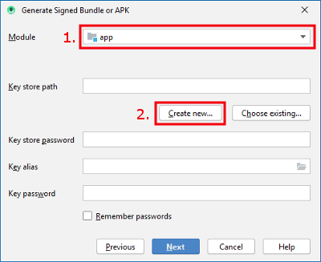

# Создание андроид-приложения (APK)

## Постройте сами вместо того, чтобы загружать

**AndroidAPS недоступен для скачивания из-за законодательства, касающегося медицинских устройств. Построить приложение для собственного использования вполне законно, но вам не разрешается передавать копию другим! См. раздел [ FAQ ](../Getting-Started/FAQ.md).**

## ## Важные Примечания

* Используйте **[ Android Studio версии 3.6.1 ](https://developer.android.com/studio/)** или новее для построения apk.
* [Windows 10 для 32-разрядных систем](../Installing-AndroidAPS/troubleshooting_androidstudio#unable-to-start-daemon-process) не поддерживается в Android Studio 3.6.1.

** Конфигурация по требованию ** не поддерживается текущей версией модуля Android Gradle!

Если сборка выполнена с ошибкой, относящейся к "выборочной конфигурации", можно сделать следующее:

* Откройте окно настроек, нажав Файл > Настройки (на Mac, Android Studio > Настройки).
* В левой панели нажмите Сборка, Выполнение, Развертывание > Компилятор.
* Снимите флажок с ячейки "выборочная конфигурация".
* Нажмите Применить или OK.

* * *

### Эта статья разделена на две части.

* В обзорной части есть объяснение того, какие шаги необходимы для создания файла APK.
* В пошаговой инструкции вы найдете снимки экранов установки. Поскольку версии Android Studio - среды разработки программного обеспечения, в которой мы будем создавать APK - меняются очень быстро, точного соответствия вашей сборке вы не увидите, но общее представление о том, как это делается, получите. Android Studio работает на Windows, Mac OS X и Linux, и между каждой платформой возможны незначительные различия. Если вы обнаружите, что что-то важное выполняется неправильно или отсутствует, пожалуйста, сообщите в группе facebook "AndroidAPS users" или в чате Gitter [Android APS](https://gitter.im/MilosKozak/AndroidAPS) или [AndroidAPSwiki](https://gitter.im/AndroidAPSwiki/Lobby) чтобы мы могли устранить проблему.

## Общие замечания

В целом, шаги, необходимые для создания файла APK таковы:

1. [Установите Git](../Installing-AndroidAPS/git-install.rst)
2. [Установите Android Studio](../Installing-AndroidAPS/Building-APK#install-android-studio)
3. [Задайте путь к git в параметрах Android Studio](../Installing-AndroidAPS/Building-APK#set-git-path-in-preferences)
4. [Скачайте код AndroidAPS](../Installing-AndroidAPS/Building-APK#download-androidaps-code)
5. [Загрузите Android SDK](../Installing-AndroidAPS/Building-APK#download-android-sdk)
6. [Постройте приложение ](../Installing-AndroidAPS/Building-APK#generate-signed-apk) (сгенерируйте подписанный apk)
7. [Перенесите файл apk на телефон](../Installing-AndroidAPS/Building-APK#transfer-apk-to-smartphone)
8. [Идентифицируйте ресивер при использовании xDrip+](../Installing-AndroidAPS/Building-APK#identify-receiver-if-using-xdrip)

## Пошаговое руководство

Подробное описание шагов, необходимых для создания файла APK.

## Установите git (если у вас его нет)

Следуйте инструкциям на странице установки [git](../Installing-AndroidAPS/git-install.rst).

## Установите Android Studio

Cледующие снимки экрана были сделаны c Android Studio версии 3.6.1. Экран может выглядеть несколько иначе в зависимости от используемой версии Android Studio. Но следует постараться найти свое решение установки. [Помощь от сообщества здесь](../Where-To-Go-For-Help/Connect-with-other-users.md).

Одна из наиболее важных заповедей при установке Android Studio: ** Будьте терпеливы! ** Во время установки и настройки Android Studio загружает многие элементы, которые отнимают время.

Установите [ Android Studio ](https://developer.android.com/studio/install.html) и настройте при первом запуске.

Выберите "Не импортировать настройки", так как вы не использовали их раньше.


Решите, хотите ли вы совместно использовать данные с Google или нет.


На следующем экране нажмите кнопку "Далее".


Выберите "Стандартная" установка и нажмите "Далее".


Для интерфейса выберите тему, которая вам нравится. (В этом руководстве мы использовали "Светлую".) Затем нажмите кнопку "Далее". Это всего лишь цветовая схема. Можете выбрать любую (напр. Darcula для темного режима). Этот выбор не влияет на построение APK.


Нажмите "Далее" в диалоге "Проверить настройки".


Подождите, пока Android Studio скачивает дополнительные компоненты и будет терпеливы. После того, как все загрузится кнопка "Готово", станет синей. Теперь нажмите на кнопку.


## Задайте путь к git в параметрах

Убедитесь, что [ git установлен ](../Installing-AndroidAPS/git-install.rst) на вашем компьютере.

На экране приветствия Android Studio нажмите на маленький треугольник (1. на следующем снимке экрана) и выберите "Настройки" (2.).


### Windows

* Нажмите на маленький треугольник рядом с Контролем Версий (1.) чтобы открыть подменю.
* Нажмите Git (2.).
* Убедитесь, что выбран метод обновления "Слияние" (merge) (3.).
* Check if Android Studio can locate path to git.exe automatically by clicking the button "Test" (4.)
    
    

* If automatic setting is successful git version will be displayed.

* Click "OK" in the dialog box (1.) and "OK" in the settings window (2.).
    
    

* In case file git.exe cannot be found click "OK" in the dialog box (1.) and then the button with the three dots (2.).

* Use [search function](https://www.tenforums.com/tutorials/94452-search-file-explorer-windows-10-a.html) in windows explorer to find "git.exe" if you are unsure where it can be found. Вы ищете файл git.exe, находящийся в папке \bin\.
* Select path to git.exe and make sure you selected the one in ** \bin\ ** folder (3.) and click "OK" (4.).
* Close settings window by clicking "OK" button (5.).
    
    

* **Reboot your computer to update system environment.**

### Mac

* Any git version should work. For example <https://git-scm.com/download/mac>.
* Use homebrew to install git: ```$ brew install git```.
* For details on installing git see the [official git documentation](https://git-scm.com/book/en/v2/Getting-Started-Installing-Git).
* If you install git via homebrew there is no need to change any preferences. На всякий случай: Их можно найти здесь: Android Studio - Настройки.

## Скачайте код AndroidAPS

* **If you haven't already rebooted your computer after setting git path in preferences do it now. System environment must be updated.**

* There are two options to start a new project:
    
    * On the Android Studio welcome screen click "Get from version control"
        
        
    
    * If you already opened Android Studio and do not see the welcome screen anymore select File (1.) > New (2.) > Project from Version Control... (3.)
        
        

* Fill in the URL to the main AndroidAPS repository (https://github.com/nightscout/AndroidAPS) (1.).

* Choose the directory where you want to save the cloned code. (2.)
* Click button "Clone" (3.).
    
    

* Do not click "Background" while repository is cloned!
    
    

* After repository is cloned successfully open your local copy by clicking "Yes".
    
    

* In the lower right corner you will see the information that Android Studio is running background tasks.
    
    

* Grant access if your firewall is asking for permission.
    
    

* Once the background tasks are finished you will probably see the following error message:
    
    

## Загрузите Android SDK

* Click File > Settings.
    
    

* Click the small triangle next to Appearance & Behaviour (1.).

* Click the small triangle next to System Settings (2.) and select Android SDK (3.)
* Check the box left of "Android 9.0 (Pie)" (4.) (API Level 28).
    
    

* Confirm changes by clicking OK.
    
    

* Accept licence agreement (1.) and click "Next" (2.).
    
    

* Wait until installation is finished.
    
    

* When SDK installation is completed the "Finish" button will turn blue. Click this button.
    
    

* Android Studio might recommend to update the gradle system. **Never update gradle!** This might lead to difficulties!

* If you see an information on the lower right side of your Android Studio window that Android Gradle Plugin is ready to update click on the text "update" (1.) and in the dialog box on "Don't remind me again for this project" (2.).
    
    

## Создание подписанного APK

Signing means that you indicate your app to be your own creation but in a digital way as a kind of digital fingerprint within the app itself. That is necessary because Android has a rule that it only accepts signed code to run for security reasons. For more information on this topic, follow [this link](https://developer.android.com/studio/publish/app-signing.html#generate-key).

* Нажмите "Build" в строке меню и выберите "Generate Signed Bundle / APK...".
    
    

* Выберите "APK" (1.) вместо "Android App Bundle" и нажмите кнопку "Далее" (2.).
    
    

* Make sure that module is set to "app" (1.).

* Click "Create new..." (2.) to start creating your key store.
    
    A key store in this case is nothing more than a file in which the information for signing is stored. It is encrypted and the information is secured with passwords.
    
    

* Click the folder symbol (1.) to select your key store path.

* Select the path where your key store shall be saved (2.). **Do not save in same folder as project. You must use a different directory!** One option might be your home folder.
* Type a file name for your key store (3.).
* Click "OK" (4.).
* Passwords for key store and key do not have to be very sophisticated. Make sure to remember those or make a note in a safe place. In case you will not remember your passwords in the future you see [troubleshooting for lost key store](../Installing-AndroidAPS/troubleshooting_androidstudio#lost-keystore).
* Enter (5.) and confirm (6.) the password for your key store.
* Do the same for your key (7. + 8.).
* Validity (9.) is 25 years by default. You do not have to change the default value.
* First and last name must be entered (10.). All other information is optional.
* Click "OK" (11.) when you are done.
    
    

* Make sure the box to remember passwords is checked (1.). So you don't have to enter them again next time you build the apk (i.e. when updating to a new AndroidAPS version).

* Click "Next" (2.).
    
    

* Выберите вариант компоновки "fullRelease" (1.).

* Отметьте флажки V1 и V2 для подписи версий (2.).
* Нажмите ``Finish``. (3.)
    
    

* После завершения сборки Android Studio покажет информацию "APK (s) сгенерировано успешно ...".

* В случае, если сборка не удалась, обратитесь к разделу [поиск и устранение неисправностей ](../Installing-AndroidAPS/troubleshooting_androidstudio.rst).
* Самый простой способ найти apk это нажать на кнопку "журнал событий".
    
    

* В секции журнала событий нажмите «locate».
    
    

* app-full-release.apk это файл, который вы ищете.
    
    

## Перенос приложения на смартфон

Самый простой способ перенести приложение на ваш телефон - [через кабель USB или Google Drive](https://support.google.com/android/answer/9064445?hl=en). Обратите внимание, что передача по почте может вызвать трудности и не является предпочтительным способом.

На вашем телефоне необходимо разрешить установку из неизвестных источников. Инструкции, как это сделать, можно найти в интернете (например [здесь](https://www.expressvpn.com/de/support/vpn-setup/enable-apk-installs-android/) или [здесь](https://www.androidcentral.com/unknown-sources)).

## Идентифицируйте ресивер при использовании xDrip+

[See xDrip+ page](../Configuration/xdrip#identify-receiver)

## Устранение неполадок

См. отдельную страницу [ устранение неполадок Android Studio ](../Installing-AndroidAPS/troubleshooting_androidstudio.rst).