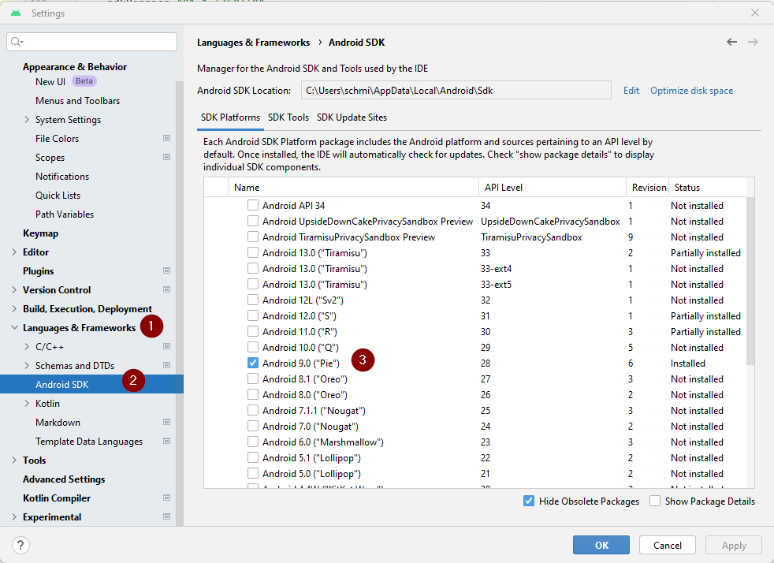

# Создание андроид-приложения (APK)

## Постройте сами вместо скачивания

**AndroidAPS недоступен для скачивания из-за законодательства, касающегося медицинских устройств. Построить приложение для собственного использования вполне законно, но передавать копию другим не разрешается! См. раздел [ FAQ ](../Getting-Started/FAQ.md).**

## Важные Примечания

* Please use **[Android Studio Giraffe" (2022.3.1)](https://developer.android.com/studio/)** or newer to build the apk.
* [Windows 32-bit systems](troubleshooting_androidstudio-unable-to-start-daemon-process) are not supported by Android Studio

(Building-APK-recommended-specification-of-computer-for-building-apk-file)=

## Рекомендуемые спецификации компьютеров для сборки файла apk

<table class="tg">
  
<thead>
  <tr>
    <th class="tg-baqh">Операционная система (только 64 бит)</th>
    <th class="tg-baqh">Windows 8 или выше</th>
    <th class="tg-baqh">Mac OS 10.14 или выше</th>
    <th class="tg-baqh">Любой Linux поддерживающий Gnome, KDE, или Unity DE;&nbsp;&nbsp;GNU C Library 2.31 или более поздние версии</th>
  </tr>
</thead>
<tbody>
  <tr>
    <td class="tg-baqh"><p align="center">Процессор CPU (Только 64 бит)</td>
    <td class="tg-baqh">x86_64 архитектура CPU; ядро Intel или новее, или процессор AMD с поддержкой <br><a href="https://developer.android.com/studio/run/emulator-acceleration#vm-windows" target="_blank" rel="noopener noreferrer"><span style="text-decoration:var(--devsite-link-text-decoration,none)">Windows Hypervisor</span></a></td>
    <td class="tg-baqh">Чипы на базе ARM или Intel Core 2 поколения или новее с поддержкой <br><a href="https://developer.android.com/studio/run/emulator-acceleration#vm-mac" target="_blank" rel="noopener noreferrer"><span style="text-decoration:var(--devsite-link-text-decoration,none)">среды Hypervisor </span></a></td>
    <td class="tg-baqh">архитектура процессора x86_64, процессор Intel Core 2 поколения или новее, или процессор AMD с поддержкой AMD-виртуализации (AMD-V) и SSSE3</td>
  </tr>
  <tr>
    <td class="tg-baqh"><p align="center">Оперативная память</td>
    <td class="tg-baqh" colspan="3"><p align="center">8ГБ или более</td>
  </tr>
  <tr>
    <td class="tg-baqh"><p align="center">Диск</td>
    <td class="tg-baqh" colspan="3"><p align="center">Не менее 30ГБ свободного места. Рекомендуется использовать SSD.</td>
  </tr>
  <tr>
    <td class="tg-baqh"><p align="center">Разрешение</td>
    <td class="tg-baqh" colspan="3"><p align="center">минимум 1280 x 800 <br></td>
  </tr>
  <tr>
    <td class="tg-baqh"><p align="center">Интернет</td>
    <td class="tg-baqh" colspan="3"><p align="center">Широкополосный</td>
  </tr>
</tbody>
</table>

Please keep in mind that both **64 bit CPU and 64 bit OS are mandatory condition.** If your system DOES NOT meet this condition, you have to change affected hardware or software or the whole system. **Рекомендуется использовать SSD(Solid State Disk) вместо HDD(Hard Disk Drive), так как при создании APS-файла потребуется меньше времени.** Рекомендация не является обязательной. Однако вы можете использовать HDD при создании apk файла, но процесс сборки может занять много времени, хотяпосле начала процесс можно оставить без присмотра.

* * *

### Эта статья разделена на две части.

* В обзорной части находится объяснение того, какие шаги необходимы для создания файла APK.
* В пошаговой инструкции вы найдете снимки экранов установки. Поскольку версии Android Studio - среды разработки программного обеспечения, в которой мы будем создавать APK - меняются очень быстро, точного соответствия вашей сборке вы не увидите, но общее представление о том, как это делается, получите. Android Studio работает на Windows, Mac OS X и Linux, и между каждой платформой возможны незначительные различия. Если вы обнаружите, что что-то важное выполняется неправильно или отсутствует, сообщите в группе facebook "AAPS users" или в чате Discord [AAPS](https://discord.gg/4fQUWHZ4Mw) чтобы мы могли устранить проблему.

## Общие замечания

В целом, шаги, необходимые для создания файла APK таковы:

1. [Установите Git](../Installing-AndroidAPS/git-install.md)
2. [Установите Android Studio](Building-APK-install-android-studio)
3. [Задайте путь к git в параметрах Android Studio](Building-APK-set-git-path-in-preferences)
4. [Скачайте код AAPS](Building-APK-download-AAPS-code)
5. [Загрузите Android SDK](Building-APK-download-android-sdk)
6. [Постройте приложение ](Building-APK-generate-signed-apk) (сгенерируйте подписанный apk)
7. [Перенесите файл apk на телефон](Building-APK-transfer-apk-to-smartphone)
8. [Идентифицируйте ресивер при использовании xDrip+](xdrip-identify-receiver)

## Пошаговое руководство

Подробное описание шагов, необходимых для создания файла APK.

## Установите git (если у вас его нет)

Следуйте инструкциям на странице установки [git](../Installing-AndroidAPS/git-install.md).

(Building-APK-install-android-studio)=

## Установите Android Studio

Следующие снимки экрана были сделаны из Android Studio Version Arctic Fox | 2020.3.1. Экраны могут меняться в будущих версиях Android Studio. Но у вас должно получиться. [Здесь можно найти помощь участников](../Where-To-Go-For-Help/Connect-with-other-users.md).

Одна из наиболее важных заповедей при установке Android Studio: ** Будьте терпеливы! ** Во время установки и настройки Android Studio загружает многие элементы, которые отнимают время.

Загрузите [ Android Studio отсюда](https://developer.android.com/studio/install.html) и настройте при первом запуске.

При первом запуске вы найдете мастер установки:

Выберите "Не импортировать настройки", так как вы не использовали их раньше.


Решите, хотите вы совместно использовать данные с Google или нет.


На следующем экране нажмите кнопку "Далее".


Выберите "Стандартная" установка и нажмите "Далее".


Для интерфейса выберите тему, которая вам нравится. (В этом руководстве мы использовали "Светлую".) Затем нажмите кнопку "Далее".

> ***Примечание:*** Это всего лишь цветовая схема. Можете выбрать любую (напр. Darcula для темного режима). Этот выбор не влияет на построение APK, но следующие скриншоты могут выглядеть иначе.


Нажмите "Далее" в диалоге "Подтвердить настройки".


Нажмите на все три части лицензионного соглашения и выберите "Согласен". Когда вы согласились со всеми, будет включена кнопка "Завершить", и вы можете "Завершить".

    
    

Подождите, пока Android Studio скачивает дополнительные компоненты и будьте терпеливы. После того, как все загрузится кнопка "Готово", станет синей. Теперь нажмите на кнопку.


(Сборка-APK-загрузка-AAPS-кода)=

## Скачайте код AAPS

* На экране Android Studio выберите "Проекты" (1) слева и затем "Получить с VCS" (2).
    
    
    
    * Если вы уже открыли Android Studio и не видите экран приветствия, то выберите File (1.) > New (2.) > Project from Version Control... (3)
        
        
    
    * Теперь мы расскажем программе Android Studio, откуда получить код:
    
    * Убедитесь, что вы выбрали "URL репозитория" слева (1).
    
    * Отметьте, выбран ли "Git" в качестве контроля версий (2).
    * Скопируйте и вставьте URL-адрес ```https://github.com/nightscout/AndroidAPS``` в основной репозиторий AAPS в текстовом поле URL (3).
    * Выберите каталог для сохранения клонированного кода(4).
        
        

* Нажмите кнопку "Клонировать" (5).
    
    

* Не нажимайте "Background", пока клонируется репозиторий!

* После успешного клонирования репозитория, Android Studio откроет клонированный проект.

* Вам будет задан вопрос, хотите ли вы доверять проекту. Нажмите на "Доверять проекту"!
    
    

* На шкале состояния появится информация о том, что в Android Studio выполняются фоновые задачи.
    
    

* Только для Windows: предоставьте доступ, если брандмауэр просит разрешение.
    
    

* После завершения фоновых задач вы увидите сообщение, указывающее на ошибки (1) или (2) или (3).
    
    
    
    Не волнуйтесь, вскоре они снимутся!

(Построение-APK-задать-путь-к-git-в-настройках) =

## Задайте путь к git в параметрах

Убедитесь, что [git установлен](../Installing-AndroidAPS/git-install.md) на компьютере и компьютер перезагрузили после установки.

На экране приветствия Android Studio нажмите кнопку "Настроить" (1) слева и затем выберите ссылку "Все настройкиs..." (2):


### Windows

* Как пользователь Windows, убедитесь, что вы перезагрузили компьютер после [установки Git](../Installing-AndroidAPS/git-install.md).

* В меню перейдите в Файл (1) > Настройки (2) (или Android Studio > Настройки на Mac).
    
    

* Дважды нажмите "Управление версиями" (1) для открытия подменю.

* Нажмите Git (2).
* Убедитесь, что "Слияние" (merge) (3.) выбрано как метод обновления.
* Проверьте, может ли Android Studio найти путь к файлу git.exe автоматически, нажав кнопку "Тест" (4).
    
    

* Если автоматическая настройка прошла успешно, то рядом с путем к git будет показана его версия.
    
    

* Иногда git.exe не может быть найден автоматически или тест приведет к ошибке (1):
    
    
    
    В этом случае нажмите на значок папки (2).

* Используйте [ поиск ](https://www.tenforums.com/tutorials/94452-search-file-explorer-windows-10-a.html) в проводнике Windows чтобы найти "git.exe", если не уверены, где он расположен. Вы ищете файл "git.exe", расположенный в папке **\bin**.

* Выберите путь к файлу git.exe и убедитесь, что выбрали папку ** \bin\ ** (3.) и нажмите кнопку "OK" (4).
    
    

* Проверьте ваш выбранный путь git еще раз кнопкой «Тест», как описано выше.

* Когда версия git отображается рядом с путем (см. снимок экрана выше), закройте окно настроек, нажав кнопку "OK" (5).

### Mac

* Любая версия git должна работать. Например <https://git-scm.com/download/mac>.
* Используйте homebrew для установки git: ```$ установка brew git```.
* Подробности об установке git см. в [официальной git документации](https://git-scm.com/book/en/v2/Getting-Started-Installing-Git).
* Если вы устанавливаете git через homebrew, то нет необходимости изменять какие-либо настройки. На всякий случай: Их можно найти здесь: Android Studio - Настройки.

(Сборка-APK-загрузка-андроид-sdk)=

## Загрузите Android SDK

* В меню перейдите в Файл (1) > Настройки (2) (или Android Studio > Настройки на Mac).
    
    

* Дважды щелкните по Языки & и откройте подменю (1).

* Выберите Android SDK (2).
* Установите флажок слева от "Android 9.0 (Pie)" (3.) (API Level 28).
    
    

* Подтвердите изменения, нажав кнопку OK.
    
    

* Дождитесь окончания загрузки и установки SDK.
    
    

* После завершения установки SDK кнопка "Finish" станет синей. Нажмите на кнопку.
    
    

* Android Studio может рекомендовать обновить систему gradle. **Не обновляйте gradle!** Это может привести к трудностям!

* Если вы видите информацию на нижней правой стороне окна Android Studio, что плагин Android Gradle готов к обновлению, нажмите на текст "upgrade" (1).
    
    

* В диалоговом окне выберите "Don't remind me again for this project" (2).
    
    

* Перезапустите Android Studio прежде чем продолжить.

(Сборка-APK-генерировать-подписанный-apk)=

## Создание подписанного APK

Подписание означает, что вы подписываете созданное вами приложение, но цифровым способом, как цифровым отпечатком пальца в самом приложении. Это необходимо потому, что Android имеет правило, согласно которому по соображениям безопасности к исполнению принимается только подписанный код. Для получения дополнительной информации перейдите по [ этой ссылке](https://developer.android.com/studio/publish/app-signing.html#generate-key).

* После запуска Android Studio дождитесь завершения всех фоновых задач.
    
    
    
    * ***Предупреждение:*** Если возникают ошибки, не делайте следующие шаги. Обращайтесь в раздел [устранение неполадок](../Installing-AndroidAPS/troubleshooting_androidstudio) для решения возникающих проблем!
    
    

* Нажмите "Build" (1) в строке меню и выберите "Generate Signed Bundle / APK..."(генерировать подписанное приложение (2).
    
    

* Выберите "APK" (1.) вместо "Android App Bundle" и нажмите кнопку "Далее" (2).
    
    

* Убедитесь, что модуль переключен на "app" (1).

* Нажмите "Create new" (cоздать новый...) для создания хранилища ключей.
    
    ***Примечание***Хранилище ключей это файл, в котором хранится информация о цифровой подписи. Он зашифрован и информация защищена паролями.
    
    

* Нажмите на символ папки и выберите путь к хранилищу ключей.
    
    

* Выберите путь к хранилищу ключей (1).
    
    
    
    ***Внимание: Не сохраняйте в той же папке, что и сам проект. Выберите другой каталог! *** Например, домашнюю папку.

* Введите имя файла хранилища ключей (2) и подтвердите, нажав "OK" (3).

* Введите (2.) и подтвердите (3.) пароль для хранилища ключей. 
    
    ***Примечание:*** Пароли не должны быть очень сложными. Обязательно запомните их или запишите в безопасное место. В случае, если вы не запомните пароли смотрите [ устранение неполадок для потерянных ключей ](troubleshooting_androidstudio-lost-keystore).

* Введите псевдоним (4) для вашего ключа. Выберите, что нравится.

* Введите (5.) и подтвердите (6.) пароль для ключа

* Срок действия (7.) по умолчанию составляет 25 лет. Изменять значение по умолчанию не требуется.

* Необходимо ввести имя и фамилию (8). Вся остальная информация необязательна.

* Когда закончите, нажмите кнопку "OK" (9.).

* Убедитесь, что поле для запоминания паролей отмечено (1). Так что не потребуется вводить их снова при следующей сборке apk (то есть при обновлении до новой версии AAPS).

* Нажмите "Далее" (2).
    
    

* Выберите вариант сборки "fullRelease" (1) и нажмите "Finish".
    
    

* Android Studio покажет «Gradle Build running» внизу. Это занимает некоторое время, в зависимости от компьютера и подключения к Интернету. **Наберитесь терпения!**
    
    

* После завершения сборки Android Studio покажет информацию "APK (s) сгенерировано успешно...".
    
    

* В случае, если сборка не удалась, обратитесь к разделу [поиск и устранение неисправностей ](../Installing-AndroidAPS/troubleshooting_androidstudio).

* Нажмите на уведомление, чтобы развернуть его.

* Нажмите на ссылку "locate". (найти расположение).
    
    
    
    * Если уведомление пропало, откройте "журнал событий" и нажмите на ту же ссылку в нем. 

* Откроется файловый менеджер/проводник. Перейдите в директорию "full" (1) > "release" (2).
    
    

* "app-full-release.apk (3) это файл, который вы ищете!

(Building-APK-перенос-apk-на-телефон) =

## Перенос приложения на смартфон

Самый простой способ перенести приложение на ваш телефон - [через кабель USB или Google Drive](https://support.google.com/android/answer/9064445?hl=en). Обратите внимание, что передача по почте может вызвать трудности и не является предпочтительным способом.

На телефоне необходимо разрешить установку из неизвестных источников. Инструкции, как это сделать, можно найти в интернете (например [здесь](https://www.expressvpn.com/de/support/vpn-setup/enable-apk-installs-android/) или [здесь](https://www.androidcentral.com/unknown-sources)).

## Устранение неполадок

См. отдельную страницу [ устранение неполадок Android Studio ](../Installing-AndroidAPS/troubleshooting_androidstudio).