# Создание андроид-приложения (APK)

## Постройте сами вместо того, чтобы загружать

**AndroidAPS недоступен для скачивания из-за законодательства, касающегося медицинских устройств. Построить приложение для собственного использования вполне законно, но вам не разрешается передавать копию другим! См. раздел [ FAQ ](../Getting-Started/FAQ.md).**

## ## Важные Примечания

*** Примечание ***: Для построения apk используйте [ Android Studio версии 3.5.1 ](https://developer.android.com/studio/) или новее.

** Конфигурация по требованию ** не поддерживается текущей версией модуля Android Gradle!

Если сборка выполнена с ошибкой, относящейся к "выборочной конфигурации", можно сделать следующее:

* Откройте окно настроек, нажав Файл > Настройки (на Mac, Android Studio > Настройки).
* В левой панели нажмите Сборка, Выполнение, Развертывание > Компилятор.
* Снимите флажок с ячейки "выборочная конфигурация".
* Нажмите Применить или OK.

* * *

### Эта статья разделена на две части.

* В обзорной части находится объяснение того, какие шаги необходимы для создания файла APK.
* В пошаговой инструкции вы найдете снимки экранов установки. Поскольку версии Android Studio - среды разработки программного обеспечения, в которой мы будем создавать APK - меняются очень быстро, точного соответствия вашей сборке вы не увидите, но общее представление о том, как это делается, получите. Android Studio работает на Windows, Mac OS X и Linux, и между каждой платформой возможны незначительные различия. Если вы обнаружите, что что-то важное выполняется неправильно или отсутствует, сообщите в группе facebook "AndroidAPS users" или в чате Gitter [Android APS](https://gitter.im/MilosKozak/AndroidAPS) или [AndroidAPSwiki](https://gitter.im/AndroidAPSwiki/Lobby) чтобы мы могли устранить проблему.

## Главный экран, Начало

В целом, шаги, необходимые для создания файла APK таковы:

* [Install git](../Installing-AndroidAPS/git-install.rst)
* Установить и настроить Android Studio.
* Используя Git  клонировать исходный код центрального репозитория Github, где разработчики разместили код приложения.
* В Android Studio открыть клонированный проект в качестве активного.
* Построить подписанный APK.
* Переместите подписанный APK на ваш телефон.

## Step by step walkthrough

Подробное описание шагов, необходимых для создания файла APK.

## Установите git (если у вас его нет)

Follow the manual on the [git installation page](../Installing-AndroidAPS/git-install.rst).

## Install Android Studio

The following screenshots have been taken from Android Studio Version 3.1.3. Your screen might look a bit different depending on the Android Studio version you use. But you should be able to find your way through. Help from the community is provided for example in the [AndroidAPS Facebook group](https://www.facebook.com/groups/1900195340201874/) and [other places](../Where-To-Go-For-Help/Connect-with-other-users.md).

Install [Android Studio](https://developer.android.com/studio/install.html) and setup during first start.

Select "Do not import settings" as you have not used it before.

Click "Next".

Select "Standard" installation and click "Next".

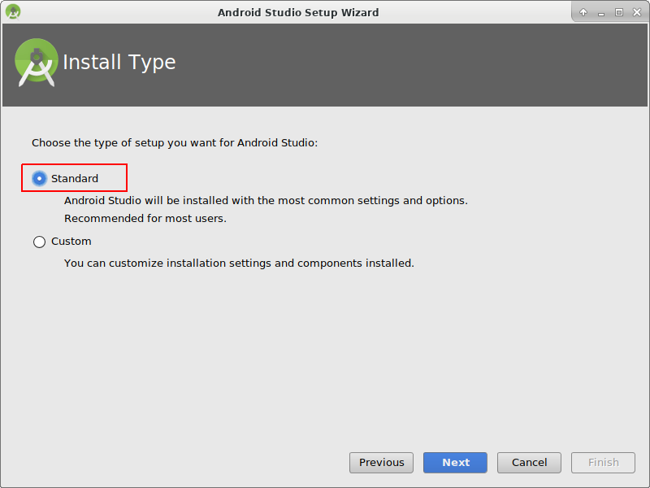

Select the theme for the user interface you like. (In this manual we used "Intellij". Then click "Next". This is just the color scheme. You can select any you like (i.e. "Darcula" for dark mode). This selection has no influence on building the APK.

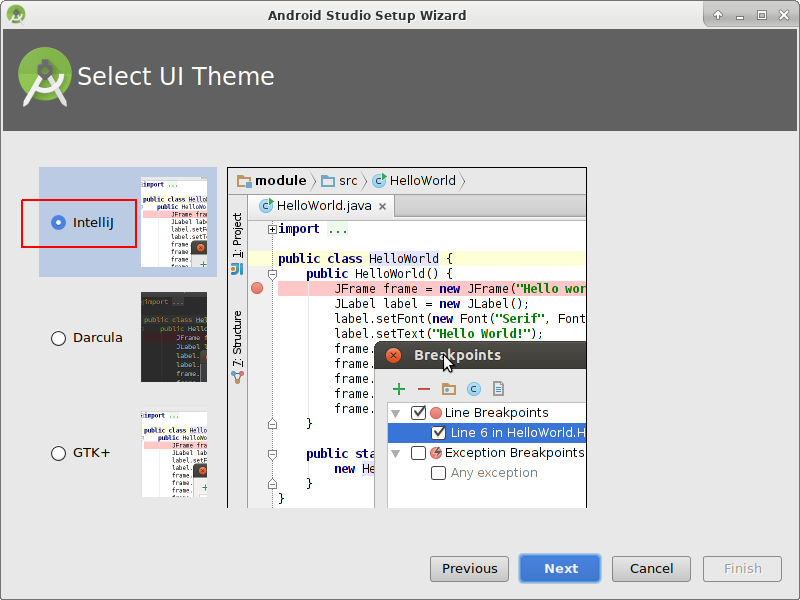

Click "Next" on the "Verify Settings" dialog.

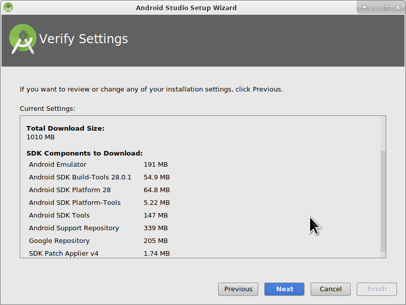

The Android emulator (to emulate the smartphone on your PC or Mac) is not used to build the APK. You can click "Finish" to finish the installation and read the documentation later on demand.

Android Studio is downloading a lot of software components it uses. You can click on the "Show Details" button to the what happens but that's not important at all.

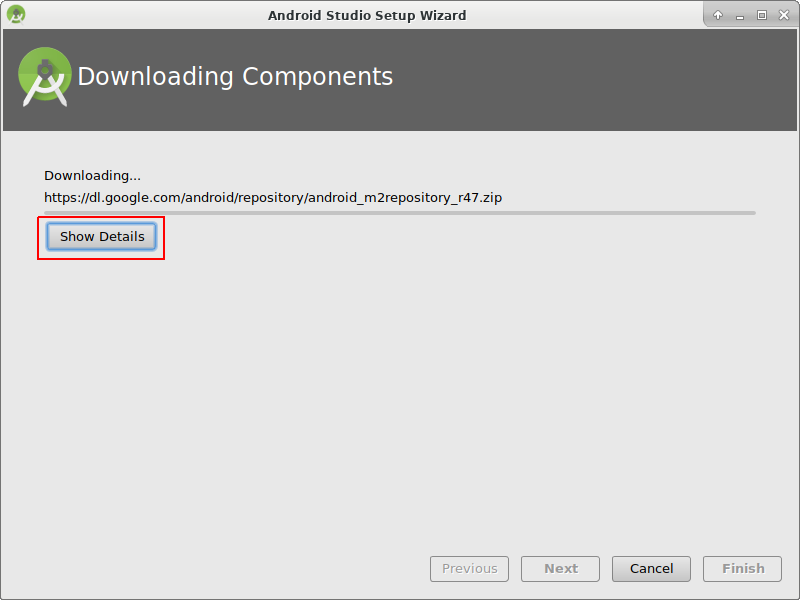

After the downloads are completed click the "Finish" button.

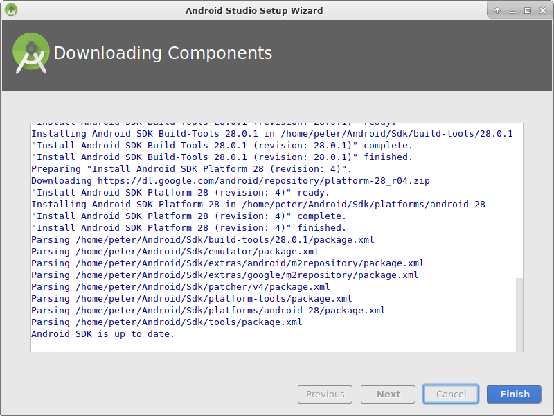

* Applause, applause you have now finished the Android Studio installation and can start cloning the source code. Maybe it's time for a short break?

## Set git path in preferences

### Windows

* Let Studio know where is git.exe located: File - Settings
  
  

* In the next window: Version Control - Git

* Choose correct path: .../Git<b>/bin</b>

* Make sure update method "Merge" is selected.
  
  

### Mac

* If you install git via homebrew there is no need to change any preferences. Just in case: They can be found here: Android Studio - Preferences.

## Download code and additional components

* Use git clone in Android Studio as shown in screenshots below. Select "Check out project from Version Control" with "Git" as concrete version control system.

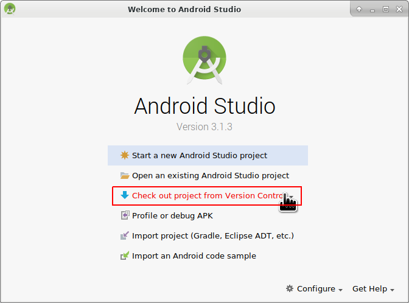

Fill in the URL to the main AndroidAPS repository ("https://github.com/MilosKozak/AndroidAPS") and click "clone".

Android Studio will start cloning. Don't click "Background" as it goes fast and makes things more complicated at the moment.

Finish the checkout from version control with opening the project by clicking "Yes".

Use the standard "default gradle wrapper" and click "OK".

Read and close the "Tip of Day" screen of Android Studio by pressing "Close".

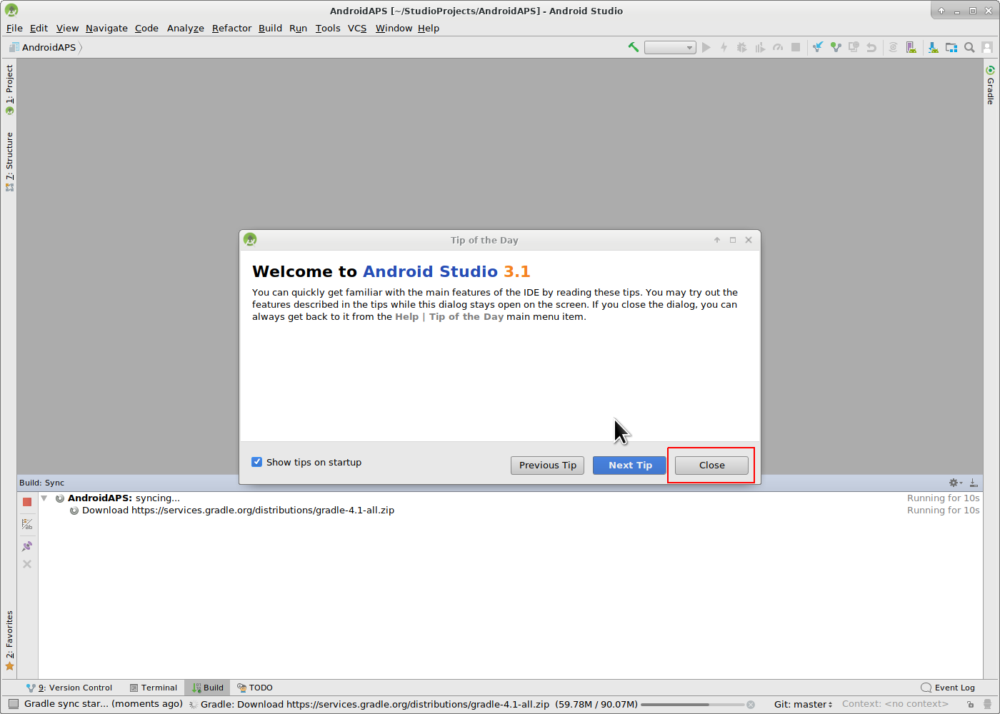

* Excellent, you have your own copy of the source code and are ready to start the build.
* Now we are approaching our first error message. Fortunately, Android Studio will directly give us the solution for this.

Click "Install missing platform(s) and sync project" as Android Studio needs to install a missing platform.

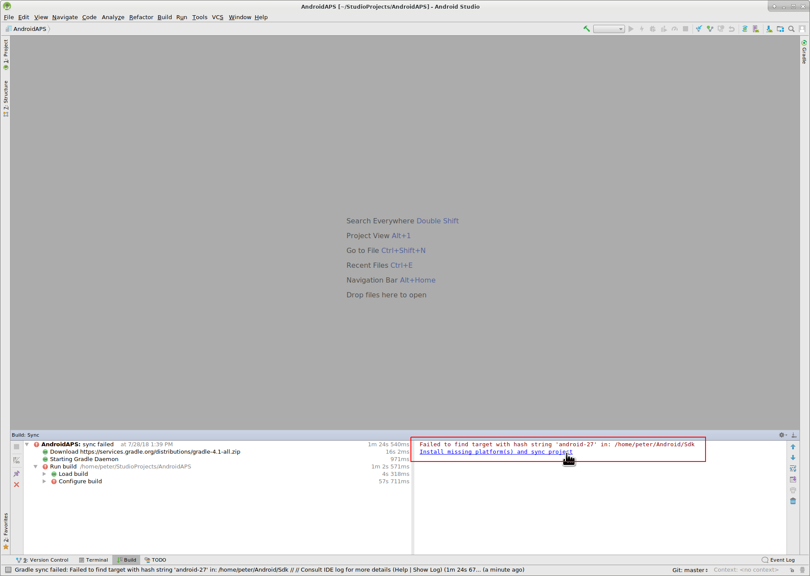

Accept the license agreement by selecting "Accept" and clicking "Next".

As it is said in the dialog please wait until the download is finished.

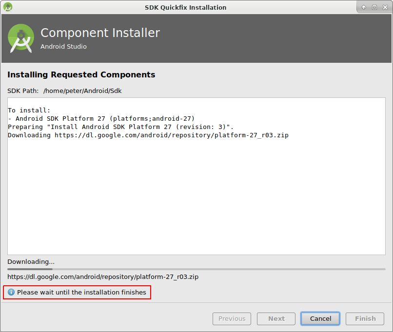

Now it's finished. Please click "Finish".

Aaaahhh, next error. But Android Studio suggests a similar solution. Click "Install Build Tools and sync project" as Android Studio needs to download missing Tools.

As it is said in the dialog please wait until the download is finished.

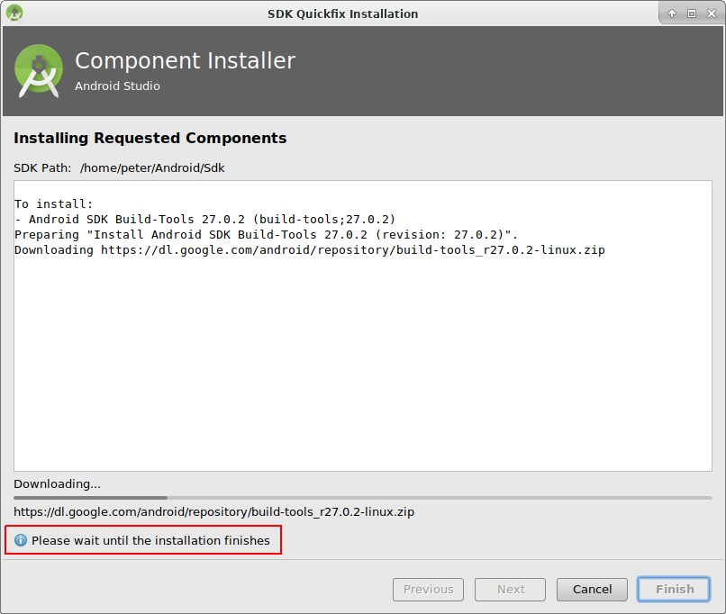

Now it's finished. Please click "Finish".

And another error to handle as Android Studio needs to download again a missing platform. Click "Install missing platform(s) and sync project".

As it is said in the dialog please wait until the download is finished.

Now it's finished. Please click "Finish".

Click "Install Build Tools and sync project" as Android Studio needs to download missing Tools.

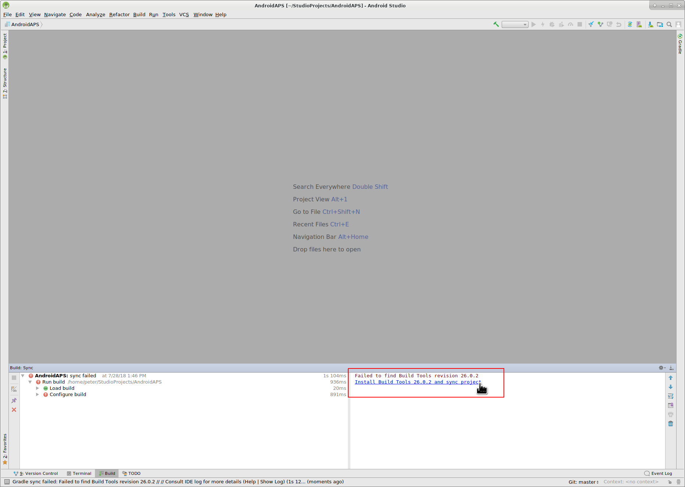

As it is said in the dialog please wait until the download is finished.

Now it's finished. Please click "Finish".

Yeah, the error messages are gone and the first gradle build is runing. Maybe it's time to drink some water?

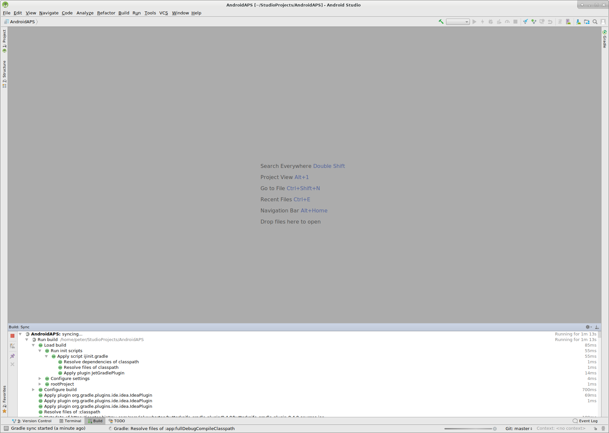

Android Studio recommends to update the gradle system. **Never update gradle!** This might lead to difficulties!

Please click "Don't remind me again for this project".

The build is running again.

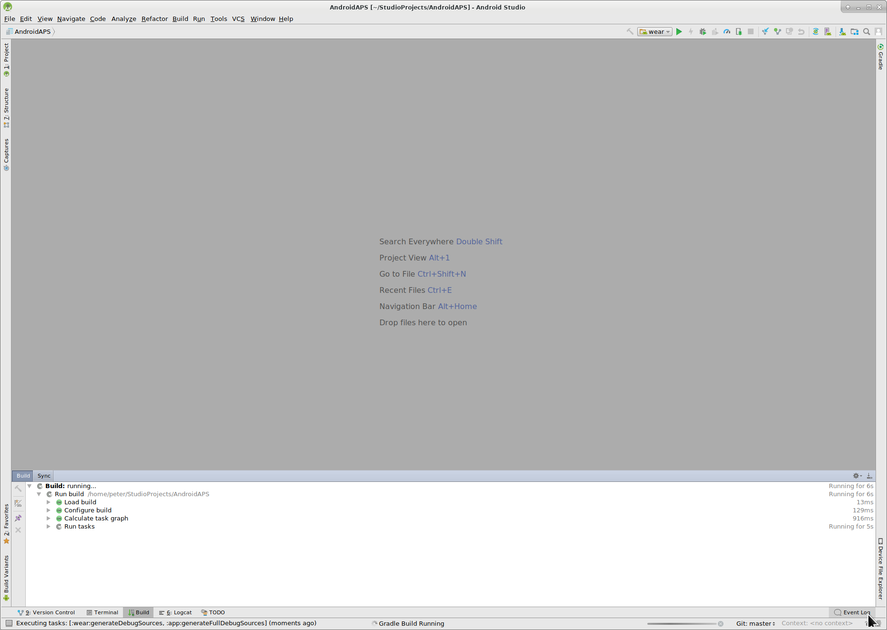

Yeah, the first build is successful but we are not finished.

## Создание подписанного APK

В меню выберите "Build"(выполнить сборку) и затем "Generate Signed Bundle / APK..."(создать подписанный пакет программ). (Меню в Android Studio изменилось с сентября 2018 года. In older versions select in the menu “Build” and then “Generate Signed APK...”.)

Signing means that you sign your generated app but in a digital way as a kind of digital fingerprint in the app itself. Это необходимо потому, что Android имеет правило, согласно которому принимается только подписанный код для запуска по соображениям безопасности. Для получения дополнительной информации по этой теме перейдите по ссылке [здесь](https://developer.android.com/studio/publish/app-signing.html#generate-key). Безопасность - это глубокая и сложная тема, нам она сейчас не нужна.

В следующем диалоговом окне выберите "APK" вместо "Android App Bundle" и нажмите кнопку "Далее".

Выберите "app" (приложение) и нажмите "Next" (далее).

Click "Create new..." to start creating your keystore. A keystore in this case is nothing more than a file in which the information for signing is stored. It is encrypted and the information is secured with passwords. We suggest storing it in your home folder and remember the passwords but if you lose this information it's not a big issue because then you just have to create a new one. Best practice is to store this information carefully.

* Fill in the information for the next dialog. 
  * Key store path: is the path to the keystore file. **Do not save in same folder as projekt. You must use a different directory!**
  * The password fields below are for the keystore to double check for typing errors.
  * Alias is a name for the key you need. You can leave the default or give it a fancy name you want.
  * The password fields below the key are for the key itself. As always to double check for typing errors.
  * You can let the validity at the default of 25 years.
  * You only have to fill out first name and last name but feel free to complete the rest of information. Then click "OK".

Fill in the information of the last dialog in this dialog and click "Next".

Выберите "full" (полный) в качестве атрибута для сгенерированного приложения. Выберите V1 "Jar Signature" (V2 необязательно) и нажмите "Finish" (закончить). В дальнейшем может пригодиться следующая информация.

* 'Release' должен быть вашим выбором по умолчанию для "Build Type"(типа сборки), 'Debug' только для программистов.
* Выберите тип сборки, который хотите создать. 
  * полный (с автоматически принимаемыми рекомендациями в закрытом цикле)
  * открытый цикл (рекомендации, адресованные пользователю, выполняются вручную)
  * управление помпой (дистанционное управление помпой, без функционирования цикла)
  * nsclient (например, отображаются данные другого пользователя, могут добавляться записи портала лечения/назначений)

В журнале событий вы увидите, что подписанное приложение (APK) было создано успешно.

Нажмите на ссылку "Найти" в журнале событий.

## Перенос приложения на смартфон

Открывается окно файлового менеджера. Может выглядеть немного иначе в вашей системе, поскольку я использую Linux. В Windows это будет File Explorer (проводник), а на Mac OS X Finder (поисковик). Там вы увидите каталог с созданным APK файлом. К сожалению, это неверное место, так как "wear-release.apk" не является подписанным приложением, которое мы ищем.

Перейдите к папке AndroidAPS/app/full/release, чтобы найти файл "app-full-release.apk". Перенесите этот файл на смартфон Android. You can do it on your preferred way, i.e.

* Bluetooth
* cloud upload (Google Drive or other cloud services)
* connect computer and phone by cable 
* by mail (Note that some mail apps do not allow apk attachments, in this case use other transfer method.)

In this example Gmail is used as it is fairly simple. To install the self-signed app you need to allow Android on your smartphone to do this installation even if this file is received via Gmail which is normally forbidden. Если переносите установщик другим способом, поступите соответственно.

В настройках смартфона есть область "установка неизвестных приложений" где я даю Gmail право устанавливать APK файлы, которые я получаю через Gmail.

Выберите "Разрешить из этого источника". После установки вы можете отключить его снова.

Последний шаг - нажать на файл APK, который я получил через Gmail и установить приложение. Если APK не установливается и у вас более старая версия AndroidAPS на телефоне, подписанная другим ключом, то нужно сначала удалить более старое приложение; при этом не забудьте экспортировать ваши настройки!

Да, все получилось, теперь можно начать настройку AndroidAPS (CGMS, помпа) и т. д.

## Identify receiver if using xDrip

[See xDrip page](../Configuration/xdrip#identify-receiver)

## Устранение неполадок

See separate page [troubleshooting Android Studio](../Installing-AndroidAPS/troubleshooting_androidstudio.rst).