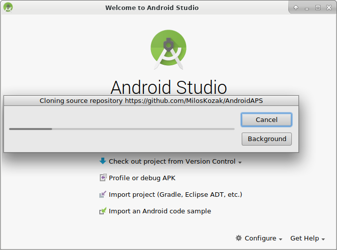
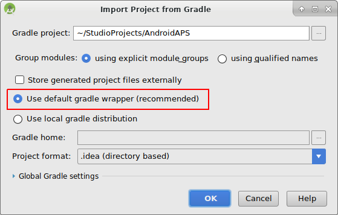
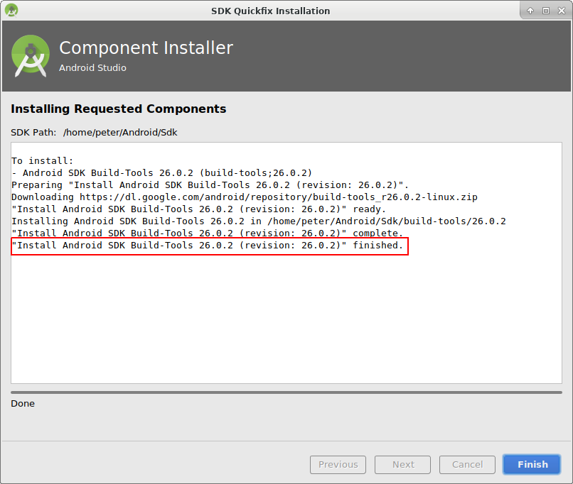

# Создание андроид-приложения (APK)

* * *

**Обратите внимание** Версию AndroidAPS 2.3 невозможно построить на последней версии Android Studio. Скачивайте Android Studio 3.4 [отсюда](https://developer.android.com/studio/archive?).

**Пожалуйста, обратите внимание** при создании приложения AndroidAPS 2.0: **Выборочная Конфигурация ** не поддерживается текущей версией плагина Android Gradle!

Если сборка выполнена с ошибкой, относящейся к "выборочной конфигурации", можно сделать следующее:

* Откройте окно настроек, нажав Файл > Настройки (на Mac, Android Studio > Настройки).
* В левой панели нажмите Сборка, Выполнение, Развертывание > Компилятор.
* Снимите флажок с ячейки "выборочная конфигурация".
* Нажмите Применить или OK.

* * *

### Эта статья разделена на две части.

* In the overview part there is an explanation on what steps are necessary to build the APK file.
* In the step by step walkthrough part you will find the screenshots of a concrete installation. Because the versions of Android Studio - the software development environment which we will use to build the APK - will change very quickly this will be not identical to your installation but it should give you a good starting point. Android Studio also runs on Windows, Mac OS X and Linux and there might be small differences in some aspects between each platform. If you find that something important is wrong or missing, please inform the facebook group "AndroidAPS users" or in the Gitter chats [Android APS](https://gitter.im/MilosKozak/AndroidAPS) or [AndroidAPSwiki](https://gitter.im/AndroidAPSwiki/Lobby) so that we can have a look at this.

## Главный экран

В целом, шаги, необходимые для создания файла APK таковы:

* Install git
* Install and setup Android Studio.
* Use git to clone the source code from the central Github repository where the developers have put the actual code for the app.
* Open the cloned project in Android Studio as active project.
* Build the signed APK.
* Transfer the signed APK to your smartphone.

## Пошаговое руководство

Подробное описание шагов, необходимых для создания файла APK.

## Установите Android Studio

* Install git 
  * [Windows](https://gitforwindows.org/)
  * [Mac OS X](http://sourceforge.net/projects/git-osx-installer/)
  * Linux - just install a package git via package manager of your distribution
* Install [Android Studio](https://developer.android.com/studio/install.html).
* Setup Android Studio during first start

Выберите "Не импортировать настройки", так как вы не использовали их раньше.

Нажмите "Далее".

Выберите "Стандартная" установка и нажмите "Далее".

Для интерфейса выберите тему, которая вам нравится. (В этом руководстве мы использовали тему"Intellij". Затем нажмите "Далее". Это всего лишь цветовая схема. Можете выбрать любую (напр. Darcula для темного режима). Этот выбор не влияет на построение APK.

Нажмите "Далее" в диалоге "Проверить настройки".

Эмулятор Android (для эмуляции смартфона на Win или Mac) не используется при построении APK. Нажмите "Готово", чтобы завершить установку и при необходимости прочитать документацию.

Android Studio загружает много программных компонентов. Можете нажать на кнопку "Показать детали" если хотите увидеть, что происходит, но в принципе это не важно.

После завершения загрузок нажмите кнопку "Готово".

* Applause, applause you have now finished the Android Studio installation and can start cloning the source code. Maybe it's time for a short break?

## Скачиваем код и дополнительные компоненты

* Use git clone in Android Studio as shown in screenshots below. Select "Check out project from Version Control" with "Git" as concrete version control system.

Заполните URL-адрес главного репозитория AndroidAPS ("https://github.com/MilosKozak/AndroidAPS") и нажмите "clone" (клонировать).

Android Studio начнет клонирование. Не нажимайте на "Background" (фоновое клонирование), так как все происходит быстро и выбор этой опции может лишь усложнить работу.

Завершите установку открытием проекта, нажав "Да".

Выберите стандартный «создатель оболочки gradle по умолчанию» и нажмите «OK».

Прочитайте и закройте экран "Совет дня", нажав "Закрыть".

* Excellent, you have your own copy of the source code and are ready to start the build.
* Now we are approaching our first error message. Fortunately, Android Studio will directly give us the solution for this.

Нажмите "Установить недостающую платформу(ы) и синхронизировать проект", так как Android Studio нуждается в установке отсутствующей платформы.

Примите лицензионное соглашение, выбрав "Принять" и нажав "Далее".

Как сказано в диалоге, подождите окончания загрузки.

Теперь она завершена. Нажмите "Готово".

Таак, следующая ошибка. Но Android Studio предлагает аналогичное решение. Нажмите "Установить инструменты сборки и синхронизировать проект", так как Android Studio нуждается в загрузке недостающих инструментов.

Как сказано в диалоге, подождите окончания загрузки.

Теперь она завершена. Нажмите "Готово".

И еще одна ошибка, нуждающаяся в обработке так как Android Studio снова должна скачать отсутствующую платформу. Нажмите "Установить недостающую платформу(ы) и синхронизировать проект".

Как сказано в диалоге, подождите окончания загрузки.

Теперь она завершена. Нажмите "Готово".

Нажмите "Установить инструменты сборки и синхронизировать проект", так как Android Studio нуждается в загрузке недостающих инструментов.

Как сказано в диалоге, подождите окончания загрузки.

Теперь она завершена. Нажмите "Готово".

Да, сообщения об ошибках пропали, и первая сборка gradle запущена. Настало время попить водички?

Android Studio рекомендует обновить систему gradle. **Не обновляйте gradle!** Это может привести к трудностям!

Нажмите "Не напоминать снова для этого проекта".

Сборка возобновляется.

Да, первая сборка завершена успешно, но мы еще не закончили.

## Создание подписанного APK

В меню выберите "Build"(выполнить сборку) и затем "Generate Signed Bundle / APK..."(создать подписанный пакет программ). (Меню в Android Studio изменилось с сентября 2018 года. In older versions select in the menu “Build” and then “Generate Signed APK...”.)

Signing means that you sign your generated app but in a digital way as a kind of digital fingerprint in the app itself. Это необходимо потому, что Android имеет правило, согласно которому принимается только подписанный код для запуска по соображениям безопасности. Для получения дополнительной информации по этой теме перейдите по ссылке [здесь](https://developer.android.com/studio/publish/app-signing.html#generate-key). Безопасность - это глубокая и сложная тема, нам она сейчас не нужна.

В следующем диалоговом окне выберите "APK" вместо "Android App Bundle" и нажмите кнопку "Далее".

Выберите "app" (приложение) и нажмите "Next" (далее).

Click "Create new..." to start creating your keystore. A keystore in this case is nothing more than a file in which the information for signing is stored. It is encrypted and the information is secured with passwords. We suggest storing it in your home folder and remember the passwords but if you lose this information it's not a big issue because then you just have to create a new one. Best practice is to store this information carefully.

* Fill in the information for the next dialog. 
  * Key store path: is the path to the keystore file
  * The password fields below are for the keystore to double check for typing errors.
  * Alias is a name for the key you need. You can leave the default or give it a fancy name you want.
  * The password fields below the key are for the key itself. As always to double check for typing errors.
  * You can let the validity at the default of 25 years.
  * You only have to fill out first name and last name but feel free to complete the rest of information. Then click "OK".

Fill in the information of the last dialog in this dialog and click "Next".

Выберите "full" (полный) в качестве атрибута для сгенерированного приложения. Выберите V1 "Jar Signature" (V2 необязательно) и нажмите "Finish" (закончить). В дальнейшем может пригодиться следующая информация.

* 'Release' должен быть вашим выбором по умолчанию для "Build Type"(типа сборки), 'Debug' только для программистов.
* Выберите тип сборки, который хотите создать. 
  * полный (с автоматически принимаемыми рекомендациями в закрытом цикле)
  * открытый цикл (рекомендации, адресованные пользователю, выполняются вручную)
  * управление помпой (дистанционное управление помпой, без функционирования цикла)
  * nsclient (например, отображаются данные другого пользователя, могут добавляться записи портала лечения/назначений)

В журнале событий вы увидите, что подписанное приложение (APK) было создано успешно.

Нажмите на ссылку "Найти" в журнале событий.

## Перенос приложения на смартфон

Открывается окно файлового менеджера. Может выглядеть немного иначе в вашей системе, поскольку я использую Linux. В Windows это будет File Explorer (проводник), а на Mac OS X Finder (поисковик). Там вы увидите каталог с созданным APK файлом. К сожалению, это неверное место, так как "wear-release.apk" не является подписанным приложением, которое мы ищем.

Перейдите к папке AndroidAPS/app/full/release, чтобы найти файл "app-full-release.apk". Перенесите этот файл на смартфон Android. Вы можете сделать это по-своему, напр. загрузкой в облако, переносом с компьютера по кабелю или используя электронную почту. В этом примере я использую Gmail, так как для меня такой перенос привычнее. Для установки на нашем смартфоне следует дать системе Android разрешение сделать установку из Gmail, которая обычно запрещена. Если переносите установщик другим способом, поступите соответственно.

В настройках смартфона есть область "установка неизвестных приложений" где я даю Gmail право устанавливать APK файлы, которые я получаю через Gmail.

Выберите "Разрешить из этого источника". После установки вы можете отключить его снова.

Последний шаг - нажать на файл APK, который я получил через Gmail и установить приложение. Если APK не установливается и у вас более старая версия AndroidAPS на телефоне, подписанная другим ключом, то нужно сначала удалить более старое приложение; при этом не забудьте экспортировать ваши настройки!

Да, все получилось, теперь можно начать настройку AndroidAPS (CGMS, помпа) и т. д.