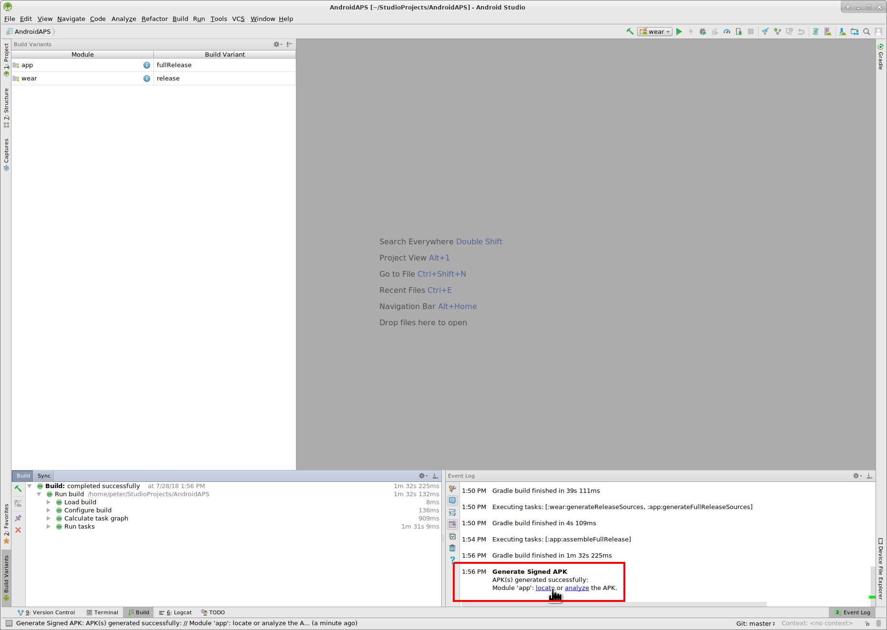

# Создание андроид-приложения (APK)

* * *

***Please note** With AndroidAPS version 2.3 it is not possible to build the APK with the latest Android Studio version. Please use Android Studio 3.4 from [here](https://developer.android.com/studio/archive?).

***Please note** when building AndroidAPS 2.0 apk: **Configuration on demand** is not supported by the current version of the Android Gradle plugin! Если сборка выполнена с ошибкой, относящейся к "выборочной конфигурации", можно сделать следующее:*

     * *Открыть окно настроек, нажав на Файл > Установки (на Mac, Android Studio > Настройки).*
     * *В левой панели нажать кнопку Build, Execution, Deployment > Compiler.* (сборка, выполнение, развертывание)
     * *Снять флажок с ячейки "выборочная конфигурация.*
    

## * *Нажмите Применить или OK.*

### Эта статья разделена на две части.

* В обзорной части есть объяснение того, какие шаги необходимы для создания файла APK.
* В пошаговой инструкции вы найдете снимки экранов установки. Поскольку версии Android Studio - среды разработки программного обеспечения, в которой мы будем создавать APK - меняются очень быстро, точного соответствия вашей сборке вы не увидите, но общее представление о том, как это делается, получите. Android Studio работает на Windows, Mac OS X и Linux, и между каждой платформой возможны незначительные различия. Если вы обнаружите, что что-то важное выполняется неправильно или отсутствует, пожалуйста, сообщите в группе facebook "AndroidAPS users" или в чате Gitter [Android APS](https://gitter.im/MilosKozak/AndroidAPS) или [AndroidAPSwiki](https://gitter.im/AndroidAPSwiki/Lobby) чтобы мы могли устранить проблему.

## Общий обзор

In general, the steps necessary to build the APK file:

* Установите Git
* Установите и настройте Android Studio.
* Используйте git для клонирования исходного кода из центрального репозитория Github, где разработчики разместили код приложения.
* В Android Studio откройте клонированный проект в качестве активного проекта.
* Постройте подписанный APK.
* Переместите подписанный APK на ваш телефон.

## Пошаговое руководство

Detailed description of the steps necessary to build the APK file.

## Установите Android Studio

* Установите Git 
  * [Windows](адреса ссылок
https://gitforwindows.org/)
  * [Mac OS X](адреса ссылок
http://sourceforge.net/projects/git-osx-installer/)
  * Linux - просто установите пакет Git через менеджер пакетов вашего дистрибутива
* Установите [Android Studio](https://developer.android.com/studio/install.html).
* Настройте Android Studio во время первого запуска

Select "Do not import settings" as you have not used it before.

Click "Next".

Select "Standard" installation and click "Next".

Select the theme for the user interface you like. (In this manual we used "Intellij". Then click "Next". This is just the color scheme. You can select any you like (i.e. "Darcula" for dark mode). This selection has no influence on building the APK.

Click "Next" on the "Verify Settings" dialog.

The Android emulator (to emulate the smartphone on your PC or Mac) is not used to build the APK. You can click "Finish" to finish the installation and read the documentation later on demand.

Android Studio is downloading a lot of software components it uses. You can click on the "Show Details" button to the what happens but that's not important at all.

After the downloads are completed click the "Finish" button.

* Аплодисменты, аплодисменты. Установка Android Studio завершена и можно приступить к клонированию исходного кода. Можно сделать короткий перерыв.

## Скачиваем код и дополнительные компоненты

* Используйте клон Git в Android Studio, как показано на снимках экрана ниже. Выберите "Проверить проект из системы управления версиями" при помощи Git в качестве конкретной системы управления версиями.

Fill in the URL to the main AndroidAPS repository ("https://github.com/MilosKozak/AndroidAPS") and click "clone".

Android Studio will start cloning. Don't click "Background" as it goes fast and makes things more complicated at the moment.

Finish the checkout from version control with opening the project by clicking "Yes".

Use the standard "default gradle wrapper" and click "OK".

Read and close the "Tip of Day" screen of Android Studio by pressing "Close".

* Отлично, теперь у нас есть своя копия исходного кода и мы готовы начать сборку.
* Теперь мы приближаемся к нашему первому сообщению об ошибке. К счастью, Android Studio будет сразу предлагать нам решения.

Click "Install missing platform(s) and sync project" as Android Studio needs to install a missing platform.

Accept the license agreement by selecting "Accept" and clicking "Next".

As it is said in the dialog please wait until the download is finished.

Now it's finished. Please click "Finish".

Aaaahhh, next error. But Android Studio suggests a similar solution. Click "Install Build Tools and sync project" as Android Studio needs to download missing Tools.

As it is said in the dialog please wait until the download is finished.

Now it's finished. Please click "Finish".

And another error to handle as Android Studio needs to download again a missing platform. Click "Install missing platform(s) and sync project".

As it is said in the dialog please wait until the download is finished.

Now it's finished. Please click "Finish".

Click "Install Build Tools and sync project" as Android Studio needs to download missing Tools.

As it is said in the dialog please wait until the download is finished.

Now it's finished. Please click "Finish".

Yeah, the error messages are gone and the first gradle build is runing. Maybe it's time to drink some water?

Android Studio recommends to update the gradle system. **Never update gradle!** This might lead to difficulties!

Please click "Don't remind me again for this project".

The build is running again.

Yeah, the first build is successful but we are not finished.

## Создание подписанного APK

В меню выберите "Build"(выполнить сборку) и затем "Generate Signed Bundle / APK..."(создать подписанный пакет программ). (Меню в Android Studio изменилось с сентября 2018 года. В более старых версиях выберите в меню «выполнить сборку» и «Генерировать подписанный APK...».)  
Подписание означает, что вы подписываете ваше сгенерированное приложение цифровой подписью. Это необходимо потому, что Android имеет правило, согласно которому принимается только подписанный код для запуска по соображениям безопасности. Для получения дополнительной информации по этой теме перейдите по ссылке [здесь](https://developer.android.com/studio/publish/app-signing.html#generate-key). Безопасность - это глубокая и сложная тема, нам она сейчас не нужна.

В следующем диалоговом окне выберите "APK" вместо "Android App Bundle" и нажмите кнопку "Далее".

Выберите "app" (приложение) и нажмите "Next" (далее).

Click "Create new..." to start creating your keystore. A keystore in this case is nothing more than a file in which the information for signing is stored. It is encrypted and the information is secured with passwords. We suggest storing it in your home folder and remember the passwords but if you lose this information it's not a big issue because then you just have to create a new one. Best practice is to store this information carefully.

* Заполните информацию для следующего диалога. 
  * Путь к хранилищу ключа: путь к файлу магазина ключей
  * Поля пароля для хранения ключей даются, чтобы дважды проверить ввод.
  * Alias - это имя для нужного вам ключа. Вы можете оставить его по умолчанию или дать ему имя, которое придумаете.
  * Поля пароля под ключом нужны для самого ключа. Как всегда, дважды проверте ошибки на вводе.
  * Вы можете оставить срок валидности по умолчанию 25 лет.
  * Обязательны к заполнению только имя и фамилия, но можно заполнить остальную информацию. Затем нажмите "OK".

Fill in the information of the last dialog in this dialog and click "Next".

Выберите "full" (полный) в качестве атрибута для сгенерированного приложения. Выберите V1 "Jar Signature" (V2 необязательно) и нажмите "Finish" (закончить). В дальнейшем может пригодиться следующая информация.

* 'Release' должен быть вашим выбором по умолчанию для "Build Type"(типа сборки), 'Debug' только для программистов.
* Выберите тип сборки, который хотите создать. 
  * полный (с автоматически принимаемыми рекомендациями в закрытом цикле)
  * открытый цикл (рекомендации, адресованные пользователю, выполняются вручную)
  * управление помпой (дистанционное управление помпой, без функционирования цикла)
  * nsclient (например, отображаются данные другого пользователя, могут добавляться записи портала лечения/назначений)

В журнале событий вы увидите, что подписанное приложение (APK) было создано успешно.

Нажмите на ссылку "Найти" в журнале событий.

## Перенос приложения на смартфон

Открывается окно файлового менеджера. Может выглядеть немного иначе в вашей системе, поскольку я использую Linux. В Windows это будет File Explorer (проводник), а на Mac OS X Finder (поисковик). Там вы увидите каталог с созданным APK файлом. К сожалению, это неверное место, так как "wear-release.apk" не является подписанным приложением, которое мы ищем.

Перейдите к папке AndroidAPS/app/full/release, чтобы найти файл "app-full-release.apk". Перенесите этот файл на смартфон Android. Вы можете сделать это по-своему, напр. загрузкой в облако, переносом с компьютера по кабелю или используя электронную почту. В этом примере я использую Gmail, так как для меня такой перенос привычнее. Для установки на нашем смартфоне следует дать системе Android разрешение сделать установку из Gmail, которая обычно запрещена. Если переносите установщик другим способом, поступите соответственно.

В настройках смартфона есть область "установка неизвестных приложений" где я даю Gmail право устанавливать APK файлы, которые я получаю через Gmail.

Выберите "Разрешить из этого источника". После установки вы можете отключить его снова.

Последний шаг - нажать на файл APK, который я получил через Gmail и установить приложение. Если APK не установливается и у вас более старая версия AndroidAPS на телефоне, подписанная другим ключом, то нужно сначала удалить более старое приложение; при этом не забудьте экспортировать ваши настройки!

Да, все получилось, теперь можно начать настройку AndroidAPS (CGMS, помпа) и т. д.