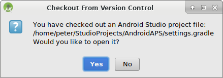

# Создание андроид-приложения (APK)

* * *

***Пожалуйста, обратите внимание** при создании приложения AndroidAPS 2.0: **Выборочная Конфигурация ** не поддерживается текущей версией плагина Android Gradle! Если сборка выполнена с ошибкой, относящейся к "выборочной конфигурации", можно сделать следующее:*

     * *Открыть окно настроек, нажав на Файл > Установки (на Mac, Android Studio > Настройки).*
     * *В левой панели нажать кнопку Build, Execution, Deployment > Compiler.* (сборка, выполнение, развертывание)
     * *Снять флажок с ячейки "выборочная конфигурация.*
    

## * *Нажмите Применить или OK.*

### Эта статья разделена на две части.

* В обзорной части есть объяснение того, какие шаги необходимы для создания файла APK.
* В пошаговой инструкции вы найдете снимки экранов установки. Поскольку версии Android Studio - среды разработки программного обеспечения, в которой мы будем создавать APK - меняются очень быстро, точного соответствия вашей сборке вы не увидите, но общее представление о том, как это делается, получите. Android Studio работает на Windows, Mac OS X и Linux, и между каждой платформой возможны незначительные различия. Если вы обнаружите, что что-то важное выполняется неправильно или отсутствует, пожалуйста, сообщите в группе facebook "AndroidAPS users" или в чате Gitter [Android APS](https://gitter.im/MilosKozak/AndroidAPS) или [AndroidAPSwiki](https://gitter.im/AndroidAPSwiki/Lobby) чтобы мы могли устранить проблему.

## Общий обзор

В целом, шаги, необходимые для создания файла APK таковы:

* Установите Git
* Установите и настройте Android Studio.
* Используйте git для клонирования исходного кода из центрального репозитория Github, где разработчики разместили код приложения.
* В Android Studio откройте клонированный проект в качестве активного проекта.
* Постройте подписанный APK.
* Переместите подписанный APK на ваш телефон.

## Пошаговое руководство

Подробное описание шагов, необходимых для создания файла APK.

## Установите Android Studio

* Установите Git 
  * [Windows](https://gitforwindows.org/)
  * [Mac OS X](http://sourceforge.net/projects/git-osx-installer/)
  * Linux - просто установите пакет Git через менеджер пакетов вашего дистрибутива
* Установите [Android Studio](https://developer.android.com/studio/install.html).
* Настройте Android Studio во время первого запуска

Выберите "Не импортировать настройки", так как вы не использовали их раньше.

Нажмите "Далее".

Выберите "Стандартная" установка и нажмите "Далее".

Для интерфейса выберите тему, которая вам нравится. (В этом руководстве мы использовали тему"Intellij". Затем нажмите "Далее". Это всего лишь цветовая схема. Можете выбрать любую (напр. Darcula для темного режима). Этот выбор не влияет на построение APK.

Нажмите "Далее" в диалоге "Проверить настройки".

Эмулятор Android (для эмуляции смартфона на Win или Mac) не используется при построении APK. Нажмите "Готово", чтобы завершить установку и при необходимости прочитать документацию.

Android Studio загружает много программных компонентов. Можете нажать на кнопку "Показать детали" если хотите увидеть, что происходит, но в принципе это не важно.

После завершения загрузок нажмите кнопку "Готово".

* Аплодисменты, аплодисменты. Установка Android Studio завершена и можно приступить к клонированию исходного кода. Можно сделать короткий перерыв.

## Скачиваем код и дополнительные компоненты

* Используйте клон Git в Android Studio, как показано на снимках экрана ниже. Выберите "Проверить проект из системы управления версиями" при помощи Git в качестве конкретной системы управления версиями.

Заполните URL-адрес главного репозитория AndroidAPS ("https://github.com/MilosKozak/AndroidAPS") и нажмите "clone" (клонировать).

Android Studio начнет клонирование. Не нажимайте на "работа в фоновом режиме" так работа идет быстро и переводом в фоновый режим можно только все усложнить.

Завершите выход из управления версиями открытием проекта, нажав "Да".

Выберите стандартный «создатель оболочки gradle по умолчанию» и нажмите «OK».

Прочитайте и закройте экран "Совет дня", нажав "Закрыть".

* Отлично, теперь у нас есть своя копия исходного кода и мы готовы начать сборку.
* Теперь мы приближаемся к нашему первому сообщению об ошибке. К счастью, Android Studio будет сразу предлагать нам решения.

Нажмите "Установить недостающую платформу(ы) и синхронизировать проект", так как Android Studio нуждается в установке отсутствующей платформы.

Примите лицензионное соглашение, выбрав "Принять" и нажав "Далее".

Как сказано в диалоге, подождите, пока завершится загрузка.

Теперь она завершена. Нажмите "Готово".

Таак, следующая ошибка. Но Android Studio предлагает аналогичное решение. Нажмите "Установить инструменты сборки и синхронизировать проект", так как Android Studio нуждается в загрузке недостающих инструментов.

Как сказано в диалоге, подождите, пока завершится загрузка.

Теперь она завершена. Нажмите "Готово".

И еще одна ошибка, нуждающаяся в обработке так как Android Studio снова должна скачать отсутствующую платформу. Нажмите "Установить недостающую платформу(ы) и синхронизировать проект".

Как сказано в диалоге, подождите, пока завершится загрузка.

Теперь она завершена. Нажмите "Готово".

Нажмите "Установить инструменты сборки и синхронизировать проект", так как Android Studio нуждается в загрузке недостающих инструментов.

Как сказано в диалоге, подождите, пока завершится загрузка.

Теперь она завершена. Нажмите "Готово".

Да, сообщения об ошибках пропали, и первая сборка gradle запущена. Настало время попить водички?

Android Studio рекомендует обновить систему gradle. **Не обновляйте gradle!** Это может привести к трудностям!

Нажмите "Не напоминать снова для этого проекта".

Построение сборки возобновлено.

Да, первая сборка завершена успешно, но мы еще не закончили.

## Создание подписанного APK

В меню выберите "Build"(выполнить сборку) и затем "Generate Signed Bundle / APK..."(создать подписанный пакет программ). (Меню в Android Studio изменилось с сентября 2018 года. В более старых версиях выберите в меню «выполнить сборку» и «Сгенерировать подписанный APK...».)  
Подписание означает, что вы подписываете ваше сгенерированное приложение цифровой подписью. Это необходимо потому, что Android имеет правило, согласно которому по соображениям безопасности к исполнению принимается только подписанный код. Для получения дополнительной информации перейдите по [этой](https://developer.android.com/studio/publish/app-signing.html#generate-key) ссылке. Безопасность - сложная тема, нам она сейчас не нужна.

В следующем диалоговом окне выберите "APK" вместо "Android App Bundle" и нажмите кнопку "Далее".

Выберите "app" и нажмите "Next".

Нажмите "Create new" (cоздать новый...) для создания магазина ключей. В этом случае магазин ключей является всего лишь файлом, в котором хранится информация о цифровой подписи. Он зашифрован и информация защищена паролями. Мы предлагаем хранить его в вашей домашней папке и помнить пароли, но если потеряете эту информацию, то просто должны создать новую. Самое лучшее - бережно хранить эту информацию.

* Заполните информацию для следующего диалога. 
  * Путь к хранилищу ключа: путь к файлу магазина ключей
  * Поля пароля для хранения ключей даются, чтобы дважды проверить ввод.
  * Alias - это имя для нужного вам ключа. Вы можете оставить его по умолчанию или дать ему имя, которое придумаете.
  * Поля пароля под ключом нужны для самого ключа. Как всегда, дважды проверте ошибки на вводе.
  * Вы можете оставить срок валидности по умолчанию 25 лет.
  * Обязательны к заполнению только имя и фамилия, но можно заполнить остальную информацию. Затем нажмите "OK".

Заполните информацию последнего диалога в этой серии и нажмите "Далее".

Выберите "full" (полный) в качестве атрибута для сгенерированного приложения. Выберите V1 "Jar Signature" (V2 необязательно) и нажмите "Finish" (закончить). В дальнейшем может пригодиться следующая информация.

* 'Release' должен быть вашим выбором по умолчанию для "Build Type"(типа сборки), 'Debug' только для программистов.
* Выберите тип сборки, который хотите создать. 
  * полный (с автоматически принимаемыми рекомендациями в закрытом цикле)
  * открытый цикл (рекомендации, адресованные пользователю, выполняются вручную)
  * управление помпой (дистанционное управление помпой, без функционирования цикла)
  * nsclient (например, отображаются данные другого пользователя, могут добавляться записи портала лечения/назначений)

В журнале событий вы увидите, что подписанное приложение (APK) создано успешно.

Нажмите на ссылку "Найти" в журнале событий.

## Перенос приложения на смартфон

Откроется окно файлового менеджера. Оно может выглядеть немного иначе в вашей системе, поскольку я использую Linux. В Windows это будет File Explorer (проводник), а на Mac OS X Finder (поисковик). Там вы увидите каталог с созданным APK файлом. К сожалению, это неверное место, так как "wear-release.apk" не является подписанным приложением, которое мы ищем.

Перейдите к папке AndroidAPS/app/full/release, чтобы найти файл "app-full-release.apk". Перенесите этот файл на смартфон Android. Вы можете сделать это по-своему, напр. загрузкой в облако, переносом с компьютера по кабелю или используя электронную почту. В этом примере я использую Gmail, так как для меня такой перенос привычнее. Для установки на нашем смартфоне следует дать системе Android разрешение сделать установку из Gmail, которая обычно запрещена. Если переносите установщик другим способом, поступите соответствующим образом.

В настройках смартфона есть область "установка неизвестных приложений" где я даю Gmail право устанавливать APK файлы, которые я получаю через Gmail.

Выберите "Разрешить из этого источника". После установки можно отключить его снова.

Последний шаг - нажать на файл APK, который мы получили через Gmail и установить приложение. Если APK не установливается и у вас более старая версия AndroidAPS на телефоне, подписанная другим ключом, то нужно сначала удалить более старое приложение; при этом не забудьте экспортировать ваши настройки!

Да, все получилось, теперь можно начать настройку AndroidAPS (мониторинг, помпа) и т. д.