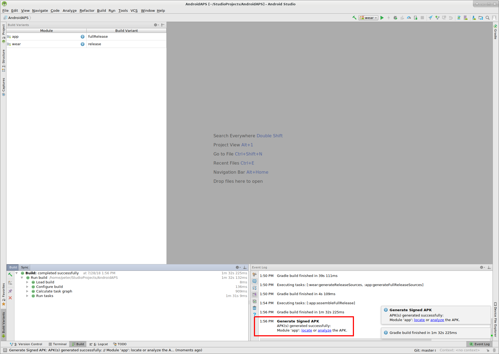

# Создание андроид-приложения (APK)

* * *

***Пожалуйста, обратите внимание** при создании приложения AndroidAPS 2.0: **Выборочная Конфигурация ** не поддерживается текущей версией плагина Android Gradle! Если сборка выполнена с ошибкой, относящейся к "выборочной конфигурации", можно сделать следующее:*

     * *Открыть окно настроек, нажав на Файл > Установки (на Mac, Android Studio > Настройки).*
     * *В левой панели нажать кнопку Build, Execution, Deployment > Compiler.* (сборка, выполнение, развертывание)
     * *Снять флажок с ячейки "выборочная конфигурация.*
    

## * *Нажмите Применить или OK.*

### Эта статья разделена на две части.

* В обзорной части есть объяснение того, какие шаги необходимы для создания файла APK.
* В пошаговой инструкции вы найдете снимки экранов установки. Поскольку версии Android Studio - среды разработки программного обеспечения, в которой мы будем создавать APK - меняются очень быстро, точного соответствия вашей сборке вы не увидите, но общее представление о том, как это делается, получите. Android Studio работает на Windows, Mac OS X и Linux, и между каждой платформой возможны незначительные различия. Если вы обнаружите, что что-то важное выполняется неправильно или отсутствует, пожалуйста, сообщите в группе facebook "AndroidAPS users" или в чате Gitter [Android APS](https://gitter.im/MilosKozak/AndroidAPS) или [AndroidAPSwiki](https://gitter.im/AndroidAPSwiki/Lobby) чтобы мы могли устранить проблему.

## Общий обзор

В целом, шаги, необходимые для создания файла APK таковы:

* Установите Git
* Установите и настройте Android Studio.
* Используйте git для клонирования исходного кода из центрального репозитория Github, где разработчики разместили код приложения.
* В Android Studio откройте клонированный проект в качестве активного проекта.
* Постройте подписанный APK.
* Переместите подписанный APK на ваш телефон.

## Пошаговое руководство

Подробное описание шагов, необходимых для создания файла APK.

## Установите Android Studio

* Установите Git 
  * [Windows](https://gitforwindows.org/)
  * [Mac OS X](http://sourceforge.net/projects/git-osx-installer/)
  * Linux - просто установите пакет Git через менеджер пакетов вашего дистрибутива
* Установите [Android Studio](https://developer.android.com/studio/install.html).
* Настройте Android Studio во время первого запуска

Выберите "Не импортировать настройки", так как вы не использовали их раньше.

Нажмите "Далее".

Выберите "Стандартная" установка и нажмите "Далее".

Для интерфейса выберите тему, которая вам нравится. (В этом руководстве мы использовали тему"Intellij". Затем нажмите "Далее". Это всего лишь цветовая схема. Можете выбрать любую (напр. Darcula для темного режима). Этот выбор не влияет на построение APK.

Нажмите "Далее" в диалоге "Проверить настройки".

Эмулятор Android (для эмуляции смартфона на Win или Mac) не используется при построении APK. Нажмите "Готово", чтобы завершить установку и при необходимости прочитать документацию.

Android Studio загружает много программных компонентов. Можете нажать на кнопку "Показать детали" если хотите увидеть, что происходит, но в принципе это не важно.

После завершения загрузок нажмите кнопку "Готово".

* Аплодисменты, аплодисменты. Установка Android Studio завершена и можно приступить к клонированию исходного кода. Можно сделать короткий перерыв.

## Скачиваем код и дополнительные компоненты

* Используйте клон Git в Android Studio, как показано на снимках экрана ниже. Выберите "Проверить проект из системы управления версиями" при помощи Git в качестве конкретной системы управления версиями.

Заполните URL-адрес главного репозитория AndroidAPS ("https://github.com/MilosKozak/AndroidAPS") и нажмите "clone" (клонировать).

Android Studio начнет клонирование. Не нажимайте на "работа в фоновом режиме" так работа идет быстро и переводом в фоновый режим можно только все усложнить.

Завершите выход из управления версиями открытием проекта, нажав "Да".

Выберите стандартный «создатель оболочки gradle по умолчанию» и нажмите «OK».

Прочитайте и закройте экран "Совет дня", нажав "Закрыть".

* Отлично, теперь у нас есть своя копия исходного кода и мы готовы начать сборку.
* Теперь мы приближаемся к нашему первому сообщению об ошибке. К счастью, Android Studio будет сразу предлагать нам решения.

Нажмите "Установить недостающую платформу(ы) и синхронизировать проект", так как Android Studio нуждается в установке отсутствующей платформы.

Примите лицензионное соглашение, выбрав "Принять" и нажав "Далее".

Как сказано в диалоге, подождите, пока завершится загрузка.

Теперь она завершена. Please click "Finish".

Aaaahhh, next error. But Android Studio suggests a similar solution. Click "Install Build Tools and sync project" as Android Studio needs to download missing Tools.

Как сказано в диалоге, подождите, пока завершится загрузка.

Теперь она завершена. Please click "Finish".

And another error to handle as Android Studio needs to download again a missing platform. Click "Install missing platform(s) and sync project".

Как сказано в диалоге, подождите, пока завершится загрузка.

Теперь она завершена. Please click "Finish".

Click "Install Build Tools and sync project" as Android Studio needs to download missing Tools.

Как сказано в диалоге, подождите, пока завершится загрузка.

Теперь она завершена. Please click "Finish".

Yeah, the error messages are gone and the first gradle build is runing. Maybe it's time to drink some water?

Android Studio recommends to update the gradle system. **Never update gradle!** This might lead to difficulties!

Please click "Don't remind me again for this project".

The build is running again.

Yeah, the first build is successful but we are not finished.

## Generate signed APK

In the menu select "Build" and then "Generate Signed Bundle / APK...". (The menu in Android Studio changed as of September 2018. In older versions select in the menu “Build” and then “Generate Signed APK...”.)  
Signing means that you sign your generated app but in a digital way as a kind of digital fingerprint in the app itself. That is necessary because Android has a rule that it only accepts signed code to run for security reasons. For more information on this topic, follow the link [here](https://developer.android.com/studio/publish/app-signing.html#generate-key) Security is a deep and complex topic and you don't need this now.

In the following dialogue box select "APK" instead of "Android App Bundle" and click button "Next".

Select "app" and click "Next".

Click "Create new..." to start creating your keystore. A keystore in this case is nothing more than a file in which the information for signing is stored. It is encrypted and the information is secured with passwords. We suggest storing it in your home folder and remember the passwords but if you lose this information it's not a big issue because then you just have to create a new one. Best practice is to store this information carefully.

* Fill in the information for the next dialog. 
  * Key store path: is the path to the keystore file
  * The password fields below are for the keystore to double check for typing errors.
  * Alias is a name for the key you need. You can leave the default or give it a fancy name you want.
  * The password fields below the key are for the key itself. As always to double check for typing errors.
  * You can let the validity at the default of 25 years.
  * You only have to fill out first name and last name but feel free to complete the rest of information. Then click "OK".

Fill in the information of the last dialog in this dialog and click "Next".

Select "full" as flavour for the generated app. Select V1 "Jar Signature" (V2 is optional) and click "Finish". The following information might be important for later use.

* 'Release' should be your default choice for "Build Type", 'Debug' is just for people coding.
* Select the build type you want to build. 
  * full (i.e. recommendations automatically enacted in closed looping)
  * openloop (i.e. recommendations given to user to manually enact)
  * pumpcontrol (i.e. remote control for pump, no looping)
  * nsclient (i.e. looping data of another user is displayed and careportal entries can be added)

In the event log you see that the Signed APK was generated successfully.

Click the "locate" link in the event log.

## Transfer APK to smartphone

A file manager window opens. It might look a bit different on your system as I am using Linux. On Windows there will be the File Explorer and on Mac OS X the Finder. There you should see the directory with the generated APK file. Unfortunately this is the wrong place as "wear-release.apk" is not the signed "app" APK we are searching for.

Please change to the directory AndroidAPS/app/full/release to find the "app-full-release.apk" file. Transfer this file to your Android smartphone. You can do it on your preferred way, i.e. Bluetooth, cloud upload, connect computer and phone by cable or use email. I use Gmail here in this example as it is fairly simple for me. I mention this because to install the self-signed app we need to allow Android on our smartphone to do this installation even if this file is received via Gmail which is normally forbidden. If you use something other please proceed accordingly.

In the settings of your smartphone there is an area "unknown apps install" where I have to give Gmail the right to install APK files which I get via Gmail.

Select "Allow from this source". After the installation, you can disable it again.

The last step is to press on the APK file I got via Gmail and install the app. If the APK does not install and you have an older version of AndroidAPS on your phone that was signed with a different key then you will need to uninstall this first, remember to export your settings if so!

Yeah, you got it and can now start with configuring AndroidAPS for your use (CGMS, insulin pump) etc.