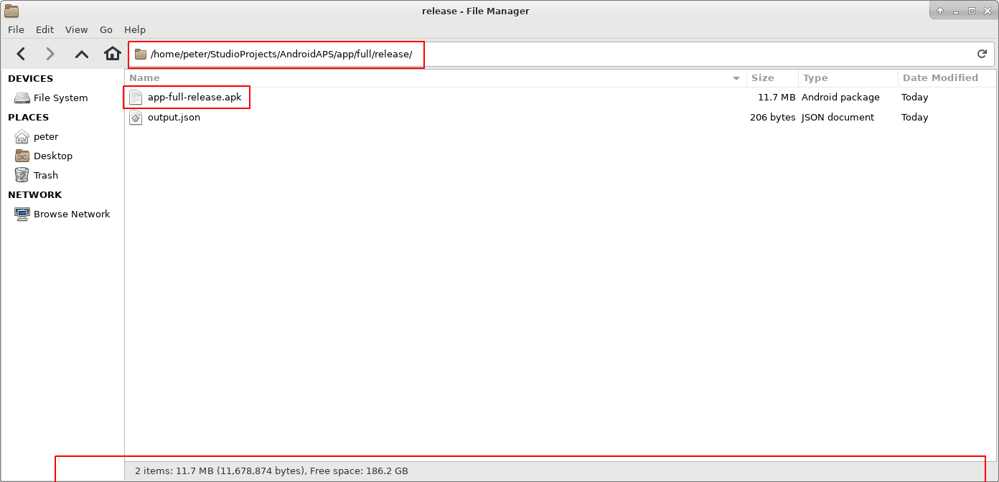

# Обновление до новой версии или ветки

## Постройте сами вместо того, чтобы загружать

**AndroidAPS недоступен для скачивания из-за законодательства, касающегося медицинских устройств. Построить приложение для собственного использования вполне законно, но вам не разрешается передавать копию другим! См. раздел [ FAQ ](../Getting-Started/FAQ.md).**

## Важные Примечания

* As of version 2.3 you have to use git to update. Updating via zip file does not work anymore.
* Please use [Android Studio Version 3.5.1](https://developer.android.com/studio/) or newer to build the apk.
* [Windows 10 32-bit systems](../Installing-AndroidAPS/troubleshooting_androidstudio#unable-to-start-daemon-process) are not supported by Android Studio 3.5.1.
* If you are using Dexcom G6 with the [patched Dexcom app](../Hardware/DexcomG6#if-using-g6-with-patched-dexcom-app) you will need the version from the [2.4 folder](https://github.com/dexcomapp/dexcomapp/tree/master/2.4).

## Quick walk-through for experienced users

Please skip this paragraph if you update for the first time. The quick walk-through is for experienced users. Your next step would be to [install git](../Installing-AndroidAPS/git-install.rst) if you do not have it already.

If you already updated AAPS in previous versions and use a Windows PC you can update in two simple steps:

1. [Update local copy](../Installing-AndroidAPS/Update-to-new-version#update-your-local-copy) (VCS->Git->Pull)
2. [Generate signed APK](../Installing-AndroidAPS/Update-to-new-version#generate-signed-apk) (Select 'app' instead of 'wear' on your way!)

## Установите git (если у вас его нет)

Follow the manual on the [git installation page](../Installing-AndroidAPS/git-install.rst).

## Update your local copy

* Click: VCS -> Git -> Pull
  
  

* Click Pull (no changes in dialog field)
  
  

## Создание подписанного APK

<!--- Text is maintained in page building-apk.md ---> В меню выберите "Build"(выполнить сборку) и затем "Generate Signed Bundle / APK..."(создать подписанный пакет программ). (Меню в Android Studio изменилось с сентября 2018 года. In older versions select in the menu “Build” and then “Generate Signed APK...”.)

  
Signing means that you sign your generated app but in a digital way as a kind of digital fingerprint in the app itself. Это необходимо потому, что Android имеет правило, согласно которому принимается только подписанный код для запуска по соображениям безопасности. Для получения дополнительной информации по этой теме перейдите по ссылке [здесь](https://developer.android.com/studio/publish/app-signing.html#generate-key). Безопасность - это глубокая и сложная тема, нам она сейчас не нужна.

В следующем диалоговом окне выберите "APK" вместо "Android App Bundle" и нажмите кнопку "Далее".

Выберите "app" (приложение) и нажмите "Next" (далее).

Enter your key store path, enter key store password, select key alias and enter key password.

Select 'Remember passwords'.

Then click next.

Select "full" (or "fullRelease") as flavour for the generated app. Select V1 "Jar Signature" (V2 is optional) and click "Finish". В дальнейшем может пригодиться следующая информация.

* 'Release' должен быть вашим выбором по умолчанию для "Build Type"(типа сборки), 'Debug' только для программистов.
* Выберите тип сборки, который хотите создать. 
  * full / fullRelease (i.e. recommendations automatically enacted in closed looping)
  * открытый цикл (рекомендации, адресованные пользователю, выполняются вручную)
  * управление помпой (дистанционное управление помпой, без функционирования цикла)
  * nsclient (например, отображаются данные другого пользователя, могут добавляться записи портала лечения/назначений)

В журнале событий вы увидите, что подписанное приложение (APK) было создано успешно.

Нажмите на ссылку "Найти" в журнале событий.

## Перенос приложения на смартфон

<!--- Text is maintained in page building-apk.md ---> Открывается окно файлового менеджера. Может выглядеть немного иначе в вашей системе, поскольку я использую Linux. В Windows это будет File Explorer (проводник), а на Mac OS X Finder (поисковик). Там вы увидите каталог с созданным APK файлом. К сожалению, это неверное место, так как "wear-release.apk" не является подписанным приложением, которое мы ищем.

Перейдите к папке AndroidAPS/app/full/release, чтобы найти файл "app-full-release.apk". Перенесите этот файл на смартфон Android. You can do it on your preferred way:

* Bluetooth
* cloud upload (Google Drive or other cloud services)
* connect computer and phone by cable 
* by mail (Note that some mail apps do not allow apk attachments, in this case use other transfer method.)

In this example Gmail is used as it is fairly simple. To install the self-signed app you need to allow Android on your smartphone to do this installation even if this file is received via Gmail which is normally forbidden. Если переносите установщик другим способом, поступите соответственно.

В настройках смартфона есть область "установка неизвестных приложений" где я даю Gmail право устанавливать APK файлы, которые я получаю через Gmail.

Выберите "Разрешить из этого источника". После установки вы можете отключить его снова.

Последний шаг - нажать на файл APK, который я получил через Gmail и установить приложение. Если APK не установливается и у вас более старая версия AndroidAPS на телефоне, подписанная другим ключом, то нужно сначала удалить более старое приложение; при этом не забудьте экспортировать ваши настройки!

Да, все получилось, теперь можно начать настройку AndroidAPS (CGMS, помпа) и т. д.

## Check AAPS version on phone

Вы можете проверить версию AAPS на вашем телефоне, нажав на меню трех точек сверху справа "о приложении".

## Устранение неполадок

See separate page [troubleshooting Android Studio](../Installing-AndroidAPS/troubleshooting_androidstudio.rst).