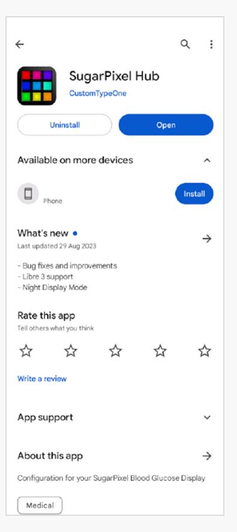

# Слежение за работой AAPS (без взаимодействия с системой)

In addition to the range of possibilities available for remotely controlling _and_ following **AAPS** which are described at [remote control](../RemoteFeatures/RemoteControl.md), there are several additional apps and devices which the community has developed, to simply follow numbers (glucose levels and other information), without interacting with AAPS.

Обзор возможностей, доступных для наблюдения работы **AAPS**, можно найти на веб-странице [фоллоуэры Nightscout](https://nightscout.github.io/nightscout/downloaders/#); развернув меню слева:


Наиболее распространенные сценарии сочетания работы **AAPS** с наблюдением приведены ниже.

## 1) Smartphone apps

Наиболее популярные приложения для отслеживания работы **AAPS**. Все эти приложения бесплатны:

A)  Dexcom Follow (Android/iOs)

B)  Nightguard (iOs)

C)  Nightwatch (Android)

D)  xDrip+ (Android)

E)  xDrip4iOS (iOs)

F)  Sugarmate (iOs)

G)  Spike (iOs)


### A) Dexcom Follow (Android and iOS)


● Dexcom Follow совместимо со многими телефонами (Android и iPhone). Dexcom Follow можно использовать, даже если вы не используете официальное приложение Dexcom для получения данных.

● Многие родители/опекуны знакомы с Dexcom Follow, предпочитая его четкий интерфейс чему-то более сложному.

● Dexcom Follow очень хорош для учителей/бабушек и дедушек и людей, которые мало знают о диабете и гликемии. Он имеет настраиваемые оповещения (уровень ГК, какой звук воспроизводить и т. д.). Оповещения могут быть полностью выключены, что очень полезно, если сенсор еще прирабатывается и передает много заниженных значений.

#### Setting up Dexcom Follow: how-to-guide

У вас есть возможность отправлять приглашения подписчикам из самостоятельно собранного приложения Dexcom BYODA. You should also be able to send invitations to Dexcom Follow from xDrip+ (settings - Cloud upload - Dexcom share server upload, see instructions here:

https://xdrip.readthedocs.io/en/latest/use/cloud/?h=#dexcom-share-server-upload

You cannot send invite emails to Dexcom followers anymore from these third-party apps. In xDrip+ the invite request will just result in the message “invite not sent”.

You must install the official Dexcom app, send the invite, and then uninstall the official app.

Для этого выполните следующие шаги:

1)  Install the official “Dexcom” app on _any_ smartphone (Android/iPhone), this can be the Follower phone, if it is more convenient. 2) Войдите c именем пользователя и паролем Dexcom, это те же данные, что и для Dexcom Clarity, если вы уже клиент Dexcom/Clarity. Если у вас нет учетной записи Dexcom, можно создать новый логин.   
3) Пролистайте вводные меню. 4) В разделе код сенсора (sensor code) введите "no code". 5) В разделе № трансмиттера (transmitter SN) введите любой валидный код трансмиттера (можно ввести номер истекшего) чтобы не произошло вмешательства в работу текущего; он имеет определенный формат чисел и букв: «NLNNL» и только в определенные комбинации, так что проще всего использовать то, что известно наверняка). 6) Когда приложение попытается найти трансмиттер и сенсор, вы сможете пригласить фоллоуэров: выберите выпадающее меню в левом верхнем углу приложения и добавьте новых подписчиков. Эту процедуру также можно использовать, если один из фоллоуэров сменил телефон и нуждается в свежем приглашении, здесь вы можете удалить его из списка подписчиков и отправить новое приглашение на новый смартфон. 7) На телефоне фоллоуэра установите Dexcom Follow скачав его из App Store (iPhone) или Google Play (Android). Настройте приложение Dexcom Follow и вам будет предложено открыть электронную почту, найти приглашение и стать подписчиком.    
8) Теперь можно удалить официальное приложение Dexcom G6.

For Dexcom Follow, the sensor data is then exported from the AAPS phone either directly from BYODA, or from xDrip+, depending on which app you are using.


### B) Nightguard (iOS)


Достоинства (как указывают пользователи):

●   Available in the [app store](https://apps.apple.com/us/app/nightguard/id1116430352), simple, user-friendly interface.

● Сдвиньте кнопку или встряхните телефон для прекращения оповещений на период  от 5 минут до 24 часов

●   Customize alarms (high, low alerts, missed readings when no data for 15-45 minutes.

● Быстрый рост/падение за 2-5 последовательных (вы выбираете) показания. Можно также выбрать значения дельты между двумя данными

● Умный сброс оповещений, если уровни движутся в правильном направлении

● Есть вкладка терапии, которая, позволяет установить новую временную цель на определенный срок, удалить временную цель или ввести углеводы.

Недостатки (по сообщениям пользователей)

● Доступно только для iOS

● Временная цель ТТ показывается как 5 ммол, независимо от того, какой уровень установлен на самом  деле

● Никогда не показывает временную скорость базала, несмотря на то, что есть графа TB

### C) Nightwatch (Android)


● Nightwatch позиционируется как клиент Nightscout и отслеживает уровни глюкозы пользователя на телефоне или планшете.

●   The app can be downloaded from [Google play](https://play.google.com/store/apps/details?id=se.cornixit.nightwatch) and displays BG data in real time.

● Пользователь может быть оповещен настраиваемым сигналами на зашумленные низкие и высокие значения ГК.

● Данные ГК отображаются в ммоль/л или мг/дл.

● Требуется Android 5.0 и выше.

● Имеет темный интерфейс, большие цифры и кнопки для ночного времени.

### D) xDrip+ (Android)

You can use xDrip+ as a follower.

#### With Nightscout

Set xDrip+ as a Nightscout Follower. You will receive BG and treatments, not basal.


#### Without Nightscout - xDrip+ BG data source

If your AAPS data source is xDrip+ (or if xDrip+ can also receive BG from another app like BYODA, Juggluco, ...) you can use it from the master phone to share data with xDrip+ followers, displaying BG, treatments and basal rates.


#### Without Nightscout - xDrip+ BG companion app

If your AAPS data source is not xDrip+ but you can display BG data from the Companion App data source, you can use it from the master phone to share data with xDrip+ followers, displaying BG, treatments and basal rates.


### E) xDrip4iOS/Shuggah (iOS)


xDripSwift was created from porting the original xDrip app to iOS and evolved to "xDrip for iOS" written **xDrip4iOS** .

A version of **xDrip4iOS** is available in the Apple Store under the name of **Shuggah**.

```{admonition} Further detail about how to attempt to obtain the original **xDrip4iOS** app
:class: dropdown
The [xDrip4iOS Facebook group](https://www.facebook.com/groups/853994615056838/announcements) is the main community support for xDrip4iOS and Shuggah. **xDrip4iOS** can connect to many different CGM systems and transmitters and display blood glucose values, charts and statistics as well as provide alarms. It can also upload to Nightscout or act as a [follower app for Nightscout](https://xdrip4ios.readthedocs.io/en/latest/connect/follower/). However, it is difficult to actually _get_ the **xDrip4iOS** app for your phone. 

"How can I get **xDrip4iOS** on my iPhone?"
There are two options:

1. If you have a Mac and an Apple Developer account (99 EUR/USD per year) you can build your own xDrip4iOS by following the instructions below:

https://xdrip4ios.readthedocs.io/en/latest/install/build/

If you want, you can then become a "releaser" and share a Personal Testflight xDrip4iOS with up to 100 other people to help them:
https://xdrip4ios.readthedocs.io/.../personal_testflight/

2. You join the [xDrip4iOS Facebook group](https://www.facebook.com/groups/853994615056838/announcements) and monitor the posts… wait for somebody to offer an invitation to their Personal Testflight releases in the group. **You should not ask for an invitation to the app** (read the group rules). 

An easier solution is therefore to download the **Shuggah** app. 
```

#### [Shuggah](https://apps.apple.com/sa/app/shuggah/id1586789452)

Приложение:


"Что такое Shuggah?" A group of Ukrainian developers copied the project code for xDrip4iOS (which is shared publicly on GitHub) and released it on the App Store under a business account (the app is free, and their intentions are good). Приложение было немного изменено, добавлено заявление о конфиденциальности и отказ от ответственности, но в остальном приложение такое же, как xDrip4iOS. The Shuggah release is not managed by the xDrip4iOS developers so it cannot be guaranteed that it will function in the same way as xDrip4iOS, that it will be updated at the same time, or that Apple won't remove it from the App Store at some point.

The [xDrip4iOS Facebook group](https://www.facebook.com/groups/853994615056838/announcements) supports xDrip4iOS, Shuggah, and the matching Apple Watch apps.

### F) Sugarmate (iOS)


[Sugarmate](https://sugarmate.io/) можно закачать из App Store. Sugarmate совместим с: ● Apple iPhone (Требуется программное обеспечение версии 13. или позднее) ● Apple iPad (Требуется программное обеспечение версии 13. или позднее) ● Google Android (Сохраните веб-приложение на домашнем экране)

Пользователи Sugarmate сообщают что приложение совместимо с Apple CarPlay в США для отображения данных гликемии во время вождения. Пока еще не установлено, возможно ли это в странах за пределами США. Если вы знаете больше об этом, добавьте подробности в документацию, заполнив запрос на слияние который быстро и легко сделать.


### G)  [Spike](https://spike-app.com/) (iOS)


Spike может использоваться и как первичный приемник и как приложение-фоллоуэр, показывающее ГК, сигналы оповещений, активный инсулин IOB и многое другое. The website and app are no longer developed. Details [here](https://spike-app.com/#features2). Support can be found on [Facebook](https://www.facebook.com/groups/1973791946274873) and [Gitter](https://gitter.im/SpikeiOS/Lobby).

Чтобы установить Spike, см. [здесь](https://spike-app.com/#installation)

## 2) Смарт-часы для **мониторинга AAPS** (полные данные профиля или только гликемия), при том, когда **AAPS** работает на телефоне.

Smartwatch options which also allow interaction with **AAPS** are described in the ["remote control"](../RemoteFeatures/RemoteControl.md) section of the documentation.

Существует множество доступных смарт-часов, которые дают только отображение ГК. Если вы пользуетесь сайтом Nightscout, то хороший обзор вариантов дан [здесь](https://nightscout.github.io/nightscout/wearable/#)

Here we summarize some of the follow-only watch options popular with **AAPS** users:

### a)  **Xiaomi and Amazfit watches**

[Artem](https://github.com/bigdigital) has created an xDrip+ integration app WatchDrip+ for various smartwatch models, mostly for Xiaomi (_e.g._ Mi band) and Amazfit brands:


Подробности об этих моделях и их настройке [здесь](https://bigdigital.home.blog/). Преимущество этих часов заключается в том, что они небольшие и относительно доступные (Xiaomi Mi Band 5 продается за £39.99 GBP). Они особенно популярны как часы для детей и людей с небольшими запястьями.

### b) Часы Pebble


Pebble watches ([now discontinued](https://en.wikipedia.org/wiki/Pebble_(watch))) were on general sale from 2013 - 2016, and may still be available second-hand. Активы Pebble перешли к Fitbit. Пользователи Pebble могут пользоваться циферблатом Urchin для просмотра данных Nightscout. Отображаемые данные включают активный инсулин IOB, действующий временный базал и прогнозирование. В случае открытого цикла вы можете использовать алгоритм IFTTT для создания апплета, который сообщает об уведомлениях от **AAPS**, вслед за чем можно отправить либо SMS, либо push-уведомление.

### c) смарт-часы [Bluejay GTS](https://bluejay.website/shop/product/bluejay-gts-26)


Это уникальное устройство может получать данные гликемии **непосредственно** с трансмиттера Dexcom G6. Малоизвестно, что трансмиттер Dexcom G6 передает текущие данные гликемии по _двум_ отдельным каналам: телефонному каналу и каналу помпы. В часах Bluejay GTS используется модифицированная версия программного обеспечения Xdrip+, и их можно настроить на получение данных о глюкозе по любому каналу, поэтому, если **AAPS ** использует телефонный канал, то часы Bluejay GTS могут использовать канал помпы.

Часы Bluejay GTS небольшие, водонепроницаемые, доступны по цене (в настоящее время 115 фунтов стерлингов) и могут быть доставлены по всему миру из Великобритании. Главное их преимущество заключается в том, что часы полностью независимы как от телефона, так и от системы ИПЖ. Так, например, если вы отсоедините помпу и телефон **AAPS** на пляже или в парке и находитесь вне зоны действия телефона AAPS, то все равно сможете получать данные с Dexcom G6 сразу на часы.

Недостатки, о которых сообщают пользователи, заключаются в том, что они не всегда снимают показания каждые 5 минут, а батарея не подлежит замене. В часах Bluejay GTS используется модифицированная версия программного обеспечения Xdrip+, и в настоящее время они не работают с другими версиями Dexcom (G7) или датчиками Libre.

### d) Часы Apple

Проверьте [Nightscout на часах](https://nightscout.github.io/nightscout/wearable/#):

Options include Nightguard, sugarmate, Gluco-Tracker and Loop Follow.


## 3) Устройства для слежения за AAPS

Devices include: A)  M5 stack/M5 stickC

B)  Sugarpixel

C)  PC (Teamviewer)


### A) M5 stack


The M5Stack is a small box which can be programmed for many applications, Martin's project [M5Stack NightscoutMon](https://github.com/mlukasek/M5_NightscoutMon/wiki) is displaying sensor glucose values and trends, IOB and COB. Он находится в пластиковой коробке, оснащен цветным дисплеем, слотом для карт Micro SD, 3 кнопками, динамиком и внутренним аккумулятором. Это отличный монитор уровня сахара в крови, и его относительно легко настроить, если у вас есть учетная запись Nightscout. Он обычно применяется в домашних сетях Wi-Fi, но некоторые сообщают, что используют его в качестве дисплея при езде на мотоцикле, запуская его через точку доступа Wi-Fi на телефоне.

### B) Sugarpixel

SugarPixel — это устройство для системы вторичного оповещения об уровне глюкозы для приложений Dexcom или Nightscout на смартфоне пользователя. Устройство отображает показания уровня сахара в крови в режиме реального времени. Этот аппаратный монитор CGM оснащен звуковыми оповещениями, генерирующими случайные сигналы (которые невероятно громкие), вибрационными оповещениями для людей с нарушениями слуха, настраиваемыми параметрами отображения и встроенным многопользовательским сопровождением.




● SugarPixel имеет несколько вариантов отображения в мг/дл и ммоль/л в соответствии с потребностями пользователя с цветовой кодировкой значений гликемии. Стандартный циферблат отображает ГК, стрелку тренда и дельту изменений. Дельта - это изменение + или - от последнего показания. ● SugarPixel можно настроить дна работы при низкой яркости, они показывают гликемию и текущее время, что удобно в ночное время на тумбочке пользователя. ● Цветной экран SugarPixel использует весь дисплей для отображения одного цвета, обозначающего значение ГК. Это позволяет пользователю видеть значения ГК на расстоянии через окно, находясь в бассейне, во дворе или на веранде. Большой циферблат хорош для тех, кто носит очки или контактные линзы.


### C) PC (TeamViewer)
Некоторые пользователи считают, что полнофункциональный инструмент удаленного доступа, такой как [TeamViewer](https://www.teamviewer.com/), может оказаться полезным для удаленного устранения неполадок.


 


