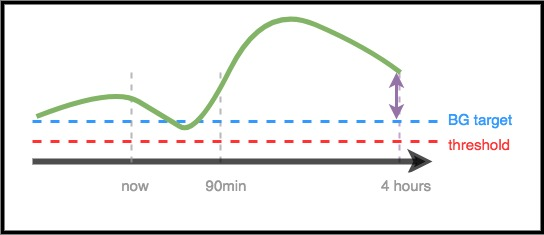

# Для клиницистов – Общие сведения и руководство по AndroidAPS

Эта страница предназначена для клиницистов, которые проявили интерес к технологии искусственной поджелудочной железы, такой как AndroidAPS, или для пациентов, которые хотят делиться такой информацией со своими лечащими врачами.

В этом руководстве содержится первоочередная информация о самодеятельных алгоритмах замкнутого цикла и, в частности, о том, как работает AndroidAPS. Более подробную информацию по всем этим темам можно найти во [ всеобъемлющей интернет-документации по AndroidAPS ](http://androidaps.readthedocs.io/en/latest/index.html). Если у вас есть вопросы, узнайте подробности у вашего пациента или обратитесь с вопросом к сообществу. (Если вы не в социальных сетях (например, [ Twitter ](https://twitter.com/kozakmilos) или Facebook), пишите разработчиками по электронной почте @AndroidAPS.org). [ Здесь также можно найти некоторые из последних исследований и связанных с ними данными ](https://openaps.org/outcomes/).

### Этапы самостоятельного построения системы замкнутого цикла:

Для начала работы с AndroidAPS необходимо выполнить следующие действия:

* Найдите [ совместимую помпу ](https://androidaps.readthedocs.io/en/latest/EN/Getting-Started/Pump-Choices.html), [совместимое устройство Android ](https://docs.google.com/spreadsheets/d/1gZAsN6f0gv6tkgy9EBsYl0BQNhna0RDqA9QGycAqCQc/edit?usp=sharing), и [ совместимый мониторинг ГК ](https://androidaps.readthedocs.io/en/latest/EN/index.html#getting-started-with-androidaps).
* [ Загрузите исходный код AndroidAPS и создайте программное обеспечение ](https://androidaps.readthedocs.io/en/latest/EN/Installing-AndroidAPS/Building-APK.html).
* [ Сконфигурируйте программу для работы с устройствами, настройте и задайте параметры защиты ](https://androidaps.readthedocs.io/en/latest/EN/index.html#configuration).

### Как работает замкнутый цикл

Без системы замкнутого цикла человек с диабетом собирает данные своей помпы и мониторинга ГК, решает, что делать, и принимает меры.

С помощью автоматизированной подачи инсулина система делает то же самое: собирает данные с помпы и мониторинга, передает их куда-либо (например, на Nightscout), использует эту информацию для расчетов и принятия решений о необходимом количестве инсулина, повышении или снижении базальной скорости использует временные изменения базы для внесения необходимых корректировок, чтобы в конечном итоге привести ГК в целевой диапазон.

Если устройство, работающая под управлением AndroidAPS, ломается или выходит из диапазона связи с помпой, то после окончания последнего временного базала помпа возвращается в стандартное состояние с предварительно запрограммироваными базалами.

### Как собираются данные:

С помощью AndroidAPS, телефон на Android запускает специальное приложение для выполнения математических операций, телефон общается с поддерживаемой помпой через Bluetooth. AndroidAPS может общаться с другими устройствами и обмениваться с облачными службами через wi-fi или передачу мобильных данных, а также сообщать пациенту, ухаживащим и близким о том, что он делает и почему.

Устройство Android должно:

* общаться с помпой и читать историю доставленного инсулина
* общаться с системой мониторинга (либо напрямую, либо через облако)- чтобы видеть, как ведет себя гликемия

Когда устройство собрало эти данные, алгоритм принимает решения на основе внесенных в программу параметров (ISF, CR, DIA, целевых значений ГК и т. д.). При необходимости он выдает команды помпе для изменения скорости доставки инсулина.

Она также соберет информацию о болюсах, потреблении углеводов и временных целевых корректировках от помпы или от Nightscout, чтобы использовать их в расчетах.

### Откуда он знает, что делать?

Программное обеспечение с открытым исходным кодом предназначено для того, чтобы устройство легко выполняло задания, которые выполнялись в ручном режиме для расчета того, как следует корректировать подачу инсулина. Сначала он собирает данные со всех вспомогательных устройств и из облака, подготавливает данные и выполняет вычисления, делает прогнозы разных сценариев ожидаемых уровней ГК и производит необходимые корректировки, чтобы сохранить или вернуть ГК в целевой диапазон. Затем он отправляет необходимые корректировки на помпу. Затем он снова считывает данные и снова повторяет алгоритм корректировки.

Поскольку наиболее важным исходным параметром является уровень глюкозы в крови, поступающий от системы мониторинга, важно иметь высококачественные данные CGM.

AndroidAPS предназначен для прозрачного отслеживания всех входных данных, а также выдаваемых рекомендаций и действий. Поэтому в любое время, просматривая журналы событий, легко ответить на вопрос, "почему он делает X?".

### Примеры принятия решений алгоритмом AndroidAPS:

AndroidAPS основывается на том же основном алгоритме и наборе функций, что и OpenAPS. Алгоритм выполняет несколько предсказаний (на основе параметров и ситуации), представляющих различные сценарии того, что может произойти в будущем. В Nightscout они отображаются в виде фиолетовых линий. Для распознавания этих [линий прогнозирования](../Installing-AndroidAPS/Releasenotes#overview-tab) AndroidAPS использует различные цвета. В журнале событий будет описано, какие из этих предсказаний и в какие временные рамки будут управлять необходимыми действиями.

#### Ниже приведены примеры фиолетовых линий прогнозирования, а также то, как они могут различаться:

#### Вот примеры различных временных рамок, влияющих на необходимые коррективы в подаче инсулина:

#### Сценарий 1- Временный нулевой базал для безопасности

В этом примере ГК увеличивается в краткосрочной перспективе, однако, как ожидается, она будет низкой в течение более длительного периода времени. По сути, ожидается, что она будет ниже целевого значения * и * порога безопасности. Для безопасности с целью предотвращения низкой ГК Андроид выдаст нулевую временную базальную скорость до тех пор пока конечная ГК (в любых временных рамках) не окажется выше порогового значения.

#### Сценарий 2- Временный нулевой базал для безопасности

В этом примере ожидается, что ГК будет низкой в ближайшем будущем, но, в конечном счете, будет выше целевого значения. Тем не менее, поскольку краткосрочная ГК фактически ниже порога безопасности, AndroidAPS будет выдавать нулевой базал до тех пор, пока не останется никакой предсказуемой точки, находящейся ниже порогового значения.

#### Сценарий 3 - Требуется больше инсулина

В этом примере, краткосрочный прогноз показывает падение ниже целевого. Однако оно не ниже порога безопасности. Конечная ГК находится выше целевой. Поэтому AndroidAPS будет сдерживать добавление инсулина, который будет приводить к ближайшему низкому значению ГК (того, который опустит прогнозируемую ГК ниже порога). Затем он оценит возможность добавление инсулина, который приведет самый низкий уровень предсказанной ГК к цели, как только это станет безопасно. * (В зависимости от настроек и потребностей, этот инсулин может быть подан через временные базалы или микроболюсы SMB) *

#### Сценарий 4- Временный нулевой базал для безопасности

В этом примере AndroidAPS видит, что ГК поднимается намного выше цели. Однако из-за времени подачи инсулина, в организме его уже достаточно, чтобы в конечном итоге привести ГК в желаемый диапазон. По сути, ГК, как ожидается, в конечном счете будет ниже целевого показателя. Поэтому AndroidAPS не будет подавать дополнительный инсулин, чтобы не способствовать более низкой ГК на широком временном отрезке. Несмотря на то, что ГК высока/растет, здесь, скорее всего, будет задана низкая временная базальная скорость.

### Оптимизация параметров и внесение изменений

Как клиницист, который не имеет опыта с AndroidAPS или подобными системами, вам может показаться сложным помочь своему пациенту оптимизировать настройки или внести изменения, улучшающие результаты. У нас в сообществе есть несколько инструментов и [ инструкций](http://openaps.readthedocs.io/en/latest/docs/Customize-Iterate/optimize-your-settings.html), которые помогают пациентам делать небольшие, проверенные корректировки для улучшения своих настроек.

Самое важное для пациентов-это делать одно изменение за раз, и наблюдать за результатом в течение 2-3 дней, прежде чем решать, изменять ли другой параметр (если только такое изменение явно не идет во вред, - в этом случае следует немедленно вернуться к предыдущему параметру). Человек склонен сразу крутить все настройки и менять все сразу; но если кто-то делает это, то такое поведение приведет к суб-оптимальным настройками и его трудно будет вернуть в известное хорошее состояние.

Один из самых мощных инструментов для изменения настроек-это автоматизированный инструмент вычислений базальной скорости, чувствительности ISF и соотношения инсулин-углеводы CR. Это называется “[Autotune](http://openaps.readthedocs.io/en/latest/docs/Customize-Iterate/autotune.html)”. Он предназначен для самостоятельного функционирования с целью определения дополнительных изменений в настройках. В сообществе принято запускать (или просматривать) отчеты Autotune, прежде чем пытаться вручную внести изменения в параметры. Для AndroidAPS Autotune выполняется как "разовая" программа, хотя предпринимаются усилия по ее включению непосредственно в AndroidAPS. Поскольку эти параметры являются условием как стандартной помповой терапии, так и подачи инсулина в системах замкнутого цикла, обсуждение результатов автонастройки и применения этих параметров будет естественным для клинициста.

Кроме того, поведение человека (основанное на ручном режиме компенсации диабета) часто влияет на результаты даже и в замкнутом цикле. Например, если, согласно прогнозам, ГК ожидается низкой, а AndroidAPS снижает уровень инсулина, то для возврата ГК до 70 мг/дл (3,9 ммоль/л) может потребоваться лишь небольшое количество углеводов (например 3-4 ГУ). Однако во многих случаях кто-то может взять для корректировки гораздо больше углеводов (например, придерживаясь правила 15), что приведет к более быстрому скачку как из-за дополнительной глюкозы, так и из-за того, что подача инсулина была снижена в период, ведущий к низкому.

### OpenAPS

** Это руководство было принято на основе [ The clinician's guide to OpenAPS ](https://openaps.readthedocs.io/en/latest/docs/Resources/clinician-guide-to-OpenAPS.html). ** OpenAPS-это система, разработанная для микрокомпьютера (обычно именуемого "платформа"). AndroidAPS использует многие методы, реализовываные в OpenAPS, и разделяет большую часть логики и алгоритмов, поэтому это руководство очень похоже на оригинальное руководство. Большая часть информации о OpenAPS можно легко адаптировать к AndroidAPS, при этом главное отличие-это аппаратная платформа, на которой работает программное обеспечение.

### Итог

Это обзорная информация о том, как работает AndroidAPS. Для получения более подробной информации обратитесь к пациенту, сообществу или прочитайте полную документацию AndroidAPS в Интернете.

Дополнительное рекомендуемое чтение:

* [Полная документация AndroidAPS](http://androidaps.readthedocs.io/en/latest/EN/index.html)
* Справочник [ Эталонный дизайн Open](https://OpenAPS.org/reference-design/), в котором объясняются принципы работы и безопасности OpenAPS: https://openaps.org/reference-design/
* [Полная документация OpenAPS](http://openaps.readthedocs.io/en/latest/index.html) 
  * Подробнее [о расчетах в OpenAPS](http://openaps.readthedocs.io/en/latest/docs/While%20You%20Wait%20For%20Gear/Understand-determine-basal.html#understanding-the-determine-basal-logic)