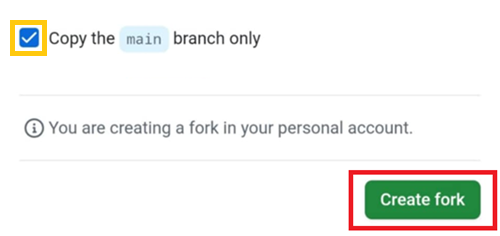
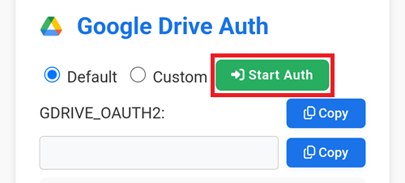
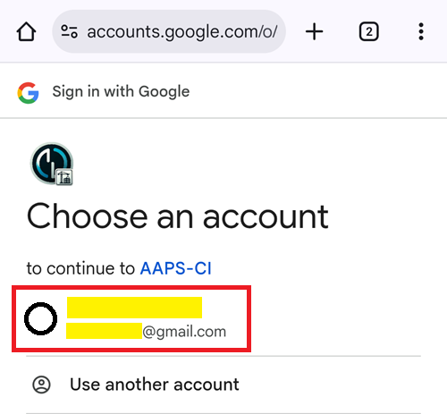
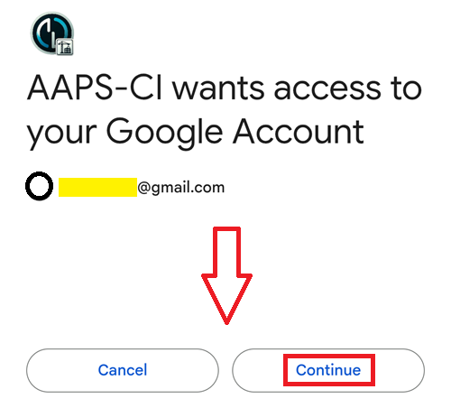
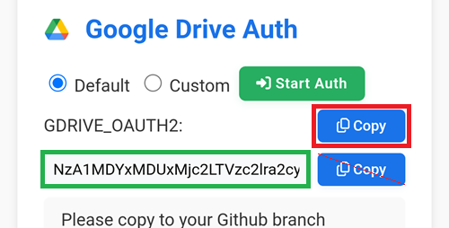
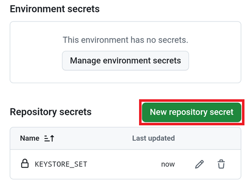
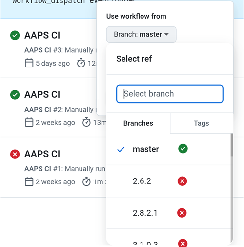
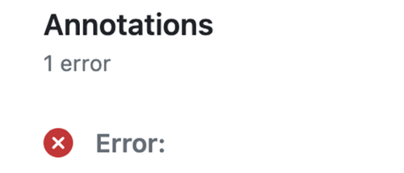
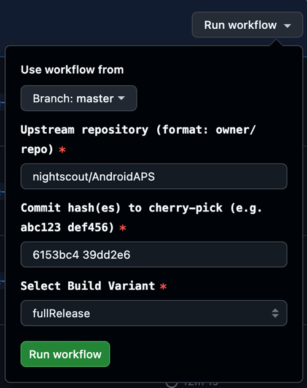

(browser-build)=

# Сборка через браузер

Сборка AAPS с использованием инструментов GitHub.

**Минимальная поддерживаемая версия AAPS - 3.3.2.1.**

## Постройте сами вместо скачивания

**The AAPS app (an apk file) is not available for download, due to regulations around medical devices. Построить приложение для собственного использования вполне законно, но передавать копию другим не разрешается!**

See [FAQ page](../UsefulLinks/FAQ.md) for details.

(Building-APK-without-a-computer)=

## Технические характеристики устройства и программного обеспечения для построения AAPS

Рекомендуется использовать устройства на базе Android. Компьютер или устройство на базе iOS тоже можно использовать.

Вам будет необходимо использовать несколько вкладок браузера и переключаться между ними. Например, в Chrome:


Также необходима учетная запись Google, чтобы сохранить свою сборку на гугл-диске.

```{note}
Эта документация предполагает, что вы используете свой смартфон и браузер Chrome.  
Вам придется переходить между вкладками: перед началом сборки закройте все открытые вкладки, чтобы не потеряться в процессе.
```

(github-fork)=

## 1. Своя ветка с AAPS

В GitHub вам необходимо держать в тайне свои личные ключи Android Java Key и Google Drive (позже мы объясним, как).

Так как это не может быть сделано внутри публичного репозитория AndroidAPS, вам нужно сделать вашу личную копию исходного кода (называемого веткой или форком).

### Учетная запись GitHub

Вам необходимо [создать учетную запись GitHub](https://github.com/signup), если у вас ее еще нет.   
Вы можете авторизоваться с помощью вашего e-mail'a или с попощью Google-акканута. Следуйте подсказкам при регистрации и верификации.

После того, как вы создадите учетную запись, [авторизуйтесь в GitHub](https://github.com/login).

### Ветка AndroidAPS

Откройте официальный репозиторий AndroidAPS с помощью [этой ссылки](https://github.com/nightscout/AndroidAPS).

Нажмите на иконку ветки. Это создаст копию репозитория в вашем аккаунте.


Прокрутите вниз до следующего экрана и нажмите **Создать Ветку (Create Fork)**.


*Примечание: вы можете **снять галку** "Copy the main branch only" (Копировать только основную ветку), если вы хотите собрать версию, находящуюся в разработке, или кастомизированную версию.*



```{note}
Вы не можете создать ветку и видите это?</br></br>
**`Create a new fork`**</br>
`A fork is a copy of a repository. Forking a repository allows you to freely experiment with changes without affecting the original project. View existing forks.`</br>
*`Required fields are marked with an asterisk (*).`*</br>
**`No available destinations to fork this repository.`**</br></br>
Это означает, что у вас уже есть ветка AndroidAPS.</br>
Убедитесь, что она актуальная и переходите к Подготовительным шагам.
```

```{warning}
**Никогда не удаляйте свою ветку без резервного копирования ваших паролей и секретов!**
```

Теперь GitHub отображает вашу персональную копию AndroidAPS. Оставить эту вкладку браузера открытой.


(aaps-ci-preparation)=

## 2. Подготовительные шаги

- Если вы используете устройство на базе Android, установите [File Manager Plus](https://play.google.com/store/apps/details?id=com.alphainventor.filemanager) из магазина Google Play.

```{admonition} File Manager Plus
:class: dropdown

:::{include} BrowserBuildFileManagerPlus.md
```

- Загрузите файл подготовки отсюда: [aaps-ci-preparation.html](https://github.com/nightscout/aaps-ci-preparation/releases/download/release-v1.1.2/aaps-ci-preparation.html)

````{admonition} Note
:class: note

1. Если вы открываете эту страницу из приложения (через веб-просмотр), файл HTML может не загрузиться. Скопируйте URL и откройте его в вашем браузере:
``text
https://github.com/nightscout/aaps-ci-preparation/releases/download/release-v1.2/aaps-ci-preparation.html
```
Или перейдите к странице со свежим релизом:
```text
https://github. om/nightscout/aaps-ci-preparation/releases/latest
```

2. Резервный файл, размещенный на этом сайте:

 - Если внешняя ссылка также недоступна, вы можете использовать этот резервный файл для загрузки.
<!--crowdin:disable-->

```{eval-rst}
.. raw:: html

    &nbsp;&nbsp;&nbsp;&nbsp;&nbsp;&nbsp;<a href="../_static/CI/aaps-ci-preparation.html" download>  aaps-ci-preparation.html</a>
```
<!--crowdin:enable-->
````
Для сборки AndroidAPS требуются закрытые ключи, которые хранятся в хранилище ключей Java (Java KeyStore, JKS):
- Если вы собираете AAPS впервые (или у вас нет Android Studio JKS) - следуйте инструкциям по ссылке [AAPS-CI Вариант 1 – Генерация JKS](#aaps-ci-option1) для завершения установки.
</br>

```{warning}
Сборка AAPS с помощью **Варианта 1** не позволит обновить уже имеющийся у вас AAPS.
Вам будет необходимо:
1. [Экспортировать настройки](#ExportImportSettings-Automating-Settings-Export) на ваш телефон.
2. Скопировать или загрузить файл настроек из телефона во внешнее хранилище (например: компьютер, облачный сервис хранения данных).
3. Создать новую версию подписанного apk, как описано во Варианте 1, и перенести ее на ваш телефон.
4. Удалить предыдущую версию AAPS.
5. Установить новую версию AAPS на телефон.
6. [Импортировать настройки](#ExportImportSettings-restoring-from-your-backups-on-a-new-phone-or-fresh-installation-of-aaps) для восстановления ваших целей и конфигурации.
7. Восстановить ваши данные из Nightscout'a.
```

- Если вы хотите использовать свой собственный JKS (тот, который вы использовали для сборки предыдущей версии AAPS на компьютере в Android Studio), вы знаете его пароль и псевдоним (key0) - выберите [AAPS-CI Вариант 2 – Загрузить Имеющийся JKS](#aaps-ci-option2).

</br>

После сборки приложение AAPS будет сохранено на вашем Google диске.

(aaps-ci-option1)=
### AAPS-CI Вариант 1 – Генерация JKS
 - Подходит тех, кто собирает приложение впервые, или не имеет JKS, или забыл пароль и/или псевдоним.
- Ниже приведены примеры для разных платформ.
- Выберите ниже вашу платформу: Android (предпочтительный вариант), iOS или компьютер.

```{tab-set}

:::{tab-item} Android
(aaps-ci-option1-android)=
:::{include} BrowserBuildO1A.md
:::  

:::{tab-item} iOS
(aaps-ci-ios-ipad)=
:::{include} BrowserBuildO1I.md
:::  

:::{tab-item} Компьютер
(aaps-ci-option1-computer)=
:::{include} BrowserBuildO1C.md
:::  

```

Пропустите следующий раздел и продолжайте [здесь](#aaps-ci-google-drive-auth).

---

(aaps-ci-option2)=

### AAPS-CI Вариант 2 – Загрузить имеющийся JKS
 - Подходит для пользователей, у которых уже есть JKS и они знают его пароль и псевдоним (Для `KEYSTORE_PASSWORD`, `KEY_ALIAS`, и `KEY_PASSWORD` введите ваши фактические пароль и псевдоним в GitHub - используйте те, что были в Android Studio, ниже показано, где вы их использовали.)

```{admonition} KEY + PASSWORDS
:class: dropdown


```

 - Ниже приведены примеры для разных платформ.
 - Выберите ниже вашу платформу: Android (предпочтительный вариант) или компьютер.


```{tab-set}

:::{tab-item} Android
(aaps-ci-option2-android)=
:::{include} BrowserBuildO2A.md
:::  

:::{tab-item} Компьютер
(aaps-ci-option2-computer)=
:::{include} BrowserBuildO2C.md
:::  

```

</br>

(aaps-ci-google-drive-auth)=

### AAPS-CI Авторизация Google Drive

```{warning}
Независимо от того, какому из предыдущих вариантов инструкций вы следовали (вариант 1 или вариант 2), вы ДОЛЖНЫ добавить авторизацию Google Drive, чтобы успешно использовать сборку через браузер.
```

Note: If you already followed this part in the video, you can now skip to [here](#github-build-apk).

Return to the File Explorer Plus tab.

Scroll down to the Google Drive Auth section and tap Start Auth.



Select your Google account.



Scroll down and accept the access. The web page needs it to obtain the Google Drive authentication key.

Tap Continue.



The `GDRIVE_OAUTH2` field will populate, tap the top Copy button.



Switch back to the GitHub tab.

Scroll down to Repository secrets and tap New repository secret.

If you followed Option 1 you should see this:



If you followed Option 2 there will be more keys:


In the Name field, paste the text you just copied. Use a long touch on the text box to show the paste menu.


Switch to the File Explorer Plus tab.

Tap the second Copy button.


Switch back to the GitHub tab.

1. In the Secret field, paste the text you just copied. Use a long touch on the text box to show the paste menu.

2. Tap Add secret.


You should have either two (option 1) or five (option 2) secrets entries now.


GitHub will now be able to store the AAPS apk file in your Google Drive, once built.

(github-build-apk)=
## AAPS-CI GitHub Actions to Build the AAPS APK
 - Suitable for general users.

```{tab-set}

:::{tab-item} Wiki
:::{include} BrowserBuildCIS.md
:::  

:::{tab-item} Video
<div align="center" style="max-width: 360px; margin: auto; margin-bottom: 2em;">
  <div style="position: relative; width: 100%; aspect-ratio: 9/16;">
    <iframe
      src="https://www.dailymotion.com/embed/video/x9rdwms?autoplay=0&queue-enable=false&loop=1"
      style="position: absolute; top: 0; left: 0; width: 100%; height: 100%;"
      frameborder="0"
      allowfullscreen>
    </iframe>
  </div>
</div>
:::  

```

### Build Version selection

**Only AAPS versions from 3.3.2.1 and above will build with the Browser method.**



(browserbuild-variant)=

### Build Variants selection

*Note: both Android and Android Wear apps will be built automatically.*

  - Select the variant you need:
    - fullRelease: For regular pump usage with full functionality.
    - [aapsclientRelease, aapsclient2Release](#RemoteControl_aapsclient): For caregivers (requires [Nightscout](../SettingUpAaps/Nightscout.md))。
    - pumpcontrolRelease: To replace your pump app/controller


Variants ending with “Debug” indicates that the APK will be built in debug mode, which is useful for developers for troubleshooting.

<!-- If you want to test the items in a pull request has been moved to dev page /AdvancedOptions/DevBranch.md -->

(aaps-ci-troubleshooting)=
## AAPS-CI Troubleshooting

(aaps-ci-preparation-web)=
### aaps-ci-preparation web page
  - When you open aaps-ci-preparation.html using a file manager, it will start a temporary local server on your phone to display the webpage and receive the Google refresh token.
  - If you see the screen below, it means you have been inactive for a while, and the file manager has already shut down the local server.
  - Please reopen aaps-ci-preparation.html using the file manager app and complete the remaining steps.

  

(aaps-ci-google-token-expired)=
### Google Refresh Token Expired
  - Google OAuth2 refresh tokens will expire if not used for 6 months, and may also become invalid under other conditions (e.g., you have changed your Google account password, or manually revoked access). For more details, see the [Google OAuth2 documentation](https://developers.google.com/identity/protocols/oauth2).
  - You will see an error indicating that the access token is invalid, as shown below:

  

  - If your build fails due to an expired or revoked Google refresh token, you will need to redo the [Google Drive Auth](#aaps-ci-google-drive-auth) steps to obtain a new `GDRIVE_OAUTH2` token and update the secret in your GitHub repository, then re-run the build workflow.

(aaps-ci-disable-software)=
### Disable Software That May Interfere With OAUTH Verification
  - Disable any VPN or security app (firewall, antimalware,...) on the phone before trying to get the OAUTH key.

(aaps-ci-actions-permission)=
### Check GitHub Actions Permission Settings
  - Make sure GitHub Actions policies are set to “Allow all actions and reusable workflows” (Settings → Actions → General).

  

`actions/checkout@v4` and `actions/setup-java@v4` are not allowed to be used in `xxxxx/AndroidAPS`. Actions in this workflow must be: within a repository owned by `xxxxx`

--------

```{warning}
Customizations are usually not necessary. This is for your information ony.
```

(github-cherry-pick)=

## If you want to add a specific commit to your branch, please use cherry-pick.

  

  - Use workflow from Branch: Please enter the branch name you want to cherry-pick to.
  - Upstream Repository: Please enter the repository name you want to cherry-pick from.
  - Commit SHA: Please enter the commit SHA you want to cherry-pick.(like git commit hash)
  - Select Build Variant: [variant](#browserbuild-variant)

(ci-keystore-export)=
## CI KeyStore Export

If you want to export your stored keystore, use this method.

This script will export your previously configured keystore information (from Option 1 or Option 2) as a password-protected ZIP file to the `/AAPS/KeyStore` directory in your Google Drive.

```{warning}
Before using this export method, make sure your keystore and Google Drive settings have been completed.
```

### Steps:

1. **Add ZIP Password Secret:**
   - Go to your repository's **Settings** → **Secrets and variables** → **Actions**
   - Click **New repository secret**
   - In the **Name** field, enter: `ZIP_PASSWORD`
   - In the **Secret** field, enter your custom ZIP encryption password
   - Use only English letters and numbers for the password (no special symbols)
   - Click **Add secret**

   

2. **Run Export Workflow:**
   - Go to the **Actions** tab in your repository
   - Select **CI KeyStore Export**
   - Click **Run workflow**
   - The exported keystore ZIP file will be saved to your Google Drive

   

   