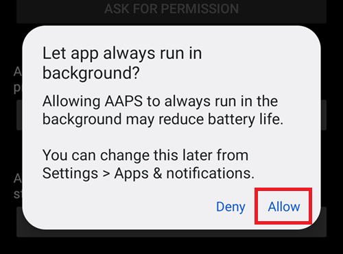
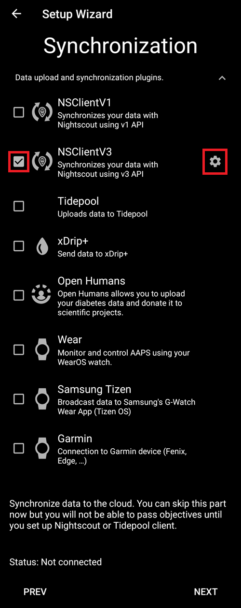
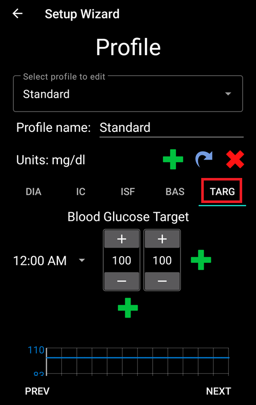
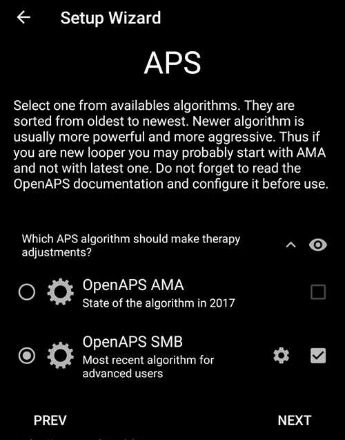

# Мастер установки AAPS

When you first start **AAPS** you are guided by the "**Setup Wizard**", to quickly setup all the basic configurations of your app in one go. **Setup Wizard** guides you, in order to avoid forgetting something crucial. For example, the **permission settings** are fundamental for setting up **AAPS** correctly.

However, it's not mandatory to get everything completely configured in the first run of using the **Setup Wizard** and you can easily exit the Wizard and come back to it later. There are three routes available after the **Setup Wizard** to further optimise/change the configuration. О них расскажем в следующем разделе. Итак, если пропустить некоторые этапы в мастере установки, их можно легко выполнить позже.

During, and directly after using the **Setup Wizard** you may not notice any significant observable changes in **AAPS**. To enable your **AAPS** loop, you have to follow the **Objectives** to enable feature after feature. You will start **Objective 1** at the end of the Setup Wizard. You are the master of **AAPS**, not the other way around.

```{admonition} Preview Objectives
:class: note
If you are keen to know the structure of the objectives, please read [Completing the objectives](../SettingUpAaps/CompletingTheObjectives.md) but then come back here to run the Setup Wizard first.

```

From previous experience, we are aware that new starters often put themselves under pressure to setup **AAPS** as fast as possible, which can lead to frustration as it is a big learning curve.

So, please take your time in configuring your loop, the benefits of a well-running **AAPS** loop are huge.

```{admonition} Ask for Help
:class: note
If there is an error in the documentation or you have a better idea for how something can be explained, you can ask for help from the community as explained at [Connect with other users](../GettingHelp/WhereCanIGetHelp.md).
```
## Приветственное сообщение

Это просто приветственное сообщение, которое можно пропустить, нажав кнопку "ДАЛЕЕ":


## Лицензионное соглашение

In the end user license agreement there is important information about the legal aspects of using **AAPS**. Внимательно изучите его.

If you don't understand, or can't agree to the end user license agreement please don't use **AAPS** at all!

Если вы понимаете и соглашаетесь, нажмите кнопку "I UNDERSTAND AND AGREE" (я принимаю и соглашаюсь) и следуйте подсказкам Мастера установки:


## Необходимые разрешения

**AAPS** needs some requirements to operate correctly.

In the following screen you are asked several questions you have to agree to, to get **AAPS** working. Мастер сам объясняет, почему он запрашивает соответствующие разрешения или настройки.

На этом экране мы даем дополнительную справочную информацию, переводим с технического языка на общий или объясняем причину. Continue reading below to see each permission request.


### Notifications

Android требует специального разрешения для уведомлений от приложений.

While it is a good feature to disable notifications _e.g._ from  social media apps, it is essential that you allow **AAPS** to send you notifications.

Please click the first "ASK FOR PERMISSION" button:


Выберите приложение "AAPS":


Включите "Разрешить поверх других приложений", сдвинув переключатель вправо:


Так выглядит переключатель во включенном положении:


### Battery optimization

Battery consumption on smartphones is a consideration, as the performance of batteries is still quite limited. Therefore, the Android operating system on your smartphone is restrictive about allowing applications to run and consume CPU time, and therefore battery power.

However, **AAPS** needs to run regularly, _e.g._ to receive the glucose readings every few minutes and then apply the algorithm to decide how to deal with your glucose levels, based on your specifications. Поэтому Android должен разрешить эти действия без препятствий.

Это делается при помощи подтверждения настроек.

Click the second "ASK FOR PERMISSION" button.


Выберите "Разрешить:



(setup-wizard-bluetooth-battery-optimisation)=
### Bluetooth battery optimisation

Newer versions of Android have added battery optimisation to the system Bluetooth application too.

As well as Disabling battery optimisation for **AAPS**, you will likely need to also disable this for the Bluetooth system app. Failure to do this may lead to pump connection dropouts and issues.

***NOTE: The xDrip documentation covers how to do this here: [xDrip documentation](https://navid200.github.io/xDrip/docs/BluetoothBatteryOpt.html)***

Follow these steps on Android 16, other versions will varies slightly from the provided screenshots:

1. Open Android settings and search for **Apps**, and open the Apps settings.

   

2. You will see the App settings, however we need to expand to see all apps, click on **See all apps** to expand.

   

3. As the Bluetooth app is a system app its hidden by default, we need to show system apps. Click on the **three dots (hamburger)** on the top left (1). Then click on **Show System** (2).

   

4. Search for the `Bluetooth` app and click on `Bluetooth` and/or `Legacy Bluetooth` if both are present ensure the procedure is followed for both.

   ***NOTE: It's safe to ignore the `Bluetooth MIDI Service` this is not used by AAPS***

           

   1. On Android 12 Click on `Battery`, Android 13+ Click on `App battery usage`,

   )   

5. On Android 12+ select the `Unrestricted` option, on Android 15+ you need to expand the `Allow background usage` setting, click on the section highlighted in red to do this then follow step 6 to complete.

       

6. On Android 16 Select `Unrestricted`

   

### Storage permission

**AAPS** needs to log information to the permanent storage of your smartphone. Постоянная память означает, что информация будет доступна даже после перезагрузки телефона. Остальная информация теряется, поскольку она не сохраняется в постоянной памяти.

Click the first "ASK FOR PERMISSION" button:


Нажмите "Разрешить":


Click "AAPS Directory". This opens the filesystem on your phone and allows you to choose where you want AAPS to store its information.


The default directory is **AAPS**, but you can use any dedicated directory of your liking. Create the directory if necessary, enter it, and choose "Use this folder":


Confirm that you wish to grant access to **AAPS** to the selected directory:


Нажмите кнопку «ДАЛЕЕ»:


### Location

Android links the use of Bluetooth communication to the ability to use location services. Возможно, вы замечали это у других приложений. It's common to need location permission if you want to access Bluetooth.

**AAPS** uses Bluetooth to communicate with your CGM and insulin pump if they are directly controlled by **AAPS** and not another app which is used by **AAPS**. Детали могут различаться в зависимости от настроек.

Click the first "ASK FOR PERMISSION" button:


Это важно. Otherwise **AAPS** can not work properly at all.

Выберите "При использовании приложения":


Click the second "ASK FOR PERMISSION" button:


Select "Allow all the time".


Нажмите кнопку «ДАЛЕЕ»:


## Master password

As the configuration of **AAPS** contains some sensitive data (_e.g._ API_KEY for accessing your Nightscout server) it is encrypted by a password you can set here.

The second sentence is very important, please **DO NOT LOSE YOUR MASTER PASSWORD**. Please make a note of it _e.g._ on Google Drive. Google Drive - хорошее место, так как он создан специально для подобных целей. Телефон или ПК могут выйти из строя, оставив нас без актуальной копии. If you forget your Master Password, it can be difficult to recover your profile configuration and progress through the **Objectives** at a later date.

После двукратного ввода пароля нажмите кнопку "Далее":


## Units (mg/dL <-> mmol/L)

Please select if your glucose values are in mg/dL or mmol/L and then please click the "NEXT" button:


## Параметры экрана

 Здесь выбираем диапазон значений, в котором хотим видеть свою гликемию. Его можно оставить заданным по умолчанию и отредактировать в дальнейшем.

Эти значения влияют только на графическое отображение ГК и больше ни на что.

Your glucose target _e.g._ is configured separately in your profile.

Величины для анализа TIR (времени в целевом диапазоне) конфигурируются отдельно при создании отчетов на сервере отчетов.

Нажмите кнопку «ДАЛЕЕ»:


(SetupWizard-synchronization-with-the-reporting-server-and-more)=
## Синхронизация с сервером отчетов и другие вопросы

Здесь вы настраиваете загрузку данных на сервер отчетов.

Здесь также можно выполнить другие настройки, но для первого запуска мы сосредоточимся на сервере отчетов.

Если вам неудобно заниматься этим в данный момент, пропустите их. Их можно сделать потом.

If you select an item here on the left tick box, on the right you can then ticking the visibility (eye) box, which will place this plugin in the upper menu on the **AAPS** home screen. Если на этом этапе вы настраиваете сервер отчетов, для него тоже выбирайте видимость.

В этом примере мы выберем Nightscout в качестве сервера отчетов и настроим его.

```{admonition}  **NSClient** version
:class: Note

Click [here](#version3200) for the release notes of **AAPS** 3.2.0.0 which explain the differences between the top option **NSClient** (this is "v1", although it is not explicitly labelled) and the second option, **NSClient v3**.
```
Для Tidepool проще, так как требуются только персональные данные для входа.

After making your selection, please press the cogwheel button next to the item you selected :



Здесь вы настраиваете сервер отчетов Nightscout.

Нажмите на "URL-адрес Nightscout":


Введите адрес вашего сайта URL Nightscout. Это просто URL-адрес, который вы настроили самостоятельно, или он был предоставлен поставщиком услуг Nightscout.

Нажмите кнопку "OK":


Enter your Nightscout access token. Это код доступа для Nightscout, настроенный вами. Без него доступа не будет.

If you don't have it at the moment please check the documentation for setting up the reporting server in the **AAPS** documentation.

After filling in the "**Nightscout access token**" and clicking "OK", please click on the "Synchronization" button:


Please select "Upload data to NS" if you already configured Nightscout in the previous steps of the Setup Wizard.

If you have stored profiles on Nightscout and want to download them to **AAPS**, enable "Receive profile store":


Вернитесь на предыдущий экран и выберите "Опции оповещения":


Пока что оставьте переключатели неактивными. We only walked to the screen to make you familiar with possible options you might configure in the future. В настоящий момент такой необходимости нет.

Вернитесь на предыдущий экран и выберите "Параметры подключения".

Здесь вы можете настроить способ передачи данных на сервер отчетов.

Caregivers must enable "use cellular connection" as otherwise the smartphone which serves the dependant/child can not upload data outside of WiFi range _e.g._ on the way to school.

Other **AAPS** users can disable the transfer via cellular connection if they want to save data or battery.

Если сомневаетесь, просто оставьте все включенным.

Вернитесь на предыдущий экран и выберите "Дополнительные настройки".


Включите "Передать в NS запись о начале работы приложения", если хотите получить эту информацию на сервере отчетов. Это может помочь вам удаленно узнать, было ли перезапущено приложение и когда именно, особенно если вы лицо, осуществляющее уход.

It might be interesting to see if **AAPS** is correctly configured now, but later it is usually not that important to be able to see **AAPS** stopping or starting in Nightscout.

Включите "Создавать оповещение на основе названия ошибки" и "Создавать оповещения из напоминаний о необходимых углеводах".

Оставьте "Замедлить выгрузку" невключенным. You would only use it in unusual circumstances if for example a lot of information is to be transferred to the Nightscout server, and the Nightscout server is being slow in processing this data.

Go back twice, to the list of plugins and select "NEXT" to go to the next screen:


## Patient name

Here you can setup your name in **AAPS**.

Можете выбрать любое. Это нужно, чтобы различать пользователей.

Для просты, введите имя и фамилию.

Нажмите "ДАЛЕЕ" и перейдите к следующему экрану.


## Patient type

Here you select your "Patient type" which is important, as the **AAPS** software has different limits, depending on the age of the patient. Это важно по соображениям безопасности и как мера предосторожности.

Here is where you also configure the **maximum allowed bolus** for a meal. То есть, самый большой болюс, который можно ввести на свои обычные блюда. Это мера безопасности, которая помогает избежать случайной передозировки, когда вводится болюс на еду.

Второе ограничение аналогично по концепции, но относится к максимальному ожидаемому потреблению углеводов.

После установки этих значений нажмите "ДАЛЕЕ" и перейдите на следующий экран:


## Применяемый инсулин

Выберите тип инсулина, используемого в помпе.

Названия инсулинов должны быть самоочевидными.

```{admonition} Don't use the "Free-Peak Oref" unless you know what you are doing
:class: danger
For advanced users or medical studies there is the possibility to define with "Free-Peak Oref" a customised profile of how insulin acts. Please don't use it unless you are an expert, usually the pre-defined values work well for each branded insulin.
```

Нажмите "ДАЛЕЕ" и перейдите к следующему экрану:


## Источник ГК

Выберите используемый вами источник ГК Please read the documentation for your [BG source](../Getting-Started/CompatiblesCgms.md).

Поскольку доступно несколько вариантов, мы не объясняем здесь конфигурацию каждого. We are using xDrip+ in our example here:


Enable the visibility in the top level menu by clicking the check box on the right side.

После установки этих значений нажмите "ДАЛЕЕ" и перейдите на следующий экран:


Click on the cogwheel button to access the settings.

Включите «Загружать данные ГК в NS» и «Вносить запись о замене сенсора в NS».

Go back and press "NEXT" to go to the next screen:


(setup-wizard-profile)=
## Profile

Теперь мы переходим к очень важной части мастера установки.

Please read the documentation about [profiles](../SettingUpAaps/YourAapsProfile.md) before you try to enter your profile details on the following screen.

```{admonition} Working profile required - no exceptions here !
:class: danger
An accurate profile is necessary to control the safe action of **AAPS**.

It's required that you have determined and discussed your profile with your doctor, and that it has been proven to work by successful basal rate, ISF and IC testing!

If a robot has an incorrect input it will fail - consistently. **AAPS** can only work with the information it is given. If your profile is too strong, you risk hypoglycemia, and if it is too weak, you risk hyperglycemia. 
```

Нажмите "ДАЛЕЕ" и перейдите к следующему экрану. Введите "название профиля":


В дальнейшем при необходимости можно настроить несколько профилей. Мы здесь создадим только один.

```{admonition} Profile only for tutorial - not for your usage
:class: information
The example profile here is only to show you how to enter data.

It is not intended to be an accurate profile or something very well optimised, because each person's needs are so different.

Don't use it for actually looping!
```

Enter your [Duration of insulin Action (DIA)](#your-aaps-profile-duration-of-insulin-action) in hours. Затем нажмите "IC" (углеводный коэффициент):


Enter your [IC](#your-aaps-profile-insulin-to-carbs-ratio) values:


Нажмите "ISF" (фактор чувствительности к инсулину). Enter your [ISF values](#your-aaps-profile-insulin-sensitivity-factor):


Нажмите "БАЗАЛ". Enter your [basal values](#your-aaps-profile-basal-rates):


Нажмите "ЦЕЛЬ". Введите целевые значения сахара в крови.

For open looping this target can be a wider range, as otherwise **AAPS** notifies you permanently to change the temporary basal rate or another setting, which can be exhausting.

Позднее для замкнутого цикла у вас обычно будет одно значение для верхней и нижней границы. That makes it easier for **AAPS** to hit the target and give you better overall diabetes control.

Введите/подтвердите целевые значения:



Сохраните профиль, нажав "СОХРАНИТЬ":


After saving, a new button "Activate Profile" appears.

```{admonition} Several defined but only one active profile
:class: информация
Можно иметь несколько заданных профилей, но в каждый данный момент активен только один.
```

Нажмите "Активировать профиль":


Появляется диалог смены профиля. В этом случае он останется как предустановленный.

```{admonition} Several defined but only one active profile
:class: информация
В дальнейшем вы узнаете, как пользоваться этим диалогом в таких ситуациях, как болезнь или спорт, когда есть необходимость изменить профиль.
```


Нажмите "OK":


Появляется диалог подтверждения смены профиля.

Подтвердите нажав кнопку "OK". Нажмите "ДАЛЕЕ" и перейдите к следующему экрану:


Ваш профиль установлен:


## Инсулиновая помпа


Теперь выберем инсулиновую помпу.

Появится важный диалог предупреждения. Прочитайте его и нажмите "OK".

Если ваш профиль уже установлен на предыдущих шагах и вы знаете, как подключить помпу, сделайте это сейчас.

Otherwise, leave the Setup Wizard, using the arrow in the top left corner and let **AAPS** first show you some blood glucose values. Вы можете вернуться к этому в любое время или использовать один из параметров прямой конфигурации (минуя мастер).

Please read the documentation for your [insulin pump](../Getting-Started/CompatiblePumps.md).

Нажмите "ДАЛЕЕ" и перейдите к следующему экрану.


В данном случае мы выберем "Виртуальную помпу".

Нажмите "ДАЛЕЕ" и перейдите к следующему экрану:


## APS algorithm

Примените алгоритм OpenAPS SMB. Despite the name the SMB feature of the algorithm is disabled until you are familiar with AAPS and already worked through the first objectives. В любом случае алгоритм OpenAPS SMB новее и лучше по сравнению с OpenAPS AMA.

Причина, по которой SMB отключён в начале, заключается в том, что функция SMB позволяет быстрее реагировать на увеличение сахара в крови через супермикроболюсы, а не повышать базальную скорость. As in the beginning your profile is in general not as good as after some time of experience the feature is disabled in the beginning.

```{admonition} Only use the older algorithm **OpenAPS AMA** if you know what you are doing
:class: information
OpenAPS AMA is the most basic algorithm which does not support micro boluses to correct high values. There might be circumstances where it is better to use this algorithm but it is not the recommendation.
```

Press the cogwheel to see the details:




Только прочтите текст и ничего не меняйте.

Due to the limitations which are imposed by the **Objectives** you can't use either "closed loop" or "SMB features" at the moment anyway.

Go back and press "NEXT" to go to the next screen:


## Определение чувствительности

Let "Sensitivity Oref1" the standard for the sensitivity plugins selected.

Нажмите "ДАЛЕЕ" и перейдите к следующему экрану:


## Начните выполнение Цели 1

Здесь вы приступаете к Целям. The qualification for access to further **AAPS** features.

Здесь мы запускаем цель 1, даже если на данный момент наши настройки не полностью готовы к завершению этой цели.

Но это – начало.

Нажмите на зеленую надпись "СТАРТ" для запуска Цели 1:


Вы видите, что уже добились определенного прогресса, но другие области еще не завершены.

Нажмите "ГОТОВО" и перейдите к следующему экрану.


You are coming to the home screen of **AAPS**.

Here you find the information message in **AAPS** that you set your profile.

Это было сделано при переходе на наш новый профиль.

Нажмите "УБРАТЬ ОПОВЕЩЕНИЕ" и оно исчезнет.


If you accidentally leave the Setup Wizard at any point, you can either simply re-start the Wizard, or change the [configuration of the AAPS loop](../SettingUpAaps/ChangeAapsConfiguration.md) manually.

If your **AAPS** loop is now fully setup, please move on to the next section ["Completing the objectives"](../SettingUpAaps/CompletingTheObjectives.md).