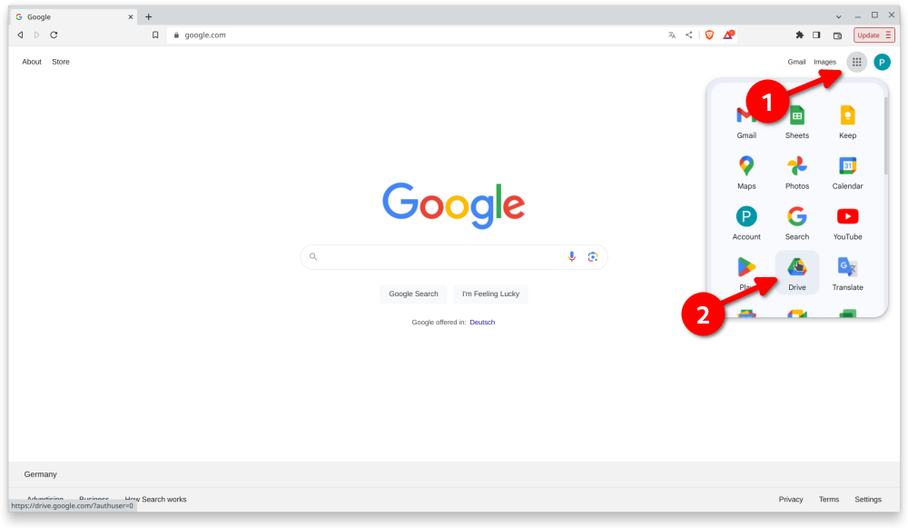
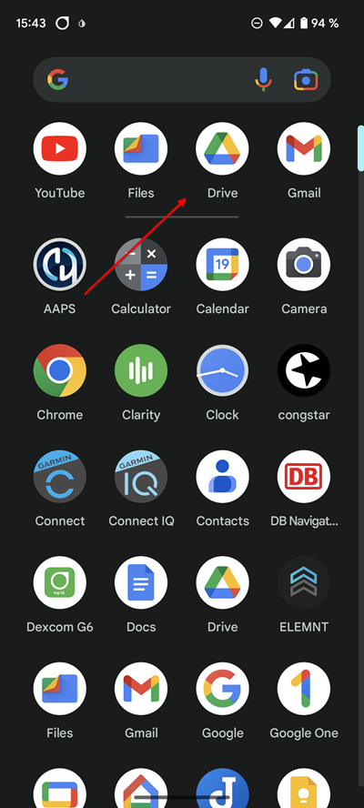
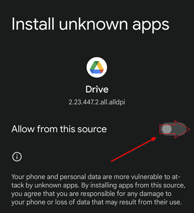

# Перенос и установка AAPS на смартфон

In the previous section, [building **AAPS**](../SettingUpAaps/BuildingAaps.md), you built the **AAPS** app (which is an .apk file) on a computer.

The next steps are to **transfer** the **AAPS** APK file (as well as other apps you may need, like BYODA, Xdrip+ or another CGM reciever app) to your Android smartphone, and then **install** the app(s).

Following installation of **AAPS** on the smartphone, you will then be able to move onto [**configuring the AAPS loop**](../SettingUpAaps/SetupWizard.md).

There are several ways to transfer the **AAPS** APK file from your computer to the smartphone. Здесь мы объясняем два различных способа:

* Способ 1 - при помощи Google диска (Gdrive)
* Способ 2 - при помощи USB-кабеля

Обратите внимание, что передача по почте не рекомендуется.

## Вариант 1. Использовать диск Google для передачи файлов

Open [Google.com](https://www.google.com/) in your web browser and login to your Google Account.

В правой верхней части выберите приложение Drive в меню Google.



Щелкните правой кнопкой мыши в свободной зоне под файлами и папками в приложении Google Drive и выберите "Загрузить файл".


Файл apk будет загружен на Google Drive.


### Use the Google Drive app to execute the apk file for installation

Перейдите в мобильный телефон и запустите приложение Google Drive. Это предварительно установленное приложение и находится где расположены другие приложения Google, а также может быть найдено утилитой поиска.



Запустите установку apk двойным щелчком мыши по имени файла в Google Drive App на мобильном телефоне.


В случае, если вы получили уведомление безопасности, что вам запрещено устанавливать приложения из Google Driver, дайте разрешите на этот раз и отключите его впоследствии, поскольку постоянное разрешение представляет угрозу безопасности.




После установки этот шаг завершен.

you should see the **AAPS** icon and be able to open the app.

```{warning}
**ВАЖНОЕ НАПОМИНАНИЕ БЕЗОПАСНОСТИ**
Вы не забыли отменить разрешение на установку приложений из Google Drive?
```

Please go on with [configuring the AAPS loop](../SettingUpAaps/SetupWizard.md).

## Вариант 2. Использовать кабель USB для передачи файлов
The second way to transfer the AAPS apk file is with a  [USB cable](https://support.google.com/android/answer/9064445?hl=en).

Переместите файл с места расположения на компьютере в папку "Загрузки" на телефоне.

На телефоне необходимо разрешить установку из неизвестных источников. Explanations of how to do this can be found on the internet (_e.g._ [here](https://www.expressvpn.com/de/support/vpn-setup/enable-apk-installs-android/) or [here](https://www.androidcentral.com/unknown-sources)).

После того, как вы перетащите файл в папку загрузок откройте папку "downloads" на телефоне, нажмите на значок установочного файла AAPS apk и выберите команду "install" (установить). You can then proceed to the next step, [Setup Wizard](../SettingUpAaps/SetupWizard.md), which will help you setup the **AAPS** app and loop on your smartphone.

Please go on with [configuring the AAPS loop](../SettingUpAaps/SetupWizard.md).