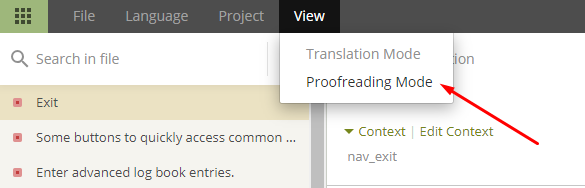
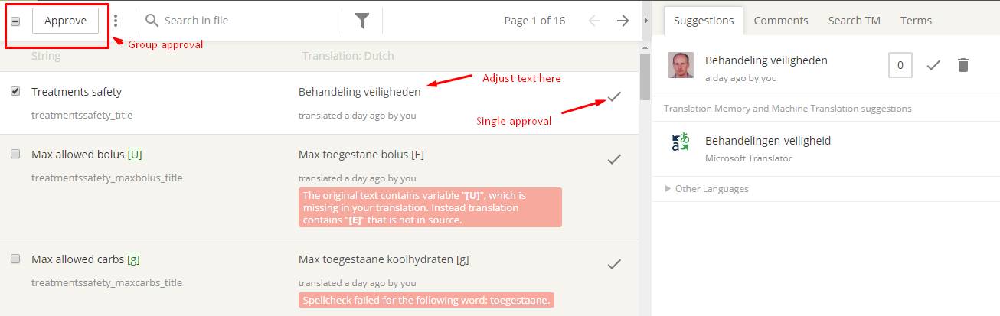

# Как переводить интерфейс AndroidAPS или статьи документации

* Для перевода текста в интерфейсе приложения пройдите по ссылке <https://crowdin.com/project/androidaps> и залогиньтесь с помощью вашей учетной записи GitHub
* Для перевода статей документации перейдите по ссылке <https://crowdin.com/project/androidapsdocs> и залогиньтесь, используя вашу учетную запись GitHub

* Запросите участие в команде составителей документации. Для этого кликните по флагу желаемого языка, а затем нажмите кнопку "Join" ("Присоединиться") в правом верхнем углу следующей страницы. Пожалуйста, укажите свой язык, сообщите немного информации о себе, своем опыте с AAPS, о том, какую роль хотите получить - переводчика (translator) или корректора (proofreader) (указывайте корректора только если вы имеете опыт в переводах + опытный пользователь AAPS).

```{admonition} Ожидание одобрения :class: note

Одобрение выполняется человеком. Как некоммерческая организация мы не выставляем какие-либо сроки, но обычно одобрение занимает меньше 1 дня. Если вы не получили одобрения - пожалуйста, обратитесь к команде документации через Facebook или Discord (русскоязычные пользователи могут написать в группу AndroidApsGroup в Telegram).

    <br />* When we approve you, click the flag
       
    
    ## Translation of the app
    
    (translations-translate-strings-for-AAPS-app)=
    ### Translate strings for AAPS app
    
    * If you have no preference for strings you translate just select the "Translate All" button to start. Если вы не настроили строки, которые хотите переводить - для начала нажмите кнопку "Translate All" ("Перевести всё"). Отобразятся требующие перевода строки.
    
       
    
    * If you want to translate an individual file please search for the file via search dialog or tree structure and click on the filename to start the translation work on strings in that file.
    
       
    
    * Translate sentences on left side by adding new translated text or use & edit suggestion 
    
       
    
    
    ### Proofread strings for AAPS app
    
    * Proofreaders start by selecting "Proofread" when starting from the language home screen.
    
        
    
    
      and approve translated texts 
    
       
    
    When a proofreader approves a translation it will be added to the next version of AAPS.
    
    (translations-translation-of-the-documentation)=
    ## Translation of the documentation
    
    * Click the name of the docs page you want to translate
    
    
    
    
    * Translate sentences by sentence
    
        1. Желтым выделен текст, над которым вы сейчас работаете.
    
        1. Зеленым - уже переведенный текст. Вам не требуется переводить его.
    
        1. Красным выделен текст, который еще не переведен.
    
        1. Оригинал текста, над которым вы сейчас работаете. Ваш перевод. Вы можете скопировать текст из поля выше или выбрать один из предложенных ниже.
    
        1. Имеющиеся варианты перевода. Здесь также можно увидеть, насколько платформа Crowdin оценивает этот перевод как подходящий, или ситуацию, когда перевод был сделан ранее и текст был реорганизован без изменения содержания.
        1. Нажмите кнопку "save" ("Сохранить") чтобы сохранить свое предложение перевода. После этого ваш вариант будет доступен для финальной оценки корректором.
    
    
    
    * A translated page will not be published in docs before 
    
        1. перевод не будет одобрен корректором. не закончится синхронизация между Crowdin и Github (раз в час), которая создает PR (pull request) для Github.
    
        1. PR в Github не будет одобрен.
    
    В среднем вся процедура занимает от 1 до 3 дней, но в выходные и праздники могут быть задержки.
    
    ### Перевод ссылок
    
    ```{admonition} Ссылки больше не переводятся
    :class: note
    
    Ссылки больше не переводятся. Раньше здесь был соответствующий раздел, однако он исчез с переходом на Markdown и myst_parser. Метки создаются на английском и распространяются автоматически на другие языки.
    
    

Вы переводите текст ссылки, отображаемый пользователю. Пожалуйста, будьте внимательны и **не** удаляйте ссылки, расположенные внутри тегов `<0></0>` или других пар чисел, если ссылок на странице несколько.

Корректорам следует обращать особое внимание вопросу правильности ссылок!

### Корректура

* Корректоры должны переключиться в режим Proofreading
    
    
    
    и одобрить переведенный текст
    
    

* Когда корректор одобрит перевод, последний будет добавлен в ближайшую сборку документации. Определенного расписания сборок нет, но они происходят примерно каждую неделю, исключая праздники. Для ускорения процесса вы можете проинформировать команду о появлении нового перевода.