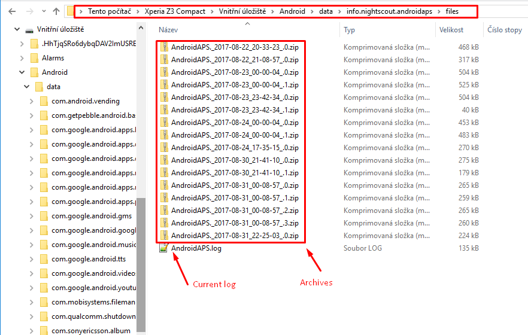

# Чтение лог-файлов

* Подключите телефон к компьютеру в режиме передачи файлов
* Найдите лог-файлы в этой директории или аналогичной (может немного отличаться на разных телефонах)

* Текущий журнал-это файл .log, который можно просмотреть разными способами, например как [ LogCat ](https://developer.android.com/studio/debug/am-logcat.html) в Android Studio, через Android-приложение Log Viewer или просто как обычный текст. Предыдущие файлы журналов архивируются и хранятся в папках по датам/времени. Отправляя журнал в [ gitter ](https://gitter.im/MilosKozak/AndroidAPS) при сообщении о потенциальной ошибке, распакуйте и отправьте папку с датой перед возникновением ошибки.