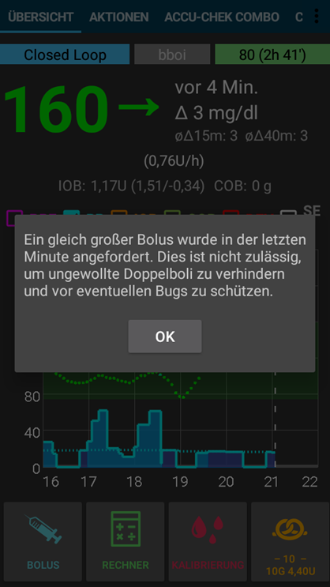

# Советы для пользователей Accu-Chek Combo

**NOTE:** Starting with AAPS version 3.2, a [new Combo driver](../Configuration/Accu-Chek-Combo-Pump-v2.md) (referred to as "combov2" sometimes) has been added. The old driver is also referred to as the "Ruffy-based driver". Some parts of this document only apply to the old driver. These will be annotated accordingly.

## Как обеспечить бесперебойную работу

* Всегда ** носите смартфон с собой **, оставляя его рядом с кроватью ночью. Так как помпа может оказаться за или под вами во время сна, лучше всего оставлять ее где-то повыше (на полке).
* Always make sure that the pump battery is as full as possible. See the battery section for tipps regarding the battery.

* (Only applies to the old driver) It is best to **not touch the app ruffy** while the system is running. If the app is started again, the connection to the pump can break off. Once the pump is connected to ruffy, there is no need to re-connect. Even after a restart of the phone, the connection is automatically re-established. If possible, move the app to an unused screen or in a folder on your smartphone so you do not accidentally open it.

* (Only applies to the old driver) If you unintentionally open the app ruffy during looping, it's best to restart the smartphone right away.
* Whenever possible, only operate the pump via the AAPS app. To facilitate this, activate the key lock on the pump under **PUMP SETTINGS / KEY LOCK / ON**. Кнопками помпы следует пользоваться только при замене батареи или картриджа. 

## Помпа недоступна. Что делать?

### Активируйте сигнализацию "помпа недоступна"

* In AAPS, go to **Settings / Local Alarms** and activate **alarm when pump is unreachable** and set **pump not reachable limit [Min]** to **31** minutes.
* Это даст вам достаточно времени, чтобы не активировать сигнал при выходе из помещения, пока телефон останется на столе, но информирует вас, если помпа не может быть достигнута на время, превышающее длительность временного базала.

### Восстановление доступности помпы

* When AAPS reports a **pump unreachable** alarm, first release the keylock and **press any key on the pump** (e.g. "down" button). As soon as the pump display has turned off, press **Refresh** on the **Combo Tab** in AAPS. В большинстве случаев связь с помпой восстанавливается.
* If that does not help, reboot your smartphone. After the restart, AAPS will be reactivated and a new connection will be established with the pump. If you are using the old driver, ruffy will be reactivated as well.

* The tests with different smartphones have shown that certain smartphones trigger the "pump unreachable" error more often than others. [AAPS Phones](https://docs.google.com/spreadsheets/d/1gZAsN6f0gv6tkgy9EBsYl0BQNhna0RDqA9QGycAqCQc/edit) lists successfully tested smartphones.

### Причины и последствия частых ошибок связи

* On phones with **low memory** (or **aggressive power-saving** settings), AAPS is often shut down. Это можно определить по тому, что кнопки Bolus и Calculator не присутствуют на главном экране при запуске AAPS, так как система инициализируется. Это может привести к оповещениям "помпа недоступна" при запуске. In the **Last Connection** field of the Combo tab, you can check when AAPS last communicated with the pump.

* Эта ошибка может ускорить понижение заряда батареи помпы, так как профиль базала считывается из помпы при перезапуске приложения.
* Кроме того, это увеличивает вероятность возникновения ошибки, которая заставляет помпу отклонять все входящие соединения до тех пор, пока на помпе не будет нажата кнопка. 

## Отмена временной базальной скорости не выполнена

* Occasionally, AAPS can not automatically cancel a **TBR CANCELED** alert. Then you have to either press **UPDATE** in the AAPS **Combo tab** or the alarm on the pump will need to be confirmed.

## Особенности работы батареи помпы

### Замена батареи

* После сигнала оповещения ** низкий заряд батареи ** батарея должна быть заменена как можно скорее, чтобы всегда иметь достаточно энергии для надежной связи Bluetooth со смартфоном, даже на большом удалении от помпы.
* Даже после оповещения ** низкий заряд батареи ** батарея может прослужить еще значительное время. Тем не менее, рекомендуется всегда иметь с собой свежую батарею после оповещения "низкий заряд".
* Перед заменой батареи, нажмите на символ **Цикл** на главном экране и выберите **приостановить цикл на 1ч**. 
* Подождите, пока помпа завершит обмен с телефоном и исчезнет логотип Bluetooth на помпе.

* Разблокируйте кнопки на помпе, переведите ее в режим остановки, подтвердите возможно отмененный временный базал, и замените батарею.
* When using the old driver, if the clock on the pump did not survive the battery chenge, re-set the date and time on the pump to exactly the date/time on your phone running AAPS. (The new driver automatically updates the pump's date and time.)
* Затем переведите помпу в рабочий режим и выберите ** Возобновить ** при длинном нажатии на ** Приостановлено ** на главном экране.
* AAPS will re-set a necessary temporary basal rate with the arrival of the next blood sugar value.

(Accu-Chek-Combo-Tips-for-Basic-usage-battery-type-and-causes-of-short-battery-life)=

### Типы батарей и причины их короткой жизни

* Поскольку интенсивная связь Bluetooth потребляет много энергии, пользуйтесь только ** высококачественными батареями **, такими как Energizer Ultimate Lithium, Power One" из "большого" сервисного набора Accu-Chek, или, если вы собираетесь пользоваться перезаряжаемым аккумулятором, используйте аккумуляторы Eneloop. 

 

Ranges for typical life time of the different battery types are as follows:

* **Energizer Ultimate Lithium**: от 4 до 7 недель
* ** Power One Alkaline ** (Varta) из сервисного набора: 2-4 недели
* Перезаряжаемые батареи ** Eenlook ** (BK-3MCCE): от 1 до 3 недель

If your battery life is significantly shorter than the ranges given above, please check the following possible causes:

* (Only applies to the old driver) Versions of the [ruffy App](https://github.com/MilosKozak/ruffy) after vMarch 2018 significantly improved pump battery lifetime. Убедитесь, что у вас самая свежая версия ruffy, если есть проблемы с коротким сроком жизни батареи.
* Есть некоторые варианты закручивающегося колпачка батарейного отсека помпы Combo, которые частично замыкают батарейку и быстро ее истощают. Колпачки без этой проблемы можно узнать по золотым металлическим контактам.
* Если часы помпы не "выдерживают" быстрой замены батареи, то, скорее всего, сломался конденсатор, который поддерживает работу часов во время краткочного отключения питания. В этом случае поможет только замена помпы Roche, что не является проблемой в течение гарантийного срока. 
* Аппаратное и программное обеспечение смартфона (операционная система Android и модуль Bluetooth) также влияют на время работы батареи помпы, хотя точные факторы пока неясны. Если у вас есть возможность, попробуйте другой телефон и сравните время жизни батареи.

## Переход на летнее время

**NOTE**: The new driver automatically sets date and time and handles daylight saving time changes on its own. The steps below all only apply to the old driver.

* В настоящее время драйвер combo не поддерживает автоматическую корректировку времени помпы.
* В течение ночи перехода на летнее/зимнее время смартфон обновляется, но время на часах помпы остается неизменным. Это приводит к срабатыванию оповещения из-за разницы времени между системами в 3 часа утра.
* Если вы не хотите просыпаться ночью, ** деактивируйте автоматический переход на летнее время на мобильном телефоне ** вечером перед переходом и скорректируйте время вручную на следующее утро. Хороший способ решения вопроса о перееходе времени - переключиться на другой часовой пояс, расположенный на вашей же долготе, но ближе к экватору, где обычно не применяют переход на летнее/зимнее время. Пример: Для Центральной Европы летнее время (CEST/GMT+2), в ночь перед переходом на зимнее время можно переключиться на часовой пояс Зимбабве, а затем на следующее утро вернуться к центральноевропейскому времени CET/GMT+1 при одновременной смене времени на помпе. И наоборот, можно в зимнее время переключиться на часовой пояс Нигерии CET/GMT+1 и после перехода на летнее время вернуться к центральноевропейскому летнему времени (CEST/GMT+2), соответственно изменив время на помпе. Чтобы найти подходящую страну, смотрите здесь https://www.timeanddate.com/time/map/,.

## Пролонгированный болюс, многоволновый болюс

The OpenAPS algorithm does not support a parallel extended bolus or multiwave bolus. But a similar treatment can be achieved by the following alternatives:

* Используйте **e-Carbs** при занесении углеводов или использовании калькулятора путем ввода всех углеводов целого блюда и расчетного времени их поступления в кровь в виде глюкозы. Затем система вычислит мелкие углеводы, равномерно распределенные на всю продолжительность, что приведет к тому, что алгоритм обеспечит эквивалентную дозировку инсулина, при этом постоянно проверяя общее увеличение/снижение уровня глюкозы в крови. При использовании многоволнового болюса можно комбинировать меньший болюс, поданный немедленно, с растянутыми углеводами e-carbs. 
* Before eating, on the **Actions tab** in AAPS set as a temporary **Eating Soon** goal with target glucose 80 for several hours. Продолжительность должна основываться на интервале, который вы выбрали бы для пролонгированного болюса. Это будет держать цель ниже, чем обычно, и поэтому увеличит количество поданного инсулина.
* Затем воспользуйтесь **Калькулятором** и введите общее количество принимаемых углеводов, но непосредственно не применяйте значения, предлагаемые калькулятором болюса. Если предполагается болюс двойной волны, снизьте дозировку инсулина. Чтобы противодействовать росту ГК, в зависимости от пищи, алгоритм обеспечит дополнительные микроболюсы SMB или более высокую временную скорость базала. В данном случае ограничение безопасности для базала должно быть тщательно изучено и, при необходимости, временно изменено.

* If you are tempted to just use the extended or multiwave bolus directly on the pump, AAPS will penalize you with disabling the closed loop for the next six hours to ensure that no excess insulin dosage is calculated.

## Сигналы оповещений при подаче болюса

* If AAPS detects that an identical bolus has been successfully delivered at the same minute, bolus delivery will be prevented with identical numer of insulin units. Если вы действительно хотите подать одинаковое количество инсулина за короткий промежуток времени, просто подождите еще две минуты, а затем снова подайте болюс. Если первый болюс был прерван или не был подан по другим причинам, вы можете сразу же повторно дать болюс (начиная с версии AAPS 2.0.).
* Такое оповещение есть механизм безопасности, который считывает историю помпы, прежде чем подавать новый болюс, чтобы правильно вычислить активный инсулин IOB, даже когда болюс подается непосредственно с помпы. Он не позволяет неразличимые записи.

* Этот механизм также предотвращает другую причину ошибок: если во время использования калькулятора болюса с помпы подается другой болюс и тем самым меняется история болюсов, то основа расчета болюса становится неверной, и болюс отменяется. 

