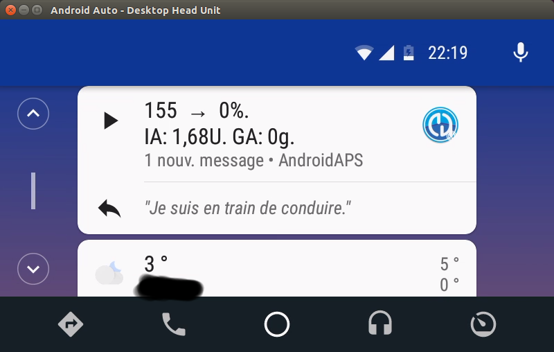

# Android Auto

Как это выглядит:

Как пользоваться:

* Установите Android Studio
* В приложении Android Auto нажмите на сендвич-меню (три горизонтальных линии)
* Выберите О приложении.
* Нажимайте заголовок Android Аuto 10 раз, до тех пор, пока появится сообщение «Включен режим разработчика».
* Теперь вы можете получить доступ к режиму разработчика, выбрав точки меню в верхнем правом углу экрана и перейдя в настройки для разработчиков.
* Выберите неизвестные источники (прокрутка к нижней части списка).
* Теперь можно выйти из режима разработчика. Чтобы сделать это, нажмите на три точки меню вверху справа.

Устранение неполадок:

* Если вы не видите уведомления, проверьте, разрешили ли вы AAPS показывать уведомления в Android и имеет ли Android Auto права доступа к уведомлениям.