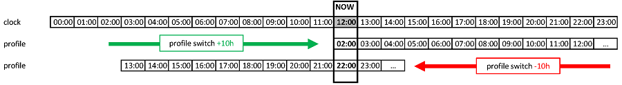

(Profiles-profile-switch)=

# Profile switch/смена профиля

Documentation about profiles in general can be found at [Config Builder - profile](Config-Builder-profile).

On starting your AAPS and selecting your profile, you will need to do a "Profile switch" event with zero duration (explained later). By doing this AAPS starts tracking history of profiles and every new profile change requires another "Profile switch" even when you change content of the profile in NS. Updated profile is pushed to AAPS immediately, but you need to switch the same profile again to start using these changes.

Internally AAPS creates snapshot of profile with start date and duration and is using it within selected period.

* Нулевая длительность означает постоянную работу. Такой профиль действителен до нового "переключения профиля".
* Продолжительность х минут означает х минут использования этого профиля. После этой процедуры профиль переключается обратно на предыдущий валидный "Переключатель профиля".

If you edited your profile inside the "local profile" tab you can activate the profile there which makes an implicit profile switch too.

To do a profile switch long-press on the name of your profile ("Tuned 03/11" in the picture below) on the homescreen of AndroidAPS.

Within the "profile switch" you can choose two additional changes which used to be part of the Circadian Percentage Profile:

## Процент

* Это применяет одинаковый процент ко всем параметрам. 
* Если установить его на 130% (то есть вы на 30% более инсулинорезистентны), то он повысит базальную скорость на 30%. Кроме того, соответственно снизится чувствительность к инсулину ISF и соотношение инсулин-углеводы (делятся на 1.3 в данном примере).
  
  

* Эти установки будут отправлены в помпу, а затем будут использоваться по умолчанию.

* Алгоритм цикла (открытый или закрытый) продолжит работу на основе выбранного процентного профиля. Так, отдельные процентные профили могут быть установлены для различных этапов гормонального цикла.

(Profiles-time-shift)=

## Сдвиг по времени

* Эта установка позволяет сместить профиль на введенное число часов. 
* Так, например, когда работаете в ночные смены, сдвиньте время в ту сторону, насколько позже/раньше вы ложитесь спать или просыпаетесь.
* Всегда возникает вопрос о том, какие настройки профиля должны сменить текущие. Это время должно быть сдвинуто на х часов. Следуйте инструкции, описанной в данном примере: 
  * Текущее время: 12:00
  * **Сдвиг в сторону увеличения** времени 
    * 2:00 ** + 10 ч **-> 12:00
    * Вместо параметров, обычно используемых в 12:00, из-за положительного сдвига времени будут использоваться параметры от 2:00.
  * **Сдвиг в сторону уменьшения ** времени 
    * 22:00 ** -10 ч **-> 12:00
    * Вместо параметров, обычно используемых в 24:00, из-за отрицательного сдвига времени будут использоваться параметры от 22:00.

This mechanism of taking snapshots of the profile allows a much more precise calculations of the past and the possibility to track profile changes.

(Profiles-troubleshooting-profile-errors)=

## Устранение ошибок профиля

### 'Недопустимый профиль'/'Профиль базала не скорректирован по часам '

* Если базальные скорости или коэффициенты I:C не выверены по часам, будут появляться сообщения об ошибке. (Так, помпы DanaR и DanaRS не поддерживают получасовой сдвиг)
  
  

* Запомните / запишите дату и время, указанные в сообщении об ошибке (26/07/2019 5:45 pm на снимке экрана выше).

* Перейдите на вкладку терапии
* Выберите Переключатель профилей
* Прокрутите страницу пока не найдете дату и время сообщения об ошибке.
* Используйте функцию удаления.
* Иногда бывает не одно неверное переключение профиля. В этом случае удалите также другие.
  
  

Alternatively you can delete the profile switch directly in mLab as described below.

### 'Получено переключение профиля из NS, но профиль не существует локально'

* Запрошенный профиль не синхронизирован корректно с Nightscout.
* Следуйте инструкциям выше, чтобы удалить переключение профиля

Alternatively you can delete the profile switch directly in mLab:

* Перейдите в коллекцию mlab
* Найдите в терапии переключатель профиля
* Удалите переключение профиля с датой и временем, указанным в сообщении об ошибке. 

### Слишком короткое время действия инсулина "DIA 3hr"

* Сообщение об ошибке появится, если длительность действия инсулина в вашем профиле указана со значением, которое AndroidAPS не признает точным. 
* Прочитайте о [ выборе правильного времени действия инсулина DIA ](https://www.diabettech.com/insulin/why-we-are-regularly-wrong-in-the-duration-of-insulin-action-dia-times-we-use-and-why-it-matters/) и отредактируйте его в своем профиле, затем выполните [ Profile Switch ](../Usage/Profiles), чтобы продолжить.