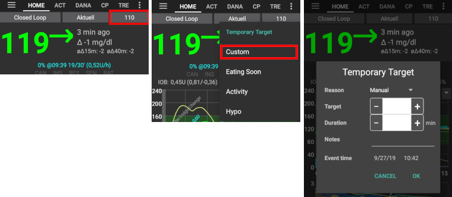

# Временные цели

## Что такое временные цели и где можно задать и сконфигурировать их?

С помощью "Временной цели" (TT) можно изменить целевое значение уровня глюкозы в крови на определенный период времени. Так как временные цели в основном нужны при нагрузке, гипогликемии (углеводы на купирование) или приближающемся приеме пищи, можно установить некоторые из них по умолчанию. Чтобы их сконфигурировать, перейдите в меню в правом углу сверху и выберите Настройки-> Другое-> Временные цели по умолчанию.

Чтобы установить одну из "Предустановленных временных целей TT", следует долго нажать на ваши цели в правом углу панели обзора или использовать ярлыки в оранжевой кнопке "Углеводы". Чтобы вручную задать [ "Произвольную временную цель TT "](../Usage/temptarget#custom-temp-target) (значение ГК и/или продолжительность), выберите" Пользовательская "после долгого нажатия на цель в верхнем правом углу или используйте кнопку "Временная цель "на вкладке "Действия ".

## Временная цель Гипо 

Можно считать ее наиболее важной временной целью. На это есть несколько причин:

1. Когда гликемия чрезмерно понижается: Обычно, алгоритм AAPS должен сам справиться с этим, но иногда вам виднее, а цикл ИПЖ будет реагировать быстрее, если он нацелен на более высокое значение глюкозы в крови.
2. Когда вы принимаете углеводы для купирования гипогликемии, уровень глюкозы в крови будет расти очень быстро. Алгоритм AAPS будет стремиться устранить подъем или давать микроболюсы SMB (если активированы). Временная цель Гипо может корректировать ситуацию. 
3. (для опытных пользователей, [ цель 10 ](../Usage/Objectives#objective-10-enabling-additional-oref1-features-for-daytime-use-such-as-super-micro-bolus-smb)): Можно включить "High Temp-Targets повышает чувствительность" для временных целей 100мг/дл / 5.5 ммоль/л или выше в OpenAPS SMB, чтобы повысить чувствительность AAPS.
4. (для опытных пользователей, [ цель 10 ](../Usage/Objectives#objective-10-enabling-additional-oref1-features-for-daytime-use-such-as-super-micro-bolus-smb)): Можно деактивировать "микроболюсы SMB при высоких временных целях", так что даже при активных углеводах COB > 0, "SMB при временных целях", "SMB всегда" и действующими микроболюсами OpenAPS SMB, AndroidAPS не даст SMB, пока активны высокие временные цели. 

Примечание: если вы вводите углеводы с помощью кнопки углеводы, а уровень глюкозы в крови меньше 72мг/дл или 4ммоль/л, то автоматически включается временная цель Гипо.

## Временная цель Нагрузка

До и во время нагрузки, можно установить более высокую цель, чтобы предотвратить гипогликемию. Чтобы упростить настройку временной цели, можно сконфигурировать значение временной цели "Нагрузка (Activity)" по умолчанию. На основе DIA, IOB и вашего опыта можно задать TT перед нагрузкой. См также [спортивный раздел в FAQ](../Getting-Started/FAQ#sports).

Для опытных пользователей, [ цель 10 ](../Usage/Objectives#objective-10-enabling-additional-oref1-features-for-daytime-use-such-as-super-micro-bolus-smb)):преимущество Временной цели "Нагрузка" в том, что можно включить настройку "Выокая врем цель TT повышает чувствительность" для временных целей выше или равных 100мг/дл / 5.5 ммоль/л в настройках микроболюсов OpenAPS SMB. В этом случае чувствительность AndroidAPS повышается. Некоторые пользователи вместо этого переключают профиль до/во время временной цели Нагрузка, но у всех все по-разному. Если "микроболюсы SMB деактивированы при высоких временных целях TT" AndroidAPS не будет выполнять SMB, даже с активными углеводами COB > 0, включенными "SMB при временных целях", "SMB всегда " и активированными микроболюсами OpenAPS SMB.

## Временная цель Ожидаемый прием пищи

Если вы знаете, что в ближайшее время вас ожидает прием пищи, можно включить эту временную цель, чтобы активный инсулин IOB уже начал работать перед едой. Особенно для тех, кто не ставит преболюсы, такая установка позволит привести глюкозу крови к более низкому значению. Подробнее об "Ожидаемом приеме пищи" можно прочитать в статье [ How to do "eating soon" mode ' ](https://diyps.org/2015/03/26/how-to-do-eating-soon-mode-diyps-lessons-learned/) или [ здесь ](https://diyps.org/tag/eating-soon-mode/).

Для опытных пользователей, [ цель 10 ](../Usage/Objectives#objective-10-enabling-additional-oref1-features-for-daytime-use-such-as-super-micro-bolus-smb): Если вы включили OpenAPS SMB и активировали режим "низкая временная цель понижает чувствительность" AAPS будет работать более агрессивно. Для этой опции требуется значение временной цели TT менее 100мг/дл или 5,5 ммоль/л.

## Настраиваемая временная цель

Иногда требуется временная цель, отличная от дефолтных. Ее можно задать, нажав на целевой диапазон в правом углу главного экрана или на вкладке "Действия".

