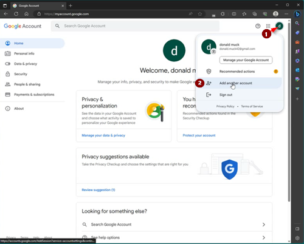
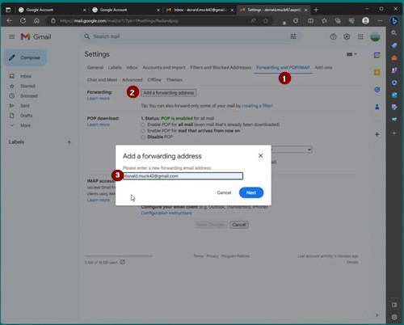

# Специальная учетная запись Google для AAPS (необязательно)

Some **AAPS** users prefer to use their main email account for **AAPS** as well. Alternatively, some **AAPS** users (or their caregivers) set-up a dedicated **AAPS** email account - this is optional, we give an example of how to do it below.

If you don't want to set up an **AAPS**-dedicated Gmail account, you can just go straight to the next section, [building AAPS](../SettingUpAaps/BuildingAaps.md).

```{admonition} Advantages of a dedicated Google account for AAPS
:class: dropdown

- Dedicated Google drive space means you will not risk filling up your personal Google drive limit with **Export Preferences**.
- Each version of **AAPS** (and supporting apps like xDrip+, BYODA, etc) will be stored in one single place which is independent of your computer hardware. If your PC or phone is stolen/lost/broken you will still have access.
- By harmonizing the setup, it will make online support simpler across users with similar folder structure.
- Depending on the setup (see below), you will have a separate identity as an alias to communicate within the community which can protect your privacy. 
- Children with T1D can preserve their own “everyday” email account as minors while using **AAPS** and associated features which require an adult account.
- Gmail allows you to register up to 4 accounts under the same phone number.
```

## Как создать специальную учетную запись Google для AAPS

(⌛Примерно 10 минут)


Требования:

* You have a Windows’ PC (Windows 10 or newer) and a Android phone (Android 9 or newer) which will host the **AAPS** app. Оба компонента должны иметь все последние обновления безопасности, доступ в интернет и права администратора, так как некоторые шаги требуют загрузки и установки программ.
* The Android phone is already set-up with your personal ”everyday” email address, such as a Gmail account.

```{admonition} Things to consider when setting up your new account
:class: dropdown
- You could use a name different to your own, which has relevance to the account (like t1dsuperstar) for privacy reasons. You can then use it in **AAPS** public forums while keeping your own identity private. Since Google requires a recovery email and phone number, it is still traceable.
- The new **AAPS** account will use the same phone number for verification as your “_everyday_” one. It will use the “everyday” email address for verification;
- We will setup email forwarding such that any email sent to the new dedicated AAPS account will be forwarded to the primary one (so there is no need to check two different mailboxes);
- Use separate passwords for your _everyday_ Gmail account and the AAPS-dedicated Gmail account
- If you use google “2-step verification” (aka multifactor) authentication for one Gmail account, you might as well do it for both Gmail accounts.
- If you plan to use Google “Passkeys”, make sure you register multiple devices. This is so you don’t lock yourself out. Only do it on devices that nobody else can access (_i.e._ not on a PC with a shared account that other people can unlock).
```


```{admonition}  Video Walkthrough! 
:class: Note
Click [here](<https://drive.google.com/file/d/1dMZTIolO-kd2eB0soP7boEVtHeCDEQBF/view?usp=drive_link>) for a video walkthrough of how to set up a dedicated Google account.
```

 В этом видео показаны шаги:

In this example: 
- Your existing “_Everyday_” Google account is <donald.muck42@gmail.com> ; 
- Your new “_AAPS_” Gmail account will be: <donald.muck42.aaps@gmail.com>; 


### Go to <https://account.google.com> 

 If you are already logged into Google, this will direct you to your “Everyday” **My Account** page. (1) Click on the top right of the page on your profile picture (in this case, a simple  (2) select “_add another account_”.




### Enter your NEW dedicated account details: 

- Enter the new account: 
- Создайте учётную запись
- for my personal use. 


### Введите личные данные:
 - Введите имя
 - фамилия
 - дату рождения (должна быть для взрослого)

### Choose your NEW email address & password

This example appends “.AAPS” to Donald Muck’s existing one…\
Set a password

### Enter a phone number which can receive the SMS verification

Теперь Gmail отправит вам уникальный код для проверки.

### Enter the recovery email address

In this case it will be your existing “_everyday_” email…

### Завершите регистрацию учетной записи

Gmail покажет имя аккаунта. It will ask you to accept Gmail’s terms and conditions & confirm your personalization settings.

### Настройте отображение нового профиля

At this point you should be on Gmail’s MyAccount page showing your new **AAPS**-dedicated email account. По умолчанию изображение профиля будет установлено на первую букву вашего имени. Change it to something unique to avoid confusion… in this example, Donald.Muck.AAPS has replaced  with 

\


### Откройте веб-сайт Gmail в обоих окнах для настройки новой учетной записи

So that you don’t need to monitor a separate email account, forward all the emails from the new **AAPS**-dedicated account to your everyday account\
This part can be a bit confusing, since you will have to switch back and forth between both accounts. Чтобы упростить задачу, откройте два отдельных окна браузера поверх друг друга:

1. Move your existing browser to the top of your screen and resize it such that it only takes about half of the top of the screen…
2. Right click on your Browser logo in your taskbar
3. From the menu select “New Window”... and adjust it so it only takes the bottom half of the screen.

Open <https://gmail.com> in each browser window. Make sure your personal account is on top and the new dedicated **AAPS** account is on the bottom, and is easily identifiable by the profile picture in the top right corner. (в случае необходимости, всегда можно переключать учетные записи, нажав на изображение профиля и выбрав правильное изображение.


Your Gmail homepages screen should look like this:\


 ### In the new Gmail account (bottom window), open Gmail settings…

- Click on the gear on the left of the profile picture
- then select “**See all Settings**”


### Настройка переадресации…

- Нажмите на вкладку «Переадресация и POP/IMAP»
- Нажмите «добавить адрес переадресации»
- Добавьте свой повседневный адрес электронной почты
- Gmail will send a verification code to your “everyday” email address.
- Вернитесь к своему повседневному профилю и щелкните ссылку, чтобы подтвердить, что вы принимаете переадресацию (или получите код из письма с подтверждением Gmail в своем «повседневном» окне Gmail, а затем вырежете и вставите его в свое «новое выделенное для AAPS» окно Gmail).

Между окнами придется немного попереключаться, но это будет гарантировать, что при проверке писем вашей повседневной учетной записи, вы также увидите письма, переадресованные с вашей учетной записи AAPS, такие, как оповещения Gmail.



### Подтверждение адреса переадресации электронной почты

- In the “Everyday” gmail (top window), you will get the “Gmail forwarding Confirmation” email.
- Откройте его и нажмите на ссылку для подтверждения запроса"

### Архивируйте переадресованные письма в новом специально выделенном аккаунте Gmail (в нижнем окне)

<!---->

1. Обновите нижнее окно
2. Выделите «переслать входящие письма»
3. И архивируйте копию Gmail (чтобы сохранить ваш новый специально выделенный почтовый ящик чистым)
4. Scroll all the way to the bottom to save your changes\
   


Поздравляем! Итак, вы создали учетную запись Google, специально выделенную для AAPS. The next step is to [build the AAPS app](../SettingUpAaps/BuildingAaps.md).