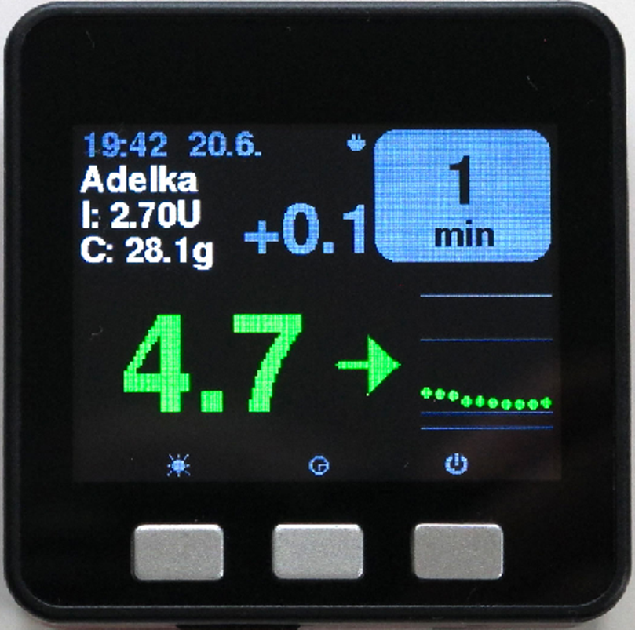

# Слежение за работой AAPS (без взаимодействия с системой)

Помимо возможностей удаленного управления _и_слежения за работой**AAPS**, которые описаны в разделе [дистанционное управление](docs/EN/remote-control.md), существует еще несколько приложений и устройств, разработанных сообществом пользователей с целью просто следить за цифрами (ГК и другой информацией), не взаимодействуя с AAPS.

Обзор возможностей, доступных для наблюдения работы **AAPS**, можно найти на веб-странице [фоллоуэры Nightscout](https://nightscout.github.io/nightscout/downloaders/#); развернув меню слева:

Наиболее распространенные сценарии сочетания работы **AAPS** с наблюдением приведены ниже.

### 1) Приложения на смартфоне

Наиболее популярные приложения для отслеживания работы **AAPS**. Все эти приложения бесплатны:

A) Dexcom Follow (Android/iOs) B) Nightguard (iOs) C) Nightwatch (Android) D) xDrip+ (Android) E) Shuggah (iOs) F) Sugarmate (iOs) G) Spike (iOs)

#### A) Dexcom Follow (совместимо с устройствами на Android и iOs)

● Dexcom Follow совместимо со многими телефонами (Android и iPhone). Dexcom Follow можно использовать, даже если вы не используете официальное приложение Dexcom для получения данных.

● Многие родители/опекуны знакомы с Dexcom Follow, предпочитая его четкий интерфейс чему-то более сложному.

● Dexcom Follow очень хорош для учителей/бабушек и дедушек и людей, которые мало знают о диабете и гликемии. Он имеет настраиваемые оповещения (уровень ГК, какой звук воспроизводить и т. д.). Оповещения могут быть полностью выключены, что очень полезно, если сенсор еще прирабатывается и передает много заниженных значений.

##### настройка Dexcom Follow: инструкция

У вас есть возможность отправлять приглашения подписчикам из самостоятельно собранного приложения Dexcom BYODA. Вы также можете отправлять приглашения на Dexcom Follow из Xdrip+ (настройки - загрузка в облако-Dexcom share server upload, смотрите инструкции здесь:

https://xdrip.readthedocs.io/en/latest/use/cloud/?h=#dexcom-share-server-upload

Тем не менее, некоторые пользователи сообщили, что не могут отправлять приглашения подписчикам Dexcom из сторонних приложений. В Xdrip+ запрос на приглашение может только привести к отправке сообщения «Приглашение не отправлено».

Если вам трудно пригласить новых подписчиков Dexcom из этих сторонних приложений, тогда одним из решений является установка официального приложения Dexcom G6, отправка приглашение, а затем удаление официального приложения.

Для этого выполните следующие шаги:

1) Установите официальное приложение «Dexcom G6» на _любой смартфон_ (Android/iPhone), это может быть телефон фоллоуэра, если вам так удобнее. 2) Войдите c именем пользователя и паролем Dexcom, это те же данные, что и для Dexcom Clarity, если вы уже клиент Dexcom/Clarity. Если у вас нет учетной записи Dexcom, можно создать новый логин.   
3) Пролистайте вводные меню. 4) В разделе код сенсора (sensor code) введите "no code". 5) В разделе № трансмиттера (transmitter SN) введите любой валидный код трансмиттера (можно ввести номер истекшего) чтобы не произошло вмешательства в работу текущего; он имеет определенный формат чисел и букв: «NLNNL» и только в определенные комбинации, так что проще всего использовать то, что известно наверняка). 6) Когда приложение попытается найти трансмиттер и сенсор, вы сможете пригласить фоллоуэров: выберите выпадающее меню в левом верхнем углу приложения и добавьте новых подписчиков. Эту процедуру также можно использовать, если один из фоллоуэров сменил телефон и нуждается в свежем приглашении, здесь вы можете удалить его из списка подписчиков и отправить новое приглашение на новый смартфон. 7) На телефоне фоллоуэра установите Dexcom Follow скачав его из App Store (iPhone) или Google Play (Android). Настройте приложение Dexcom Follow и вам будет предложено открыть электронную почту, найти приглашение и стать подписчиком.    
8) Теперь можно удалить официальное приложение Dexcom G6.

Для Dexcom Follow, данные сенсора затем экспортируются с телефона AAPS либо непосредственно из BYODA, или из Xdrip+, в зависимости от того, какое приложение используется.

#### B) Nightguard (только для iOS)

Достоинства (как указывают пользователи):

● простой и удобный интерфейс.

● Сдвиньте кнопку или встряхните телефон для прекращения оповещений на период  от 5 минут до 24 часов

● Настройка оповещений (высокая, низкая ГК, пропущенные данные за 15-45 минут.

● Быстрый рост/падение за 2-5 последовательных (вы выбираете) показания. Можно также выбрать значения дельты между двумя данными

● Умный сброс оповещений, если уровни движутся в правильном направлении

● Есть вкладка терапии, которая, позволяет установить новую временную цель на определенный срок, удалить временную цель или ввести углеводы.

Недостатки (по сообщениям пользователей)

● Доступно только для iOS

● Временная цель ТТ показывается как 5 ммол, независимо от того, какой уровень установлен на самом  деле

● Никогда не показывает временную скорость базала, несмотря на то, что есть графа TB

#### C) Nightwatch (только для Android)

● Nightwatch позиционируется как клиент Nightscout и отслеживает уровни глюкозы пользователя на телефоне или планшете.

● Приложение загружается из Google Play и отображает ГК в режиме реального времени.

● Пользователь может быть оповещен настраиваемым сигналами на зашумленные низкие и высокие значения ГК.

● Данные ГК отображаются в ммоль/л или мг/дл.

● Требуется Android 5.0 и выше.

● Имеет темный интерфейс, большие цифры и кнопки для ночного времени.

#### D) xDrip+ (только для Android)

Фоллоуэры могут оповещаться с помощью xDrip+ в режиме подписчика.  [xDrip+](../Configuration/xdrip.md). (в основном значения ГК и **оповещения**)

#### E) Shuggah (только для iOS)

Исторически было трудно найти приложение xDrip+ для iOS ( **xDrip4iOS**) для слежения за **AAPS**.

Появилась бесплатная модифицированная версия xDrip+4iOs** известная как **Shuggah**. Она загружается непосредственно из Apple App store на iPhone или планшет.

:::{admonition} Информация о том, как получить оригинальное приложение **xDrip4iOS** 
:class: dropdown

 [**xDrip4iOS**](https://xdrip4ios.readthedocs.io/en/latest/?fbclid=IwAR3lmPR2O9lgZW7xLi1GHdH8SeeMRtekmBiZFlEBCrM13BoJph0uezao_gQ) — версия **xDrip+** для Apple, поддержка в группе [XdripiOS Facebook](https://www.facebook.com/groups/853994615056838/announcements). **xDrip4iOS** может подключаться к различным системам CGM и трансмиттерам и отображать значения ГК, графики и статистику, а также подавать звуковые оповещения. Оно также может загружать данные в Nightscout или выполнять роль [фоллоуэра для Nightscout](https://xdrip4ios.readthedocs.io/en/latest/connect/follower/). Однако, _получить_ приложение **xDrip4iOS** довольно трудно.

"Как получить **xDrip4iOS** на iPhone?" Есть два варианта:
1. Если у вас есть учетная запись разработчика Mac и Apple (99 EUR/USD в год), то можно создать свой собственный xDrip4iOS по инструкциям ниже:

https://xdrip4ios.readthedocs.io/ru/latest/install/build/

Если хотите, то можете стать "релизером" и поделиться своей версией приложения (Personal Testflight) со 100 другими: https://xdrip4ios.readthedocs.io/.../personal_testflight/

2. Присоединившись к группе [Xdrip4iOS Facebook](https://www.facebook.com/groups/853994615056838/announcements) наблюдайте за записями… в ожидании личного приглашения к выпускам в группе._**Вам не разрешается запрашивать приложение**_ (прочтите их групповые правила).

Таким образом, легче загрузить приложение **Shuggah**.

:::

#### [Shuggah](https://apps.apple.com/sa/app/shuggah/id1586789452)

Приложение:

"Что такое Shuggah?" Группа украинских разработчиков взяла код проекта xDrip4iOS (он опубликован на Github) и выпустила его в App Store под бизнес-учетной записью (приложение бесплатное, группа не имеет плохих намерений). Приложение было немного изменено, добавлено заявление о конфиденциальности и отказ от ответственности, но в остальном приложение такое же, как xDrip4iOS. Shuggah официально не контролируется разработчиками xDrip4iOS, поэтому нельзя гарантировать, что приложение будет работать так же, как и xDrip4iOS, или что Apple когда-нибудь не удалит его из App Store.

[Группа Facebook xDrip4iOS](https://www.facebook.com/groups/853994615056838/announcements) поддерживает xDrip4iOS, Shuggah, а также приложение Apple Watch.

#### F) Sugarmate (iOS)

[Sugarmate](https://sugarmate.io/) можно закачать из App Store. Sugarmate совместим с: ● Apple iPhone (Требуется программное обеспечение версии 13. или позднее) ● Apple iPad (Требуется программное обеспечение версии 13. или позднее) ● Google Android (Сохраните веб-приложение на домашнем экране)

Пользователи Sugarmate сообщают что приложение совместимо с Apple CarPlay в США для отображения данных гликемии во время вождения. Пока еще не установлено, возможно ли это в странах за пределами США. Если вы знаете больше об этом, добавьте подробности в документацию, заполнив запрос на слияние который быстро и легко сделать.

#### G)  [Spike](https://spike-app.com/) на iOS

Spike может использоваться и как первичный приемник и как приложение-фоллоуэр, показывающее ГК, сигналы оповещений, активный инсулин IOB и многое другое. Сайта больше не существует. Подробно [здесь](https://spike-app.com/#features2). Подробности и поддержку можно найти на [Facebook](https://www.facebook.com/groups/1973791946274873) и Gitter](https://gitter.im/SpikeiOS/Lobby).

Чтобы установить Spike, см. [здесь](https://spike-app.com/#installation)

### 2) Смарт-часы для **мониторинга AAPS** (полные данные профиля или только гликемия), при том, когда **AAPS** работает на телефоне.

Опции смарт-часов, которые позволяют взаимодействовать с **AAPS**, описаны в разделе [дистанционное управление](remote-control.md) документации.

Существует множество доступных смарт-часов, которые дают только отображение ГК. Если вы пользуетесь сайтом Nightscout, то хороший обзор вариантов дан [здесь](https://nightscout.github.io/nightscout/wearable/#)

Здесь дан обзор некоторых популярных срели пользователей **AAPS** моделей смарт-часов, применяемых только для слежения:

#### а) Часы **Xiaomi и Amazfit**

Разработчик по имени Артем создал интеграцию xDrip для различных моделей смарт-часов, в основном для брендов Xiaomi (_например_ Mi band) и Amazfit:

Подробности об этих моделях и их настройке [здесь](https://bigdigital.home.blog/). Преимущество этих часов заключается в том, что они небольшие и относительно доступные (Xiaomi Mi Band 5 продается за £39.99 GBP). Они особенно популярны как часы для детей и людей с небольшими запястьями.

#### b) Часы Pebble

Часы Pebble, [снятые с производства](https://en.wikipedia.org/wiki/Pebble_(watch))), были в продаже с 2013 по 2016 год, и их до сих пор можно приобрести на вторичном рынке. Активы Pebble перешли к Fitbit. Пользователи Pebble могут пользоваться циферблатом Urchin для просмотра данных Nightscout. Отображаемые данные включают активный инсулин IOB, действующий временный базал и прогнозирование. В случае открытого цикла вы можете использовать алгоритм IFTTT для создания апплета, который сообщает об уведомлениях от **AAPS**, вслед за чем можно отправить либо SMS, либо push-уведомление.

#### c) смарт-часы [Bluejay GTS](https://bluejay.website/shop/product/bluejay-gts-26)

Это уникальное устройство может получать данные гликемии **непосредственно** с трансмиттера Dexcom G6. Малоизвестно, что трансмиттер Dexcom G6 передает текущие данные гликемии по _двум_ отдельным каналам: телефонному каналу и каналу помпы. В часах Bluejay GTS используется модифицированная версия программного обеспечения Xdrip+, и их можно настроить на получение данных о глюкозе по любому каналу, поэтому, если **AAPS ** использует телефонный канал, то часы Bluejay GTS могут использовать канал помпы.

Часы Bluejay GTS небольшие, водонепроницаемые, доступны по цене (в настоящее время 115 фунтов стерлингов) и могут быть доставлены по всему миру из Великобритании. Главное их преимущество заключается в том, что часы полностью независимы как от телефона, так и от системы ИПЖ. Так, например, если вы отсоедините помпу и телефон **AAPS** на пляже или в парке и находитесь вне зоны действия телефона AAPS, то все равно сможете получать данные с Dexcom G6 сразу на часы.

Недостатки, о которых сообщают пользователи, заключаются в том, что они не всегда снимают показания каждые 5 минут, а батарея не подлежит замене. В часах Bluejay GTS используется модифицированная версия программного обеспечения Xdrip+, и в настоящее время они не работают с другими версиями Dexcom (G7) или датчиками Libre.

#### d) Часы Apple

Проверьте [Nightscout на часах](https://nightscout.github.io/nightscout/wearable/#):

Выбор состоит из Nightguard, sugarmate, Gluco-Tracker, nsapple и слежение Loop Follow.

### 3) Устройства для слежения за AAPS

Устройства включают: A) M5 stack/M5 stickC B) Sugarpixel C) PC (Teamviewer)

#### A) M5 stack

[M5Stack](https://github.com/mlukasek/M5_NightscoutMon) — это небольшой блок, который можно запрограммировать для множества приложений, одно из которых — отображение значений и тенденций уровня глюкозы сенсора, IOB и COB. Он находится в пластиковой коробке, оснащен цветным дисплеем, слотом для карт Micro SD, 3 кнопками, динамиком и внутренним аккумулятором. Это отличный монитор уровня сахара в крови, и его относительно легко настроить, если у вас есть учетная запись Nightscout. Он обычно применяется в домашних сетях Wi-Fi, но некоторые сообщают, что используют его в качестве дисплея при езде на мотоцикле, запуская его через точку доступа Wi-Fi на телефоне.

#### B) Sugarpixel

SugarPixel — это устройство для системы вторичного оповещения об уровне глюкозы для приложений Dexcom или Nightscout на смартфоне пользователя. Устройство отображает показания уровня сахара в крови в режиме реального времени. Этот аппаратный монитор CGM оснащен звуковыми оповещениями, генерирующими случайные сигналы (которые невероятно громкие), вибрационными оповещениями для людей с нарушениями слуха, настраиваемыми параметрами отображения и встроенным многопользовательским сопровождением.

● SugarPixel имеет несколько вариантов отображения в мг/дл и ммоль/л в соответствии с потребностями пользователя с цветовой кодировкой значений гликемии. Стандартный циферблат отображает ГК, стрелку тренда и дельту изменений. Дельта - это изменение + или - от последнего показания. ● SugarPixel можно настроить дна работы при низкой яркости, они показывают гликемию и текущее время, что удобно в ночное время на тумбочке пользователя. ● Цветной экран SugarPixel использует весь дисплей для отображения одного цвета, обозначающего значение ГК. Это позволяет пользователю видеть значения ГК на расстоянии через окно, находясь в бассейне, во дворе или на веранде. Большой циферблат хорош для тех, кто носит очки или контактные линзы.

#### C) ПК (Teamviwer)
Некоторые пользователи считают, что полнофункциональный инструмент удаленного доступа, такой как [TeamViewer](https://www.teamviewer.com/), может оказаться полезным для удаленного устранения неполадок.

 

