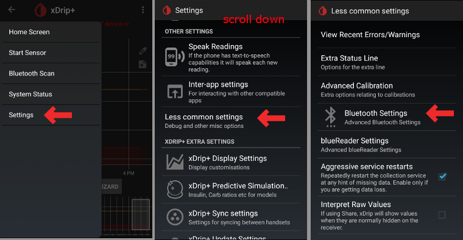

# xDrip+ settings

If not already set up then download [xdrip](https://github.com/NightscoutFoundation/xDrip)

For G6 transmitters manufactured after fall/end of 2018 please make sure to use one of the [latest nightly build xDrip+ versions](https://github.com/NightscoutFoundation/xDrip/releases). Those transmitters have a new firmware and latest stable version of xDrip+ (2019/01/10) cannot deal with it.

## Basic settings for all CGM & FGM systems

* Make sure to set Base URL correctly including <b>S</b> at the end of http<b>s</b>:// (not http://)
 
   
   

     i.e. https://API_SECRET@your-app-name.herokuapp.com/api/v1/
   

   
   

     -> Hamburger Menu (top left of homescreen) -> Settings-> Cloud Upload-> Nightscout Sync (REST-API) -> Base URL
   
</li> 
   
   <li>
     

       Deactivate “Automatic Calibration” If the checkbox for "Automatic Calibration" is checked, activate "Download data" once, then remove the checkbox for "automatic calibration" and deactivate "Download data" again, otherwise the treatments (insulin & carbs) will be added twice to Nightscout.
     

   </li>
   
   <li>
     Tap "Extra Options"
   </li>
   
   <li>
     Deactivate "Upload treatments" and "Back-fill data"
   </li>
   
   <li>
     

       Option "Alert on failures" should also be deactivated. Otherwise you will get an alarm every 5 minutes in case wifi/mobile network is too bad or the server is not available.
     

     

       
     

     

       
     

   </li>
   
   <li>
     

       <strong>InterApp-Settings</strong> (Broadcast) If you are going to use AndroidAPS and the data should be forwarded to i.e. AndroidAPS you have to activate broadcasting in xDrip+ in Inter-App settings.
     

   </li>
   
   <li>
     In order for the values to be equal, you should activate "Send the displayed glucose value".
   </li>
   
   <li>
     

       If you have also activated "Accept treatments" and broadcasting in AAPS, then xDrip+ will receive insulin, carbs and basal rate information from your DIY closed loop system and can estimate the hypo prediction etc. more accurately.
     

     

       
     

   </li></ul> 
   
   <h2>
     XDrip+ & Dexcom G6
   </h2>
   
   <h3>
     Dexcom specific settings
   </h3>
   
   <ul>
     <li>
       

         Open G5/G6 Debug Settings -> Hamburger Menu (top left of homescreen) -> Settings -> G5/G6 Debug Settings 
       

     </li>
     <li>
       

         Enable the following settings
       

       <ul>
         <li>
           Use the OB1 Collector
         </li>
         <li>
           Native Algorithm (important if you want to use SMB)
         </li>
         <li>
           G6 support
         </li>
         <li>
           Allow OB1 unbonding
         </li>
         <li>
           Allow OB1 initiate bonding
         </li>
       </ul>
     </li>
     <li>
       All other options should be disabled
     </li>
     <li>
       

         Adjust battery warning level to 280 (bottom of G5/G6 Debug Settings)
       

       

         
       

     </li>
   </ul>
   
   <h3>
     Preemptive restarts not recommended
   </h3>
   
   

     The automatic extension of Dexcom sensors (“preemtive restarts”) is not recommended as this might lead to “jumps” in BG values on day 9 after restart.
   

   
   <pre><code>
</code></pre>
   
   

     What’s clear is that using the G6 is perhaps a little more complex than it as first suggests. To use it safely, there are a few points to be aware of:
   

   
   <ul>
     <li>
       If you are using the native data with the calibration code in xDrip or Spike, the safest thing to do is not allow preemptive restarts of the sensor.
     </li>
     <li>
       If you must use preemptive restarts, then make sure you insert at a time of day where you can observe the change and calibrate if necessary.
     </li>
     <li>
       If you are restarting sensors, either do it without the factory calibration for safest results on days 11 and 12, or ensure you are ready to calibrate and keep an eye on variation.
     </li>
     <li>
       Pre-soaking of the G6 with factory calibration is likely to give variation in results. If you do pre-soak, then to get best results, you will probably need to calibrate the sensor.
     </li>
     <li>
       If you aren’t being observant about the changes that may be taking place, it may be better to revert to non-factory-calibrated mode and use the system like a G5.
     </li>
   </ul>
   
   

     To learn more about the details and reasons for these recommendations read the <a href="http://www.diabettech.com/artificial-pancreas/diy-looping-and-cgm/">complete article</a> published by Tim Street at <a href="http://www.diabettech.com">www.diabettech.com</a>.
   

   
   <h3>
     Connect G6 transmitter for the first time
   </h3>
   
   

     

<b>For second and following transmitters see 'Extend transmitter life' below.</b>

   

   
   <ul>
     <li>
       For G6 transmitters manufactured after fall/end of 2018 please make sure to use one of the <a href="https://github.com/NightscoutFoundation/xDrip/releases">latest nightly build xDrip+ versions</a>. Those transmitters have a new firmware and latest stable version of xDrip+ (2019/01/10) cannot deal with it.
     </li>
     <li>
       Turn original Dexcom receiver off (if used).
     </li>
     <li>
       Long press the red xDrip+ blood drop icon on the main screen to enable the "Source Wizard Button".
     </li>
     <li>
       Use the Source Wizard Button which ensures default settings including OB1 & Native Mode <ul>
         <li>
           This guides you through the initial set up.
         </li>
         <li>
           you will need your Transmitter serial number if this is the first time you've used it.
         </li>
       </ul>
     </li>
     <li>
       

         Put in serial number of new transmitter (on the transmitter packaging or on the back of the transmitter
       

       

         
       

     </li>
     <li>
       

         Insert new sensor (only if replacing)
       

     </li>
     <li>
       Put transmitter into sensor
     </li>
     <li>
       Start sensor (only if replacing) -> Near the bottom of the screen “Warm Up x,x hours left” must be displayed after a few minutes. -> If there is no time specification stop and restart the sensor.
     </li>
     <li>
       Restart collector (system status - if not replacing sensor}
     </li>
     <li>
       Do not turn original Dexcom receiver (if used) back on before xDrip+ shows first readings.
     </li>
     <li>
       

         Long press the red xDrip+ blood drop icon on the main screen to disable the "Source Wizard Button".
       

       

         
       

       

         
       

       

         
       

       

         
       

     </li>
   </ul>
   
   <h3>
     Transmitter battery status
   </h3>
   
   <ul>
     <li>
       Battery status can be controlled in system status (Hamburger Menu top left on homescreen)
     </li>
     <li>
       

         Swipe left once to see second screen. 
       

     </li>
     <li>
       

         The exact values when the transmitter “dies” due to empty battery are not known. The following information was posted online after the transmitter “died”: Transmitter days: 151 Voltage A: 297 Voltage B: 260 Resistance: 2391
       

     </li>
   </ul>
   
   <h3>
     Extend transmitter life
   </h3>
   
   <ul>
     <li>
       Switch to the "engineering mode": <ul>
         <li>
           tap on the character on the right of the xDrip+ start screen that represents a syringe
         </li>
         <li>
           then tap on the microphone icon in the lower right corner
         </li>
         <li>
           In the text box that opens type "enable engineering mode"
         </li>
         <li>
           click "Done"
         </li>
         <li>
           If Google Speak engine is enabled, you can also speak the voice command: "enable engineering mode".
         </li>
       </ul>
     </li>
     <li>
       Go to the G5 debug settings and check "OB1 collector".
     </li>
     <li>
       Use the voice command: “hard reset transmitter”
     </li>
     <li>
       The voice command will be executed with the next data receipt of the transmitter
     </li>
     <li>
       Look at the system status (Hamburger menu -> system status) and see what happens
     </li>
   </ul>
   
   <h3>
     Replace transmitter
   </h3>
   
   

     For G6 transmitters manufactured after fall/end of 2018 please make sure to use one of the <a href="https://github.com/NightscoutFoundation/xDrip/releases">latest nightly build xDrip+ versions</a>. Those transmitters have a new firmware and latest stable version of xDrip+ (2019/01/10) cannot deal with it.
   

   
   <ul>
     <li>
       Turn original Dexcom receiver off (if used).
     </li>
     <li>
       

         Stop sensor (only if replacing sensor) Ensure it really is stopped: On the second "G5/G6 Status" screen look at "Queue Items" about half way down - It may say something like "(1) Stop Sensor" Wait until this goes - a few minutes in my experience. -> To remove transmitter without stopping sensor see this video <a href="https://youtu.be/AAhBVsc6NZo">https://youtu.be/AAhBVsc6NZo</a>.
       

       

         
       

     </li>
     <li>
       

         Forget device (in system status)
       

       

         
       

     </li>
     <li>
       

         Forget device in smartphone’s BT settings (Will be shown as DexcomXX whereas XX are the last two
       

     </li>
     <li>
       Remove transmitter (and sensor if replacing sensor)
     </li>
     <li>
       Long press the red xDrip+ blood drop icon on the main screen to enable the "Source Wizard Button".
     </li>
     <li>
       Use the Source Wizard Button which ensures default settings including OB1 & Native Mode <ul>
         <li>
           This guides you through the initial set up.
         </li>
         <li>
           You will need your Transmitter serial number if this is the first time you've used it.
         </li>
       </ul>
     </li>
     <li>
       Put in serial number of new transmitter.
     </li>
     <li>
       Insert new sensor (only if replacing). -> It is recommended to wait approx. 15 minutes between stopping and starting the new sensor.
     </li>
     <li>
       Put transmitter into sensor
     </li>
     <li>
       Start sensor (only if replacing)
     </li>
     <li>
       Restart collector (system status - if not replacing sensor}
     </li>
     <li>
       Do not turn original Dexcom receiver (if used) back on before xDrip+ shows first readings.
     </li>
     <li>
       

         Long press the red xDrip+ blood drop icon on the main screen to disable the "Source Wizard Button".
       

       

         
       

       

         
       

       

         
       

       

         
       

     </li>
   </ul>
   
   <h3>
     New Sensor
   </h3>
   
   <ul>
     <li>
       Turn original Dexcom receiver off (if used).
     </li>
     <li>
       

         Stop sensor if necessary Ensure it really is stopped: On the second "G5/G6 Status" screen look at "Queue Items" about half way down - It may say something like "(1) Stop Sensor" Wait until this goes - usually a few minutes
       

       

         
       

     </li>
     <li>
       

         Clean contacts (transmitter backside) with alcohol and let air-dry.
       

     </li>
     <li>
       

         In case you use this function disable “Restart Sensor” and “Preemptive restarts” (Hamburger Menu -> Settings -> G5/G6 Debug Settings). If you miss this step and have these functions enabled the new sensor will not start properly.
       

       

         
       

     </li>
     <li>
       

         Start Sensor <b>-> It is recommended to wait approx. 15 minutes between stopping and starting the new sensor.</b>
</li> 
         
         <li>
           Set time inserted <ul>
             <li>
               To use G6 Native mode you must wait for the 2 hour warm up (i.e insertion time is now).
             </li>
             <li>
               If you are using the xDrip+ algorithm then you can set a time more than 2 hours ago to avoid warm up. Readings may be very erratic. Therefore this is not recommended.
             </li>
           </ul>
         </li>
         
         <li>
           Enter Sensor code (on the peel-off foil of the sensor) <ul>
             <li>
               Keep code for further reference (i.e. new start after transmitter had to be removed)
             </li>
             <li>
               Code can also be found in xDrip+ logs: Click 3-dots-menu on xDrip+ homescreen and choose "show logs".
             </li>
           </ul>
         </li>
         
         <li>
           No calibration is needed if you use G6 in "native mode". xDrip+ will show readings automatically after 2 hour warm-up.
         </li>
         
         <li>
           

             Do not turn original Dexcom Receiver (if used) back on before xDrip+ shows first readings.
           

           

             
           

           

             
           

         </li></ul> 
         
         <h3>
           Retrieve sensor code
         </h3>
         
         <ul>
           <li>
             Dexcom sensor code can be found in xDrip+ logs.
           </li>
           <li>
             Tap 3 dot menu (top right side on homescreen)
           </li>
           <li>
             

               Select ‘View Event Logs’ and search for ‘code’
             

             

               
             

           </li>
         </ul>
         
         <h2>
           xDrip+ & Freestyle Libre
         </h2>
         
         <h3>
           Libre specific settings
         </h3>
         
         <ul>
           <li>
             

               Open Bluetooth Settings -> Hamburger Menu (top left of homescreen) -> Settings -> scroll down -> Less common settings -> Bluetooth Settings
             

             

               
             

           </li>
           <li>
             

               Enable the following settings
             

             <ul>
               <li>
                 Turn Bluetooth
               </li>
               <li>
                 Use scanning
               </li>
               <li>
                 Always discover services
               </li>
             </ul>
           </li>
           <li>
             

               All other options should be disabled
             

             

               
             

           </li>
         </ul>
         
         <h3>
           Connect Libre Transmitter & start sensor
         </h3>
         
         <pre><code>

</code></pre>