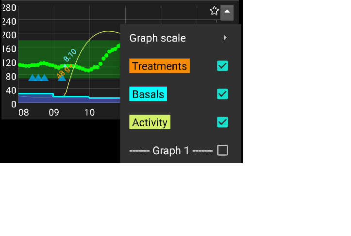
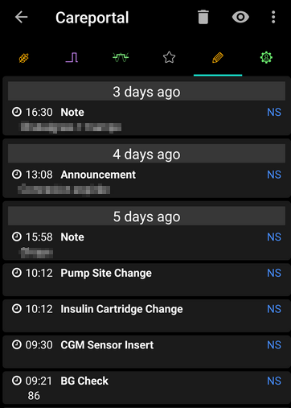

# Obrazovky aplikácie AAPS

```{contents}
:backlinks: entry
:depth: 2
```

(AapsScreens-the-homescreen)=

## Domovská obrazovka


Toto je prvá obrazovka, s ktorou sa stretnete po otvorení **AAPS** a obsahuje väčšinu informácií, ktoré budete denne potrebovať.

### Sekcia A – Záložky

* Môžete sa pohybovať medzi rôznymi modulmi **AAPS**.
* Prípadne môžete meniť obrazovky potiahnutím prsta doľava alebo doprava.
* Zobrazené záložky je možné vybrať v [nastaveniach konfigurátora](#Config-Builder-tab-or-hamburger-menu).

(aaps-screens-profile--target)=

### Sekcia B – Profil a ciel

#### Aktuálny Profil

Aktuálny profil sa zobrazuje v ľavom paneli.

Krátkym stlačením panela profilu zobrazíte podrobnosti profilu. Dlhým stlačením panela profilov [prepínate medzi rôznymi profilmi](../DailyLifeWithAaps/ProfileSwitch-ProfilePercentage.md).


1. Bežné zobrazenie so štandardnou aktiváciou profilu.
2. Zmena profilu so zostávajúcou dobou trvania 59 minút.
3. Zmena profilu s konkrétnym percentom 120 %.
4. Zmena profilu s konkrétnym percentom 80 % a zostávajúcou dobou trvania 59 minút.
5. Zmena profilov s časovým posunom -1 hodina.
6. Zmena profilov s konkrétnym percentom 120 %, časovým posunom o 1 hodinu a zostávajúcim trvaním 59 minút.

#### Cieľ


Aktuálna cieľová hladina glukózy v krvi sa zobrazuje v pravom stĺpci.

Krátkym stlačením panela s cieľmi nastavíte **[dočasný cieľ](../DailyLifeWithAaps/TempTargets.md)**.

Ak je nastavený dočasný cieľ, lišta sa zafarbí na žlto a v zátvorkách sa zobrazí zostávajúci čas v minútach.

(AapsScreens-visualization-of-dynamic-target-adjustment)=

#### Vizualizácia nastavenia Dynamického cieľa


Pri použití [algoritmu SMB](#Config-Builder-aps) a funkcie [Autosens](#Open-APS-features-autosens) dokáže **AAPS** dynamicky upraviť váš cieľ na základe citlivosti.

V časti [Predvoľby > Nastavenia OpenAPS SMB](#Preferences-openaps-smb-settings) povoľte jednu alebo obe z nasledujúcich možností:

* „citlivosť zvyšuje cieľ“ a/alebo 
* "rezistencia znižuje cieľ" 

Ak systém **AAPS** zistí rezistenciu alebo citlivosť, cieľ sa zmení oproti nastaveniu v profile. Keď sa zmení cieľová glukóza, pozadie sa zmení na zelené.

(AapsScreens-section-c-bg-loop-status)=

### Sekcia C – Stav glykémie a slučky

#### Aktuálna hladina glukózy v krvi

Najnovšia hodnota glukózy v krvi z vášho CGM sa zobrazuje na ľavej strane.

Farba hodnoty glykémie odráža stav v zadanom [rozsahu](#Preferences-range-for-visualization).

* Zelená = v rozsahu
* červená = pod rozsahom
* žltá = nad rozsahom 


Bloky v strede zobrazujú:

1. Koľko minút uplynulo od posledného merania **CGM**
2. Rozdiely oproti poslednej nameranej hodnote: Δ, a oproti priemeru za posledných 15 a 40 minút (Δ15 a Δ40).  
    Dlhodobé odchýlky sa vypočítavajú ako priemerná hodnota zmien v minulosti, pričom ukazujú, aká bola priemerná hodnota.

(AapsScreens-loop-status)=

#### Stav uzavretého okruhu


Na pravej strane ikona zobrazuje stav slučky:

1. Zelený kruh = bežiaca slučka
2. Zelený kruh s bodkovanou čiarou = [low glucose suspend (LGS)](#objectives-objective6)
3. Červený kruh = slučka deaktivovaná (nefunguje trvalo)
4. Žltý kruh = slučka pozastavená (dočasne pozastavená, ale bude podávaný bazálny inzulín) - zostávajúci čas je zobrazený pod ikonou
5. Sivý kruh = pumpa odpojená (dočasne sa vôbec nedáva inzulín) - zostávajúci čas je zobrazený pod ikonou
6. Oranžový kruh = prebieha super bolus – zostávajúci čas je zobrazený pod ikonou
7. Modrý kruh s bodkovanou čiarou = otvorená slučka

Krátkym alebo dlhým stlačením ikony otvoríte dialógové okno Slučka, kde môžete prepnúť režim slučky (Zatvoriť, Pozastaviť pri nízkej glukóze, Otvoriť alebo Zakázať), pozastaviť/opätovne zapnúť slučku alebo odpojiť/opätovne pripojiť pumpu.

* Ak krátko stlačíte ikonu Slučky, po výbere v okne Slučky je potrebné overenie
    
    

(aaps-screens-bg-warning-sign)=

#### Upozornenia na glykémiu

Ak sa z akéhokoľvek dôvodu vyskytnú problémy s údajmi o glykémii, ktoré prijíma **AAPS**, zobrazí sa vám na hlavnej obrazovke varovný signál pod hodnotou glykémie.

##### Červená varovná značka: Duplicitné údaje o glykémii

Červený varovný signál vám signalizuje potrebu okamžitého zásahu. Dostávate **duplicitné údaje o glykémii**, čo bráni správnemu fungovaniu slučky. Preto bude vaša slučka deaktivovaná, kým sa problém nevyrieši.

    {admonition} Vaša slučka je pozastavená
    :class: note
    Vaša slučka je pozastavená kým sa problém neodstráni !


Musíte zistiť, prečo máte duplicitné hodnoty glykémie:

* Je Dexcom bridge povolený na vašej Nightscout stránke? Vypnutie bridge je možné cez administračný panel vašej Nightscout stránky: nájdite premennú „enable“ a z nej odstráňte hodnotu „bridge". (Pre heroku [viac detailov môžte nájsť tu](https://nightscout.github.io/troubleshoot/troublehoot/#heroku-settings).)
* Nahráva sa viacero zdrojov vašej glykémie do Nightscoutu? Ak používate aplikáciu BYODA, povoľte upload v **AAPS**, ale nepovoľujte ho v xDrip+, ak ho používate.
* Máte nejakých sledovateľov, ktorí prijímajú údaje o vašej glykémii ale zároveň ich oj odosielajú na váš Nightscout účet?
* Posledná možnosť: V **AAPS** prejdite do časti [Nastavenia > NSClient](#Preferences-nsclient), vyberte nastavenia synchronizácie a vypnite možnosť „Prijímať údaje CGM z NS“.

Ak chcete rýchlo odstrániť upozornenie a znova spustiť slučku, musíte manuálne odstrániť niekoľko položiek z karty Dexcom/xDrip+.

Ak je však veľa zdvojených údajov, jednoduchšie môže byť

* [zálohujte si nastavenia](../Maintenance/ExportImportSettings.md),
* resetujte databázu v ponuke údržby a
* [importujte nastavenia](../Maintenance/ExportImportSettings.md) znova

##### Žltý výstražný signál

Žltý výstražný signál signalizuje, že vaša glykémia prichádzala v nepravidelných časových intervaloch alebo že niektoré hodnoty glykémie chýbajú. Po stlačení znaku sa zobrazí správa „Použité prepočítané dáta“.


Zvyčajne nemusíte podniknúť žiadne kroky. Uzavretá slučka bude naďalej fungovať!

Keďže počas výmeny/zahrievania senzora sú dáta o glykémii pozastavené, žltý varovný signál v takomto prípade je normálny a nie je dôvod na obavy.

Špeciálna poznámka pre používateľov Libre:

* Každá jedna hodnota LIBRE sa každých pár hodín posunie o minútu alebo dve, čo znamená, že nikdy nedosiahnete pravidelný tok údajov o glykémii.
* Taktiež, nepravidelné hodnoty narúšajú plynulé dáta.
* Preto bude žltá výstražná značka pre používateľov Libre „vždy aktívna“.

*Poznámka*: Pri výpočtoch **AAPS** sa berie do úvahy doba prevádzky až 30 hodín. Takže aj po vyriešení problému môže trvať približne 30 hodín, kým žltý trojuholník zmizne po poslednom nepravidelnom intervale.

#### Jednoduchý mód

Ikona s detskou tvárou v pravom hornom rohu tejto sekcie označuje, že sa nachádzate v [Jednoduchom móde](#preferences-simple-mode).


### Sekcia D – IOB, COB, BR a AS


1. **Striekačka**: Inzulín v tele (IOB) – predstavuje množstvo aktívneho inzulínu, ktorý ešte účinkuje vo vašom tele. Hodnota IOB by bola nulová, ak by sa podával iba základný (bazálny) inzulín a zároveň by v tele nezostali žiadne zvyšky z predchádzajúcich bolusov.
    
    * IOB môže byť záporný, ak bol v poslednom čase aktívny znížený bazál.
    * Stlačením ikony zobrazíte rozdelenie bolusového a bazálneho inzulínu

2. **Klások**: [aktívne sacharidy v tele (COB)](../DailyLifeWithAaps/CobCalculation.md) – ešte nevstrebané sacharidy, ktoré ste predtým zjedli. Ikona bliká na červeno, ak sú potrebné ďalšie sacharidy (pozri [nižšie](#aaps-screens-carbs-required))

3. **Fialová linka**: aktuálna bazálna dávka. Ikona sa zmení, aby odrážala dočasné zmeny bazálnej dávky (rovná pri 100 %) 
    * Ťuknutím na ikonu zobrazíte základnú bazálnu dávku a podrobnosti o dočasnej bazálnej dávke (vrátane zostávajúcej dĺžky)
4. **Šípky hore a dole**: označuje stav funkcií dynamickej citlivosti ([Autosens](#Open-APS-features-autosens) alebo [DynamicISF](#Open-APS-features-DynamicISF)): aktívne alebo neaktívne. V tejto časti sa môže zobraziť niekoľko hodnôt: 
    * AS: Hodnota automatickej citlivosti. Zobrazuje sa, aj keď je funkcia Autosens vypnutá (len pre informáciu). Zobrazuje sa aj pri aktívnej funkcii DynISF, hoci to nemá žiadny účinok.
    * Alg: Hodnota DynamicISF (na základe TDD). Viac informácií nájdete na stránke [DynamicISF](#Open-APS-features-DynamicISF).

(aaps-screens-carbs-required)=

#### Požadované sacharidy


Návrhy na sacharidy sa zobrazia, keď systém zistí potrebu ďalších sacharidov.

V tomto prípade si algoritmus oref myslí, že vám nebude stačiť nulový dočasný bazál a preto budete potrebovať ďalšie sacharidy.

Upozornenia na sacharidy sú oveľa sofistikovanejšie ako tie z bolusovej kalkulačky. Môže sa zobraziť návrh sacharidov, zatiaľ čo bolusová kalkulačka nezobrazuje chýbajúce sacharidy.

Upozornenia na potrebu sacharidov je možné v prípade potreby odoslať do Nightscoutu, v takom prípade sa upozornenie zobrazí a pošle ďalej.

### Sekcia E – Stavové indikátory


Stavové indikátory poskytujú vizuálne varovanie pred

* Vek kanyly
* Vek inzulínu (dni používania zásobníka)
* Hladina inzulínu v zásobníku (units)
* Vek senzora
* Vek a úroveň nabitia batérie (%)

Pri prekročení limitu sa hodnoty zobrazia žltou farbou.

Ak je prekročená kritická hodnota, hodnoty sa zobrazia červenou farbou.

Nastavenia je možné zmeniť v časti [Nastavenia > Prehľad > Stavové indikátory](#Preferences-status-lights).

Depending on the pump you use, you may not have all of these icons.

(aaps-screens-main-graph)=

### Section F - Main graph


The graph shows your blood glucose (BG) as read from your glucose monitor (CGM).

Notes entered in action tab such as fingerstick calibrations and carbs entries as well as profile switches are shown here.

Use the menu on top left of the graph or long press anywhere on the graph to change the timescale. You can choose between 6, 12, 18 or 24 hours.

The green area reflects your target range.

Blue triangles show [SMB](#Open-APS-features-super-micro-bolus-smb) - if enabled in [Preferences > OpenAPS SMB](#Preferences-openaps-smb-settings).

(AapsScreens-activate-optional-information)=

#### Activate optional information

On the main graph, you can switch on these optional information:

* Predictions
* Ošetrenia
* Basals
* Activity - insulin activity curve

To show this information, click the triangle on the right side of the main graph. For the main graph just the four options above the line "Graph 1 2 3 4" are available.



(aaps-screens-prediction-lines)=

#### Prediction lines

* **Orange** line: [COB](CobCalculation) (color is used generally to represent COB and carbs)
    
    This prediction line shows where your BG (not where COB itself!) will go based on the current **Profile** settings, assuming that the deviations due to carb absorption remain constant. This line only appears if there are known COB.

* **Dark blue** line: IOB (color is used generally to represent IOB and insulin)
    
    This prediction line shows what would happen under the influence of insulin only. For example if you dialed in some insulin and then didn’t eat any carbs.

* **Light blue** line: zero-temp (predicted BG if temporary basal rate at 0% would be set)
    
    This prediction line shows how the BG trajectory line would change if the pump stopped all insulin delivery (0% TBR).
    
    *This line appears only when the [SMB](#Config-Builder-aps) algorithm is used.*

* **Dark yellow** line: [UAM](#SensitivityDetectionAndCob-sensitivity-oref1) (un-announced meals)
    
    Unannounced meals means that a significant increase in glucose levels due to meals, adrenaline or other influences is detected. Prediction line is similar to the **orange COB line**, but it assumes that the deviations will taper down at a constant rate (by extending the current rate of reduction).
    
    *This line appears only when the [SMB](#Config-Builder-aps) algorithm is used.*

* **Dark orange** line: aCOB (accelerated carbohydrate absorption)
    
    Similar to COB, but assuming a static 10 mg/dL/5m (-0.555 mmol/l/5m) carb absorption rate. Deprecated and of limited usefulness.
    
    *This line appears only when the older [AMA](#Config-Builder-aps) algorithm is used.*

Usually your real glucose curve ends up in the middle of these lines, or close to the one which makes assumptions that closest resemble your situation.

#### Basals

A **solid blue** line shows the basal delivery of your pump and reflects the actual delivery over time.

The **dotted blue** line is what the basal rate would be if there were no temporary basal adjustments (TBRs).

When the standard basal rate is given, the area under the curve is shown in dark blue. When the basal rate is temporarily adjusted (increased or decreased), the area under the curve is shown in light blue.

#### Activity

The **thin yellow** line shows the activity of Insulin.

It is based on the expected drop in BG of the insulin in your system if no other factors (like carbs) were present.

(AapsScreens-section-g-additional-graphs)=

### Section G - Additional graphs

You can activate up to four additional graphs below the main graph. When in [Simple Mode](#preferences-simple-mode), additional graphs are preset and can not be changed. Switch off **Simple Mode** if you wish to set your own configuration of additional graphs.

To open settings for additional graphs click the triangle on the right side of the [main graph](#aaps-screens-main-graph) and scroll down.


To configure additional graphs, check the boxes corresponding to the data you want to see on each graph.

Most users find the following configuration of additional graphs to be adequate :

* Graph 1 with IOB, COB, Sensitivity change
* Graph 2 with Deviations and BGI.

#### Absolute insulin

Active insulin including boluses **and basal**.

#### Insulin on board

Shows the insulin you have on board (= active insulin in your body). It includes insulin from bolus and temporary basal (**but excludes basal rates set in your profile**).

If there were no [SMBs](#Open-APS-features-super-micro-bolus-smb), no boluses and no TBR during DIA time this would be zero.

IOB can be negative if you have no remaining bolus and zero/low temp for a longer time.

Decaying depends on your [DIA and insulin profile settings](../SettingUpAaps/YourAapsProfile.md).

#### Carbs On Board

Shows the carbs you have on board (= active, not yet decayed carbs in your body).

Decaying depends on the [deviations the algorithm detects](../DailyLifeWithAaps/CobCalculation.md).

If it detects a higher carb absorption than expected, insulin would be given and this will increase IOB (more or less, depending on your safety settings).

#### Sensitivity change

Shows the sensitivity that [Autosens](#Open-APS-features-autosens) has detected.

Sensitivity is a calculation of sensitivity to insulin as a result of exercise, hormones etc.

Upozorňujeme, že musíte plniť [Cieľ 8](#objectives-objective8), aby detekcia citlivosti/[Autosens](#Open-APS-features-autosens) automaticky upravila množstvo podaného inzulínu. Before reaching that objective, the line in your graph is displayed for information only.

### Variable sensitivity

Shows the sensitivity as calculated by [DynamicISF](../DailyLifeWithAaps/DynamicISF.md). Only populated if you use this feature.

(screen-heart-rate-steps)=

#### Heart rate & Steps

This data may be available when using a [Wear smartwatch](../WearOS/WearOsSmartwatch.md). Enable them on **AAPS** Wear app and give permission for health data.

#### Deviations

* **Grey** bars show a deviation due to carbs. 
* **Green** bars show that BG is higher than the algorithm expected it to be. Green bars are used to increase resistance in [Autosens](#Open-APS-features-autosens).
* **Red** bars show that BG is lower than the algorithm expected. Red bars are used to increase sensitivity in [Autosens](#Open-APS-features-autosens).
* **Yellow** bars show a deviation due to UAM.
* **Black** bars show small deviations not taken into account for sensitivity

#### Blood Glucose Impact

This line shows the degree to which BG ‘should’ rise or fall based on insulin activity alone.


It is a good combination to display this line along with the Deviation bars. They share the same scale, but it is a different one than the other optional data, so it is a good idea to display them on a separate graph, as shown above. Comparing the BGI line and the Deviation bars is another way to understand how **BG** fluctuates. Here, at the time marked **1**, the Deviation bars are greater than the BGI line, indicating that BG is rising. Later, during the hours marked **2**, BGI and DEV are pretty much in line, indicating that BG is stable.

### Section H - Buttons


Buttons for Insulin and Carbs are almost always visible. If the connection to the pump is lost, the Calculator button will not be visible.

Other Buttons can be setup in [Preferences > Overview > Buttons](#Preferences-buttons).

About using the Insulin, Carbs and Calculator buttons : If enabled in the [Preferences > Overview](#Preferences-show-notes-field-in-treatments-dialogs), the **Notes** field allows you to enter text that will show on the main graph, and may be uploaded to Nightscout - depending on your settings for NS client.

(aaps-screens-buttons-insulin)=

#### Inzulín


To give a certain amount of insulin without using the [bolus calculator](#aaps-screens-bolus-wizard).

By checking the box **Start eating soon TT**, you can automatically start your [eating soon temp target](#TempTargets-eating-soon-temp-target).

If you do not want to bolus through the pump but record an insulin amount (i.e. insulin given by pen) check the corresponding box. When checking this box, you get an additional field “Time offset”, that you can use to record an insulin injection made in the past.

You can use the buttons to quickly increase the insulin quantity. The increment values can be changed in the [Preferences > Overview > Buttons](#Preferences-buttons).

The insulin button can be used when the pump is suspended as well, i.e. to record insulin injected with a pen. In this case, the header will show in yellow, and the checkbox “Do not bolus, record only” can not be unchecked.


#### Carbs


To record carbs without bolusing.

Certain [pre-set temporary targets](#TempTargets-hypo-temp-target) can be set directly by checking the box.

**Time offset**: When will you / have you been eaten carbs (in minutes).

**Duration**: To be used for ["extended carbs"](ExtendedCarbs)

You can use the buttons to quickly increase the carb amount. The increment values can be changed in the [Preferences > Overview > Buttons](#Preferences-buttons).

#### Calculator

See Bolus Wizard [section below](#aaps-screens-bolus-wizard).

#### Calibrations

Sends a calibration to xDrip+ or opens Dexcom calibration dialogue.

Must be activated in [Preferences > Overview > Buttons](#Preferences-buttons).

#### CGM

Opens xDrip+.

Back button returns to **AAPS**.

Must be activated in [Preferences > Overview > Buttons](#Preferences-buttons).

#### Quick Wizard

Easily enter amount of carbs and set calculation basics.

Details are set up in [Preferences > Overview > QuickWizard settings](#Preferences-quick-wizard).

(aaps-screens-bolus-wizard)=

## Bolus Wizard


When you want to make a meal bolus, this is where you will normally make it from.

### Section I

Shows the calculated bolus.

If the amount of insulin on board already exceeds the calculated bolus then it will just display the amount of carbs still required.

(AapsScreens-section-j)=

### Section J

BG field is normally already populated with the latest reading from your CGM. If you don't have a working CGM then it will be blank.

In the **Carbs** field, you add your estimate of the amount of carbs - or equivalent - that you want to bolus for.

The **Corr** field is if you want to modify the end dosage for some reason.

The **Carb time** field is for pre-bolusing so you can tell the system that there will be a delay before the carbs are to be expected. You can put a negative number in this field if you are bolusing for past carbs.

**Eating reminder** : For carbs in the future, the alarm checkbox can be selected (and is by default when a time in the future is entered) so that you can be reminded at the given time, when to eat the carbs you have input into **AAPS**.


### Section K

**Profile** allows you to select a different profile than the current one, to make the calculation for the insulin required. This profile selection applies only for the current bolus, it is not a profile change.

**Super Bolus** is where the basal insulin for the next two hours is added to the immediate bolus and a zero TBR is issued for the following two hours to take back the extra insulin. The option only shows when "Enable Superbolus in wizard" is set in the [Preferences > Overview > Advanced Settings](#Preferences-advanced-settings-overview). The idea is to deliver the insulin sooner and hopefully reduce spikes.

For details visit [diabetesnet.com](https://www.diabetesnet.com/diabetes-technology/blue-skying/super-bolus/).

### Section L

Details of the wizard's bolus calculation.

You can deselect any that you do not want to include, but you normally wouldn't want to.

For safety reasons the **TT box must be ticked manually**, if you want the bolus wizard to calculate based on an existing temporary target.

#### Combinations of COB and IOB and what they mean

* For safety reasons, the IOB box cannot be unticked when COB box is ticked as you might run the risk of too much insulin as **AAPS** is not accounting for what’s already given.
* If you tick COB and IOB, unabsorbed carbs that are not already covered with insulin + all insulin that has been delivered as TBR or SMB will be taken into account.
* If you tick IOB without COB, **AAPS** takes account of already delivered insulin but won’t cover that off against any carbs still to be absorbed. This leads to a 'missing carbs' notice.
* If you bolus for **additional food** shortly after a meal bolus (i.e. additional desert) it can be helpful to **untick all boxes**. This way just the new carbs are being added as the main meal won't necessarily be absorbed so IOB won't match COB accurately shortly after a meal bolus.


The box near the eye allows you to choose between the detailed view, with the numbers entering the calculation for each item, or the simple view with icons. Pressing on an icon will enable / disable this entry from the calculation.

(AapsScreens-wrong-cob-detection)=

#### Wrong COB detection


If you see the warning above after using bolus wizard, **AAPS** has detected that the calculated COB value may be wrong. So, if you want to bolus again after a previous meal with COB, you should be aware of overdosing!

For details, see the hints on [COB calculation page](#CobCalculation-detection-of-wrong-cob-values).

(screens-action-tab)=

## Action tab


### Actions - section M

Button **[Profile switch](../DailyLifeWithAaps/ProfileSwitch-ProfilePercentage.md)** as an alternative to pressing the [current profile](#aaps-screens-profile--target) on homescreen.

Button **[Temporary target](../DailyLifeWithAaps/TempTargets.md)** as an alternative to pressing the [current target](#aaps-screens-profile--target) on homescreen.

Button to start or cancel a temporary basal rate. Please note that the button changes from “TEMPBASAL” to “CANCEL x%” when a temporary basal rate is set.

Even though [extended boluses](#extended-bolus-and-why-they-wont-work-in-closed-loop-environment) do not really work in a closed loop environment some people were asking for an option to use extended bolus anyway.

* This option is only available for Dana RS and Insight pumps. 
    * Closed loop will automatically be stopped and switched to open loop mode for the time running extended bolus.
    * Make sure to read the [details](../DailyLifeWithAaps/ExtendedCarbs.md) before using this option.

(aaps-screens-careportal)=

### Careportal - section N

Displays information on:

* sensor age & level (battery percentage)
* insulin age & level (units)
* cannula age
* pump battery age & level (percentage

Less information will be shown if **low resolution skin** is used ([Preferences > General > Skin](#Preferences-skin)).

(screens-sensor-level-battery)=

#### Sensor level (battery)

Works for CGM with an additional transmitter such as MiaoMiao 2. (Technically sensor has to send cat level information to xDrip+.)

Thresholds can be set in [Preferences > Overview > Status lights](#Preferences-status-lights).

### Careportal - section O

BG check, prime/fill, sensor insert and pump battery change are the base for the data displayed in [section N](#aaps-screens-careportal).

Prime/Fill allows you to record pump site and insulin cartridge change.

Section O reflects the Nightscout careportal. So exercise, announcement and question are special forms of notes.

### Tools - section P

(Aapsscreens-site-rotation)=

#### Site Rotation

Site Rotation button opens the Site Rotation Dialog in View mode:

* You can select if you want to see Cannula sites only, Sensor sites only, or both with upper checkboxes (1)
* All Cannula change and Sensor change event since the past 45 days are available.
* Click on a Site area, or in one entry in the list below to filter the list with only entries in selected area. The selected area will be highlighted in light green color.
* You can open the Edit view to update Site location, Arrow, or Comment associated to each entry (4)


* The Setting tab allow you to adjust the patient view (Man, Woman or Child), and to select if you want to manage only Pump sites, only Sensor sites or both. Note that it is this setting which will be used to automatically open or not Site Rotation Dialog (Edit mode) when a new entry is done from "Prime/Fill button" or "CGM Sensor Insert button"
* For Site change done directly from Pump, you have to open the View Mode and Edit the new entry to select Location and Arrow

Edit Mode allows you to select Location, Arrow, and Note associated to selected Entry:

* Entry type is visible on the to of Edit mode (Cannula Icon, or Sensor Icon)
* You have to select Front or Back tab and then the Area
* Once a Site selected (highlighted in green), you will see in the list below the list of all entries done in the pas 45 days in this site
* You can adjust an optional arrow with a click on little arrow icon on the top (Arrow allow you to precise sub-location, from 2 to 9, or Pod Orientation)
* You can also adjust comments concerning selected site
* After confirmation, the site is recorded

Filtering can be done graphically on the image, or clicking a therapy event in the list To remove filtering, just click on the image outside any sites

#### History Browser

Allows you to ride back in **AAPS** [history](../Maintenance/Reviewing.md).

#### TDD

Total daily dose = bolus + basal per day

Some doctors use - especially for new pumpers - a basal-bolus-ratio of 50:50.

Therefore, ratio is calculated as TDD / 2 * TBB (Total base basal = sum of basal rate within 24 hours).

Others prefer range of 32% to 37% of TDD for TBB.

Like most of these rules-of-thumb it is of limited real validity. Note: Your diabetes may vary!

(AapsScreens-insulin-profile)=

## Insulin Profile


This shows the activity profile of the insulin you have chosen in [Config builder > Insulin](#Config-Builder-insulin). The curves will vary based on the [DIA](#your-aaps-profile-duration-of-insulin-action) and the time to peak.

The **purple** line shows how much insulin remains after it has been injected as it decays with time and the **blue** line shows how active it is.

See [Your AAPS Profile > Duration of insulin action](#your-aaps-profile-duration-of-insulin-action) to learn more about what it is and how to set it.

## Pump Status


* Different information on pump status. Displayed information depends on your pump model.
* See [pumps page](../Getting-Started/CompatiblePumps.md) for details.

## Loop, AMA / SMB

These tabs show details about the algorithm's calculations and why **AAPS** acts the way it does.

Calculations are run each time the system gets a fresh reading from the CGM.

For more details see [APS section on config builder page](#Config-Builder-aps).

(aaps-screens-profile)=

## Profil


Profile contains information on your individual diabetes settings, see the detailed **[Profile](../SettingUpAaps/YourAapsProfile.md)** page for more information.

## Automatizácia

See the dedicated page [here](../DailyLifeWithAaps/Automations.md).

## Interný NSClient


This page displays the status of the connection with your Nightscout site.

Settings can be changed in [Preferences > NS Client](#Preferences-nsclient).

For troubleshooting see this [page](../GettingHelp/TroubleshootingNsClient.md).

## BG Source - xDrip+, BYODA...


Depending on your BG source settings, this tab is named differently.

Shows history of CGM readings and offers option to remove reading in case of failure (i.e. compression low) or duplicate readings.

(aaps-screens-treatments)=

## Ošetrenia

This view can be accessed by pressing the 3 dots on the right of the menu, then Treatments. It is not possible to show it in the main menu through the Config Builder. In this view, you can view and alter the history of the following treatments:

* Bolus & carbs
* [Extended bolus](#Extended-Carbs-extended-bolus-and-switch-to-open-loop-dana-and-insight-pump-only)
* Temporary basal rate
* [Temporary target](../DailyLifeWithAaps/TempTargets.md)
* [Profile switch](../DailyLifeWithAaps/ProfileSwitch-ProfilePercentage.md)
* Careportal: notes entered through action tab and notes in dialogues
* User entry: other notes that are not sent to Nightscout

In the last column, the data source for each line is displayed in blue. It can be :

* NS for Nightscout : the data comes from or has been recorded to Nightscout
* PH for Pump History : the data has been processed by the pump

(screens-bolus-carbs)=

### Bolus & carbs


On this tab you can view the bolus and carbs log. Each bolus (line **1** and **4**) shows the remaining associated IOB next to the insulin amount. The origin of the bolus can be either :

* Meal (manually entered though the Insulin, Quick Wizard or Bolus Wizard buttons)
* SMB, when using the SMB Functionality

The carbs (line **2**) are only stored in Nightscout. If you have used the [Bolus Wizard](#aaps-screens-bolus-wizard) to calculate insulin dosage, you can press the “Calc” text (line **3**) to show the details of how the bolus was calculated.

Depending on the pump used, insulin and carbs can be shown in one single line, or will result in multiple lines: one for the calculation detail, one for the carbs, one for the bolus itself.

The treatment tab can be used to correct faulty carb entries (*i.e.* you over- or underestimated carbs). Note that it is not possible to edit an existing entry, you need to follow the following process:

1. Check and remember actual COB and IOB on homescreen.
2. Depending on pump in treatment tab carbs might be shown together with insulin in one line or as a separate entry (i.e. with Dana RS).
3. Remove the entry with the faulty carb amount. (Latest versions have trashcan icon in treatments screen. Press the trashcan icon, select the lines to remove, and then press the trashcan icon again to finalize.)
4. Make sure carbs are removed successfully by checking COB on homescreen again.
5. Do the same for IOB if there is just one line in treatment tab including carbs and insulin.
    
    → If carbs are not removed as intended, and you add additional carbs as explained here (6.), COB will be too high and that might lead to too high insulin delivery.

6. Enter correct carb amount through carbs button on homescreen and make sure to set the correct event time.

7. If there is just one line in treatment tab including carbs and insulin you have to add also the amount of insulin. Make sure to set the correct event time and check IOB on homescreen after confirming the new entry.

### Temp Basal


The **temp basals** applied by the loop are shown here. When there is still an impact on the IOB for an entry, the information is shown in green. It can be:

* Positive IOB if the temp basal was higher than the one set in the Profile (line **2**)
* Negative IOB for a zero-temp or if the temp basal was lower than the one set in the Profile (line **1**)

Deleting the entries only affects your reports in Nightscout and will probably tamper your real IOB - it is not recommended.

On the left of a line, a red S means “Suspend” : it happens when basal is not currently delivered. This is a normal situation when in the process of changing a pod, for example.

### Temporary target


The history of temporary targets can be seen here.

### Profile Switch


The history of profile switches can be seen here. You may see multiple entries each time you switch profile : line **1**, stored in Nightscout but not in Pump History, corresponds to the request of a profile switch made by the user. Line **2**, stored both in NS and PH, correspond to the actual switch.

Deleting the entries only affects your reports in Nightscout and will never actually change the current profile.

You can use the **Clone** button shown on line **1** to make a copy of a **Profile Switch**. See [Your AAPS Profile > Manage your profiles](#your-aaps-profile-clone-profile-switch) for more information.

### Care portal



This tab shows all notes and alerts recorded in Nightscout.

## History Browser

This view can be accessed by pressing the 3 dots on the right of the menu, then History. It is not possible to put in the main menu through the Config Builder. It can also be accessed through a button at the bottom of the [Action tab](#screens-action-tab).

Allows you to ride back in **AAPS** history. See the dedicated page [Reviewing your data > History Browser](../Maintenance/Reviewing.md).

## Statistics

This view can be accessed by pressing the 3 dots on the right of the menu, then Statistics. It is not possible to put in the main menu through the Config Builder.

Gives you statistics about your Time In Range and Total Daily Dose. See the dedicated page [Reviewing your data > Statistics](#reviewing-statistics).

(aaps-screens-profile-helper)=

## Profile Helper

This view can be accessed by pressing the 3 dots on the right of the menu, then Profile Helper. It is not possible to put in the main menu through the Config Builder. The Profile Helper can help you:

* [build a profile from scratch for a kid](#your-aaps-profile-profile-from-scratch-for-a-kid)
* [compare two profiles](#your-aaps-profile-compare-profiles)