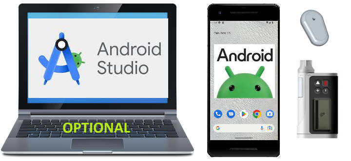

# Prehľad komponentov

<0>AAPS</0> nie je len (self-built) aplikácia, je to jeden z niekoľkých modulov vášho systému uzavretej slučky. Pred tým ako sa rozhodnete, ktoré komponenty použijete bolo by dobré pozrieť sa na dokumentáciu ku komponentom.



```{admonition} IMPORTANT SAFETY NOTICE
:class: important

Bezpečnosť **AAPS** vychádza hlavne z toho aké bezpečnostné funkcie majú vaše zariadenia. Pre správne fungovanie uzavretej slučky je mimoriadne dôležité, aby ste používali iba inzulínovú pumpu a systém CGM, ktoré sú testované, plne funkčné a schválené oficiálnymi orgánmi vašej krajiny. Úpravy hardvéru alebo softvéru týchto komponentov môžu spôsobiť neočakávané dávkovanie inzulínu, čo predstavuje značné riziko pre používateľa. Ak nájdete alebo vám ponúknu pokazené, upravené alebo svojpomocne vyrobené inzulínové pumpy alebo prijímače CGM, **nepoužívajte** ich na vytvorenie systému **AAPS**.

Okrem toho je rovnako dôležité používať iba originálne pomôcky, ako sú zavádzače, kanyly a zásobníky na inzulín schválené výrobcom na použitie s vašou pumpou alebo systémom CGM. Používanie netestovaných alebo upravených pomôcok môže spôsobiť nepresnosť CGM a chyby v dávkovaní inzulínu. Inzulín je pri nesprávnom dávkovaní veľmi nebezpečný – nezahrávajte si so životom manipuláciou s týmito zariadeniami.

V neposlednom rade nesmiete užívať inhibítory SGLT-2 (gliflozíny), pretože výrazne znižujú hladinu cukru v krvi. Kombinácia so systémom, ktorý znižuje bazálne dávky s cieľom zvýšiť glykémiu, je obzvlášť nebezpečná, pretože kvôli gliflozínu k tomuto zvýšeniu glykémie nemusí dôjsť a môže nastať nebezpečný stav nedostatku inzulínu. [Viac informácií tu](#PreparingForAaps-no-sglt-2-inhibitors).
```

## Potrebné moduly

### Dobrý individuálny dávkovací algoritmus pre liečbu vašej cukrovky

Aj keď sa nejedná o niečo, čo by sa dalo vytvoriť alebo kúpiť, ide o „modul“, ktorý je pravdepodobne najviac podceňovaný, ale je nevyhnutný. Keď necháte algoritmus pomáhať vám s cukrovkou, potrebuje poznať správne nastavenia, aby neurobil vážne chyby. Aj keď vám stále chýbajú ďalšie moduly, svoj **profil** si už teraz môžete overiť a upraviť v spolupráci s vaším diabetológom.

**Profil** obsahuje:

- BR (bazálne dávky): podávanie bazálneho inzulínu;
- ISF (faktor citlivosti na inzulín): o koľko sa zníži hladina glukózy v krvi po podaní 1 jednotky inzulínu;
- CR (sacharidový pomer): koľko gramov sacharidov pokrýva 1 jednotka inzulínu;
- DIA (trvanie účinku inzulínu).

Väčšina používateľov slučky používa cirkadiánny BR, ISF a CR, ktoré prispôsobujú hormonálnu citlivosť na inzulín počas dňa.

Viac informácií o **profile** [na príslušnej stránke](../SettingUpAaps/YourAapsProfile.md).

### Telefón

Pozrieť si môžte na stránke [Telefóny](../Getting-Started/Phones.md).

### Inzulínová pumpa

Pozrieť si môžte na stránke [Kompatibilné pumpy](../Getting-Started/CompatiblePumps.md).

**Výhody a nevýhody niektorých modelov púmp**

Combo, Insight a staršie Medtronic sú solídne pumpy s možnosťou uzavretého okruhu. Combo má výhodu v podobe oveľa väčšieho počtu typov infúznych setov, z ktorých si môžete vybrať, pretože má štandardný Luer-Lock. A batéria je štandardná, kúpite ju na každej benzínovej pumpe, v obchode s potravinami otvorenom 24 hodín denne a ak ju naozaj potrebujete, môžete si ju ukradnúť/požičať z diaľkového ovládača v hotelovej izbe ;-).

Výhody DanaR/RS a Dana-i oproti Combo ako preferovanej pumpe sú však:

- Počiatočné párovanie je s Dana-i/RS jednoduchšie. Toto ale obvykle robíte len raz, takže to má vplyv iba ak plánujete testovanie nových funkcií s rôznymi pumpami.
- Zatiaľ Combo pracuje s analýzou obrazovky. Vo všeobecnosti to funguje dobre ale je to pomalé. Pre uzavretý okruh to nie je príliš dôležité, keďže všetko prebieha na pozadí. Počas podávania bolusov musí byť pumpa stále v dosahu BT. Ak sa vzdialite od telefónu (napr. odbehnete do kuchyne niečo variť) signál sa môže prerušiť a bolus sa nemusí podať správne.
- Combo vibruje na konci TBR, DanaR vibruje (alebo pípa) na SMB. V noci budete pravdepodobne viac používať TBR ako SMB.  Dana-i/RS sa dá nastaviť tak, aby nepípala ani nevibrovala.
- Na pumpách Dana-i/RS sa dá história načítať v priebehu niekoľkých sekúnd spolu so záznamami o sacharidoch a hneď ako budu dostupné CGM dáta môžte pokračovať v slučke.
- Všetky pumpy, s ktorými **AAPS** dokáže komunikovať, sú pri dodaní vodotesné. Iba pumpy Dana majú "záruku na vodotesnosť" v dôsledku utesneného priestoru pre batériu a plniaceho systému zásobníka.

### Zdroj glykémie

Viacej na stránke [Kompatibilné CGM](../Getting-Started/CompatiblesCgms.md).

### **AAPS**- súbor.apk

Hlavná zložka systému. Ak chcete aplikáciu nainštalovať, musíte si najprv sami zostaviť súbor .apk. Pokyny sú [tu](../SettingUpAaps/BuildingAaps.md).

### Reportovací server

Reportovací server zobrazuje vaše údaje o glukóze a liečbe a vytvára správy pre podrobnú analýzu. V súčasnosti sú k dispozícii dva report servery pre AAPS: [Nightscout](#SettingUpTheReportingServer-nightscout) a [Tidepool](#SettingUpTheReportingServer-tidepool). Oba poskytujú spôsoby vizualizácie údajov o cukrovke, poskytujú štatistiky o **čase v rozsahu** (TIR) ​​a ďalšie ukazovatele.

Reportovací server je nezávislý od ostatných modulov. Ak nechcete používať reportovací server mali by ste vedieť, že nie je povinný pre dlhodobú funkčnosť **AAPS**. Stále si ho však musíte nastaviť, pretože bude potrebný na splnenie [**Cieľa 1**](#objectives-objective1).

Ďalšie informácie o nastavení reportovacieho servera nájdete [tu](../SettingUpAaps/SettingUpTheReportingServer.md).

## Voliteľné moduly

### Inteligentné hodinky

Môžete si vybrať akékoľvek inteligentné hodinky s operačným systémom Android WearOS 2.x až do verzie 4.x. **Pozor, WearOS 5.x nie je vždy kompatibilný!**

Používatelia vytvárajú [zoznam testovaných telefónov a hodiniek](#Phones-list-of-tested-phones). Existujú rôzne ciferníky na použitie s **AAPS**, ktoré nájdete [tu](../WearOS/WearOsSmartwatch.md).

### xDrip+

Aj keď nepotrebujete mať aplikáciu xDrip+ ako **zdroj glykémie**, stále ju môžete použiť na upozornenia alebo na iné zobrazenie hladiny glukózy v krvi. Môžete mať toľko upozornení, koľko chcete, určiť čas, kedy má byť alarm aktívny, či môže prepísať tichý režim atď. Niektoré informácie o xDrip+ nájdete [tu](../CompatibleCgms/xDrip.md). Upozorňujeme, že dokumentácia k tejto aplikácii nie je vždy aktuálna, pretože jej vývoj je pomerne rýchly.

## Čo robiť počas čakania na moduly

Niekedy to chvíľu trvá kým získate všetky moduly na uzavretý okruh. Ale žiadny strach, počas čakania sa dá robiť veľa vecí. Je **nevyhnutné** skontrolovať a (v prípade potreby) upraviť bazálne dávky (BR), inzulín-sacharidový pomer (IC), faktory citlivosti na inzulín (ISF) atď. A možno by otvorená slučka mohla byť dobrým spôsobom, ako otestovať systém a oboznámiť sa s **AAPS**. V tomto režime systém **AAPS** poskytuje odporúčania, ktoré môžete vykonať manuálne.

Môžete si tu prečítať dokumentáciu, spojiť sa s inými loopermi online alebo offline, [čítať](../UsefulLinks/BackgroundReading.md) dokumentáciu alebo to, čo píšu iní looperi (aj keď musíte byť opatrní, nie všetko je správne).

**Hotovo?** Ak máte všetky komponenty **AAPS** pohromade (gratulujeme!) alebo aspoň dostatok na spustenie v režime otvorenej slučky, mali by ste si pred každým novým cieľom a nastavením hardvéru prečítať [popis cieľa](../SettingUpAaps/CompletingTheObjectives.md).
