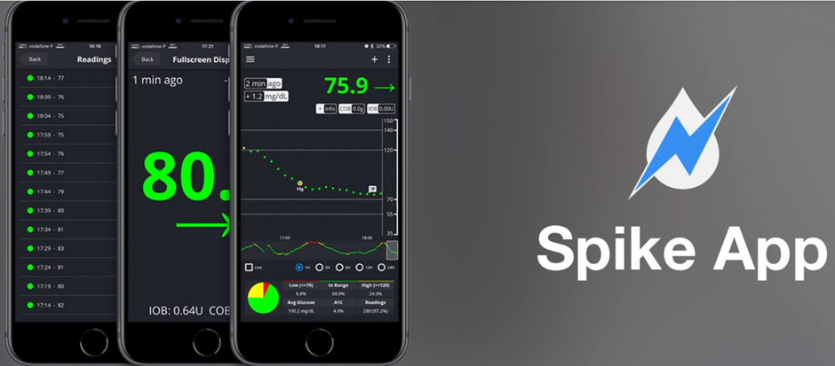

# Following AAPS (no interaction with the AAPS system)

In addition to the range of possibilities available for remotely controlling _and_ following **AAPS** which are described at [remote control](../RemoteFeatures/RemoteControl.md), there are several additional apps and devices which the community has developed, to simply follow numbers (glucose levels and other information), without interacting with **AAPS**.

A good overview of the extensive options available for following **AAPS** is at [Nightscout follower](https://nightscout.github.io/nightscout/downloaders/#) webpage.

```{contents} Table of contents
:depth: 1
:local: true
```

The most common strategies used in combination with **AAPS** are explained in more detail below.

## Smartphone apps

```{contents} These are some of the main “follower” apps used by **AAPS** users. All of these apps are “free”: 
:depth: 1
:local: true
```

### Dexcom Follow ([Android](https://play.google.com/store/apps/details?id=com.dexcom.follow.region2.mgdl) and [iOS](https://apps.apple.com/fr/app/dexcom-follow-mg-dl-dxcm2/id1032203080))


* Dexcom Follow is compatible with a wide range of handsets (both Android and iPhone). Dexcom Follow can be used even if you are not using the official Dexcom app to receive sensor data.

* Many caregivers are familiar with Dexcom Follow, preferring its clear interface over something more complicated.

* Dexcom Follow is very good for teachers/grandparents and people who know very little about diabetes and sugar levels. It has customisable alerts (BG level, what sound to play etc.). Alarms can be completely switched off if needed, which is very useful if you have a sensor which is still settling down and creating multiple fake lows.

#### Setting up Dexcom Follow: how-to-guide

If you use the unofficial Dexcom app BYODA for receiving sensor data, you may be able to send invites to followers from within the BYODA app.

You cannot send invite emails to Dexcom followers anymore from third-party apps. In xDrip+ the invite request will just result in the message “invite not sent”.

You must install the official Dexcom app, send the invite, and then uninstall the official app.

The steps to do this are as follows:

1)  Install the official “Dexcom” app on _any_ smartphone (Android/iPhone), this can be the Follower phone, if it is more convenient. 2)  Log in with your Dexcom username and password, this is the same login details you would use for Dexcom Clarity, if you are already a current Dexcom/Clarity customer. If you don’t have a Dexcom login, there is the option to create a new login at this point.   
3)  Swipe through the introduction menus. 4)  Add “no code” for the sensor code. 5)  Under Transmitter SN select “enter manually” and enter any valid transmitter code (use one of your expired transmitter codes, if you know one, so it doesn’t interfere with the running of your current transmitter, they follow a specific format of certain numbers and letters: “NLNNNL” and only use certain combinations, so it’s easiest to use one you already know is valid). 6)  Once the app is trying to find the transmitter and sensor, you will be able to invite followers: select the small three dots in the top left of the app, and add new follower. You can also use this if one of your followers has changed their handset and needs a fresh invite, here you can delete them from the follower list and resend a new invite email for them to use on their new handset. 7)  On the Follower phone, install Dexcom Follow by downloading it from the App Store (iPhone) or Play (Android). Set up the Dexcom Follow app, and you will be prompted to open your email to find the invite to be a Follower.    
8)  You can now delete the official Dexcom G6 app.

For Dexcom Follow, the sensor data is then exported from the **AAPS** phone either directly from BYODA, or from xDrip+, depending on which app you are using.


### [Nightguard](https://apps.apple.com/fr/app/nightguard/id1116430352) (iOS)


Pros (as reported by users):

* Available in the [app store](https://apps.apple.com/us/app/nightguard/id1116430352), simple, user-friendly interface.

* Swipe button or shake phone to snooze alarms at different intervals ranging from 5 min to 24 hours

* Customize alarms (high, low alerts, missed readings when no data for 15-45 minutes).

* Fast rise/drop over 2-5 consecutive readings (you choose). Can also choose the delta between two individual readings

* Smart snooze so doesn't alert if levels are moving in right direction

* There is a Care tab which appears to enable you to set a new temp target for a certain duration, delete the temp target or enter carbs.

Cons (as reported by users)

* Only available for iOS

* The TT shows as 5 mmol regardless of which TT level is set

* Never shows Temp Basal rate even though it shows TB

### [Nightwatch](https://play.google.com/store/apps/details?id=se.cornixit.nightwatch) (Android)


* Nightwatch markets itself as a Nightscout client and monitors the user’s Nightscout glucose levels on either Android phone or tablet.

* The app can be downloaded from [Google play](https://play.google.com/store/apps/details?id=se.cornixit.nightwatch) and displays BG data in real time.

* The user can be alerted with customised noisy low and high alarms set.

* BG data can be viewed in either mmol/L or mg/dL.

* It requires Android 5.0 and up.

* It has a dark Ul, large readings and buttons, designed for usage at night.

### xDrip+ (Android)

You can use xDrip+ as a follower.

#### With Nightscout

Set xDrip+ as a Nightscout Follower. You will receive BG and treatments, not basal.


#### Without Nightscout - xDrip+ BG data source

If your **AAPS** data source is xDrip+ (or if xDrip+ can also receive BG from another app like BYODA, Juggluco, ...) you can use it from the master phone to share data with xDrip+ followers, displaying BG, treatments and basal rates.


#### Without Nightscout - xDrip+ BG companion app

If your **AAPS** data source is not xDrip+ but you can display BG data from the Companion App data source, you can use it from the master phone to share data with xDrip+ followers, displaying BG, treatments and basal rates.


### xDrip4iOS (iOS)


xDripSwift was created from porting the original xDrip app to iOS and evolved to "xDrip for iOS" written **xDrip4iOS** .

```{admonition} Further detail about how to attempt to obtain the original **xDrip4iOS** app
:class: dropdown
The [xDrip4iOS Facebook group](https://www.facebook.com/groups/853994615056838/announcements) is the main community support for xDrip4iOS and Shuggah. **xDrip4iOS** can connect to many different CGM systems and transmitters and display blood glucose values, charts and statistics as well as provide alarms. It can also upload to Nightscout or act as a [follower app for Nightscout](https://xdrip4ios.readthedocs.io/en/latest/connect/follower/). 

"How can I get **xDrip4iOS** on my iPhone?"
There are two options:

1. If you have a Mac and an Apple Developer account (99 EUR/USD per year) you can build your own xDrip4iOS by [following the instructions](https://xdrip4ios.readthedocs.io/en/latest/install/build/).

If you want, you can then become a "releaser" and [share a Personal Testflight xDrip4iOS](https://xdrip4ios.readthedocs.io/en/latest/install/personal_testflight/) with up to 100 other people to help them.

2. You join the [xDrip4iOS Facebook group](https://www.facebook.com/groups/853994615056838/announcements) and read the pinned posts for current methods to get the app. **You should not ask for an invitation to the app** (read the group rules).
```


"What is **Shuggah**?" A group of Ukrainian developers copied the project code for xDrip4iOS (which is shared publicly on GitHub) and released it on the App Store under a business account. The Shuggah release is in no way managed by the xDrip4iOS developers.

The [xDrip4iOS Facebook group](https://www.facebook.com/groups/853994615056838/announcements) supports xDrip4iOS, and the matching Apple Watch apps.

### [Sugarmate](https://apps.apple.com/fr/app/sugarmate/id1111093108) (iOS)


[Sugarmate](https://sugarmate.io/) is available to download onto iPhones from the App store. Sugarmate is compatible with:
* Apple iPhone (Requires software version 13.0 or later)
* Apple iPad (Requires software version 13.0 or later)
* Google Android (Save web app to your homescreen)

It has been reported by users of Sugarmate that it can be used with Apple CarPlay in the USA to display glucose readings when driving. It is not yet established if this is possible in countries outside the USA. If you know more about this, please add details in here to the documentation by completing a pull-request (link) which is quick and easy to do.


### [Spike](https://spike-app.com/) (iOS)



Spike can be used as a primary receiver or as a follower app, providing BG, alarms and IOB and more.

The website and app are no longer developed. Support can be found on [Facebook](https://www.facebook.com/groups/1973791946274873) and [Gitter](https://gitter.im/SpikeiOS/Lobby).

## Smartwatches for **Monitoring of AAPS** (full profile data, or glucose-only) where **AAPS** is running on a phone.

See [here](../Getting-Started/Watches.md).


## Devices for following AAPS

```{contents} Devices include:
:depth: 1
:local: true
```

### M5 stack


The M5Stack is a small box which can be programmed for many applications, Martin's project [M5Stack NightscoutMon](https://github.com/mlukasek/M5_NightscoutMon/wiki) is displaying sensor glucose values and trends, IOB and COB. It is in a plastic box, equipped with a colour display, micro SD card slot, 3 buttons, speaker and internal battery. It is a great blood sugar monitor and is relatively easy to set up if you have a Nightscout account. Users typically run it on their home Wi-Fi, but some users report using it as a display when motorbiking, by running it off a phone Wi-Fi hotspot.

### Sugarpixel

SugarPixel is a device for secondary glucose display alert system for continuous glucose monitoring that connects with Dexcom app or Nightscout app on the user’s smartphone. The device displays real time blood sugar readings. This CGM hardware monitor benefits from random tone generation audio alerts (which are incredibly loud), vibration alerts for hearing impaired, customisable display options and native multi-user following.


* SugarPixel has multiple display options in mg/dL and mmol/L to suit the user’s needs with colour-coded glucose values.
* The standard face displays BG, Trend Arrow, and Delta. Delta is the change + or - from the last reading.
* SugarPixel can be customised for use in low brightness with the BG and Time face to see the user’s BG reading and current time on the user’s nightstand.
* SugarPixel’s xolour face utilises the entire display to show a single colour representing the BG value. This enables the user to see BG readings at a distance through the window while outside playing in the backyard, patio, or pool.
* The Big BG face is useful for nightstand users who wear glasses or contact lenses.

### Nightscout Clock on Ulanzi TC001

**Nightscout Clock** is an open source software running on the **Ulanzi TC001** device. It connects with Dexcom servers or Nightscout and displays real time blood sugar readings.


* The clock supports both mmol/L and mg/dL units, and includes audible alarms.
* Several display available, see [Github nightscout-clock](https://github.com/ktomy/nightscout-clock?tab=readme-ov-file#more-information-for-people-who-needs-it) for an overview.
* Setting up and configuring the device involves just a few simple steps. Once set up, it only requires power and Wi-Fi to function.
* The Ulanzi TC001 device is significantly cheaper than the SugarPixel to buy.
* The software along with installation instructions can be found on [Github nightscout-clock](https://github.com/ktomy/nightscout-clock?tab=readme-ov-file).
* It is developed and maintained by Artiom Kenibasov, offering support on the [Facebook AAPS Users group](https://www.facebook.com/groups/cgminthecloud/posts/8776932509094594/).

### PC (TeamViewer)
Some users find a full remote access tool like [TeamViewer](https://www.teamviewer.com/) to be helpful for advanced remote troubleshooting.
