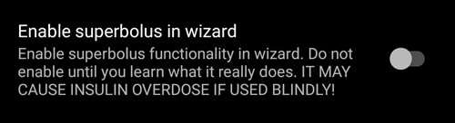

# Nastavenia

- **Otvorte nastavenia** kliknutím na trojbodkové menu v pravom hornom rohu domovskej obrazovky.


- Na nastavenia pre konkrétnu kartu (napr. kartu pumpy) môžete prejsť priamo otvorením tejto karty a kliknutím na položku Nastavenia doplnkov.


- **Podponuky** je možné otvoriť kliknutím na trojuholník pod názvom podponuky.


- Pomocou **filtra** v hornej časti obrazovky s nastaveniami môžete rýchlo získať prístup k určitým nastaveniam. Stačí začať písať časť textu, ktorý hľadáte.


```{contents}
:backlinks: entry
:depth: 2
```

(Preferences-general)=
## Všeobecne


**Jednotky**

- Nastavte jednotky na mmol/l alebo mg/dl podľa vašej potreby.

**Jazyk**

- Máte aj možnosť použiť predvolený jazyk telefónu (odporúčané).

- Ak chcete **AAPS** v inom jazyku, ako je váš štandardný jazyk telefónu, môžete si vybrať zo širokej ponuky.

- Ak používate rôzne jazyky, niekedy sa môže stať, že sa používajú rôzne kombinácie týchto jazykov. Je to spôsobené problémom s Androidom, kde prepísanie predvoleného jazyka systému Android niekedy nefunguje.
- Nastavenie je skryté v [jednoduchom režime](#preferences-simple-mode).

(preferences-simple-mode)= **Simple mode**

**Jednoduchý režim**je predvolene aktivovaný pri prvej inštalácii **AAPS**. V **jednoduchom režime** je značné množstvo nastavení skryté a nastavenia sú nahradené preddefinovanými hodnotami. [Ďalšie grafy](#AapsScreens-section-g-additional-graphs) na domovskej stránke sú tiež preddefinované. Jednoduchý režim by ste mali vypnúť hneď, ako sa oboznámite s používateľským rozhraním a nastaveniami **AAPS**.

**Meno pacienta**

- Môžete použiť, ak musíte rozlišovať medzi viacerými nastaveniami (napr. dve deti s diabetom 1. typu vo vašej rodine).
- Zobrazuje sa v [dvojitom ciferníku](../WearOS/WearOsSmartwatch.md).

(Preferences-skin)=
### Vzhľad

Nastavenie je skryté v [jednoduchom režime](#preferences-simple-mode).

Môžete si vybrať zo štyroch typov vzhľadov:


„Vzhľad s nízkym rozlíšením“ má kratšie označenia a odstránený vek/úroveň, aby sa na obrazovke s veľmi nízkym rozlíšením vytvorilo viac miesta.

Rozdiel medzi ostatnými vzhľadmi závisí od orientácie displeja telefónu:

#### Orientácia na výšku

- **Pôvodný vzhľad** a **Tlačidlá zobrazené v dolnej časti obrazovky** sú identické
- **Veľký displej** má v porovnaní s inými vzhľadmi zväčšenú výšku všetkých grafov

#### Orientácia na šírku

- Pri použití **Originálneho vzhľadu** a **Veľkého displeja** musíte posunúť nadol, aby ste videli tlačidlá v dolnej časti obrazovky

- **Veľký displej** má v porovnaní s inými vzhľadmi zväčšenú výšku všetkých grafov


(Preferences-protection)=
## Ochrana


(Preferences-master-password)=
### Hlavné heslo

Povinné pre možnosť [exportovať nastavenia](../Maintenance/ExportImportSettings.md), pretože sú od verzie 2.7 šifrované.

**Biometrická ochrana nemusí na telefónoch OnePlus fungovať. Toto je známy problém na niektorých telefónoch OnePlus.**


### Ochrana nastavení

- Chráňte svoje nastavenia heslom alebo biometrickým overením telefónu (napr. [ak dieťa používa **AAPS**](../RemoteFeatures/RemoteMonitoring.md)). Ak túto funkciu povolíte, budete vyzvaní na overenie vždy, keď budete chcieť získať prístup k akémukoľvek zobrazeniu súvisiacemu s nastaveniami.

- Vlastné heslo by sa malo použiť, ak chcete hlavné heslo používať iba na zabezpečenie [exportovaných nastavení](../Maintenance/ExportImportSettings.md), a iné heslo na úpravu nastavení.

- Ak používate vlastné heslo, kliknite na riadok „Nastavenia hesla“ a nastavte heslo podľa postupu [vyššie](#Preferences-master-password).


### Ochrana aplikácie

Ak je aplikácia chránená, musíte na otvorenie aplikácie **AAPS** zadať heslo alebo použiť biometrické overenie telefónu.

**AAPS** sa okamžite vypne, ak zadáte nesprávne heslo, ale bude stále bežať na pozadí, ak bol predtým úspešne spustený.

### Ochrana bolusu

- Ochrana bolusu môže byť užitočná, ak **AAPS** používa malé dieťa a vy [podávate bolus cez SMS](../RemoteFeatures/SMSCommands.md).

- V nasledujúcom príklade vidíte výzvu na biometrickú ochranu. Ak biometrické overenie nefunguje, kliknite do priestoru nad bielym oknom a zadajte hlavné heslo.


### Uchovanie hesla a PIN

Definujte, ako dlho (v sekundách) zostanú nastavenia alebo funkcie bolusu odomknuté po úspešnom zadaní hesla.

## Prehľad

V sekcii **Prehľad** môžete definovať nastavenia pre domovskú obrazovku.


### Nechať obrazovku zapnutú

Možnosť „Ponechať obrazovku zapnutú“ prinúti Android, aby obrazovka zostala zapnutá stále. Toto je užitočné pri prezentáciách atď. Ale spotrebuje veľa energie batérie. Preto sa odporúča pripojiť smartfón k nabíjačke.

(Preferences-buttons)=
### Buttons

- Definujte, ktoré tlačidlá sú viditeľné v dolnej časti domovskej obrazovky.
- Nastavenie je skryté v [jednoduchom režime](#preferences-simple-mode).


- Možnosti **Prídavok** vám umožňujú definovať množstvo inzulínu pre tri tlačidlá v oknách sacharidy a inzulín.


(Preferences-quick-wizard)=
### Sprievodca rýchlym bolusom

Vytvorte si prispôsobené tlačidlá pre určité jedlá alebo občerstvenie, ktoré sa budú zobrazovať na domovskej obrazovke. Užitočné pre jedlá, ktoré často konzumujete.

Pre každé tlačidlo definujete sacharidy a spôsob výpočtu bolusu. Potom si nastavíte v ktorom časovom úseku sa má tlačidlo zobrazovať na hlavnej obrazovke - v danom čase sa môže zobraziť len jedno. Tlačidlo nebude viditeľné, ak je časový rozsah mimo zadaného rozsahu alebo ak máte dostatok IOB na pokrytie sacharidov definovaných v tlačidle rýhleho bolusu. Ak sú pre rôzne jedlá zadané rôzne časy, na domovskej obrazovke sa vždy zobrazí príslušné tlačidlo jedla v závislosti od dennej doby.


Ak kliknete na tlačidlo rýchleho bolusu, systém **AAPS** vypočíta a navrhne bolus pre tieto sacharidy na základe vašich aktuálnych pomerov (s prihliadnutím na hodnotu glukózy v krvi alebo IOB, ak je nastavený).

Návrh musí byť potvrdený pred podaním inzulínu.


Súčasne sa môže zobraziť iba jedno tlačidlo rýchleho bolusu. Ak chcete spustiť iný: dlho podržte zobrazené tlačidlo rýchleho bolusu. Presmeruje vás na zoznam všetkých uložených možností rýchleho bolusu. Ak chcete jeden použiť, dlho ho podržte. Pred použitím ho budete musieť potvrdiť.

(Preferences-default-temp-targets)=
### Predvolené dočasné ciele

Toto nastavenie je skryté v [jednoduchom režime](#preferences-simple-mode).

[Dočasné ciele (TT)](../DailyLifeWithAaps/TempTargets.md) vám umožňujú zmeniť cieľovú hodnotu glukózy v krvi na určité časové obdobie. Pri nastavovaní predvoleného TT môžete jednoducho zmeniť cieľ aktivity, pred jedlom atď.

Tu môžete zmeniť cieľ a trvanie pre každý preddefinovaný TT. Prednastavené hodnoty sú:

* Pred jedlom: cieľová hodnota 72 mg/dl / 4,0 mmol/l, trvanie 45 min
* Aktivita: cieľová hodnota 140 mg/dl / 7,8 mmol/l, trvanie 90 min
* Hypoglykémia: cieľová hodnota 125 mg/dl / 6,9 mmol/l, trvanie 45 min


[Tu](#TempTargets-where-can-i-select-a-temp-target) si môžte pozrieť ako aktivovať dočasné ciele.

### Štandardné množstvo inzulínu pre Plnenie/Doplňovanie

Toto nastavenie je skryté v [jednoduchom režime](#preferences-simple-mode).

Ak chcete naplniť hadičku alebo kanylu cez **AAPS**, môžete to urobiť na karte [**Akcie**](#screens-action-tab).

V tomto okne je možné definovať prednastavené hodnoty. V okne plnenia/dopĺňanie vyberte predvolené hodnoty troch tlačidiel v závislosti od dĺžky vašej kanyly.

(Preferences-range-for-visualization)=
### Rozsah pre zobrazenie

Vyberte si najvyššie a najnižšie hodnoty pre graf glykémie v prehľade **AAPS** a na inteligentných hodinkách. Je to len vizualizácia, nie cieľový rozsah vašej glykémie. Príklad: 70 – 180 mg/dl alebo 3,9 – 10 mmol/l


### Krátke názvy modulov

Toto nastavenie je skryté v [jednoduchom režime](#preferences-simple-mode).

Užitočné na zobrazenie viacerých názvov kariet na obrazovke.

Napríklad karta „OpenAPS AMA“ sa zmení na „OAPS“, „CIELE“ na „OBJ“ ​​atď.


(Preferences-show-notes-field-in-treatments-dialogs)=
### Zobrazenie pola na poznámky v oknách ošetrenia

Toto nastavenie je skryté v [jednoduchom režime](#preferences-simple-mode).

Ponúka možnosť pridať k ošetreniam krátke textové poznámky (kalkulačka, sacharidy, inzulín...)


(Preferences-status-lights)=
### Indikátory stavu

Toto nastavenie je skryté v [jednoduchom režime](#preferences-simple-mode).

Indikátory stavu zobrazujú vizuálne varovanie pre tieto možnosti:

- Vek senzora
- Úroveň nabitia batérie senzora pre niektoré inteligentné čítačky (podrobnosti nájdete na [stránke snímky obrazovky](#screens-sensor-level-battery)).
- Vek inzulínu (dni používania zásobníka)
- Hladina inzulínu v zásobníku (units)
- Vek kanyly
- Vek batérie v pumpe
- Úroveň nabitia batérie pumpy (%)

Ak je prekročená prahová hodnota varovania, hodnoty sa zobrazia žltou farbou. Ak je prekročená kritická hodnota, hodnoty sa zobrazia červenou farbou.

Posledná možnosť vám umožňuje importovať tieto nastavenia z Nightscoutu, ak sú tam definované. Viac informácií nájdete v [dokumentácii k Nightscoutu](https://nightscout.github.io/nightscout/setup_variables/#age-pills).


(Preferences-deliver-this-part-of-bolus-wizard-result)=
### Podaj túto časť z výsledku kalkulácie

Nastavte [predvolené percento](#AapsScreens-section-j) bolusu vypočítaného pri použití bolusovej kalkulačky.

Predvolená hodnota je 100 %: žiadna korekcia. Aj keď tu nastavujete inú hodnotu, stále ju môžete zmeniť pri každom použití bolusovej kalkulačky. Ak je toto nastavenie 75 % a museli ste podať bolus 10 jednotiek, kalkulačka navrhne bolus k jedlu iba 7,5 jednotiek.

Pri používaní systému [SMB](#objectives-objective9) si veľa ľudí nepodáva 100 % potrebného inzulínu v podobe bolusu k jedlu, ale iba jeho časť (napr. 75 %) a zvyšok nechávajú na systém SMB s funkciou UAM (Unattended Meal Detection). Použitie hodnoty nižšej ako 100 % tu môže byť dosť nápomocné:
* Pre ľudí s pomalým trávením: odoslanie celého bolusu naraz môže spôsobiť hypoglykémiu, pretože účinok inzulínu je rýchlejší ako trávenie.
* aby sa **AAPS** mohol sám vysporiadať so **zvýšenou hladinou glukózy v krvi**. V oboch prípadoch systém **AAPS** kompenzuje chýbajúcu časť bolusu pomocou SMB, ak/keď sa to bude považovať za dostatočné.

### Povolenie bolusového poradcu

Toto nastavenie je skryté v [jednoduchom režime](#preferences-simple-mode).


Keď je táto funkcia povolená a používate bolusového sprievodcu počas hyperglykémie, zobrazí sa vám upozornenie s výzvou, či chcete podať bolus a najesť sa neskôr, keď sa vaša **glykémia** vráti do rozsahu.

### Povolenie pripomenutia bolusu

Toto nastavenie je skryté v [jednoduchom režime](#preferences-simple-mode).

% todo

(Preferences-advanced-settings-overview)=
### Rozšírené nastavenia (prehľad)



#### Superbolus

Toto nastavenie je skryté v [jednoduchom režime](#preferences-simple-mode).

Option to enable superbolus in bolus wizard.

[Superbolus](https://www.diabetesnet.com/diabetes-technology/blue-skying/super-bolus/) is a concept to "borrow" some insulin from basal rate in the next two hours to prevent spikes. Je to niečo iné ako *super mikro bolus*!

Používajte ho opatrne a nepovoľujte ho, kým nezistíte ako funguje. V podstate sa k bolusu pridá bazálna dávka na ďalšie dve hodiny a na ďalšie dve hodiny sa vypne bazál. **Funkcie slučky AAPS budú vypnuté – preto ich používajte opatrne! Ak používate SMB, AAPS** vypne slučku podľa vašich nastavení v časti [„Maximálny počet minút bazálnej dávky na obmedzenie SMB na“](#Open-APS-features-max-minutes-of-basal-to-limit-smb-to). Ak nepoužívate SMB slučka sa automaticky pozastaví na dve hodiny. Podrobnosti o super boluse nájdete [tu](https://www.diabetesnet.com/diabetes-technology/blue-skying/super-bolus).

## Bezpečnosť ošetrení

(preferences-patient-type)=
### Typ pacienta

- Bezpečnostné limity sú nastavené na základe veku, ktorý vyberiete v tomto nastavení.
- Ak začnete narážať na tieto pevné limity (ako napríklad maximálny bolus), je čas posunúť sa o krok vyššie.
- Neodporúčame zadať vyšší vek ako je skutočný pretože to môže viesť k predávkovaniu inzulínom (napríklad vynechaním desatinnej bodky).
- Ak vás zaujímajú aké presné hodnoty majú tieto bezpečnostné limity, prejdite na [stránku](../DailyLifeWithAaps/KeyAapsFeatures.md) k funkcii algoritmu, ktorý používate.

### Maximálny povolený bolus

- Definuje maximálne množstvo bolusového inzulínu v inzulínových jednotkách, ktoré môže systém **AAPS** podať naraz.
- Je to bezpečnostné nastavenie aby sa predišlo podaniu príliš velkého bolusu v prípade, že omylom zadáte chybné množstvo sacharidov a pod.
- Odporúča sa ho nastaviť na takú hodnotu, ktorá zhruba zodpovedá maximálnemu bolusu, ktorý budete potrebovať pri jedle alebo korekcii.
- Toto obmedzenie sa vzťahuje aj na výsledky bolusovej kalkulačky.

### Maximálne povolené množstvo sacharidov

- Definuje maximálne množstvo sacharidov v gramoch, ktoré môže bolusová kalkulačka **AAPS** použiť pre výpočet.
- Je to bezpečnostné nastavenie aby sa predišlo podaniu príliš velkého bolusu v prípade, že omylom zadáte chybné množstvo sacharidov a pod.
- Odporúča sa ho nastaviť na takú hodnotu, ktorá zhruba zodpovedá maximálnemu množstvu sacharidov, ktoré prijmete v jednom jedle.

## Uzavretý okruh

(Preferences-aps-mode)=
### Režim APS
Prepínanie medzi otvorenou slučkou, uzavretou slučkou a pozastavením pri nízkej hladine glukózy (LGS).


(Preferences-open-loop)=
#### Otvorený okruh
**AAPS** priebežne vyhodnocuje všetky dostupné údaje (IOB, COB, BG...) a v prípade potreby podáva návrhy ošetrení (dočasné bazálne dávky), ako upraviť vašu liečbu.

Návrhy sa nebudú vykonávať automaticky (ako v uzavretej slučke). Návrhy musí používateľ zadať manuálne do pumpy (ak sa používa virtuálna pumpa) alebo pomocou tlačidla, ak je **AAPS** pripojený k reálnej pumpe.

Táto možnosť slúži na oboznámenie sa s fungovaním systému **AAPS** alebo v prípade, že používate nepodporovanú pumpu. Bez ohľadu na to, aké rozhodnutie tu urobíte, budete v otvorenej slučke až do konca **[Cieľa 5](#objectives-objective5)**.

(preferences-closed-loop)=
#### Uzavretý okruh

Systém **AAPS** priebežne vyhodnocuje všetky dostupné údaje (IOB, COB, BG...) a v prípade potreby automaticky upravuje dávkovanie (_t. j._ bez ďalšieho zásahu z vašej strany), aby sa dosiahol nastavený [cieľový rozsah alebo hodnota](#profile-glucose-targets) (podávanie bolusu, dočasná bazálna dávka, vypnutie inzulínu, aby sa predišlo hypoglykémii atď.).

Uzavretá slučka má viacero bezpečnostných obmedzení, ktoré si môžete prispôsobiť podľa seba.

Uzavretú slučku je možné používať iba v prípade, že plníte **[Cieľ 6](#objectives-objective6)** alebo vyšší a používate podporovanú pumpu.

#### Zastavovanie pri nízkej glykémii (LGS)

V tomto režime je [maxIOB](#Open-APS-features-maximum-total-iob-openaps-cant-go-over) nastavený na nulu.

To znamená, že ak hladina glukózy v krvi klesá, **AAPS** vám môže znížiť bazálnu dávku. Ak však hladina glukózy v krvi stúpa, automatická korekcia sa nevykoná. Vaše bazálne dávky zostanú rovnaké, ako sú definované vo vašom aktuálnom **profile**. Iba ak je IOB negatívny (z predchádzajúceho LGS), podá sa ďalší inzulín na zníženie **glykémie**.

(Preferences-minimal-request-change)=
### Minimálna požiadavka na zmenu

Pri používaní **Otvorenej slučky** budete dostávať upozornenia vždy, keď systém **AAPS** odporučí úpravu bazálnej dávky. Ak chcete znížiť počet upozornení, môžete použiť buď [širší cieľový rozsah bg](#profile-glucose-targets), alebo zvýšiť percento minimálnej miery požiadaviek. Tým nastavíte aká veľká zmena je potrebná aby sa zobrazilo upozornenie.

## Rozšírený asistent jedla (AMA) alebo super mikro bolus (SMB)

V závislosti od nastavení v [Konfigurátor > APS](#Open-APS-features-advanced-meal-assist-ama) si môžete vybrať medzi dvoma algoritmami:

- [Advanced meal assist (OpenAPS AMA)](#Open-APS-features-advanced-meal-assist-ama) – stav algoritmu v roku 2017
- [Super micro bolus (OpenAPS SMB)](#Open-APS-features-super-micro-bolus-smb) – najnovší algoritmus odporúčaný pre začiatočníkov

Od
**AAPS** verzie 3.3 bola funkcia [Dynamic ISF](../DailyLifeWithAaps/DynamicISF.md) presunutá ako súčasť OpenAPS SMB.</p> 


### OpenAPS AMA

Všetky nastavenia pre OpenAPS AMA sú popísané v časti [Kľúčové funkcie AAPS – Pokročilý asistent pri jedle (AMA)](#Open-APS-features-advanced-meal-assist-ama).

(Preferences-openaps-smb-settings)=


### OpenAPS SMB

Všetky nastavenia pre OpenAPS SMB sú popísané v časti [Kľúčové funkcie AAPS – Super mikrobolus (SMB)](#Open-APS-features-super-micro-bolus-smb).


## Nastavenie vstrebávania sacharidov

(Preferences-min_5m_carbimpact)=


### min_5m_carbimpact

Toto nastavenie je skryté v [jednoduchom režime](#preferences-simple-mode).

Algoritmus používa BGI (vplyv glukózy v krvi) na určenie, kedy sa [sacharidy vstrebávajú](../DailyLifeWithAaps/CobCalculation.md).

V prípadoch, keď absorpciu sacharidov nie je možné dynamicky vypočítať na základe reakcií vašej glykémie, **AAPS** vloží do vašich sacharidov predvolený rozklad. V podstate je to niečo ako poistka. Táto hodnota sa používa iba počas chýbajúcich údajov **CGM** alebo keď fyzická aktivita „spotrebuje“ všetok nárast hladiny glukózy v krvi, ktorý by inak spôsobil rozklad COB pomocou **AAPS**.

Jednoducho povedané: Algoritmus „*vie*“, ako by sa vaše glykémie mali správať, keď sú ovplyvnené aktuálnou dávkou inzulínu atď. Vždy, keď dôjde k pozitívnej odchýlke od očakávaného správania, niektoré sacharidy sa vstrebajú/rozložia. Veľká zmena = veľa sacharidov atď.

Parameter min_5m_carbimpact definuje predvolený vplyv absorpcie sacharidov za 5 minút. Viac informácií nájdete v [dokumentácii OpenAPS](https://openaps.readthedocs.io/en/latest/docs/While%20You%20Wait%20For%20Gear/preferences-and-safety-settings.html?highlight=carbimpact#min-5m-carbimpact).

Štandardná hodnota pre AMA je 5, pre SMB je to 8.

Graf COB na hlavnej obrazovke zobrazuje oranžovú bodku v hornej časti grafu, kedy sa používa min_5m_impact.


### Maximálna doba vstrebávania jedla

Ak často jedávate jedlá s vysokým obsahom tuku alebo bielkovín, budete musieť nastaviť dlhší čas vstrebávania jedla.


### Rozšírené nastavenia – pomer autosens


- Definujte min. a max. pomer [automatickej citlivosti](#Open-APS-features-autosens).
- Štandardné hodnoty (max. 1,2 a min. 0,7) by sa normálne nemali meniť.


## Pumpa


### Strážny pes BT

V prípade potreby aktivujte BT watchdog (napr. pre pumpy Dana). Ak nie je možné pripojenie k pumpe, na jednu sekundu sa vypne Bluetooth. To vám môže pomôcť na niektorých telefónoch, kde sa bluetooth zasekáva.


## Nastavenia pumpy

Možnosti sa budú líšiť v závislosti od pumpy, ktorú ste vybrali v nástroji [Konfigurátor > Pumpa](#Config-Builder-pump).  Spárujte a nastavte pumpu podľa [pokynov k pumpe](../Getting-Started/CompatiblePumps.md).


## Tidepool

Viac informácií nájdete na stránke [Tidepool](../SettingUpAaps/Tidepool.md).

(Preferences-nsclient)=


## Interný NSClient


Pôvodný komunikačný protokol, možno ho použiť so staršími verziami Nightscoutu.

- Nastavte si *URL adresu Nightscout* (napr. <https://yoursitename.yourplaform.dom>).
- **Uistite sa, že adresa URL je BEZ /api/v1/ na konci.**
- *[API secret](https://nightscout.github.io/nightscout/setup_variables/#api-secret-nightscout-password)* (12-znakové heslo uložené vo vašom Nightscoute).
- To vám umožní čítanie a zápis údajov medzi webovou stránkou Nightscout a **AAPS**.
- Ak ste sa zasekli pri Cieli 1, prekontrolujte si zadané údaje.


## NSClientV3


[Nový protokol zavedený s AAPS 3.2.](#Important-comments-on-using-v3-versus-v1-API-for-Nightscout-with-AAPS) Bezpečnejší a efektívnejší.


```{admonition} V3 data uploaders
:class: warning

Pri používaní NSClientV3 musia všetky zdroje ktoré uploadujú dáta používať API V3. Keďže väčšina z nich ešte nie je kompatibilná, znamená to, že **musíte povoliť **AAPS** nahrávať všetky údaje** (glukózu, ošetrenia atď.) do Nightscout a zakázať všetky ostatné nahrávacie programy, ak nie sú kompatibilné s V3.
```


- Nastavte si *URL adresu Nightscout* (napr. <https://yoursitename.yourplaform.dom>).
- **Uistite sa, že adresa URL je BEZ /api/v1/ na konci.**
- V Nightscoute vytvorte *[Admin token](https://nightscout.github.io/nightscout/security/#create-a-token)* (na používanie V3 API je potrebný [Nightscout 15](https://nightscout.github.io/update/update/)) a zadajte ho do **NS prístupového tokenu** (nie váš API secret!).
- To vám umožní čítanie a zápis údajov medzi webovou stránkou Nightscout a **AAPS**.
- Ak ste sa zasekli pri Cieli 1, prekontrolujte si zadané údaje.
- Možnosť Pripojenie k webovým socketom nechajte povolenú (odporúčané).

(Preferences-nsclient-synchronization)=


### Synchronizácia


Možnosti synchronizácie budú závisieť od spôsobu, akým chcete používať **AAPS**.

Môžete si vybrať, ktoré údaje chcete [nahrať a stiahnuť do alebo z Nightscoutu](#Nightscout-aaps-settings). 


### Nastavenie alarmov


- Možnosti alarmov vám umožňujú vybrať si, ktoré alarmy Nightscout chcete používať prostredníctvom aplikácie. **AAPS** potom spustí alarm, keď sa spustí alarm Nightscout.
- Aby sa spustili alarmy, musíte nastaviť hodnoty alarmov Urgent High (Veľmi vysoká), High (Vysoká), Low (Nízka) a Urgent Low (Veľmi nízka) v [nastaveniach Nightscoutu](https://nightscout.github.io/nightscout/setup_variables/#alarms).
- Budú fungovať iba vtedy, keď máte pripojenie k Nightscoutu a sú určené pre rodičov/opatrovateľov.
- Ak máte v telefóne zdroj **CGM** (napr. xDrip+ alebo BYODA) môžete použiť tieto alarmy namiesto alarmov z Nightscoutu.
- Ak zapnete túto možnosť **AAPS** vám zobrazí [upozornenia](https://nightscout.github.io/nightscout/discover/#announcement) z Nightscoutu aj priamo v aplikácii AAPS.
- Môžete zmeniť prah alarmov zastaraných údajov a urgentných zastaraných údajov, keď sa z Nightscoutu po určitom čase neprijmú žiadne údaje.


### Nastavenie pripojenia


- Nastavenia pripojenia definujú, kedy sa AAPS bude pripájať k Nightscoutu.
- Môžete nastaviť aby AAPS posielal dáta do Nightscoutu len vtedy keď ste pripojený na Wi-Fi alebo len na konkrétnu Wi-Fi sieť, ktorú si zvolíte.
- Ak chcete používať iba konkrétnu sieť Wi-Fi, môžete zadať jej SSID.
- Viaceré SSID je možné oddeliť bodkočiarkou.
- Ak chcete odstrániť všetky SSID, zadajte do poľa prázdne miesto(medzeru).

(Preferences-advanced-settings-nsclient)=


### Rozšírené nastavenia (NSClient)


Možnosti v rozšírených nastaveniach sú samovysvetľujúce.


## SMS komunikátor

Viac informácií nájdete na stránke [SMS príkazy](../RemoteFeatures/SMSCommands.md).


## Automatizácia

Vyberte, ktorá lokalizačná služba sa má použiť:

- Použiť pasívnu polohu: **AAPS** zaznamenáva polohu iba v prípade, že o ňu požadujú iné aplikácie
- Použiť sieťovú polohu: Poloha vašej siete Wi-Fi
- Použiť GPS polohu (Pozor! Môže spôsobiť nadmerné vybitie batérie!)


## Lokálne výstrahy


Nastavenia by mali byť samovysvetľujúce.

(preferences-maintenance-settings)=


## Nastavenia údržby


**Príjemca e-mailu**: Informácie o chode aplikácie sa štandardne posielajú na  <logs@aaps.app>.

**Možnosti dát**


Môžete pomôcť vývojárom **AAPS** zasielaním hlásení o chybách aplikácie.

**automatický export nastavení**<br/> Povolením tejto funkcie umožníte **AAPS** export nastavení bez zásahu používateľa. Pri ďalšom manuálnom exporte sa hlavné heslo bezpečne uloží len do vášho telefónu. Uložené heslo bude platné až 4 týždne. Po 4 týždňoch budete upozornení, že platnosť hesla čoskoro vyprší. Počas týždňa od posledného exportu si môžete heslo obnoviť manuálnym exportom nastavení z menu údržby.

Po uplynutí 1 týždňa uložené heslo vyprší a akýkoľvek automatický export nastavení sa preruší, pričom sa používateľovi zobrazí upozornenie s otázkou  Všetky [**automatické exporty nastavení**](../DailyLifeWithAaps/Automations.md#automating-preference-settings-export) sa zapíšu do AAPS 'Careportal' a 'User entry' v časti ošetrenia.

Po povolení tejto možnosti nezabudnite na manuálny export nastavení, kde sa od vás bude vyžadovať heslo, aby ho **AAPS** mohol uložiť.

(preferences-maintenance-logdirectory)= Nastavenia údržby zahŕňajú aj adresár **AAPS**, ktorý sa nachádza priamo na karte Údržba. Toto nastavenie umožňuje používateľovi vybrať si adresár v telefóne, kam bude **AAPS** ukladať nastavenia, protokoly a ďalšie súbory.


## Open Humans

Môžete pomôcť komunite zdielaním svojich údajov na výskumné projekty! Podrobnosti sú popísané na [stránke Open Humans](../SupportingAaps/OpenHumans.md).

V nastaveniach môžete zadať, kedy sa majú údaje nahrať

- iba ak ste pripojený k Wi-Fi
- len pri nabíjaní
