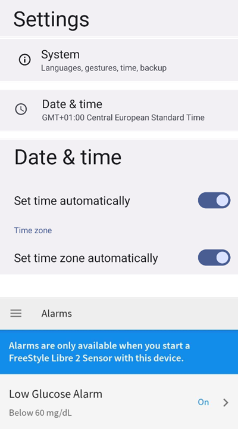

- - -
orphan: true
- - -

# Freestyle Libre 2 and 2+

The Freestyle Libre 2 sensor is now a real CGM even with the official app. Still, LibreLink cannot send data to AAPS. There are several solutions to use it with AAPS.

## 1. Use a Bluetooth bridge and OOP

Bluetooth transmitters can be used with the Libre 2 (EU) or 2+ (EU) and an out of process algorithm app. You can receive blood sugar readings every 5 minutes like with the [Libre 1](./Libre1.md).

Check the bridge and app you want to use are compatible with your sensor and xDrip+ (older Blucon and recent ones won't work, Miaomiao 1 needs firmware 39 and Miaomiao 2 firmware 7).

The Libre2 OOP is creating the same BG readings as with the original reader or the LibreLink app via NFC scan. AAPS with Libre 2 do a 10 to 25 minutes smoothing to avoid certain jumps. See below [Value smoothing & raw values](#libre2-value-smoothing-raw-values). OOP generates readings every 5 minutes with the average of the last 5 minutes. Therefore the BG readings are not that smooth but match the original reader device and faster follow the "real" BG readings. If you try to loop with OOP please enable all smoothing settings in xDrip+.

There are some good reasons to use a Bluetooth transmitter:

-   You can choose various OOP2 calibration strategies (1): have the reader values using "no calibration", or calibrate the sensor like a Libre 1 using "calibrate based on raw" or ultimately calibrate the the readers like values with "calibrate based on glucose".  
  Make sure to leave OOP1 disabled (2).

    → Hamburger Menu → Settings → Less common settings → Other misc. options


-   The Libre 2 sensor can be used 14.5 days as the Libre 1
-   8 hours backfilling is fully supported

Remark: The transmitter can be used in parallel to the LibreLink app without interfering with it.

## 2. Use xDrip+ direct connection

```{admonition} Libre 2 EU only
:class: warning
xDrip+ doesn't support direct connection to Libre 2 US and AUS.
Only Libre 2 and 2+ **EU** models.
```

- Follow [these instructions](https://www.minimallooper.com/post/how-to-setup-freestyle-libre-2-and-oop2-to-use-a-native-bluetooth-connection-in-xdrip) to setup xDrip+ but make sure to download [the latest OOP2](https://drive.google.com/file/d/1hkbs60Bv2udTlMS81UStCdY4RaHR0V57/view) as the one in the document is obsolete.
- Follow setup instructions on [xDrip+ settings page](../CompatibleCgms/xDrip.md).

-   Select xDrip+ in in [ConfigBuilder, BG Source](#Config-Builder-bg-source).

## 3. Use Diabox

- Install [Diabox](https://www.bubblesmartreader.com/_files/ugd/6afd37_f183eabd4fbd44fcac4b1926a79b094f.pdf). In Settings, Integration, enable Share data with other apps.


- Select xDrip+ in in [ConfigBuilder, BG Source](#Config-Builder-bg-source).

## 4. Use Juggluco

See [here](./Juggluco.md).

(libre2-patched-librelink-app-with-xdrip)=

## 5. Use the patched LibreLink app with xDrip+

```{admonition} Libre 2 EU only
:class: warning
The patched app is an old version (22/4/2019) and might not be compatible with recent Android releases.  
```

### Step 1: Build the patched app

For legal reasons, "patching" has to be done by yourself. İlgili bağlantıları bulmak için arama motorlarını kullanın. There are two variants: The recommended original patched app blocks any internet traffic to avoid tracking. The other variant supports LibreView.

Orijinal uygulama yerine yamalı uygulama yüklenmelidir. Onunla başlatılan bir sonraki sensör, mevcut KŞ değerlerini Bluetooth aracılığıyla akıllı telefonunuzda çalışan xDrip+ uygulamasına iletecektir.

Önemli: Olası sorunları önlemek için orijinal uygulamayı NFC özellikli bir akıllı telefona yüklemek ve kaldırmak yardımcı olabilir. NFC etkinleştirilmelidir. Bu ekstra güç gerektirmez. Ardından yamalı uygulamayı yükleyin.

Yama uygulanmış uygulama, ön plan yetkilendirme bildirimi ile tanımlanabilir. The foreground authorization service improves the connection stability compared to the original app which does not use this service.


Other indications could be the Linux penguin logo in the three dot menu -> Info or the font of the patched app (2) different from the original app (1). Bu kriterler, seçtiğiniz uygulama kaynağına bağlı olarak isteğe bağlıdır.


NFC'nin etkinleştirildiğinden emin olun, yamalı uygulama için bellek ve konum iznini etkinleştirin, otomatik saat ve saat dilimini etkinleştirin ve yamalı uygulamada en az bir alarm ayarlayın.

### Step 2: Start the sensor with the patched app

Şimdi, sadece sensörü tarayarak yamalı uygulama ile Libre2 sensörünü başlatın. Tüm ayarların doğru yapıldığından emin olun.

Başarılı sensör başlatma için zorunlu ayarlar:

-   NFC etkin / BT etkin
-   hafıza ve konum izni etkin
-   konum hizmeti etkin
-   otomatik saat ve saat dilimi ayarı
-   yamalı uygulamada en az bir alarm ayarlayın

Konum hizmetinin merkezi bir ayar olduğunu lütfen unutmayın. Bu, ayrıca ayarlanması gereken uygulama konumu izni değildir!




Once the sensor started with the patched app, you won't be able to connect it to another app/phone. If you uninstall the patched app, you will lose alarms and continuous BG readings.

Sensöre ilk bağlantı kurulumu kritiktir. LibreLink uygulaması, sensörle her 30 saniyede bir kablosuz bağlantı kurmaya çalışır. Bir veya daha fazla zorunlu ayar eksikse, bunların ayarlanması gerekir. Bunu yapmak için zaman sınırınız yok. Sensör sürekli olarak bağlantı kurmaya çalışır. Birkaç saat sürse bile. Be patient and try different settings before even thinking of changing the sensor.

LibreLink'in başlangıç ekranının sol üst köşesinde kırmızı bir ünlem işareti ("!") on the upper left corner of the LibreLink start screen there is no connection or some other setting blocks LibreLink to signal alarms. Lütfen sesin etkin olup olmadığını ve her türlü uygulama engelleme bildiriminin devre dışı bırakılıp bırakılmadığını kontrol edin. Ünlem işareti kaybolduğunda bağlantı kurulmalı ve akıllı telefona kan şekeri değerleri gönderilmelidir. Bu en fazla 5 dakika içerisinde gerçekleşmelidir.


Ünlem işareti kalıyorsa veya bir hata mesajı alıyorsanız, bunun birkaç nedeni olabilir:

-   Android location service is not granted - please enable it in system settings
-   automatic time and time zone not set - please change settings accordingly
-   activate alarms - at least one of the three alarms must be activated in LibreLink
-   Bluetooth kapalı - lütfen açın
-   Ses engellenmiş
-   Uygulama bildirimleri engellenmiş
-   Kilit ekranı bildirimleri engellenmiş

Telefonu yeniden başlatmak yardımcı olabilir, bunu birkaç kez yapmanız gerekebilir. Bağlantı kurulur kurulmaz kırmızı ünlem işareti kaybolur ve en önemli adım aşılmış olur. Sistem ayarlarına bağlı olarak ünlem işareti kalabilir ancak yine de okumalar alabilirsiniz. Her iki durumda da sıkıntı yok endişelenmeyin. Sensör ve telefon artık bağlı, her dakikada bir kan şekeri değeri iletiliyor.


Nadir durumlarda, bluetooth önbelleğini boşaltma ve/veya sistem menüsü aracılığıyla tüm ağ bağlantılarını sıfırlama yardımcı olabilir. Bu, uygun bir bluetooth bağlantısı kurmaya yardımcı olabilecek tüm bağlı bluetooth cihazlarını kaldırır. That procedure is safe as the started sensor is remembered by the patched LibreLink app. Burada ek bir şey yapılması gerekmez. Yamalı uygulamanın sensöre bağlanmasını bekleyin.

Başarılı bir bağlantıdan sonra gerekirse akıllı telefon ayarları değiştirilebilir. Bu önerilmez, ancak güç tasarruf modunu açmak isteyebilirsiniz. Konum servisi kapatılabilir, ses seviyesi sıfırlanabilir veya alarmlar tekrar kapatılabilir. Kan şekeri seviyeleri yine de aktarılır.

Ancak bir sonraki sensör başlatılırken tüm ayarlar yeniden yapılmalıdır!

Açıklama: Yamalı uygulama, bir bağlantıyı etkinleştirmek için bir saat ısınmadan sonra belirlenen zorunlu ayarlara ihtiyaç duyar. 14 günlük çalışma süresi içinde bunlara ihtiyaç yoktur. Çoğu durumda, bir sensörü başlatmakla ilgili sorunlarınız olduğunda, konum hizmeti kapatılmıştır. Android telefonlarda, bağlanmak için uygun bluetooth prosedürü(!) gereklidir. Lütfen Google'ın Android dokümantasyonuna bakın.

14 gün boyunca, NFC ile tarama için orijinal LibreLink uygulamasını çalıştıran bir veya daha fazla NFC özellikli akıllı telefonu (okuyucu cihazı değil!) paralel olarak kullanabilirsiniz. Bunu başlatmak için herhangi bir zaman sınırlaması yoktur. Örneğin, 5. gün ya da sonrasına bir paralel telefon kullanabilirsiniz. Paralel telefon(lar) kan şekeri değerlerini Abbott Cloud'a (LibreView) yükleyebilir. LibreView, diyabet ekibiniz için raporlar oluşturabilir.

İzlemeyi önlemek için orijinal yamalı uygulamanın **internet bağlantısı** olmadığını lütfen unutmayın.

Ancak, etkin internet erişimi ile LibreView'ı destekleyen yamalı uygulamanın bir çeşidi vardır. Lütfen verilerinizin buluta aktarıldığını unutmayın. But your endo team reporting is fully supported then. Bu varyantla, çalışan bir sensörün alarmlarını, sensörü başlatmamış farklı bir cihaza taşımak da mümkündür. Google'dan diyabetle ilgili Alman forumlarında bunun nasıl yapılabileceğini araştırabilirsiniz.

### Step 3: Install and configure xDrip+ app

Kan şekeri değerleri akıllı telefonda xDrip+ uygulaması tarafından alınır.

-   You can safely download the [latest APK (stable)](https://xdrip-plus-updates.appspot.com/stable/xdrip-plus-latest.apk) unless you need recent features, in which case you should use the latest [Nightly Snapshot](https://github.com/NightscoutFoundation/xDrip/releases).
-   Set xDrip+ with the [patched app data source](#xdrip-libre2-patched-app).
-   Follow setup instructions on [xDrip+ settings page](../CompatibleCgms/xDrip.md).

### Step 4: Start sensor

- → Hamburger Menu (1) → Start sensor (2) → Start sensor (3) → Answer "Not Today" (4).


This will not physically start any Libre2 sensor or interact with them in any case. Bu sadece xDrip+'ın yeni bir sensörün kan şekeri seviyelerini ilettiğini anlamak içindir. Varsa, ilk kalibrasyon için iki ölçümlü glikometre değeri girin. Şimdi kan şekeri değerleri her 5 dakikada bir xDrip+'da görüntülenmelidir. Atlanan değerler, ör. telefonunuzdan çok uzakta olduğunuz zamanlar için, doldurulmayabilr.

Bir sensör değişikliğinden sonra xDrip+ yeni sensörü otomatik olarak algılar ve tüm kalibrasyon verilerini siler. You may check you blood glucose after activation and make a new initial calibration.

### Step 5: Configure AAPS (for looping only)

-   In AAPS go to Config Builder > BG Source and check 'xDrip+'


-   If AAPS does not receive BG values when phone is in airplane mode, use 'Identify receiver' as describe on [xDrip+ settings page](#xdrip-identify-receiver).

(Libre2-experiences-and-troubleshooting)=
### Deneyimler ve Sorun Giderme

#### Bağlantı

The connectivity is good with most phones, with the exception of Huawei mobile phones. Cep telefonu sensörün karşısındaki cepteyse veya dışarıdaysanız bağlantı kopabilir. Wear your phone on the sensor side of your body. Bluetooth'un yansımalar üzerinden yayıldığı odalarda herhangi bir sorun yaşanmamalıdır. Bağlantı sorunlarınız varsa lütfen başka bir telefonda test edin. Sensörü dahili BT anteni aşağı bakacak şekilde ayarlamak da yardımcı olabilir. Sensörü ayarlarken aplikatör üzerindeki yarık aşağıyı göstermelidir.

(libre2-value-smoothing-raw-values)=
#### Değer yumuşatma & ham değerler

Technically, the current blood sugar value is transmitted to xDrip+ every minute. A weighted average filter calculates a smoothed value over the last 25 minutes by default. You can change the period in the NFC Scan features menu.

→ Hamburger menu → Settings → NFC Scan features → Smooth libre 3 data when using xxx method


Bu döngü için zorunludur. The curves look smooth and the loop results are great. Alarmların dayandığı ham değerler biraz daha oynak olabilir, ancak okuyucunun gösterdiği değerlere karşılık gelir. Ayrıca hızlı değişimlere zamanında tepki verebilmek için ham değerler xDrip+ grafiğinde görüntülenebilir. Lütfen Xdrip+'ta Ayarlar \> Gelişmiş Ayarlar \> Libre2 için Gelişmiş Ayarlar "Ham değerleri göster" ve "Sensör Bilgilerini göster"i açın. Daha sonra ham değerler grafikte küçük beyaz noktalar olarak görüntülenir ve sistem menüsünde ek sensör bilgileri bulunur.

Kan şekeri hızlı hareket ettiğinde ham değerler çok faydalıdır. Noktalar daha atlamalı olsa bile, doğru tedavi kararlarını vermek için düzleştirilmiş çizgiyi kullanarak eğilimi çok daha iyi saptarsınız.

→ Hamburger menu → Settings → Less common settings → Advanced settings for Libre 2


#### Sensör çalışma zamanı

Sensör çalışma süresi 14 gün olarak sabitlenmiştir. Libre1'deki 12 ekstra saat artık mevcut değil. xDrip+ shows additional sensor information after enabling Advanced Settings for Libre2 → "show Sensors Infos" in the system menu like the starting time. Kalan sensör süresi, yamalı LibreLink uygulamasında da görülebilir. Either in the main screen as remaining days display or as the sensor start time in the three-point menu → Help → Event log under "New sensor found".


#### Yeni sensör

Anında sensör değişimi gerçekleştirmek için: Aktivasyondan kısa bir süre önce yeni sensör ayarlayın. xDrip+ eski sensörden daha fazla veri alamadığı zaman, yamalı uygulama ile yeni sensörü başlatın. Bir saat sonra xDrip+'ta yeni değerler otomatik olarak görünmelidir.

Değilse, lütfen telefon ayarlarını kontrol edin ve ilk başlatmada olduğu gibi devam edin. Zaman sınırınız yok. Doğru ayarları bulmaya çalışın. Farklı kombinasyonları denemeden önce sensörü hemen değiştirmenize gerek yok. Sensörler sağlamdır ve kalıcı olarak bir bağlantı kurmaya çalışır. Lütfen acele etmeyin. Çoğu durumda, daha önce değiştirdiğiniz bir ayar şimdi sorunlara neden oluyor.

Başarılı okumalardan sonra lütfen xDrip'te "Sensör Durdurma" ve "Yalnızca kalibrasyonu sil"i seçin. Bunu, xDrip+ için yeni bir sensörün kan şekeri seviyelerini ayarlamak ve eski kalibrasyonların artık geçerli olmadığı ve bu nedenle silinmeleri gerektiği için yaparız. Burada Libre2 sensörü ile fiziksel bir etkileşim yapılmaz! Sensörü xDrip+'da başlatmanız gerekmez.


#### Kalibrasyon

You can calibrate the Libre2 **with an offset of -40 mg/dl to +20 mg/dL \[-2,2 mmol/l to +1,1 mmol/l\]** (intercept). The slope isn't changeable. Please check by fingerpricking after setting a new sensor, keeping in mind it might not be accurate in the first 12 hours after insertion. Since there can be large differences to the blood measurements, verify every 24 hours and calibrate if necessary. If the sensor is completely off after a few days, it should then be replaced.

### Olası kontroller

Libre2 sensörleri, hatalı sensör değerlerini tespit etmek için uygunluk kontrolleri içerir. Sensör kol üzerinde hareket ettiğinde veya hafifçe kaldırıldığında değerler dalgalanmaya başlayabilir. Libre2 sensörü daha sonra güvenlik nedenleriyle kapanacaktır. Ne yazık ki, Uygulama ile tarama yapılırken ek kontroller yapılır. Sensör iyi durumda olsa bile uygulama sensörü devre dışı bırakabilir. Şu anda dahili test çok katı. Avoid scanning the sensor with another phone to reduce the risk of unexpected sensor shutdown.

(Libre2-best-practices-for-calibrating-a-libre-2-sensor)=
# Best practices for calibrating a Libre 2 sensor

Bir libre 2 sensörünü kalibre ederken en iyi sonuçları elde etmek için izlemeniz gereken bazı “kurallar” vardır. Libre 2 değerlerini işlemek için kullanılan (örn. yamalı libre-app, oop2, …) yazılım kombinasyonundan bağımsız olarak uygulanırlar.

1.  En önemli kural, sensörü yalnızca en az 15 dakika boyunca düz bir KŞ seviyeniz olduğunda kalibre etmektir. Son üç okuma arasındaki delta 10 mg/dl'yi geçmemelidir (her okuma arasında 15 dakikadan fazla olmamalıdır). Libre 2, kan şekeri seviyenizi değil, deri altı glikoz seviyenizi ölçtüğünden, özellikle kan şekeri seviyesi yükselirken veya düşerken biraz gecikme olur. Bu zaman gecikmesi, KŞ seviyesi yükselme/düşüş o kadar fazla olmasa bile, elverişsiz durumlarda çok büyük kalibrasyon farklarına yol açabilir. Bu nedenle, mümkün olduğunca, yükselen veya düşen durumlarda kalibrasyon yapmaktan kaçının. ->Düz bir KŞ seviyeniz olmadığında bir kalibrasyon eklemeniz gerekiyorsa (örn. yeni bir sensör başlatırken) bu kalibrasyonu/kalibrasyonları mümkün olan en kısa sürede kaldırmanız ve düz KŞ seviyelerindeyken yeni bir tane eklemeniz önerilir.
2.  Aslında bu, kural 1'in bir benzeridir ve otomatik olarak dikkate alınması gerekir, ancak emin olmak için: Karşılaştırma ölçümleri yaparken (parmaktan glikometre ile) KŞ seviyeniz yaklaşık 15 dakika boyunca düz olmalıdır. Yükselirken veya düşerken karşılaştırma yapmayın. Önemli: Yine de şüpheye düştüğünüz zamanlarda kan şekeri ölçümleri yapacaksınız, sadece yükselirken veya düşerken sonuçları kalibrasyon için kullanmayın!
3.  Sensörü düz KŞ seviyelerinde kalibre etmek çok iyi bir başlangıç noktası olduğundan, sensörü yalnızca 70 mg/dl ila 160 mg/dl gibi istediğiniz hedef aralığında kalibre etmeniz şiddetle tavsiye edilir. Libre 2, 50 mg/dl ila 350 mg/dl (en azından doğrusal bir şekilde değil) gibi çok büyük bir aralıkta çalışacak şekilde optimize edilmemiştir, bu nedenle yalnızca hedef aralığınız dahilinde kalibre etmeye çalışın. -> Hedef aralığınızın dışındaki kalibrasyon değerlerinin kan şekeri seviyelerine tam olarak uymayacağını kabul edin.
4.  Çok sık kalibrasyon yapmayın. Sensörü çok sık kalibre etmek daha kötü sonuçlara yol açar. Sensör düz KŞ koşullarında iyi sonuçlar verdiğinde, herhangi bir -yararlı- etkisi olmadığı için yeni kalibrasyon eklemeyin. Her 3-5 günde bir durumu tekrar kontrol etmek yeterli olmalıdır (elbette düz KŞ koşullarında).
5.  Gerekli olmadığında kalibrasyondan kaçının. This might sound silly but it is not recommended to add a new calibration if the blood glucose to flesh glucose level difference is only ±10 mg/dl (e.g. blood glucose level: 95, Libre sensor 100 -> do NOT add the 95, blood glucose level: 95, Libre sensor 115 -> add the 95 to be taken into account for the calibration)

Bazı genel notlar: Sensörün kullanım ömrü sona erdiğinde yeni bir sensörü etkinleştirdikten sonra kural no. 4 yerine 3-5 günden daha sık karşılaştırma ölçümleri yapmak mantıklıdır. Yeni ve eski sensörler için ham değerlerin değişmesi olasıdır ve yeniden kalibrasyonun gereklidir. Zaman zaman bir sensör geçerli değerler sağlamaz. Büyük olasılıkla sensör değeri, gerçek kan şekeri düzeyine kıyasla çok düşüktür (örn. sensör: 50 mg/dl, bg: 130 mg/dl) kalibrasyondan sonra bile. Bu durumda sensör, faydalı sonuçları rapor edecek şekilde kalibre edilemez. Ör. yamalı libre uygulamasını kullanırken, maksimum +20 mg/dl'lik bir sapma eklenebilir. Sensör çok düşük değerler verdiğinde, daha iyi olmayacağı için değiştirmekten çekinmeyin. Arızalı bir sensör olsa bile, değiştirdiğiniz sensörler sürekli çok sık düşük değerler veriyorsa, sensörünüzü yerleştirmek için farklı alanlar kullanmayı deneyin. Tavsiye edilen alanda (üst kol) bile sensörlerin geçerli değerler sağlamadığı bazı yerler olabilir. Bu, sizin için işe yarayan alanları bulmada bir tür deneme yanılmadır.
