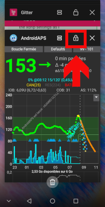

# Huawei telefonlar nasıl yapılandırılır

Bazıları Android'e özel, bazıları Huawei'ye özgü olmak üzere farklı seçenekler vardır:

* Add AAPS and xdrip+ to apps list which ignore battery optimisations:
  
  * Ayarlar / Uygulamalar / ayarlar / Özel erişim / Pil optimizasyonunu yoksay / "Tüm uygulamalar"ı seçin / Uygulamayı izin verilen olarak ayarla
    
    

* Pil seçeneği ayarlarını yapın:
  
  * Ayarlar / Uygulama / AndroidAPS/xdrip+ öğesini seçin / Pil Altında / Uygulama başlatma
    
    * "Otomatik yönetimi" kaldırdığınızdan emin olun
    * İzin ver:
      
      * Otomatik başlatma
      * İkincil başlatma (diğer uygulamalardan başlatılabilir)
      * Arka planda çalıştırma
        
        

* Uygulamayı kilitle
  
  * Son uygulamalar listesine gidin ve kilit simgesini seçin
    
    

For xDrip+, you must enable persistent notifications (within xDrip+ app):

* Settings / less common settings / other misc options / Run Collector in foreground
  
  

Android sürümüne bağlı olarak, bu ayarlar başka bir yerde olabilir. Bu açıklamalar Android 8.1 içindir.