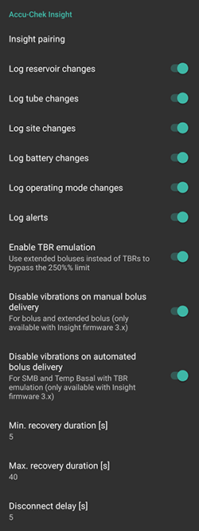

# Accu-Chek Insight Pompa

**Bu yazılım bir DIY (Kendin Yap) çözümünün parçasıdır ve bir ürün değildir, ancak nasıl kullanılacağı da dahil olmak üzere sistemi okumanızı, öğrenmenizi ve anlamanızı gerektirir. Tüm diyabet yönetimini sizin için yapan bir şey değildir, ancak gerekli zamanı ayırmaya istekliyseniz diyabetinizi ve yaşam kalitenizi iyileştirmenize izin verir. Acele etmeyin, ancak öğrenmek için kendinize zaman tanıyın. Yazılımla yaptıklarınızdan yalnızca siz sorumlusunuz.**

* * *

## ***UYARI:** Geçmişte **SightRemote** ile Insight kullanıyorsanız, lütfen **en yeni AAPS sürümüne güncelleyin** ve **SightRemote'u kaldırın**.*

## Donanım ve yazılım gereksinimleri

* Roche Accu-Chek Insight pompası (herhangi bir donanım yazılımı olabilir, hepsi çalışır)

Not: AAPS, verileri her zaman **pompadaki ilk bazal oran profiline** yazar.

* An Android phone (Basically every Android version would work with Insight, but check on the [Module](../Getting-Started/ComponentOverview) page which Android version is required to run AAPS.)
* The AAPS app installed on your phone

## Kurulum

* Insight pompası aynı anda yalnızca bir cihaza bağlanmalıdır. Insight uzaktan kumandasını (ölçüm cihazı) daha önce kullandıysanız, cihazı pompanızın eşleştirilmiş cihazlar listesinden çıkarmalısınız: Menü > Ayarlar > İletişim > Cihazı kaldır
    
    

* In [Config builder > Pump](../SettingUpAaps/ConfigBuilder.md), select Accu-Chek Insight.
    
    

* Insight ayarlarını açmak için dişli çarka dokunun.

* Ayarlarda, ekranın üst kısmındaki 'Insight eşleştirme' ye dokunun. Yakındaki tüm bluetooth cihazlarının bir listesini görmelisiniz (sol altta).
* Insight pompasında Menü > Ayarlar > İletişim > Cihaz Ekle'ye gidin. Pompa, takip eden ekranda (sağ altta) pompanın seri numarasını gösterecektir.
    
    

* Telefonunuza geri dönerek, bluetooth cihazları listesindeki pompa seri numarasına dokunun. Ardından onaylamak için Eşleştir'e dokunun.
    
    

* Hem pompada hem de telefonda bir kod görüntülenir. Kodların her iki cihazda da aynı olduğunu kontrol edin ve hem pompada hem de telefonda onaylayın.
    
    

* Başardınız! Pat yourself on the back for successfully pairing your pump with AAPS.
    
    

* To check all is well, go back to Config builder in AAPS and tap on the cog-wheel by the Insight Pump to get into Insight settings, then tap on Insight Pairing and you will see some information about the pump:
    
    

Not: Pompa ile telefon arasında kalıcı bir bağlantı olmayacaktır. Yalnızca gerektiği zaman bir bağlantı kurulacaktır (yani geçici bazal hızın ayarlanması, bolus verilmesi, pompa geçmişinin okunması...). Aksi takdirde telefonun ve pompanın pili çok hızlı bitecektir.

(Accu-Chek-Insight-Pump-settings-in-aaps)=

## AAPS ayarları

**Note : It is now possible (only with AAPS v2.7.0 and above) to use ‘Always use basal absolute values’ if you want to use Autotune with Insight pump, even if 'sync is enabled' with Nightscout.** (In AAPS go to [Preferences > NSClient > Advanced Settings](#Preferences-advanced-settings-nsclient)).

In the Insight settings in AAPS you can enable the following options:

* "Rezervuar değişikliklerini günlüğe kaydet": Bu, pompada "kanül dolumu" programını çalıştırdığınızda bir insülin kartuşu değişikliğini otomatik olarak kaydeder.

* "Log tube changes": This adds a note to the AAPS database when you run the "tube filling" program on the pump.

* "Log site change": This adds a note to the AAPS database when you run the "cannula filling" program on the pump. **Not: Bir set değişikliği, Autosens'i de sıfırlar.**

* "Pil değişikliklerini günlüğe kaydet": Bu, pompaya yeni bir pil taktığınızda pil değişikliğini kaydeder.

* "Log operating mode changes": This inserts a note in the AAPS database whenever you start, stop or pause the pump.

* "Log alerts": This records a note in the AAPS database whenever the pump issues an alert (except reminders, bolus and TBR cancellation - those are not recorded).

* "GBO öykünmesini etkinleştir": Insight pompası yalnızca %250'ye kadar geçici bazal oranları (GBO'lar) verebilir. Bu kısıtlamayı aşmak için, %250'den fazla bir GBO talep ederseniz, GBO emülasyonu pompaya ekstra insülin için bir yayma bolus verme talimatı verecektir.
    
    **Not: Aynı anda birden fazla yayma bolus hatalara neden olabileceğinden, bir seferde yalnızca bir yayma bolus kullanın.**

* "Manuel bolus iletiminde titreşimleri devre dışı bırak": Bu, bir manuel bolus (veya yayma bolus) iletirken Insight pompasının titreşimlerini devre dışı bırakır. Bu ayar yalnızca Insight üretici yazılımının (3.x) en son sürümüyle kullanılabilir.

* "Otomatik bolus iletiminde titreşimleri devre dışı bırak": Bu, otomatik bolus (SMB veya GBO emülasyonlu geçici bazal) iletirken Insight pompasının titreşimlerini devre dışı bırakır. Bu ayar yalnızca Insight üretici yazılımının (3.x) en son sürümüyle kullanılabilir.

* "Recovery duration": This defines how long AAPS will wait before trying again after a failed connection attempt. 0 ila 20 saniye arasında seçim yapabilirsiniz. Bağlantı sorunları yaşıyorsanız, daha uzun bir bekleme süresi seçin.   
      
    Örnek min. kurtarma süresi = 5 ve maks. kurtarma süresi = 20   
      
    bağlantı yok -> **5** saniye bekleyin.   
    yeniden dene -> bağlantı yok -> **6** saniye bekleyin.   
    yeniden dene -> bağlantı yok -> **7** saniye bekleyin.   
    yeniden dene -> bağlantı yok -> **8** saniye bekleyin.   
    ...   
    retry -> no connection -> wait **20** sec.   
    retry -> no connection -> wait **20** sec.   
    ...

* "Disconnect delay": This defines how long (in seconds) AAPS will wait to disconnect from the pump after an operation is finished. Varsayılan değer 5 saniyedir.

Pompanın durdurulduğu süreler için AAPS %0 geçici bazal oranı kaydeder.

In AAPS, the Accu-Chek Insight tab shows the current status of the pump and has two buttons:

* "Yenile": Pompa durumunu yeniler
* "Bildirim üzerinden GBO'yu Etkinleştir/Devre Dışı Bırak": Standart bir Insight pompası, bir GBO bittiğinde bir alarm verir. Bu düğme, yapılandırma yazılımına ihtiyaç duymadan bu alarmı etkinleştirmenizi veya devre dışı bırakmanızı sağlar.
    
    

## Pompadaki ayarlar

Pompadaki alarmları aşağıdaki gibi yapılandırın:

* Menü > Ayarlar > Cihaz ayarları > Mod ayarları > Sessiz > Sinyal > Ses
* Menü > Ayarlar > Cihaz ayarları > Mod ayarları > Sessiz > Ses > 0 (tüm çubukları kaldırın)
* Menü > Modlar > Sinyal modu > Sessiz

This will silence all alarms from the pump, allowing AAPS to decide if an alarm is relevant to you. If AAPS does not acknowledge an alarm, its volume will increase (first beep, then vibration).

(Accu-Chek-Insight-Pump-vibration)=

### Titreşim

Depending on the firmware version of your pump, the Insight will vibrate briefly every time a bolus is delivered (for example, when AAPS issues an SMB or TBR emulation delivers an extended bolus).

* Firmware 1.x: Tasarımda titreşim yok.
* Firmware 2.x: Titreşim devre dışı bırakılamaz.
* Firmware 3.x: AAPS delivers bolus silently. (minimum [version 2.6.1.4](#Releasenotes-version-2-6-1-4))

Donanım yazılımı sürümünü menüde bulabilirsiniz.

## Pil değiştirme

Döngü sırasında Insight için pil ömrü 10 ila 14 gün maks. 20 gündür. Energizer lityum pil kullanan kullanıcılar bunu bildirmişlerdir.

Insight pompası, çıkarılabilir pili değiştirirken saat gibi temel işlevleri çalışır durumda tutmak için küçük bir dahili pile sahiptir. Pilin değiştirilmesi çok uzun sürerse, bu dahili pilin gücü tükenebilir. Saat sıfırlanırsa yeni bir pil taktıktan sonra yeni bir saat ve tarih girmeniz istenecektir. If this happens, all entries in AAPS prior to the battery change will no longer be included in calculations as the correct time cannot be identified properly.

(Accu-Chek-Insight-Pump-insight-specific-errors)=

## Spesifik Insight hataları

### Yayma Bolus

Aynı anda birden fazla yayma bolus hatalara neden olabileceğinden, bir seferde yalnızca bir yayma bolus kullanın.

### Zaman aşımı (Time out)

Bazen Insight pompası bağlantı kurulumu sırasında yanıt vermeyebilir. Bu durumda AAPS şu mesajı görüntüler: "El sıkışma sırasında zaman aşımı - bluetooth'u sıfırla".

Bu durumda, pomp ve akıllı telefondaki bluetooth'u yaklaşık 10 saniye kapatın ve ardından tekrar açın.

## Insight pompasıyla zaman dilimlerini geçme

For information on traveling across time zones see section [Timezone traveling with pumps](#timezone-traveling-insight).