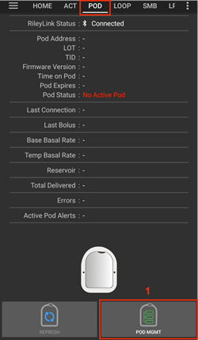
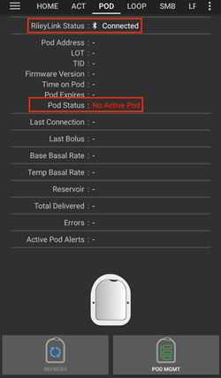
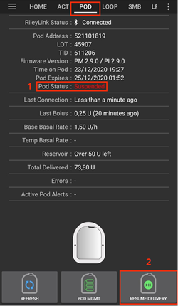
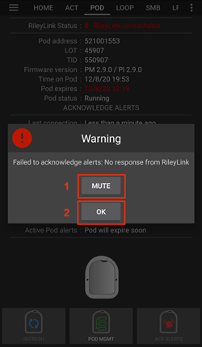
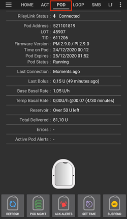
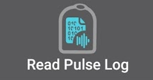
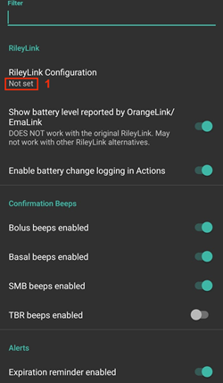
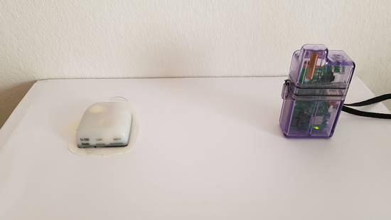

# AAPS Omnipod İnsülin Pompası Sürücü Dokümantasyonu

Bu talimatlar, Omnipod Eros nesil pompayı yapılandırmak içindir (**Omnipod Dash DEĞİL**). Omnipod Eros sürücüsü, 2.8 sürümünden itibaren AAPS'in bir eklentisidir.

**Bu yazılım bir DIY (Kendin Yap) yapay pankreas çözümünün bir parçasıdır ve bir ürün değildir, ancak nasıl kullanılacağı da dahil olmak üzere sistemi okumanızı, öğrenmenizi ve anlamanızı gerektirir. Yazılımla yaptıklarınızdan yalnızca siz sorumlusunuz.**

```{contents}
:backlinks: entry
:depth: 2
```

## Donanım ve Yazılım Gereksinimleri

- **Pod İletişim Cihazı**

> AAPS Omnipod Eros sekmesi üzerinden yapılandırıp etkinleştirdiğiniz, telefonunuz ile Eros podları arasında iletişimi sağlayan cihaz.
> 
> > -   [OrangeLink Websitesi](https://getrileylink.org/product/orangelink)
> > -  [433MHz RileyLink](https://getrileylink.org/product/rileylink433)
> > -   [Emalink Websitesi](https://github.com/sks01/EmaLink) - [İletişim Bilgileri](mailto:getemalink@gmail.com)
> > -   DiaLink - [İletişim bilgileri](mailto:Boshetyn@ukr.net)
> > -   [LoopLink Websitesi](https://www.getlooplink.org/) - [İletişim Bilgileri](https://jameswedding.substack.com/) - Test edilmedi

-   **Cep Telefonu Cihazı**

> AAPS'i çalıştıracak ve Pod iletişim cihazına kontrol komutları gönderecek eklenti.
> 
> > - Supported [Omnipod driver Android phone](#Phones-list-of-tested-phones) with a version of AAPS 2.8 and related components set up.

-   **İnsülin İletim Cihazı**

> AAPS kurulu telefonunuz tarafından Pod iletişim cihazına gönderilen komutları yorumlayacak bileşen.
> 
> > - Yeni bir Omnipod podu (Eros - **DASH DEĞİL**)

Bu talimatlar, yeni bir pod oturumu başlattığınızı varsayar; durum böyle değilse, lütfen sabırlı olun ve bir sonraki pod değişikliğinizde bu işlemle başlamaya çalışın.

## Başlamadan önce

**ÖNCE GÜVENLİK** - bir hatadan kurtulamayacağınız bir ortamda bu işlemi denemeyin (ekstra pod, insülin ve telefon cihazları olmazsa olmazdır).

**Omnipod PDM'niz, AAPS Omnipod sürücüsü podunuzu etkinleştirdikten sonra artık çalışmayacaktır**. Önceden Omnipod Eros Podunuz'a komutlar göndermek için Omnipod PDM'nizi kullanıyordunuz. Bir Omnipod Eros podu, yalnızca tek bir cihazın kendisine iletişim göndermesine izin verir. The device that successfully activates the pod is the only device allowed to communicate with it from that point forward. Bu AAPS Omnipod sürücüsü aracılığıyla RileyLink'inizle bir Omnipod Eros podunu etkinleştirdiğinizde, ** artık PDM'niz ile podunuzu kullanamayacağınız anlamına gelir**. RileyLink'li AAPS Omnipod sürücüsü artık bir nevi yeni PDM'niz olur. *Bu, PDM'nizi çöpe atmanız gerektiği anlamına GELMEZ, yedek olarak saklamanız şiddetle önerilir ve AAPS düzgün çalışmadığı acil durumlar için gereklidir.*

**Birden çok RileyLink yapılandırabilirsiniz, ancak bir seferde yalnızca bir seçili RileyLink bir podla iletişim kurabilir.** AAPS Omnipod sürücüsü, RileyLink yapılandırmasına birden çok RileyLink ekleme özelliğini destekler, ancak iletişim göndermek ve almak için kullanılmak üzere bir seferde yalnızca bir RileyLink seçilebilir.

**RileyLink kapsama alanı dışındayken podunuz kapanmaz.** RileyLink'iniz kapsama alanı dışında olduğunda veya sinyalin aktif podunuz ile iletişim kurması engellendiğinde, podunuz bazal insülin iletmeye devam edecektir. Bir podu etkinleştirdikten sonra, AAPS'de tanımlanan bazal profil yeni poda programlanacaktır. Pod ile teması kaybederseniz, bu bazal profile geri dönecektir. RileyLink menzile girip bağlantıyı yeniden kurana kadar yeni komutlar veremezsiniz.

**30 dakikalık Bazal Oran Profilleri AAPS'de DESTEKLENMEZ.** AAPS'de yeniyseniz ve bazal oran profilinizi ilk kez oluşturuyorsanız, lütfen saatlik bazal oran profilinizi ayarlayın ve yarım saatlik bazal oranların desteklenmediğini unutmayın. Örneğin, 09:30'da başlayan ve 11:30'da biten 2 saatlik bir süresi olan 1,1 ünitelik bir bazal oranınız varsa, bu çalışmayacaktır.  Bu 1,1 ünite bazal oranını 9:00-11:00 veya 10:00-12:00 zaman aralığına güncellemeniz gerekecektir.  30 dakikalık bazal oran profili artışları Omnipod donanımının kendisi tarafından desteklense de, AAPS şu anda algoritmaları ile bunları hesaba katamamaktadır.

## AAPS'de Omnipod Sürücüsünü Etkinleştirme

Dash sürücüsünü AAPS'de **iki şekilde** etkinleştirebilirsiniz:

### Seçenek 1: Kurulum Sihirbazı

AAPS'nin yeni bir sürümünü yükledikten sonra **Kurulum Sihirbazı** otomatik olarak başlayacaktır.  Bu aynı zamanda sürüm yükseltme sırasında da ortaya çıkacaktır.  Ayarlarınızı önceki bir kurulumdan kaydettiyseniz (dışarı aktarma), Kurulum Sihirbazından çıkıp eski ayarlarınızı içeri aktarabilirsiniz.  Yeni kurulumlar için aşağıdan ilerleyin.

Sağ üst köşede **üç noktalı menü (1)** bulunan **AAPS Kurulum Sihirbazı (2)** aracılığıyla **Pompa** ekranına gelene kadar sihirbaz menülerinde ilerleyin. Ardından **Omnipod radyo butonunu (3)** seçin.

>   

Aynı ekranda, pompa seçiminin altında **Omnipod Sürücü Ayarları** görüntülenir, **RileyLink Yapılandırması** altında **Ayarlanmadı** metnine basarak RileyLink cihazınızı ekleyin metin.

**RileyLink Seçimi** ekranında **Tara** düğmesine basın ve mevcut tüm Bluetooth cihazlarını tarayarak ve listeden RileyLink cihazınızı bulup seçin. Doğru seçildiğinde, seçtiğiniz RileyLink ve mac adresinin de bulunduğu Omnipod sürücü ayarlarının görüntülendiği pompa sürücüsü seçim ekranına dönersiniz.

**Kurulum Sihirbazı**'nın geri kalanına devam etmek için **İleri** düğmesine basın. Seçilen RileyLink'in başlatılması bir dakika kadar sürebilir ve **İleri** > butonuna basarak aktif hale getirin.

Detailed steps on how to setup your pod communication device are listed below in the [RileyLink Setup Section](#OmnipodEros-rileylink-setup).

**VEYA**

### Seçenek 2: Konfigürasyon ayarları

Sol üst köşedeki **hamburger menüsü** aracılığıyla **Konfigürasyon ayarları(1)** ➜**Pompa**➜**Omnipod** altındaki **Omnipod** başlığındaki **radyo düğmesi (2)**. **Ayar Dişlisi (3)**'ün yanındaki **onay kutusu (4)** seçildiğinde, Omnipod menüsü AAPS arayüzünde **POD** başlıklı bir sekme olarak görüntülenir. Bu dokümanda **Omnipod (POD)** sekmesi olarak anılır.

> **NOTE:** A faster way to access the **Omnipod settings** can be found below in the [Omnipod Settings section](#OmnipodEros-omnipod-settings) of this document.
> 
>  

### Omnipod Sürücü Seçiminin Doğrulanması

*Not: Kurulum Sihirbazından RileyLink'inizi seçmeden erken çıktıysanız, Omnipod Sürücüsü etkinleştirilir ancak yine de RileyLink'inizi seçmeniz gerekir.  Omnipod (POD) sekmesi aşağıdaki gibi görünecektir*

AAPS'de Omnipod sürücüsünü etkinleştirdiğinizi doğrulamak için **Genel Bakış** sekmesinde **sola kaydırdığınızda** bir **Omnipod** veya **POD** sekmesi göreceksiniz.


## Omnipod Kanfigürasyonu

Lütfen **sola kaydırıp** tüm pod ve RileyLink işlevlerini yönetebileceğiniz **Omnipod (POD)** sekmesine ulaşın.(bu işlevlerden bazıları etkin bir pod oturumu olmadan etkinleştirilmez veya görünmez):

>  Pod bağlantısını ve durumunu yenileyin
> 
>  Pod Yönetimi (Etkinleştir, Devre Dışı Bırak, Test bip sesini çal, RileyLink İstatistikleri ve Pod geçmişi)

(OmnipodEros-rileylink-setup)=

### RileyLink Kurulumu

If you already successfully paired your RileyLink in the Setup Wizard or steps above, then proceed to the [Activating a Pod Section](#OmnipodEros-activating-a-pod) below.

*Not: RileyLink'in bağlı olmadığının göstergesi, GİRİŞ sekmesindeki İnsülin ve Hesap Makinesi düğmelerinin eksik olmasıdır. Bu, RileyLink'e aktif olarak bağlanıp, AAPS başladıktan sonraki ilk 30 saniye boyunca da böyle olacaktır.*

1. RileyLink'inizin tam olarak şarj edildiğinden ve açık olduğundan emin olun.

2. Omnipod sürücüsünü seçtikten sonra **Konfigürasyon ayarları (1)** ➜**Pompa**➜**Omnipod**➜**Dişli Çark (Ayarlar) (2) **➜**RileyLink Yapılandırması (3)** **Ayarlanmadı** veya **MAC Adresi (varsa)** metnine basarak RileyLink'inizi belirleyin ve seçin.

   > Ensure your RileyLink battery is charged and it is [positioned in close proximity](#OmnipodEros-optimal-omnipod-and-rileylink-positioning) (~30 cm away or less) to your phone for AAPS to identify it by its MAC address. Seçildikten sonra, ilk pod oturumunuzu etkinleştirmek için ilerleyebilirsiniz. Ana AAPS arayüzüne dönmek için telefonunuzdaki geri düğmesini kullanın.
   > 
   >  

3. Bir bluetooth taraması başlatmak için **RileyLink Seçimi** ekranında **Tara (4)** düğmesine basın. Kullanılabilir Bluetooth cihazları listesinden **RileyLink'inizi (5) seçin**.

   >  

4. Başarılı bir seçimden sonra, **seçtiğiniz RileyLink'in MAC Adresini (6)** listeleyen Omnipod Ayarları sayfasına geri dönersiniz.

   > 

5. **Omnipod (POD)** sekmesinde, **RileyLink Durumu (1)** öğesinin **Bağlı** olarak göründüğünü doğrulayın. **Pod durumu (2) ** alanında **Etkin Pod Yok** gösterilmelidir. Değilse, lütfen önceki adımı deneyin veya bunun bağlantıyı yenileyip yenilemediğini görmek için AAPS'den çıkın.

   > 

(OmnipodEros-activating-a-pod)=

### Pod Etkinleştirme

Bir podu etkinleştirmeden önce lütfen Omnipod ayarlarında RileyLink bağlantınızı doğru şekilde yapılandırdığınızdan ve bağlandığınızdan emin olun

*HATIRLATICI: Güvenlik güvenlik önlemleri nedeniyle, pod aktivasyon eşleştirmesi için pod iletişimi sınırlı mesafede gerçekleşir. Eşleştirmeden önce Pod'un radyo sinyali daha zayıftır, ancak eşleştirildikten sonra tam sinyal gücünde çalışacaktır. During these procedures, make sure that your pod is* [within close proximity](#OmnipodEros-optimal-omnipod-and-rileylink-positioning) (~30 cm away or less) but not on top of or right next to the RileyLink.\*

01. **Omnipod (POD)** sekmesine gidin ve **POD YNTM (1)** butonuna ve ardından **Podu Etkinleştir(2)**'i tıklayın.

    >  

02. **Podu Doldur** ekranı görüntülenir. Yeni bir podu en az 80 ünite insülinle doldurun ve podun kullanıma hazır olduğunu belirten iki bip sesini dinleyin. 3 gün boyunca ihtiyacınız olan toplam insülin miktarını hesaplarken, pod hazırlamanın ilave12 ile 15 ünite kullanacağını lütfen göz önünde bulundurun.

    > 
    > 
    > Yeni pod ve RileyLink'in birbirine yakın (~30cm veya daha az) olduğundan emin olun ve **İleri** butonunu tıklayın.

03. **Pod'u Başlat** ekranında, pod hazırlanmaya başlar (pod kendini hazırlarken bir tıklama ve ardından bir dizi tıkırtı sesi duyarsınız). RileyLink etkinleştirilmekte olan podun kapsama alanı dışındaysa **Pod yanıt vermiyor** hata mesajı alırsınız. If this occurs, [move the RileyLink closer](#OmnipodEros-optimal-omnipod-and-rileylink-positioning) (~30 cm away or less) to but not on top of or right next to the Pod and click the **Retry (1)** button.

    >  

04. Başarılı kullanıma hazırlamanın ardından yeşil bir onay işareti gösterilecek ve **İleri** butonu etkinleştirilecektir. Pod hazırlama işlemini tamamlamak ve **Pod Ekle** ekranını görüntülemek için **İleri** butonunu tıklayın.

    > 

05. Ardından, yeni podun infüzyon bölgesini hazırlayın. Podun plastik iğne kapağını ve beyaz kağıt desteğini yapışkandan çıkarın ve Pod'u vücudunuzda genellikle seçtiğiniz bölgeye uygulayın. Bitirdiğinizde, **İleri** butonunu tıklayın.

    > 

06. **Pod Ekle** iletişim kutusu şimdi görünecektir. **YALNIZCA kanülü yerleştirmeye hazırsanız Tamam butonuna tıklayın**.

    > 

07. **Tamam**'a bastıktan sonra, Omnipod'un yanıt vermesi ve kanülü yerleştirmesi biraz zaman alabilir (maksimum 1-2 dakika), bu nedenle sabırlı olun.

    > RileyLink etkinleştirilmekte olan podun kapsama alanı dışındaysa **Pod yanıt vermiyor** hata mesajı alırsınız. Böyle bir durumda, RileyLink'i podun üstüne veya hemen yanına değil, yakınına (~30 cm veya daha yakın) getirin ve **Yeniden Dene** butonuna tıklayın.
    > 
    > RileyLink, Bluetooth kapsama alanı dışındaysa veya telefonla etkin bir bağlantısı yoksa **RileyLink yanıt vermiyor** hata mesajı alırsınız. Böyle bir durumda, RileyLink'i telefona yaklaştırın ve **Yeniden Dene** butonunu tıklayın.
    > 
    > *NOT: Kanül takılmadan önce, kanül yerleştirme noktasının etrafındaki cildi sıkıştırmak iyi bir uygulamadır. Bu iğnenin düzgün bir şekilde yerleştirilmesini sağlar ve tıkanıklık oluşturma şansınızı azaltır.*
    > 
    > 
    > 
    >  

08. Başarılı bir kanül yerleştirilmesinden sonra yeşil bir onay işareti görünür ve **İleri** butonu aktif olur. **İleri** butonunu tıklayın.

    > 

09. **Pod etkinleştirildi** ekranı görüntülenir. Yeşil **Bitti** düğmesini tıklayın. Tebrikler! Artık yeni bir aktif pod oturumu başlattınız.

    > 

10. **Pod yönetimi** menüsünde şimdi **Pod Etkinleştir (1)** butonu <em x-id"3"=>devre dışı</em> olmalı ve **Pod'u Devre Dışı Bırak (2)** butonu *aktif olmalıdır.*. Bunun nedeni, bir podun artık etkin olması ve o anda etkin olan podu devre dışı bırakmadan ek bir pod etkinleştirememenizdendir.

    **Omnipod(POD)** sekme ekranına dönmek için telefonunuzdaki geri düğmesini tıklayın. Şimdi aktif pod oturumunuz için mevcut bazal oran, pod rezervuar seviyesi, iletilen insülin, pod hataları ve uyarılar dahil Pod bilgileri görüntülenecektir.

    For more details on the information displayed go to the [Omnipod (POD) Tab](#OmnipodEros-omnipod-pod-tab) section of this document.

     

### Pod'u Devre Dışı Bırakma

Normal şartlar altında toplam 80 saatlik pod kullanımı için, üç günlük (72 saat) pod kullanım ömrüne ilaveten, sona erme uyarısından sonra 8 saat daha çalışmalıdır.

To deactivate a pod (either from expiration or from a pod failure):

1. **Omnipod (POD)** sekmesine gidin, **POD YNTM (1)** butonunu tıklayın, **pod yönetimi** ekranında **Pod'u Devre Dışı Bırak (2)** butonunu tıklayın.

   >  

2. **Podu Devre Dışı Bırak** ekranında, önce RileyLink'in poda yakın olduğundan, ama podun üstünde veya hemen yanında olmadığından emin olun, ardından işlemi başlatmak için **İleri** butonunu tıklayarak podu devre dışı bırakın.

   > 

3. **Pod Devre Dışı Bırakılıyor** ekranı görünecek ve podun devre dışı bırakmanın başarılı olduğuna dair bir onay bip sesi alacaksınız.

   > 
   > 
   > **Devre dışı bırakma başarısız olursa** ve bir onay bip sesi almazsanız, **RileyLink cevap vermiyor** veya **Pod mesajından yanıt yok** bildirimlerini alabilirsiniz. Devre dışı bırakmayı tekrar denemek için lütfen **Yeniden Dene (1)** butonunu tıklayın. Devre dışı bırakma işlemi başarısız olmaya devam ederse, lütfen **Podu çıkar (2)** butonunu tıklayarak Pod'u iptal edin. Etkin oturum devre dışı bırakıldığı için artık podunuzu çıkartabilirsiniz. Pod'unuzda çığlık atan bir alarm varsa, **Podu çıkar (2)** butonu onu susturmayacağından manuel olarak (bir iğne veya ataç kullanarak) susturmanız gerekebilir.
   > 
   > >   

4. Başarılı bir şekilde devre dışı bırakmanın ardından yeşil bir onay işareti görünecektir. Pod devre dışı ekranını görüntülemek için **İleri** butonunu tıklayın. Etkin oturum devre dışı bırakıldığı için artık podunuzu çıkartabilirsiniz.

   > 

5. **Pod yönetimi** ekranına dönmek için yeşil butonu tıklayın.

   > 

6. Artık **Pod yönetimi** menüsüne döndünüz, **Omnipod (POD)** sekmesine dönmek için telefonunuzdaki geri düğmesine basın. **RileyLink Durumu:** alanının **Bağlandı** olarak bildirdiğini ve **Pod durumu:** alanının **Etkin Pod Yok** mesajı görüntülediğini doğrulayın.

   >   

### İnsülin İletimini Askıya Alma ve Devam Ettirme

Aşağıdaki süreç, insülin pompası iletimini nasıl askıya alacağınızı ve devam ettireceğinizi gösterecektir.

*NOT - bir ASKIYA AL butonu* görmüyorsanız, Omnipod (POD) sekmesinde görüntülenmesi etkinleştirilmemiştir. Enable the **Show Suspend Delivery button in Omnipod tab** setting in the [Omnipod settings](#OmnipodEros-omnipod-settings) under **Other**.

#### İnsülin İletiminin Askıya Alınması

Etkin podu askıya alınmış duruma getirmek için bu komutu kullanın. Bu askıya alınmış durumda, pod artık herhangi bir insülin iletmeyecektir. Bu komut orijinal Omnipod PDM'nin etkin bir poda verdiği askıya alma işlevini taklit eder.

1. **Omnipod (POD)** sekmesine gidin ve **ASKIYA AL (1)** butonunu tıklayın. Askıya alma komutu, RileyLink'ten aktif poda gönderilir ve **ASKIYA AL (3)** butonu grileşir. **Pod durumu (2)**, **İLETİM DURDURULDU** olarak görüntülenecektir.

   >  

2. Askıya alma komutu RileyLink tarafından başarıyla onaylandığında, bir onay iletişim kutusu **Tüm insülin iletimi askıya alındı** mesajını görüntüler. Onaylamak ve devam etmek için **Tamam**'ı tıklayın.

   > 

3. Aktif Pod'unuz şimdi tüm insülin iletimini askıya aldı. **Omnipod (POD)** sekmesi, **Pod durumunu (1)** **Askıya alındı** olarak güncelleyecektir. **ASKIYA AL** butonu, **İletime Devam Et (2)** butonu olarak değişecektir.

   > 

#### İnsülin İletimini Sürdür

Use this command to instruct the active, currently suspended pod to resume insulin delivery. Komut başarıyla işlendikten sonra, aktif bazal profildeki geçerli zamana dayalı mevcut bazal oranı kullanılarak normal insülin iletimi sürdürülecektir. Pod bolus, GBO ve SMB için komutları tekrar kabul edecektir.

1. **Omnipod (POD)** sekmesine gidin ve **Pod durumu (1)** satırında **ASKIYA ALINDI** mesajının görünmesi gerekir, ardından mevcut podun normal insülin iletimini sürdürmesi talimatını vermek için **İLETİME DEVAM ET (2)** butonuna basın. **Pod durumu (3)** alanında, RileyLink'in aktif olarak askıya alınan pod'a komutu gönderdiğini belirten bir **İLETİME DEVAM ET** mesajı görüntülenecektir.

   >  

2. İletime devam et komutu RileyLink tarafından başarıyla onaylandığında, bir onay iletişim kutusunda **İnsülin iletimi devam ettirildi** mesajı görüntülenecektir. Onaylamak ve devam etmek için **Tamam**'ı tıklayın.

   > 

3. **Omnipod (POD)** sekmesi, **Pod durumu (1)** alanını **ÇALIŞIYOR** olarak güncelleyecek ve **İletimi Sürdür** butonu şimdi **ASKIYA AL (2)** butonu olarak görünecektir.

   > 

### Pod Uyarılarını Onaylamak

*NOT - bir BİLGİ UYARILARI düğmesi görmüyorsanız, bunun nedeni SADECE pod sona erme veya düşük rezervuar uyarısı tetiklendiğinde Omnipod (POD) sekmesinde koşullu olarak görüntülenmesidir.*

Aşağıdaki süreç, etkin pod süresi 72 saatlik (3 gün) pod sona ermeden önce uyarı süresi sınırına ulaştığında meydana gelen pod bip seslerini nasıl onaylayacağınızı ve kapatacağınızı göstermektedir. Bu uyarı süresi sınırı, Omnipod uyarıları ayarında **Kapanmadan kaç saat önce** olarak tanımlanır. Bir pod'un maksimum ömrü 80 saattir (3 gün 8 saat), ancak Insulet 72 saat (3 gün) sınırının aşılmamasını önermektedir.

*NOT - Omnipod Uyarılarında "Pod uyarılarını otomatik olarak onayla" ayarını etkinleştirdiyseniz, bu uyarı ilk kez meydana geldikten sonra otomatik olarak işlenir ve uyarıyı manuel olarak kapatmanız GEREKMEZ.*

1. Tanımlanan **Kapanmadan kaç saat önce?** uyarı süresi sınırına ulaşıldığında, pod sona erme zamanına yaklaştığını size bildirmek için uyarı bip sesleri çıkaracak ve yakında pod değişikliği gerekecektir. Bunu **Omnipod (POD)** sekmesinde doğrulayabilirsiniz, **Pod'un süresi doluyor: (1)** alanı, pod süresinin tam olarak ne zaman biteceğini (etkinleştirmeden 72 saat sonra) gösterecek ve metin ** kırmızıya** dönecektir. Bu süre geçtikten sonra, **Aktif Pod uyarıları (2)** alanının altında, **Pod'un süresi yakında dolacak** durum mesajı görüntülenecektir. Bu aynı zamanda **ALARMLARI ONAYLA (3)** butonunun görüntülenmesini de tetikler. Bir **sistem bildirimi (4)** ayrıca size yaklaşan pod sona erme tarihi hakkında bilgi verecektir

   >  

2. **Omnipod (POD)** sekmesine gidin ve **ALARMLARI ONAYLA (2)** butonuna basın (alarmları onaylayın). Rileylink, pod sona erme uyarı bip seslerini devre dışı bırakmak için pod'a komutu gönderir ve **Pod durumu (1)** satırını **ALARMLARI ONAYLA** olarak günceller.

   > 

3. Uyarıların **başarıyla devre dışı bırakılması** üzerine, etkin pod tarafından **2 bip** sesi verilir ve bir onay iletişim kutusunda **Etkin alarmlar susturuldu.** mesajı görüntülenir. İletişim kutusunu onaylamak ve kapatmak için **Tamam** butonunu tıklayın.

   > 
   > 
   > RileyLink, onay uyarıları komutu işlenirken pod'un menzili dışındaysa, bir uyarı mesajı 2 seçenek görüntüleyecektir. **Sessiz (1)** bu mevcut uyarıyı susturur. **Tamam (2)**, bu uyarıyı onaylar ve kullanıcının uyarıları yeniden onaylamasına izin verir.
   > 
   > 

4. **Omnipod (POD)** ana sekmesine gidin, **Aktif Pod uyarıları** alanı altında, uyarı mesajı artık görüntülenmez ve aktif pod artık pod sona erme uyarı bip sesleri vermez.

(OmnipodEros-view-pod-history)=

### Pod Geçmişini Görüntüle

Bu bölüm, aktif pod geçmişinizi nasıl gözden geçireceğinizi ve farklı eylem kategorilerine göre nasıl filtreleyeceğinizi gösterir. Pod geçmişi aracı, üç günlük (72 - 80 saat) ömrü boyunca şu anda etkin olan pod'unuza yönelik eylemleri ve sonuçları görüntülemenize olanak tanır.

Bu özellik ile verilen bolusları, GBO'larını, bazal değişiklikleri doğrulamak için kullanışlıdır ancak tamamlandıklarından emin olamayabilirsiniz. Kalan kategoriler, genel olarak sorunları gidermek ve bir arızaya yol açan olayların sırasını belirlemek için kullanışlıdır.

*NOT:* **Belirsiz** komutlar pod geçmişinde görünür, ancak yapıları gereği doğruluklarından emin olamazsınız.

1. **Omnipod (POD)** sekmesine gidin ve **POD YNTM (1)** butonuna basarak **Pod Yönetimi** menüsüne gidin ve ardından pod geçmişi ekranına erişmek için **Pod geçmişi (2)** butonuna basın.

   >  

2. **Pod geçmişi ** ekranında, **All (1)** (Tümü) varsayılan kategorisi ile tüm pod **Eylemleri (3)** ve **Sonuçları (4)** **Tarih ve Saat (2)** ters kronolojik sırada görüntülenir. Ana AAPS arayüzünde **Omnipod (POD)** sekmesine dönmek için telefonunuzun **geri butonunu 2 kez** kullanın.

   >  

### RileyLink Ayarlarını ve Geçmişini Görüntüle

Bu bölüm, aktif pod ve RileyLink ayarlarının yanı sıra her birinin iletişim geçmişinin nasıl gözden geçirileceğini gösterir. Bu özellik bir kez erişildiğinde iki bölüme ayrılır: **Ayarlar** ve **Geçmiş**.

Bu özelliğin birincil kullanımı, pod iletişim cihazınızın bir süre sonra telefonunuzun Bluetooth kapsama alanı dışında kalması ve **RileyLink durumunun** **RileyLink'e ulaşılamadığını** bildirmesidir. **Omnipod (POD)** ana sekmesindeki **REFRESH** butonu, Omnipod ayarlarında halihazırda yapılandırılmış RileyLink ile Bluetooth iletişimini manuel olarak yeniden kurmaya çalışır.

**Omnipod (POD)** ana sekmesindeki **YENİLE** butonunun pod iletişim cihazına olan bağlantıyı geri yüklememesi durumunda, manuel yeniden bağlantı için lütfen aşağıdaki ek adımları izleyin.

#### Pod İletişim Bluetooth İletişim Aygıtını Manuel Olarak Yeniden-kurun

1. **Omnipod (POD)** sekmesinde **RileyLink Durumu: (1)** **RileyLink'e ulaşılamıyor** bildirdiğinde, **Pod Yönetimi** menüsüne gitmek için **POD YNTM (2)** butonuna basın. **Pod Yönetimi** menüsünde, aktif olarak bir RileyLink bağlantısı arayan bir bildirimin göründüğünü göreceksiniz, **RileyLink ayarları** ekranına erişmek için **RileyLink istatistikleri (3)** butonuna basın.

   >  

2. **RileyLink (2)** bölümünün altındaki **RileyLink Ayarları (1)** ekranında, **Bağlantı Durumu ve Hata: (3)** alanlarında hem Bluetooth bağlantı durumunu hem de hatayı onaylayabilirsiniz. Bir *Bluetooth Hatası* ve *RileyLink ulaşılamaz* durumu görünmelidir. Sağ alt köşedeki **yenile (4)** butonuna basarak manuel olarak Bluetooth'a yeniden bağlanmasını sağlayın.

   > 
   > 
   > Bluetooth yenileme komutu işlenirken pod iletişim cihazı yanıt vermiyorsa veya telefonun kapsama alanı dışındaysa, 2 seçenekli bir uyarı mesajı görüntülenir.

   - **Sessiz (1)** bu mevcut uyarıyı susturur.
   - **Tamam (2)** bu uyarıyı onaylar ve kullanıcının Bluetooth bağlantısını yeniden kurmayı denemesine izin verir.

   > 

3. **Bluetooth bağlantısı** yeniden kurulmazsa, telefonunuzdaki Bluetooth işlevini manuel olarak **kapatmayı** ve ardından tekrar **açmayı** deneyin.

4. Başarılı bir RileyLink Bluetooth yeniden bağlantısından sonra, **Bağlantı Durumu: (1)** alanı **RileyLink hazır** olarak görünmelidir. Tebrikler, artık yapılandırılmış pod iletişim cihazınızı (örn. RileyLink) AAPS'ye yeniden bağladınız!

   > 

#### Pod İletişim Cihazı (örn. RileyLink) ve Aktif Pod Ayarları

Bu ekran, hem halihazırda yapılandırılmış pod iletişim cihazı hem de aktif olan Omnipod Eros pod için bilgi, durum ve ayar yapılandırma bilgilerini sağlayacaktır.

1. **Pod yönetimi** menüsüne erişmek için **Omnipod (POD)** sekmesine gidin ve **POD YNTM (1)** butonuna basın. Ardından yapılandırılmış **RileyLink (3)** ve etkin pod **Cihaz (4)** ayarlarınızı görüntülemek için **RileyLink istatistikleri (2)** butonuna basın.

   >  
   > 
   > 

##### RileyLink (3) alanı

> - **Adres:** Omnipod Ayarlarında tanımlanan seçili pod iletişim cihazının MAC adresi.
> - **İsim:** Telefonunuzun Bluetooth ayarlarında tanımlanan seçili pod iletişim cihazının Bluetooth tanımlama adı.
> - **Pil Seviyesi:** Bağlı pod iletişim cihazının mevcut pil seviyesini gösterir
> - **Bağlı Cihaz:** Şu anda pod iletişim cihazıyla iletişim kuran Omnipod pod modeli
> - **Bağlantı Durumu**: Pod iletişim cihazı ile AAPS çalıştıran telefon arasındaki Bluetooth bağlantısının mevcut durumu.
> - **Bağlantı Hatası:** Pod iletişim cihazı ile ilgili bir hata varsa Bluetooth bağlantı detayları burada görüntülenecektir.
> - **Pod yazılımı:** Aktif olarak bağlı pod iletişim cihazında kurulu mevcut yazılım sürümüdür.

##### Cihaz (4) alanı - Aktif Pod ile

> - **Cihaz Ti̇pi:** Pod iletişim cihazıyla iletişim kuran aygıtın türü (Omnipod pod pompası)
> - **Cihaz Modeli:** Pod iletişim cihazına bağlı aktif cihazın modeli (Omnipod podunun mevcut model adı, yani Eros)
> - **Pompa Seri Numarası:** Şu anda etkinleştirilmiş olan podun seri numarası
> - **Pompa Frekansı:** Pod iletişim cihazının kendisi ile pod arasında iletişimi sağlamak için ayarladığı iletişim radyo frekansı.
> - **Son Kullanılan frekans:** podun, pod iletişim cihazıyla iletişim kurmak için kullandığı bilinen son radyo frekansı.
> - **Son Cihaz İletişimi:** Pod ile pod iletişim cihazı (örn. RilyLink) arasında yapılan son iletişimin tarihi ve saati.
> - **Yenile butonu** bu sayfadaki ayarları manuel olarak yeniler.

(omnipod-eros-rileylink-and-active-pod-history)=
#### RileyLink ve Aktif Pod Geçmişi

Bu ekran RileyLink'in veya o anda bağlı olan pod içinde olduğu veya gerçekleştirdiği her durum veya eylemin ters kronolojik sırayla bilgi sağlar. Tüm geçmiş yalnızca o anda etkin olan pod için kullanılabilir, bir bölme değişikliğinden sonra bu geçmiş silinecek ve yalnızca yeni etkinleştirilen podun olayları kaydedilecek ve gösterilecektir.

1. **Pod Yönetimi** menüsüne erişmek için **Omnipod (POD)** sekmesine gidin ve **POD YNTM (1)** butonuna basın, ardından **Ayarlar** ve **Geçmiş** ekranını görüntülemek için **Pod Geçmişi (2)** butonuna basın. RileyLink'in tüm geçmişini ve şu anda etkin olan pod oturumunu görüntülemek için **GEÇMİŞ (3)** metnine tıklayın.

   >  
   > 
   > 

##### Alanlar

> - **Tarih & Zaman**: Ters kronolojik sırayla her olayın zaman damgası.
> - **Cihaz:** Mevcut eylemin veya durumun atıfta bulunduğu cihaz.
> - **Durum veya Eylem:** Cihaz tarafından gerçekleştirilen mevcut durum veya eylem.

(OmnipodEros-omnipod-pod-tab)=

## Omnipod (POD) Sekmesi

Aşağıda, ana AAPS arayüzündeki **Omnipod (POD)** sekmesindeki simgelerin ve durum satırlarının düzeninin ve anlamının bir açıklaması bulunmaktadır.

*NOT: Omnipod (POD) sekmesi durum alanlarındaki herhangi bir mesaj raporlanırsa (belirsiz), o zaman bunu temizlemek ve bölme durumunu yenilemek için Yenile düğmesine basmanız gerekir.*

> 

### Alanlar

- **RileyLink Durumu:** RileyLink'in mevcut bağlantı durumunu görüntüler

- *RileyLink Ulaşılamıyor* Pod iletişim cihazı, telefonun Bluetooth kapsama alanında değil, kapalı veya Bluetooth iletişimini engelleyen bir arıza var.
- *RileyLink Hazır* Pod iletişim cihazı açık ve Bluetooth bağlantısını aktif olarak başlatıyor
- *Bağlı* Pod iletişim cihazı açık, bağlı ve Bluetooth aracılığıyla aktif olarak iletişim kurabiliyor.

- **Pod adresi:** Etkin pod'un referans aldığı mevcut adresi görüntüler

- **LOT:** Etkin podun LOT numarasını görüntüler

- **TID:** Podun seri numarasını görüntüler.

- **Yyazılımı Sürümü:** Etkin podun donanım yazılımı sürümünü görüntüler.

- **Pod üzerindeki zaman:** Aktif poddaki geçerli saati görüntüler.

- **Pod Sona Erme:** Pod'un süresinin dolacağı tarih ve saati görüntüler.

- **Pod durumu:** Aktif podun durumunu görüntüler.

- **Son bağlantı:** Etkin Pod'la en son iletişimin sağlandığı zamanı görüntüler.

- *Biraz önce* - 20 saniyeden kısa bir süre önce.
- *Bir dakikadan kısa bir süre önce* - 20 saniyeden uzun, ancak 60 saniyeden kısa bir süre önce.
- *1 dakika önce* - 60 saniyeden uzun ancak 120 saniyeden kısa (2 dakika)
- *XX dakika önce* - XX değeriyle tanımlanan 2 dakikadan daha uzun bir süre önce

- **Son bolus:** Etkin poda gönderilen son bolusun miktarını ve ne kadar süre önce verildiğini parantez içinde görüntüler.

- **Bazal oranı:** Bazal oran profilinden geçerli zaman için programlanmış bazal oranı görüntüler.

- **Geçici bazal oranı:** Şu anda çalışmakta olan Geçici Bazal Oranı aşağıdaki biçimde görüntüler

- Ünite / saat @ GBO'nın verildiği zaman (çalışma dakikası / GBO'nın çalıştırılacağı toplam dakika)
- *Örnek:* 0,00Ü/s @18:25 ( 90/120 dakika)

- **Rezervuar:** Rezervuarda 50 üniteden fazla insülin olduğuda 50+Ü'den fazla kalanı gösterir. Bu değerin altında tam birimler sarı metinle gösterilir.

- **Toplam iletilen:** Rezervuardan iletilen toplam insülin ünite miktarını görüntüler. *Pod mutlak kesinlikle hazırlanıp ve doldurulmadığı için bunun bir tahmin olduğunu unutmayın.*

- **Hatalar:** Karşılaşılan son hatayı görüntüler. Review the [Pod history](#OmnipodEros-view-pod-history), [RileyLink history](#omnipod-eros-rileylink-and-active-pod-history) and log files for past errors and more detailed information.

- **Etkin pod alarmları:** Etkin pod alarmlarını gösteren satırdır. Genellikle pod son kullanma tarihi 72 saat sonraysa ve pod yerel bip sesleri çıkardığında kullanılır.

### Simgeler

- **YENİLE:**

  > 
  > 
  > İletişimi güncellemek için aktif pod'a bir yenileme komutu gönderir
  > 
  > Pod durumunu yenilemek ve metin içeren (belirsiz) durum satırlarını yenilemek için kullanın.
  > 
  > See the [Troubleshooting section](#OmnipodEros-troubleshooting) below for additional information.

- **POD YNTM:**

  > 
  > 
  > Pod yönetimi menüsüne yönlendirir

- **BİLGİ UYARILARI:**

  > 
  > 
  > Bu butona basıldığında, pod sona erme biplerini ve bildirimlerini devre dışı bırakır.
  > 
  > Buton, yalnızca pod süresi sona erme uyarı süresini geçtiğinde görüntülenir Bildirimler devre dışı kaldıktan sonra, bu simge artık görünmeyecek.

- **SAATİ AYARLA:**

  > 
  > 
  > Basıldığında, pod'taki saat, telefonunuzdaki geçerli saatle güncellenir.

- **ASKIYA AL:**

  > 
  > 
  > Etkin pod'u askıya alır

- **İLETİME DEVAM ET:**

  > 
  > 
  > > Şu anda askıya alınmış, etkin pod'u devam ettirir

### Pod Yönetim Menüsü

Aşağıda, **Omnipod (POD)** sekmesinden erişilen **Pod Yönetimi** menüsündeki simgelerin düzeni ve anlamının bir açıklaması bulunmaktadır.

> 

- **Pod Etkinleştirme**

  > 
  > 
  > Yeni bir pod hazırlar ve etkinleştirir

- **Pod'u Devre Dışı Bırakma**

  > 
  > 
  > O anda etkin olan podu devre dışı bırakır.
  > 
  > Kısmen eşleştirilmiş bir pod bu komutu yok sayar.
  > 
  > Çığlık atan bir podu devre dışı bırakmak için bu komutu kullanın (hata 49).
  > 
  > Buton devre dışıysa (gri ise), "Pod'u çıkart" butonunu kullanın.

- **Test bip sesi çal**

  > 
  > 
  > Basıldığında pod'tan tek bir test bip sesi çalar.

- **Pod'u çıkart**

  > 
  > 
  > Basıldığında, yanıt vermeyen bir Pod'un Pod durumunu devre dışı bırakacak ve iptal edecektir.
  > 
  > Düğme yalnızca, uygun şekilde devre dışı bırakma artık mümkün olmadığı zaman, çok özel durumlarda görüntülenir:
  > 
  > > - Bir **pod tam olarak eşlenmemiş** ve dolayısıyla devre dışı bırakma komutları yok sayar.
  > > - Eşleştirme adımları arasındaki işlemler sırasında bir **pod takıldı** ise
  > > - **Pod hiç bir şekilde eşleşmiyorsa.**

- **Pod geçmişi**

  > 
  > 
  > Etkin Pod'un etkinlik geçmişini görüntüler

- **RileyLink istatistikleri:**

  > 
  > 
  > Geçerli ayarları ve RileyLink Bağlantı geçmişini gösteren RileyLink İstatistikleri ekranına gider
  > 
  > > - **Ayarlar** - RileyLink ve aktif pod ayarları bilgilerini görüntüler
  > > - **Geçmiş** - RileyLink ve Pod iletişim geçmişini görüntüler

- **RileyLink Yapılandırmasını Sıfırla**

  > 
  > 
  > Bu düğmeye basıldığında, o anda bağlı olan pod iletişim cihazı (örn. RileyLink) yapılandırmasını sıfırlar.
  > 
  > > - İletişim başladığında, belirli veriler RileyLink'e gönderilir ve burada ayarlanır > - Bellek Kayıtları ayarlandı > - İletişim Protokolleri ayarlandı > - Ayarlı Radyo Frekansı ayarlandı 
  > > - See [additional notes](#OmnipodEros-reset-rileylink-config-notes) at the end of this table

- **Sinyal günlüğünü oku:**

  > 
  > 
  > > Aktif pod sinyal günlüğünü panoya gönderir

(OmnipodEros-reset-rileylink-config-notes)=

#### *RileyLink Yapılandırma Sıfırlama Notları*

- Bu özelliğin birincil kullanımı, o anda etkin olan pod iletişim cihazının yanıt vermediği ve iletişimin takılı kaldığı durumlardır.
- Pod iletişim cihazı (örn. RileyLink) kapatılıp tekrar açılırsa, pod iletişim cihazı konfigürasyonunda bu iletişim parametrelerini ayarlaması için **RileyLink Ayarlarını Sıfırla** butonuna basılması gerekir.
- Bu YAPILMAYACAK OLURSA, pod iletişim cihazı kapatıldıktan sonra AAPS'nin yeniden başlatılması gerekecektir.
- Farklı pod iletişim cihazları arasında geçiş yaparken bu butona basılması **GEREKMEZ**

(OmnipodEros-omnipod-settings)=

## Omnipod Ayarları

Omnipod sürücü ayarları, sol üst köşedeki **hamburger menüsü** altında **Konfigürasyon ayarları**➜**Pompa**➜**Omnipod**➜**Dişli çark (ayarlar) (2)** içerisinde **Omnipod** başlıklı **radyo butonu(1)** seçilerek yapılabilir. **Dişli çark (2)**'ın yanındaki **onay kutusu (3)**'ün seçilmesi, Omnipod menüsünün AAPS arayüzünde **OMNIPOD** veya **POD** başlıklı bir sekme olarak görüntülenmesini sağlar. Bu dokümanda **Omnipod (POD)** sekmesi olarak anılır.


**NOT:** **Omnipod ayarlarına** daha hızlı erişmenin bir yolu da, **Omnipod (POD)** sekmesinde iken sağ üst köşesindeki **3 noktalı menü (1)** ye basıp açılan menüden **Omnipod tercihler'ini (2)** seçmektir.


The settings groups are listed below; you can enable or disable via a toggle switch for most entries described below:


*NOT: Yıldız işareti (\*), bir ayarın varsayılan olarak etkin olduğunu belirtir.*

### RileyLink

Bir pod iletişim cihazının taranmasına izin verir. Omnipod sürücüsü aynı anda birden fazla pod iletişim cihazı seçemez.

- **OrangeLink/EmaLink/DiaLink tarafından bildirilen pil seviyesini göster:** OrangeLink/EmaLink/Dialink'in gerçek pil seviyesini bildirir. Tüm OrangeLink/EmaLink/DiaLink kullanıcılarının bu ayarı etkinleştirmesi **şiddetle önerilir**.

- Orijinal RileyLink ile ÇALIŞMAZ.
- RileyLink alternatifleriyle çalışmayabilir.
- Etkin - Desteklenen pod iletişim cihazları için mevcut pil seviyesini raporlar.
- Devre Dışı - n/a değerini gösterir.

- **Eylemlerde pil değişikliği kaydını etkinleştir:** Eylemler menüsünde, bu ayarı VE yukarıdaki pil raporlama ayarını etkinleştirdiyseniz pil değiştirme düğmesi etkinleştirilir.  Bazı pod iletişim cihazları artık değiştirilebilen normal pilleri kullanmaya imkan sağlarlar.  Bu seçenek, bunu not etmenize ve pil yaşı zamanlayıcılarını sıfırlamanıza olanak tanır.

### Onay Bildirimleri

Provides confirmation beeps from the pod for bolus, basal, SMB, and TBR delivery and changes.

- **\*Bolus bip seslerini etkinleştir:** Bolus iletildiğinde onay biplerini etkinleştirin veya devre dışı bırakın.
- **\*Bazal bip seslerini etkinleştir:** Yeni bir bazal oran ayarlandığında, aktif bazal oran iptal edildiğinde veya mevcut bazal oran değiştirildiğinde onay biplerini etkinleştirin veya devre dışı bırakın.
- **\*SMB bip seslerini etkinleştir:** Bir SMB teslim edildiğinde onay biplerini etkinleştirin veya devre dışı bırakın.
- **GBO (TBR) bip seslerini etkinleştir:** Bir GBO ayarlandığında veya iptal edildiğinde onay biplerini etkinleştirin veya devre dışı bırakın.

### Alarmlar

Tanımlanan eşik birimlerine dayalı olarak pod sona erme, kapatma, düşük rezervuar için AAPS uyarıları ve Nightscout duyuruları sağlar.

*Note an AAPS notification will ALWAYS be issued for any alert after the initial communication with the pod since the alert was triggered. Dismissing the notification will NOT dismiss the alert UNLESS automatically acknowledge Pod alerts is enabled. Uyarıyı MANUEL OLARAK kapatmak için Omnipod (POD) sekmesini ziyaret etmeli ve BİLGİ UYARILARI düğmesine basmalısınız.*

- **\*Süre sonu hatırlatıcısını etkinleştir:** Kapanmadan önce tanımlanan saat süresine ulaşıldığında tetiklenecek şekilde pod sona erme hatırlatıcısını etkinleştirin veya devre dışı bırakın.
- **Kapanmadan kaç saat önce:** Etkin pod kapanmadan önceki saat süresini tanımlar, bu daha sonra pod süre sonu hatırlatıcısı alarmını tetikler.
- **\*Düşük rezervuar uyarısını etkinleştir:** Pod, ünite satırında belirlenen alt rezervuar sınırına ulaştığında bir alarm etkinleştirin veya devre dışı bırakın.
- **Ünite:** Pod düşük rezervuar alarmının tetikleneceği ünite sayısı.
- **Pod uyarılarını otomatik olarak kabul et:** Etkinleştirildiğinde, yine de bir bildirim verilecektir, ancak uyarının verilmesinden bu yana ilk pod iletişim temasından hemen sonra, artık otomatik olarak onaylanacak ve uyarı reddedilecektir.

### Bildirimler

GBO, SMB veya bolus olaylarının başarılı olup olmadığı yani belirsiz olduğunda AAPS bildirimleri ve sesli telefon uyarıları sağlar.

*NOTE: These are notifications only, no audible beep alerts are made.*

- **Belirsiz GBO (TBR) bildirimleri için sesi etkinleştir:** Bir Geçici Bazal Oranının başarılı bir şekilde ayarlanıp ayarlanmadığı AAPS tarafından belirsiz olduğunda sesli bir uyarı ve görsel bildirim tetiklemek için bu ayarı etkinleştirin veya devre dışı bırakın.
- **\*Belirsiz SMB bildirimleri için sesi etkinleştir:** Bir SMB'nin başarıyla teslim edilip edilmediğinden AAPS emin olmadığında sesli bir uyarı ve görsel bildirimi tetiklemek için bu ayarı etkinleştirin veya devre dışı bırakın.
- **\*Belirsiz bolus bildirimleri için sesi etkinleştir:** AAPS'nin bir bolusun başarıyla iletildiğinden emin olmadığı durumlarda sesli uyarı ve görsel bildirimi tetiklemek için bu ayarı etkinleştirin veya devre dışı bırakın.

### Diğer

Hata ayıklamaya yardımcı olmak için gelişmiş ayarlar sağlar.

- **Omnipod sekmesinde İletimi Askıya Al butonunu göster:** **Omnipod (POD)** sekmesinde iletimi askıya al butonunu gizleyin veya görüntüleyin.
- **Pod Yönetimi menüsünde Nabız günlüğü butonunu göster:** **Pod Yönetimi** menüsünde nabız günlüğü butonunu gizleyin veya görüntüleyin.
- **Pod Yönetimi menüsünde RileyLink İstatistikleri butonunu göster:** **Pod Yönetimi** menüsünde RileyLink İstatistikleri butonunu gizleyin veya görüntüleyin.
- **\*DST/Saat dilimi algılamayı etkinleştir:**, telefon DST'nin gözlemlendiği bir alanda kullanılıyorsa, saat dilimi değişikliklerinin otomatik olarak algılanmasını sağlar.

### Aktif Pod İletişim Aygıtını Değiştirme veya Çıkarma (RileyLink)

Mevcut RileyLink'e (OrangeLink veya EmaLink gibi) birçok alternatif model veya aynı pod iletişim cihazının (RileyLink) birden çok/yedek versiyonuna ihtiyaç duyulduğunda, Omnipod Ayarı yapılandırmasından, seçilen pod iletişim cihazının (RileyLink) değiştirilmesi veya çıkarılması gerekli hale gelir.

Aşağıdaki adımlar, Mevcut pod iletişim cihazını (RileyLink) **Kaldır**'manın yanı sıra yeni bir pod iletişim cihazının **Eklemesini** gösterecektir.  Hem **Kaldır** hem de **Ekle** adımlarını uyguladığınızda cihazınız değişir.

1. **RileyLink Seçimi** menüsüne erişmek için **Omnipod (POD)** sekmesinin sağ üst köşesindeki **3 noktalı menüyü (1)** seçerek, açılır menüden **Omnipod tercihleri (2)** ni seçin. **Omnipod Ayarları** menüsünde **RileyLink Yapılandırması (3)** altındaki **Ayarlanmadı** (herhangi bir cihaz seçilmemişse) veya **MAC Adresi** (bir cihaz varsa) metnine basın. **RileyLink Seçimi** menüsünü açın.

   >  

### Halihazırda Seçili Olan Pod İletişim Aygıtını Kaldırın (RileyLink)

Bu işlem, seçili olan pod iletişim cihazının (RileyLink) Omnipod Sürücü ayarlarından nasıl kaldırılacağını gösterecektir.

1. **RileyLink Yapılandırması** altında, **RileyLink Seçimi** menüsünü açmak için **MAC Adresi (1)** metnine basın.

   > 

2. **RileyLink Seçimi** menüsünde, **Seçtiğiniz RileyLink'i (3)** kaldırmak için **Kaldır (2)** butonuna basın

   > 

3. Onay isteminde, cihazınızın kaldırılmasını onaylamak için **Evet (4)**'e basın.

   > 

4. **RileyLink Yapılandırması** altında **Omnipod Ayarı** menüsüne geri dönerek cihazın **Ayarlanmadı (5)** olduğunu görürsünüz.  Tebrikler, seçtiğiniz pod iletişim cihazını başarıyla kaldırdınız.

   > 

### Halihazırda Seçili Olan Pod İletişim Aygıtını Ekleyin (RileyLink)

Bu işlem, Omnipod Sürücü ayarlarına yeni bir pod iletişim cihazının nasıl ekleneceğini gösterecektir.

1. **RileyLink Seçimi** menüsünü açmak için **RileyLink Yapılandırması** altında **Ayarlanmadı (1)** metnine basın.

   > 

2. Mevcut tüm Bluetooth cihazlarını taramaya başlamak için **Tara (2)** butonuna basın.

   > 

3. Mevcut cihazlar listesinden **RileyLink'inizi (3)** seçerek yeni seçtiğiniz cihazınızın **MAC Adresini (4)** görüntüleyen **Omnipod Ayarları** menüsüne geri dönersiniz.  Tebrikler, pod iletişim cihazınızı başarıyla seçtiniz.

   >  

## Eylemler (EYLEM) Sekmesi

Bu sekme, ana AAPS dokümantasyonunda açık bir şekilde anlatılmıştır, ancak bu sekmede, özellikle yeni bir pod takıldıktan sonra, Omnipod podunun hortum bazlı pompalardan nasıl farklı olduğuna dair özel birkaç nokta belirtilmektedir.

1. Ana AAPS arayüzünde **Eylemler (EYLEM)** sekmesine gidin.
2. **Bakımportalı (1)** bölümünün altında **İnsülin** ve **Kanül** alanları her pod değişikliğinden sonra **yaşlarını 0 gün ve 0 saat ** olacak şekilde sıfırlayacaktır. Bu Omnipod pompasının çalışma şekli nedeniyle böyle yapılmaktadır. **Pompa pili** ve **insülin rezervuarı**, her pod içinde yer almaktadır. Pod, kanülü doğrudan pod uygulama bölgesinde deriye yerleştirdiği için, Omnipod pompalarında hortum kullanılmaz. *Bu nedenle, bir pod değişikliğinden sonra bu değerlerin her birinin yaşı otomatik olarak sıfırlanır.* **Pompa pil yaşı** pod pili her zaman kendi ömründen daha fazla olacağı için (maksimum 80 saat) rapor edilmez.

> 

### Dolum seviyeleri

**Insulin Level**

Omnipod Eros Pod'daki insülin bildirim miktarı kesin değil.  Bunun nedeni, pod ne kadar insülin konulduğu tam olarak bilinmemekle birlikte, yalnızca pod doldurulurken 2 bip sesi tetiklendiğinde 85 üniteden fazla enjekte edilmiş olmasıdır. Bir Pod en fazla 200 ünite alabilir. Hazırlama, kesin bir süreç olmadığı için sapmalara da yol açabilir.  Bu faktörlerin her ikisiyle birlikte, Omnipod sürücüsü rezervuarda kalan insülinin en iyi yaklaşık değerini verecek şekilde yazılmıştır.

> - **50 Ünitenin Üzerinde** - Şu an rezervuarda 50 üniteden fazla insülin olduğunda 50+Ü değeri bildirilir.
> - **50 Ünitenin Altında** - Rezervuarda kalan insülinin yaklaşık hesaplanmış değerini bildirir.
> - **SMS** - SMS yanıtlarında insülin seviyesi 50+Ü veya değer görünür.
> - **Nightscout** - Nightscout'a (sürüm 14.07 ve daha eski) 50 üniteden fazla olduğunda 50 değerini yükler.  Daha yeni sürümler, 50 ünite üzerinde olduğunda 50+ değerini bildirir.

**Pil seviyesi**

Pil seviyesi bildirimi, OrangeLink, EmaLink veya DiaLink gibi pod iletişim cihazlarının mevcut pil düzeyini görüntülemek için etkinleştirilebilen bir ayardır.  RileyLink donanımı, pil seviyesini bildiremez.  Pil seviyesi, pod ile her iletişimden sonra rapor edilir, bu nedenle şarj olurken doğrusal bir artış gözlemlenmeyebilir.  El ile yenileme, mevcut pil seviyesini güncelleyecektir.  Desteklenen bir Pod iletişim cihazının bağlantısı kesildiğinde %0 değeri rapor edilecektir.

> - **RileyLink donanımı, pil seviyesini bildirme özelliğine sahip değildir**
> - **Pil seviyesi değerlerini bildirmek için Omnipod ayarlarında "OrangeLink/EmaLink/DiaLink tarafından bildirilen pil seviyesini göster" Ayarı MUTLAKA etkinleştirilmelidir**
> - **Pil seviyesi raporlaması YALNIZCA OrangeLink, EmaLink ve DiaLink Cihazları için geçerlidir**
> - **Pil Düzeyi raporlaması diğer cihazlarda da çalışabilir (RileyLink hariç)**
> - **SMS** - Gerçek bir seviye mevcut olduğunda yanıt olarak mevcut pil seviyesini döndürür, n/a değeri döndürülmez
> - **Nightscout** - Gerçek bir seviye mevcut olduğunda pil seviyesi rapor edilir, n/a değeri rapor edilmez

(OmnipodEros-troubleshooting)=

## Troubleshooting

### Pod Hataları

Pods fail occasionally due to a variety of issues, including hardware issues with the Pod itself. It is best practice not to call these into Insulet, since AAPS is not an approved use case. Nedeni belirlemeye yardımcı olması için [burada](https://github.com/openaps/openomni/wiki/Fault-event-codes) hata kodlarının bir listesi bulunmaktadır.

### 49 numaralı Pod hatasını önleme

This failure is related to an incorrect pod state for a command or an error during an insulin delivery command. Nightscout client kullanıcılarının, olası arızaları önlemek için **Konfigürasyon ayarları**➜**Genel**➜**NSClient**➜**dişli çark**➜**Gelişmiş Ayarlar** altında *yalnızca yükleme (Senkronizasyonu devre dışı bırak)* seçeneğini etkinleştirmelerini öneririz.

### Pompaya Ulaşılamıyor Uyarıları

Pompa ulaşılamaz uyarılarının sağ üst taraftaki üç noktalı menüye giderek,**Tercihler**➜**Yerel Uyarılar**➜**Pompa Ulaşılamaz eşiği \[min\]** seçip bu seçeneğin **120** olarak ayarlanması önerilir.

(OmnipodEros-import-settings-from-previous-aaps)=
### Önceki AAPS ayarlarını içe aktarın

Ayarları içe aktarmanın, eski bir Pod durumunu içe aktarma olanağına sahip olduğunu lütfen unutmayın. Sonuç olarak, aktif bir Pod'u kaybedebilirsiniz. Bu nedenle dolayı **etkin bir Pod oturumu sırasında ayarları içe aktarmamanız** şiddetle tavsiye edilir.

1. Pod oturumunuzu devre dışı bırakın. Etkin bir pod oturumunuz olmadığına emin olun.
2. Ayarlarınızı dışa aktarın ve bir kopyasını güvenli bir yerde saklayın.
3. AAPS'nin önceki sürümünü kaldırın ve telefonunuzu yeniden başlatın.
4. AAPS'nin yeni sürümünü yükleyin ve etkin bir pod oturumunuz olmadığını doğrulayın.
5. Ayarlarınızı içe aktarın ve yeni podunuzu etkinleştirin.

### Omnipod sürücü uyarıları

Omnipod ürücüsü **Giriş sekmesinde** çeşitli uyarılar sunmakla birlikte bunların çoğu bilgi amaçlıdır ve kapatılabilirken, bazıları da kullanıcıya tetiklenen uyarının nedenini çözmek için bir eylemde bulunmasını sağlar. A summary of the main alerts that you may encounter is listed below:

#### Aktif Pod Yok

Aktif bir Pod oturumu algılanamadı. Bu uyarı, **ERTELE**'ye basılarak geçici olarak kapatılabilir, ancak yeni bir pod etkinleştirilmedikçe tetiklenmeye devam edecektir. Etkinleştirildiğinde bu uyarı otomatik olarak susacaktır.

#### Pod askıya alındı

Pod'un askıya alındığına dair bilgi uyarısı.

#### Bazal profil ayarlanamadı. İletim durdurulmuş olabilir! Lütfen Omnipod sekmesindeki Pod durumunu manuel olarak güncelleyin ve gerekirse teslimi devam ettirin..

Pod bazal profili ayarının başarısız olduğuna ve Dash sekmesinde *Yenile*'ye basmanız gerektiğine dair bilgi uyarısı.

#### SMB bolusunun başarılı olup olmadığı doğrulanamıyor. Bolus'un başarılı olmadığından eminseniz, SMB girişini Tedaviler'den manuel olarak kaldırmalısınız.

SMB bolus başarısının doğrulanamadığı konusunda uyarı; SMB bolusunun başarılı olup olmadığını görmek için Omnipod sekmesindeki *Son bolus* alanını doğrulamanız ve başarısız olmuşsa Tedaviler sekmesinden girişi kaldırmanız gerekir.

#### "Görev bolus/GBO/SMB"nin tamamlanıp tamamlanmadığı belirsizse, lütfen başarılı olup olmadığını manuel olarak doğrulayın.

RileyLink ve Omnipod'un iletişim kurma biçimi nedeniyle, bir komutun başarıyla işlenip işlenmediğinin *belirsiz* olduğu durumlar ortaya çıkabilir. Kullanıcıyı bu belirsizlik hakkında bilgilendirme önemlidir.

Aşağıda, belirsiz bir bildirimin ne zaman ortaya çıkabileceğine dair birkaç örnek verilmiştir.

- **Bolus** - Belirsiz boluslar otomatik olarak doğrulanamaz. Bildirim, bir sonraki bolusa kadar kalacak ancak manuel Pod yenilemesi mesajı silecektir. *Varsayılan olarak, kullanıcının manuel olarak onaylaması gerektiğinden, bu tür bir bildirim için uyarı bip sesleri etkinleştirilir.*
- **GBO'lar, Pod Durumları, Profil Anahtarları, Zaman Değişiklikleri** - manuel bir pod güncellemesi mesajı siler. Bu bildirim türü için varsayılan uyarı bip sesleri devre dışıdır.
- **Pod Zaman Sapması -** Pod zamanı ile telefonunuzun zamanı çok fazla saptığında, AAPS döngünün çalışması ve doğru tahminler ve dozaj önerileri yapması zordur. Pod ile telefon arasındaki zaman sapması 5 dakikadan fazlaysa, AAPS, HANDLE TIME CHANGE "ZAMAN DEĞİŞİKLİĞİ İŞLE" mesajıyla Pod'un Pod durumu altında Askıya alınmış durumda olduğunu bildirir. Omnipod (POD) sekmesinin altında ek bir **Saati Ayarla** simgesi görünecektir. Saati Ayarla'yı tıklamak, Pod saati telefondaki saatle senkronize eder ve ardından normal pod işlemlerine devam etmek için 'RESUME DELIVERY' TESLİME DEVAM ET düğmesine tıklayabilirsiniz.

## En İyi Uygulamalar

(OmnipodEros-optimal-omnipod-and-rileylink-positioning)=

### En İyi Omnipod ve RileyLink Konumlandırılması

Bir Omnipod pod ile iletişim kurmak için RileyLink'te kullanılan anten, 433 MHz sarmal spiral antendir. Yapı özelliklerinden dolayı, dikey duran anteni temsil eden z ekseni ile üç boyutlu bir halka gibi çok yönlü bir sinyal yayar. Bu özellikle pod etkinleştirme ve devre dışı bırakma rutinleri sırasında, RileyLink'in yerleştirilmesi için en uygun konumdırmanın olduğu anlamına gelir.


> *(Şek 1. Çok yönlü bir düzende sarmal sarmal antenin grafik çizimi*)

Hem güvenlik hem de emniyet endişeleri nedeniyle pod *aktivasyonu*, bolus verme, bir GBO ayarlama veya sadece bölme durumunu yenilemek gibi diğer işlemlerden *daha yakın (~30 cm veya daha kısa)* bir mesafede yapılmalıdır. RileyLink anteninden sinyal iletiminin doğası gereği, podun doğrudan RileyLink'in üzerine veya hemen yanına yerleştirilmesi ÖNERİLMEZ.

Aşağıdaki resim, pod etkinleştirme ve devre dışı bırakma prosedürleri sırasında RileyLink'i konumlandırmanın en uygun yolunu göstermektedir. Pod başka pozisyonlarda aktif olabilir ama en başarılı olanı aşağıdaki resimdeki pozisyonu kullanarak elde edersiniz.

*Not: Pod en uygun şekilde yerleştirdikten sonra ve RileyLink iletişimi başarısız olursa, bunun nedeni, RileyLink anteninin iletim menzilini azaltan düşük pil seviyesi olabilir. Bu sorunu önlemek için, bu işlem sırasında RileyLink'in doğru şekilde şarj edildiğinden veya doğrudan bir şarj kablosuna bağlandığından emin olun.*



## Omnipod sürücüsü için nereden yardım alınabilir

Omnipod sürücüsü için tüm geliştirme çalışmaları topluluk tarafından gönüllü olarak yapılır; Yardım talep ederken lütfen düşünceli olmanızı ve aşağıdaki yönergeleri kullanmanızı rica ediyoruz:

- **Seviye 0:** Sorun yaşadığınız işlevin nasıl çalışması gerektiğini anladığınızdan emin olmak için bu dokümantasyonun ilgili bölümünü okuyun.
- **Seviye 1:** Bu dokümantasyonu kullanmanıza rağmen hâlâ çözemediğiniz sorunlarla karşılaşıyorsanız, lütfen [bu davet bağlantısını](https://discord.gg/4fQUWHZ4Mw) kullanarak **Discord**'da * #androidaps* kanalına gidin.
- **Level 2:** Search existing issues to see if your issue has already been reported; if not, please create a new [issue](https://github.com/nightscout/AndroidAPS/issues) and attach your [log files](../GettingHelp/AccessingLogFiles.md).
- **Sabırlı olun - topluluğumuzun üyelerinin çoğu iyi huylu gönüllülerden oluşur ve sorunları çözmek genellikle hem kullanıcılar hem de geliştiriciler için zaman ve sabır gerektirir.**
