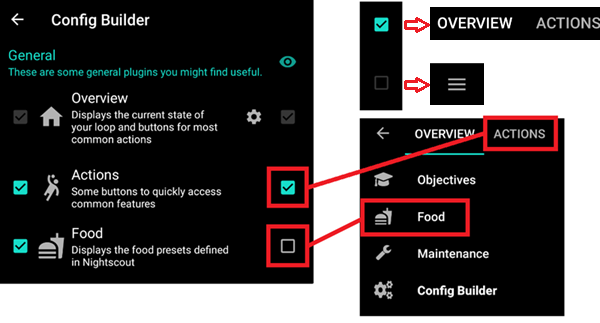
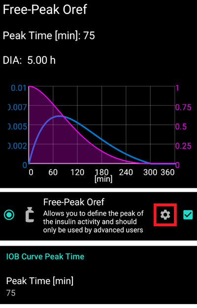

# Konfigürasyon ayarları

Ayarlarınıza bağlı olarak, ekranın üst kısmındaki bir sekmeden veya hamburger menüsünden Konfigürasyon ayarları'nı açabilirsiniz.

Konfigürasyon ayarları (KONF), modüler özellikleri açıp kapattığınız sekmedir. Sol taraftaki kutular (A) hangisini kullanacağınızı seçmenize izin verir, sağ taraftaki kutular (C) bunları AndroidAPS'de bir sekme (E) olarak görmenizi sağlar. Sağ kutu aktif değilse ekranın sol üst köşesindeki hamburger menüsünü (D) kullanarak fonksiyona ulaşabilirsiniz.

Modül içinde ek ayarlar mevcut olduğunda, sizi tercihler içindeki belirli ayarlara götürecek olan dişli çarka (B) tıklayabilirsiniz.

**İlk yapılandırma:** AAPS 2.0'dan bu yana bir Kurulum sihirbazı, AndroidAPS'yi kurma sürecinde size rehberlik eder. Ekranın sağ üst tarafındaki 3 nokta menüsüne basın (F) ve kullanmak için 'Kurulum Sihirbazı'nı seçin.

(tab-or-hamburger-menu)=

## Sekme veya hamburger menüsü

With the checkbox under the eye symbol you can decide how to open the corresponding program section.

(profile)=

## Profil

* Kullanmak istediğiniz bazal profili seçin. Daha fazla kurulum bilgisi için [Profiller](../Usage/Profiles.md) sayfasına bakın.
* AAPS 3.0'dan itibaren yalnızca yerel profil kullanılabilir.

However, it is possible to synchronise a Nightscout profile into a local profile. To do this, however, it is important to clone the whole database record consisting of several profiles in the Nightscout editor. Please see the instructions below. This can be helpful if major changes to a more extensive profile can be entered more easily via the web interface, e.g. to manually copy data from a spreadsheet.

(local-profile)=

### Yerel profil

Local profile uses the basal profile manually entered in phone. As soon as it is selected, a new tab appears in AAPS, where you can change the profile data read out from the pump if necessary. With the next profile switch they are then written to the pump in profile 1. This profile is recommended as it does not rely on internet connectivity.

Your local profiles are part of [exported settings](../Usage/ExportImportSettings.md). So make sure to have a backup in a safe place.

Buttons:

* yeşil artı: profil ekleme
* kırmızı X: profil silme
* mavi ok: profil kopyalama

If you make any changes to your profile, make sure, you are editing the correct profile. In profile tab there is not always shown the actual profile being used - e.g. if you made a profile switch by using the profile tab on homescreen it may differ from the profile actually shown in profile tab as there is no connection between these.

#### Klon profil değişikliği

You can easily create a new local profile from a profile switch. In this case timeshift and percentage will be applied to the new local profile.

1. Sağ üst köşedeki 3 nokta menüsüne tıklayın.
2. 'Tedaviler'i seçin.
3. Profil değiştirme sayfasına erişmek için yıldız sembolüne basın.
4. İstediğiniz profil anahtarını seçin ve "Klonla"ya basın.
5. Yeni yerel profili Yerel Profil (YP) sekmesinden veya hamburger menüsünde "profil"den düzenleyebilirsiniz.

(upload-local-profiles-to-nightscout)=

#### Yerel profilleri Nightscout'a yükleyin

Local profiles can also be uploaded to Nightscout. The settings can be found in [NSClient preferences](../Configuration/Preferences.md#nsclient).

#### Nighscout profil düzenleyicide profili değiştir

You can synchronoze changes to the profile in the Nighscout profile editor to local profiles. The settings can be found in [NSClient preferences](../Configuration/Preferences.md#nsclient).

It is necessary to clone the actual active entire Nightscout database records for the profiles and not just a profile with the blue arrow! The new database records then carries the current date and can be activated via the tab "local profile".

### Profil yardımcısı

Profile helper offers two functions:

1. Çocuklar için bir profil bulmak
2. Yeni bir profili klonlamak için iki profili veya profil değişimlerini karşılaştırmak

Details are explained on the separate [profile helper page](../Configuration/profilehelper.md).

(insulin)=

## İnsülin

* Kullanmakta olduğunuz insülin eğrisinin türünü seçin.
* 'Hızlı Etkili Oref', Ultra Hızlı Oref', 'Lyumjev' ve 'Serbest Tepe Oref' seçeneklerinin tümü üstel bir şekle sahiptir. Daha fazla bilgi [OpenAPS dokümantasyonu](https://openaps.readthedocs.io/en/latest/docs/While%20You%20Wait%20For%20Gear/understanding-insulin-on-board-calculations.html#understanding-the-new-iob-curves-based-on-exponential-activity-curves) sayfasında listelenmiştir. 
* Eğriler, İES'e ve zirveye ulaşma süresine bağlı olarak değişecektir.
    
    * MOR çizgi, zamanla bozulduğu için enjekte edildikten sonra ne kadar **insülin kaldığını** gösterir.
    * MAVİ çizgi, insülinin **ne kadar aktif** olduğunu gösterir.

### İES (DIA) İnsülin etki süresi

* İES her kişi için aynı değildir. Bu yüzden kendiniz test etmelisiniz. 
* Ancak her zaman en az 5 saat olmalıdır.
* Fiasp gibi ultra hızlı insülin kullanan birçok insan için, kural olarak 0.0xx ünite mevcut olsa bile, 3-4 saat sonra pratikte gözle görülür bir etkisi yoktur. Bu kalan miktar, örneğin spor sırasında hala görülebilir. Bu nedenle, AndroidAPS, İES olarak minimum 5saat kullanır.
* You can read more about that in the Insulin Profile section of [this](../Getting-Started/Screenshots.md#insulin-profile) page.

### İnsülin tipi farklılıkları

* 'Hızlı Etkili', 'Ultra Hızlı' ve 'Lyumjev' için İES, kendiniz ayarlayabileceğiniz tek değişkendir ve zirve zamanı sabittir. 
* Free-Peak (serbest-zirve), hem İES'i hem de zirveye ulaşma süresini ayarlamanıza olanak tanır fakat yalnızca bu ayarların etkilerini bilen ileri düzey kullanıcılar tarafından kullanılmalıdır. 
* The [insulin curve graph](../Getting-Started/Screenshots.md#insulin-profile) helps you to understand the different curves.
* Yukarıda bir sekme olarak görüntülemek için onay kutusunu etkinleştirebilirsiniz. Diğer türlü hamburger menüsünde olacaktır.

#### Hızlı etkili Oref

* Humalog, Novolog ve Novorapid için önerilir
* İES = en az 5.0s
* Maks. zirve = enjeksiyondan 75 dakika sonra (sabit, ayarlanabilir değil)

#### Ultra Hızlı Oref

* FIASP için önerilir
* İES = en az 5.0s
* Maks. zirve = enjeksiyondan 55 dakika sonra (sabit, ayarlanabilir değil)

(lyumjev)=

#### Lyumjev

* Lyumjev için özel insülin profili
* İES = en az 5.0s
* Maks. zirve = enjeksiyondan 45 dakika sonra (sabit, ayarlanabilir değil)

#### Serbest Zirve Oref

* Serbest zirve Oref "Free Peak 0ref" profili ile zirve zamanını kendiniz girebilirsiniz. Bunu yapmak için gelişmiş ayarlarda dişli çarka tıklayın.
* Profilde daha yüksek belirtilmemişse, İES otomatik olarak 5 saate ayarlanır.
* Bu etki profili, desteklenmeyen bir insülin veya farklı insülinlerin bir karışımı kullanılıyorsa önerilir.

(bg-source)=

## KŞ kaynağı

Select the blood glucose source you are using - see [BG Source](BG-Source.md) page for more setup information.

* [Kendi Dexcom Uygulamanızı Oluşturun (BYODA)](https://docs.google.com/forms/d/e/1FAIpQLScD76G0Y-BlL4tZljaFkjlwuqhT83QlFM5v6ZEfO7gCU98iJQ/viewform?fbzx=2196386787609383750&fbclid=IwAR2aL8Cps1s6W8apUVK-gOqgGpA-McMPJj9Y8emf_P0-_gAsmJs6QwAY-o0).
* [xDrip+](https://xdrip-plus-updates.appspot.com/stable/xdrip-plus-latest.apk) - Cannot be used as receiver for Dexcom G6 as of AAPS 3.0 (see [release notes](../Installing-AndroidAPS/Releasenotes.md#important-hints-3-0-0) for details.
* [MM640g](https://github.com/pazaan/600SeriesAndroidUploader/releases)
* [Glimp](https://play.google.com/store/apps/details?id=it.ct.glicemia&hl=de) - Sadece versiyon 4.15.57 ve daha yenisi için desteklenir.
* [Poctech](https://www.poctechcorp.com/en/contents/268/5682.html)
* MiaoMiao cihazı için [Tomato Uygulaması](http://tomato.cool/)
* Glunovo CGM sistemi için [Glunovo Uygulaması](https://infinovo.com/)
* NSClient KŞ - bu durumda kapalı döngü mobil veri / wifi kapsama alanına bağlı olduğundan önerilmez. CGM verileri yalnızca NS sitenize çevrimiçi bir bağlantı varsa alınacaktır. En iyisi, diğer CGM veri kaynaklarından birinden yerel olarak kullanmaktır.
* Rastgele KŞ: Rastgele KŞ verisi oluşturur (Yalnızca Demo modu)

(pump)=

## Pompa

Select the pump you are using.

* [Dana R](DanaR-Insulin-Pump.md)
* Dana R Kore (yerli DanaR pompası için)
* Dana Rv2 (resmi olmayan ürün yazılımı yükseltmesine sahip DanaR pompası)
* [Dana-i/RS](DanaRS-Insulin-Pump.md)
    
    * Dana pompalarında gerekirse BT watchdog'u etkinleştirmek için **Gelişmiş ayarlar**'ı kullanın. Bu seçenek, pompaya bağlantı yoksa bluetooth'u bir saniyeliğine kapatır. Böylelikle bluetooth yığınının donduğu bazı telefonlarda yardımcı olabilir.
    * [Dana RS pompasının şifresi](../Configuration/DanaRS-Insulin-Pump.md) doğru girilmelidir. Şifre önceki sürümlerde kontrol edilmiyordu.

* [Accu Chek Insight](Accu-Chek-Insight-Pump.md)

* [Accu Chek Combo](Accu-Chek-Combo-Pump.md) (ruffy kurulumu gerektirir)
* [Omnipod Eros](OmnipodEros.md)
* [Omnipod DASH](OmnipodDASH.md)
* [Medtronic](MedtronicPump.md)
* [Diaconn G8](DiaconnG8.md)
* MDI (Çoklu Günlük Enjeksiyon tedaviniz için AAPS önerileri alın)
* Sanal pompa (henüz sürücüsü olmayan pompa için açık döngü - yalnızca AAPS önerileri)

## Duyarlılık algılaması

Select the type of sensitivity detection. For more details of different designs please [read on here](../Configuration/Sensitivity-detection-and-COB.md). This will analyze historical data on the go and make adjustments if it recognizes that you are reacting more sensitively (or conversely, more resistant) to insulin than usual. More details about the Sensitivity algorithm can be read in the [OpenAPS docs](https://openaps.readthedocs.io/en/latest/docs/Customize-Iterate/autosens.html).

You can view your sensitivity on the homescreen by selecting SEN and watching the white line. Note, you need to be in [Objective 8](../Usage/Objectives.md#objective-8-adjust-basals-and-ratios-if-needed-and-then-enable-autosens) in order to let Sensitivity Detection/[Autosens](../Usage/Open-APS-features#autosens) automatically adjust the amount of insulin delivered. Before reaching that objective, the Autosens percentage / the line in your graph is displayed for information only.

(absorption-settings)=

### Emilim ayarları

If you use Oref1 with SMB you must change **min_5m_carbimpact** to 8. The value is only used during gaps in CGM readings or when physical activity "uses up" all the blood glucose rise that would otherwise cause AAPS to decay COB. At times when [carb absorption](../Usage/COB-calculation.md) can't be dynamically worked out based on your bloods reactions it inserts a default decay to your carbs. Basically, it is a failsafe.

(aps)=

## APS (YPS)

Select the desired APS algorithm for therapy adjustments. You can view the active detail of the chosen algorithm in the OpenAPS(OAPS) tab.

* OpenAPS AMA (gelişmiş yemek yardımı, algoritmanın 2017'deki durumu) Basit bir ifadeyle faydası, yemek bolusu verdikten sonra eğer karbonhidratları doğru bir şekilde girerseniz, sistem daha hızlı bir şekilde kan şekerine yüksek geçici bazal oranları ile müdahale eder.
* [OpenAPS SMB](../Usage/Open-APS-features.md) (super micro bolus, most recent algorithm for advanced users) Note you need to be in [Objective 9](../Usage/Objectives.md#objective-9-enabling-additional-oref1-features-for-daytime-use-such-as-super-micro-bolus-smb) in order to use OpenAPS SMB and min_5m_carbimpact must be set to 8 in Config builder > Sensitivity detection > Sensitivity Oref1 settings.

## Döngü

* Açık Döngü, Kapalı Döngü ve Düşük Glikoz Askıya Alma (LGS) arasında geçiş yapın.

(open-loop)=

### Açık Döngü

* AAPS, mevcut tüm verileri (AİNS, AKARB, KŞ...) sürekli olarak değerlendirir ve gerekirse tedavinizi nasıl ayarlayacağınız konusunda tedavi önerilerinde bulunur. 
* (kapalı döngüde olduğu gibi) Öneriler otomatik olarak yürütülmeyecektir. Uyumlu bir pompa (Dana R/RS veya Accu Chek Combo) kullanıyorsanız, pompaya manuel olarak veya bir düğme kullanılarak girilmelidir. 
* Bu seçenek, AndroidAPS'in nasıl çalıştığını veya desteklenmeyen bir pompa kullanıp kullanmadığınızı öğrenmek içindir.

(closed-loop)=

### Kapalı Döngü

* AAPS, mevcut tüm verileri (AİNS, AKARB, KŞ...) sürekli olarak değerlendirir ve ayarlanan hedef aralığa veya değere ulaşmak için (yani sizin tarafınızdan fazla müdahale olmadan) gerekirse tedaviyi (bolus iletimi, geçici bazal oranı, hipo öncesi insülin durdurma vb.) otomatik olarak ayarlar. 
* Kapalı Döngü, bireysel olarak ayarlayabileceğiniz çok sayıda güvenlik limiti dahilinde çalışır.
* Closed Loop is only possible if you are in [Objective 6](../Usage/Objectives.md#objective-6-starting-to-close-the-loop-with-low-glucose-suspend) or higher and use a supported pump.
* Not: Kapalı döngü modunda hedef aralığı yerine tek bir hedef (yani 5,0 - 7,0 mmol veya 90 - 125 mg/dl yerine 5,5 mmol veya 100 mg/dl) önerilir.

### Düşük Glikoz Süspansiyonu (LGS)

* maxIOB (max.aktif insülin) sıfıra ayarlıdır.
* Bu, kan şekeri düşüyorsa sizin için bazalı azaltabileceği anlamına gelir.
* Ancak kan şekeri yükseliyorsa, otomatik düzeltme yapılmayacaktır. Bazal oranlarınız, seçtiğiniz profille aynı kalacaktır.
* Yalnızca bazal AİNS (aktif insülin) negatifse (önceki Düşük Glikoz Süspansiyonundan), KŞ'ni düşürmek için ek insülin verilecektir.

### Minimum istek değişikliği

* Açık döngü kullanırken, AAPS'in bazal hızı ayarlamanızı önerdiği her seferde bildirim alırsınız. 
* Bildirim sayısını azaltmak için daha geniş bir KŞ hedef aralığı kullanabilir veya minimum istek oranının yüzdesini artırabilirsiniz.
* Bu, bir bildirimi tetiklemek için gereken göreli değişikliği tanımlar.

## Görevler (öğrenme programı)

AndroidAPS has a leraning program (objectives) that you have to fulfill step by step. This should guide you safely through setting up a closed loop system. It guarantees that you have set everything up correctly and understand what the system does exactly. This is the only way you can trust the system.

You should [export your settings](../Usage/ExportImportSettings.md) (including progress of the objectives) on a regularly basis. In case you have to replace your smartphone later (new purchase, display damage etc.) you can simply import those settings.

See [Objectives](../Usage/Objectives.md) page for more information.

## Tedaviler

If you view the Treatments (Treat) tab, you can see the treatments that have been uploaded to nightscout. Should you wish to edit or delete an entry (e.g. you ate less carbs than you expected) then select 'Remove' and enter the new value (change the time if necessary) through the [carbs button on the home screen](../Getting-Started/Screenshots.md#carb-correction).

## Genel

### Genel Bakış

Displays the current state of your loop and buttons for most common actions (see [section The Homescreen](../Getting-Started/Screenshots.md) for details). Settings can be accessed by clicking the cog wheel.

#### Ekranı açık tut

Option 'Keep screen on' will force Android to keep the screen on at all times. This is useful for presentations etc. But it consumes a lot of battery power. Therefore, it is recommended to connect the smartphone to a charger cable.

#### Butonlar

Define which Buttons are shown on the home screen.

* Tedaviler
* Hesap makinesi
* İnsülin
* Karbonhidrat
* CGM (xDrip+ programını açar)
* Kalibrasyon

Furthermore, you can set shortcuts for insulin and carb increments and decide whether the notes field should be shown in treatment dialogues.

#### Hızlı asistan ayarları

Create a button for a certain standard meal (carbs and calculation method for the bolus) which will be displayed on the home screen. Use for standard meals frequently eaten. If different times are specified for the different meals you will always have the appropriate standard meal button on the home screen, depending on the time of day.

Note: Button will not be visible if outside the specified time range or if you have enough IOB to cover the carbs defined in the QuickWizard button.

#### Varsayılan Geçici hedefler

Choose default temp-targets (duration and target). Preset values are:

* yakında öğün: hedef 72 mg/dl / 4.0 mmol/l, süre 45 dk
* aktivite: hedef 140 mg/dl / 7.8 mmol/l, süre 90 dk
* hipo: hedef 125 mg/dl / 6.9 mmol/l, süre 45 dk

#### Standart insülin miktarlarını Hazırla/Doldur

Choose the default amounts of the three buttons in fill/prime dialogue, depending on the length of your catheter.

#### Görüntüleme aralığı

Choose the high and low marks for the BG-graph on AndroidAPS overview and smart watch. It is only the visualization, not the target range for your BG. Example: 70 - 180 mg/dl or 3.9 - 10 mmol/l

#### Kısa sekme başlıkları

Choose wether the tab titles in AndroidAPS are long (e.g. ACTIONS, LOCAL PROFILE, AUTOMATION) or short (e.g. ACT, LP, AUTO)

#### Tedavi diyaloglarında not alanını göster

Choose if you want to have a notes field when entering treatments or not.

#### Durum ışıkları

Choose if you want to have [status lights](../Configuration/Preferences.md#status-lights) on overview for cannula age, insulin age, sensor age, battery age, reservoir level or battery level. When warning level is reached, the color of the status light will switch to yellow. Critical age will show up in red.

#### Gelişmiş Ayarlar

**Deliver this part of bolus wizard result**: When using SMB, many people do not meal-bolus 100% of needed insulin, but only a part of it (e.g. 75 %) and let the SMB with UAM (unattended meal detection) do the rest. In this setting, you can choose a default value for the percenteage the bolus wizard should calculate with. If this setting is 75 % and you had to bolus 10u, the bolus wizard will propose a meal bolus of only 7.5 units.

**Enable super bolus functionality in wizard** (It is different from *super micro bolus*!): Use with caution and do not enable until you learn what it really does. Basically, the basal for the next two hours is added to the bolus and a two hour zero-temp activated. **AAPS looping functions will be disabled - so use with care! If you use SMB AAPS looping functions will be disabled according to your settings in ["Max minutes of basal to limit SMB to"](../Usage/Open-APS-features.md#max-minutes-of-basal-to-limit-smb-to), if you do not use SMB looping functions will be disabled for two hours.** Details on super bolus can be found [here](https://www.diabetesnet.com/diabetes-technology/blue-skying/super-bolus).

(actions)=

### Eylemler

* Ortak özelliklere hızla erişmek için bazı butonlar.
* See [AAPS screenshots](../Getting-Started/Screenshots.md#action-tab) for details.

### Otomasyon

User defined automation tasks ('if-then-else'). Please [read on here](../Usage/Automation.md).

(sms-communicator)=

### SMS Kominikatör

Allows remote caregivers to control some AndroidAPS features via SMS, see [SMS Commands](../Children/SMS-Commands.md) for more setup information.

### Yiyecek

Displays the food presets defined in the Nightscout food database, see [Nightscout Readme](https://github.com/nightscout/cgm-remote-monitor#food-custom-foods) for more setup information.

Note: Entries cannot be used in the AndroidAPS calculator. (View only)

(wear)=

### Wear

Monitor and control AAPS using your Android Wear watch (see [page Watchfaces](../Configuration/Watchfaces.md)). Use settings (cog wheel) to define which variables should be considered when calculating bolus given though your watch (i.e. 15min trend, COB...).

Saatinizden bolus vs. göndermek istiyorsanız "Wear ayarları" içinde "Saat tarafından kontrol"u etkinleştirmeniz gerekir.

Through Wear tab or hamburger menu (top left of screen, if tab is not displayed) you can

* Tüm verileri yeniden gönder. Saat bir süredir bağlı değilse ve bilgileri saate göndermek istiyorsanız yardımcı olabilir.
* Telefonunuzu kullanarak Ayarları doğrudan saatinizde açar.

### xDrip+ Durum Çizgisi (saat)

Display loop information on your xDrip+ watchface (if you are not using AAPS/[AAPSv2 watchface](../Configuration/Watchfaces.md)

### NSClient

* AndroidAPS verilerinizin Nightscout ile senkronizasyonunu ayarlayın.
* Settings in [preferences](../Configuration/Preferences.md#nsclient) can be opened by clicking the cog wheel.

### Bakım

Email and number of logs to be send. Normally no change necessary.

### Konfigürasyon ayarları

Use tab for config builder instead of hamburger menu.