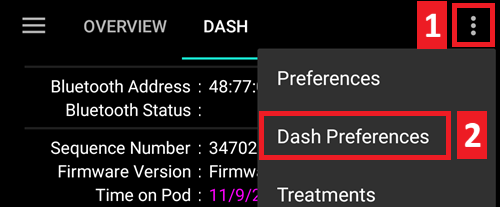

# Omnipod DASH

Bu talimatlar **Omnipod DASH** nesil pompayı yapılandırmak içindir **(Omnipod Eros DEĞİL)**. Omnipod Eros sürücüsü, 3.0 sürümünden itibaren AAPS'in bir eklentisidir.

**Bu yazılım bir DIY (Kendin Yap) yapay pankreas çözümünün bir parçasıdır ve bir ürün değildir, ancak nasıl kullanılacağı da dahil olmak üzere sistemi okumanızı, öğrenmenizi ve anlamanızı gerektirir. Yazılımla yaptıklarınızdan yalnızca siz sorumlusunuz.**

## Omnipod DASH özellikleri

**Omnipod DASH**'ın özellikleri ve onu **Omnipod EROS**'dan ayıran özellikler şunlardır:

* DASH podları mavi bir iğne kapağıyla tanımlanır (EROS'un şeffaf bir iğne kapağı vardır). Podlar, fiziksel boyutlar açısından birbirinin aynıdır
* Bağlantı için ayrı bir BLE bağlantı/köprü cihazına gerek yoktur (RileyLink, OrangeLink veya EmaLink gerekmez).
* BT bağlantısı yalnızca komut göndermek için gerektiğinde yapılır ve hemen sonra bağlantı kesilir!
* Artık "köprü cihazına bağlantı yok / pod" hataları yok
* AAPS komutları göndermek için pod erişilebilirliğini bekleyecek
* Aktifleştirmede, AAPS yeni bir DASH podunu bulacak ve bağlayacaktır.
* Beklenen menzil: 5-10 metre (YMMV)

## Donanım/Yazılım Gereksinimleri

* Yeni bir **Omnipod DASH Pod** (Mavi iğne kapağıyla anlaşılır)

* BLE Bluetooth bağlantısına sahip **Uyumlu Android telefon**
   -  Tüm telefon donanımları ve Android sürümlerinin çalışması garanti edilmez. Lütfen [**DASH Test Edilen telefonları**](https://docs.google.com/spreadsheets/d/1zO-Vf3wv0jji5Gflk6pe48oi348ApF5RvMcI6NG5TnY) kontrol edin veya sadece telefonunuzla deneyin ve sonucu bize bildirin (telefon referansı ve coğrafi bölge, Android sürümü, "çalıştı / bazı zorluklar mevcut / çalışmadı" şeklinde).
   - **Önemli not: Yazılım sürümü 3.XX.X olan pod ile birlikte kullanırken birçok kalıcı, kurtarılamaz bağlantı kaybı vakası olmuştur. Bu eski yazılımlı podları AAPS ile kullanırken özellikle diğer bluetooth cihazları telefonunuza bağlı ise dikkatli olun!** AAPS Omnipod Dash sürücüsünün her komut gönderdiğinde Bluetooth aracılığıyla Dash POD'a bağlandığını ve hemen ardından bağlantısının kesildiğini unutmayın. Bluetooth bağlantıları AAPS çalıştıran telefona bağlı olan kulaklık vb. diğer cihazlar tarafından bozulabilir, (bazı telefon modellerinde ender durumlarda bağlantı sorununa veya etkinleştirme sırasında veya sonrasında pod hatalarına/kaybına neden olabilir) veya etkilenebilir.
   -  [**APK Derle**](../Installing-AndroidAPS/Building-APK.md) talimatlarını kullanarak **AAPS'nin 3.0 veya daha yeni ** sürümü derleyin ve yükleyin.
* [**Sürekli Glikoz İzleme (CGM)**](https://androidaps.readthedocs.io/en/latest/Configuration/BG-Source.html)

Bu talimatlar, yeni bir pod oturumu başlattığınızı varsayacaktır; durum böyle değilse, lütfen sabırlı olun ve bir sonraki pod değişikliğinizde bu işleme başlayın.

## Başlamadan önce

**ÖNCE GÜVENLİK** - bir hatadan kurtulamayacağınız bir ortamda bu işlemi denemeyin (ekstra pod, insülin ve telefon cihazları olmazsa olmazdır).

**AAPS Dash sürücüsü podunuzu etkinleştirdikten sonra Omnipod Dash PDM'niz artık çalışmayacaktır.** Önceden Dash podunuza komut göndermek için Dash PDM'nizi kullanıyordunuz. Bir Dash podu, yalnızca tek bir cihazın kendisiyle iletişim kurmak için komutlar göndermesine izin verir. Podu başarıyla etkinleştiren cihaz, o andan itibaren onunla iletişim kurmasına izin verilen tek cihazdır. Bu Android telefonunuzla AAPS Dash sürücüsü aracılığıyla bir Dash podunu etkinleştirdiğinizde, **PDM'nizi artık o podla kullanamayacağınız anlamına gelir**. Android telefonunuzdaki AAPS Dash sürücüsü artık vekil PDM'nizdir.

*Bu PDM'nizi atmanız gerektiği anlamına GELMEZ, yedek olarak ve örneğin telefonunuz kaybolduğunda veya AAPS düzgün çalışmadığında acil durumlar için bir kenarda tutmanız önerilir.*

**Podunuz, AAPS'e bağlı olmadığında insülin vermeyi durdurmaz**. Varsayılan bazal oranlar, geçerli etkin profilde tanımlandığı gibi etkinleştirme sırasında poda programlanır. AAPS çalışır durumda olduğu sürece, maksimum 120 dakika boyunca çalışan bazal oran komutları gönderir. Herhangi bir nedenle pod herhangi bir yeni komut almadığında (örneğin, Pod - telefon mesafesi nedeniyle iletişimin kesilmesi) pod otomatik olarak varsayılan bazal oranlarına geri dönecektir.

**30 dk Bazal Oranı Profilleri AAPS'de DESTEKLENMEZ.** **AndroidAPS Profili, 30 dakikalık bir bazal oran zaman dilimini desteklemiyor.** AAPS'de yeniyseniz ve bazal oran profilinizi ilk kez oluşturuyorsanız, yarım saatlik bazal oranların desteklenmediğini ve başlangıç için bazal oran profilinizi saatlik olarak ayarlamanız gerekeceğini lütfen unutmayın. Örneğin, 09:30'da başlayan ve 11:30'da biten 2 saatlik bir süresi olan 1,1 birimlik bir bazal oranınız varsa, bu çalışmayacaktır. Bu 1,1 birim bazal oranını 9:00-11:00 veya 10:00-12:00 zaman aralığına değiştirmeniz gerekecektir. Even though the Omnipod Dash hardware itself supports the 30 min basal rate profile increments, AAPS is not able to take them into account with its algorithms currently.

**0U/h profile basal rates are NOT supported in AAPS** While the DASH pods do support a zero basal rate, since AAPS uses multiples of the profile basal rate to determine automated treatment it cannot function with a zero basal rate. A temporary zero basal rate can be achieved through the "Disconnect pump" function or through a combination of Disable Loop/Temp Basal Rate or Suspend Loop/Temp Basal Rate.

## AAPS'de Dash Sürücüsünü Etkinleştirme

Dash sürücüsünü AAPS'de **iki şekilde** etkinleştirebilirsiniz:

### Seçenek 1: Yeni kurulum

AAPS'i ilk kez kurarken, **Kurulum Sihirbazı**, AAPS'i yüklemeniz için size rehberlik edecektir. Pompa seçimine ulaştığınızda “DASH” seçeneğini seçin.

Şüphe duyduğunuzda, AAPS'i kurduktan sonra “Sanal Pompa”yı ve daha sonra “DASH”ı da seçebilirsiniz (bkz. seçenek 2).

### Seçenek 2: Konfigürasyon ayarları

Mevcut bir kurulumda, Konfigürasyon ayarları altında **DASH** pompasını seçebilirsiniz:

Sol üst köşede **hamburger menüsü** seçilip **Konfigürasyon ayarları (1)**\ ➜\ **Pompa**\ ➜\ **Dash**\ ➜**Dişli Çark (3)** Dash satırındaki ** radyo butonu (2)** seçilir.

**Dişli çark (3)**'ın yanındaki **onay kutusu (4)**'nun seçilmesi, Dash menüsünün AAPS arayüzünde **DASH** başlıklı bir sekme olarak görüntülenmesini sağlar. Bu kutuyu işaretlemek, AAPS kullanırken DASH komutlarına erişiminizi kolaylaştıracaktır.

**NOT:** [**Dash ayarlarına**](DanaRS-Insulin-Pump-dash-settings) erişmenin daha hızlı bir yolunu, aşağıda bu dokümantasyonun Dash ayarları kısmında bulabilirsiniz.

### Omnipod Sürücü Seçiminin Doğrulanması

Eğer kutucuğu (4) işaretlediyseniz, AAPS'de Dash pompasını etkinleştirdiğinizi doğrulamak için, **Giriş** sekmesinde **sola kaydırarak** **DASH** sekmesine ulaşmanız gerekir. Kutucuğu işaretlemediyseniz, sol üstteki hamburger menüsünde pompalar kısmında DASH satırında bulacaksınız.

## Dash Konfigürasyonu

Lütfen **sola kaydırıp** tüm pod işlevlerini yönetebileceğiniz **DASH** sekmesine ulaşın.(bu işlevlerden bazıları etkin bir pod oturumu olmadan etkinleştirilmez veya görünmez):

 Pod bağlantısını ve durumunu yenileyin, pod bip sesleri pod alarmlarında susturabilir.

 Pod Yönetimi (Etkinleştir, Devre Dışı Bırak, Test bip sesini çal ve Pod geçmişi)

(OmnipodDASH-activate-pod)=

### Pod Etkinleştirme

1. **DASH** sekmesine gidin. **POD YNTM (1)** butonuna ve ardından **Pod Etkinleştir (2) **butonuna tıklayın.

    

2. **Podu Doldur** ekranı görüntülenir. Yeni bir podu en az 80 ünite insülinle doldurun ve podun kullanıma hazır olduğunu belirten iki bip sesini dinleyin. 3 gün boyunca ihtiyacınız olan toplam insülin miktarını hesaplarken, pod hazırlamanın ilave 3-10 ünite kullanacağını lütfen göz önünde bulundurun.

    

Yeni podun ve AAPS yüklü telefonun birbirine yakın olduğundan emin olun ve **İleri** butonunu tıklayın.

**NOT**: Aşağıdaki hata mesajını almanız durumunda (bu olabilir), panik yapmayın. **TEKRAR DENE** butonunu tıklayın. Çoğu durumda etkinleştirme başarıyla devam eder.

3. **Pod'u Başlat** ekranında, pod hazırlanmaya başlar (pod kendini hazırlarken bir tıklama ve ardından bir dizi tıkırtı sesi duyarsınız).  Başarılı kullanıma hazırlamanın ardından yeşil bir onay işareti gösterilecek ve **İleri** butonu aktif olacaktır. Pod hazırlama işlemini tamamlamak ve **Pod Ekle** ekranını görüntülemek için **İleri** butonunu tıklayın.

    

4. Ardından, yeni podun infüzyon bölgesini hazırlayın. Podun plastik iğne kapağını çıkarın. Poddan dışarı çıkan bir şey görürseniz, işlemi iptal edin ve yeni bir pod ile başlayın. Her şey yolunda görünüyorsa, yapışkanın arkasındaki beyaz kağıdı çıkarın ve podu vücudunuzdaki seçtiğiniz bölgeye uygulayın. Bitirdiğinizde, **İleri** butonunu tıklayın.

5. **Pod Ekle** iletişim kutusu şimdi görünecektir. **Kanülü vücudunuza yerleştirmeye hazırsanız Tamam düğmesini tıklayın**.

6. **Tamam**'a bastıktan sonra, Dash podunun yanıt vermesi ve kanülü yerleştirmesi biraz zaman alabilir (en fazla 1-2 dakika), bu yüzden sabırlı olun.

 *NOT: Kanül takılmadan önce, kanül yerleştirme noktasının etrafındaki cildi sıkıştırmak iyi bir uygulamadır. Bu iğnenin düzgün bir şekilde yerleştirilmesini sağlar ve tıkanıklık oluşturma şansınızı azaltır.*

    

7. Başarılı bir kanül yerleştirilmesinden sonra yeşil bir onay işareti görünür ve **İleri** butonu aktif olur. **İleri** butonunu tıklayın.

9. **Pod etkinleştirildi** ekranı görüntülenir. Yeşil **Bitti** düğmesini tıklayın. Tebrikler! Artık yeni bir aktif pod oturumu başlattınız.

10. **Pod yönetimi** menüsünde şimdi **Pod Etkinleştir (1)** butonu <em x-id"3"=>devre dışı</em> olmalı ve **Pod'u Devre Dışı Bırak (2)** butonu *aktif olmalıdır.*. Bunun nedeni, bir podun artık etkin olması ve o anda etkin olan podu devre dışı bırakmadan ek bir pod etkinleştirememenizdendir.

    **DASH** sekme ekranına dönmek için telefonunuzdaki geri düğmesini tıklayın. Şimdi aktif pod oturumunuz için mevcut bazal oran, pod rezervuar seviyesi, iletilen insülin, pod hataları ve uyarılar dahil Pod bilgileri görüntülenecektir.

    Görüntülenen bilgilerle ilgili daha fazla ayrıntı için bu dokümantasyonun [**DASH Sekmesi**](OmnipodDASH-dash-tab) bölümüne gidin.

    

Podu etkinleştirdikten SONRA ayarları dışa aktarmak akıllıca olacaktır. Bunu her pod değişikliğinde yapın ve ayda bir dışa aktarılan dosyayı internet sürücünüze (cloud) kopyalayın. [**Dışarı aktarma ayarları dokümantasyonuna bakabilirsiniz **](https://androidaps.readthedocs.io/en/latest/Usage/ExportImportSettings.html?highlight=exporting#export-import-settings).

(OmnipodDASH-deactivate-pod)=

### Pod'u Devre Dışı Bırakma

Normal koşullar altında, bir podun beklenen ömrü üç gündür. (72 saat) Pod sona erme uyarısından sonra ek 8 saattlik süre ile toplam 80 saat olabilir.

Bir Podu devre dışı bırakmak (süre sonundan veya bir pod hatasından dolayı):

1. **DASH** sekmesine gidin, **POD YNTM (1)** butonunu tıklayın, **pod yönetimi** ekranında **Pod'u Devre Dışı Bırak (2)** butonunu tıklayın.

    

2. **Pod'u Devre Dışı Bırak** ekranında, podu devre dışı bırakma işlemini başlatmak için **İleri** butonunu tıklayın. Devre dışı bırakmanın başarılı olduğuna dair poddan bir onay bip sesi alacaksınız.

 

3. Başarılı bir şekilde devre dışı bırakmanın ardından yeşil bir onay işareti görünecektir. Pod devre dışı ekranını görüntülemek için **İleri** butonunu tıklayın. Etkin oturum devre dışı bırakıldığı için artık podunuzu çıkartabilirsiniz.

4. **Pod Yönetimi** ekranına dönmek için yeşil butona tıklayın.

5. Artık **Pod Yönetimi** menüsündesiniz; **DASH** sekmesine dönmek için telefonunuzdaki geri butonuna basın. **Pod durumu:** alanında bir **Aktif pod yok** mesajının görüntülendiğini doğrulayın.

 

(OmnipodDASH-resuming-insulin-delivery)=

### İnsülin İletimini Sürdür

**Note**: During profile switches, dash must suspend delivery before setting the new basal profile. If communication fails between the two commands, then delivery can be suspended. Read [**Delivery suspended**](OmnipodDASH) in the troubleshooting section for more details.

Use this command to instruct the active, currently suspended pod to resume insulin delivery. After the command is successfully processed, insulin will resume normal delivery using the current basal rate based on the current time from the active basal profile. The pod will again accept commands for bolus, TBR, and SMB.

1. **DASH** sekmesine gidin ve **Pod durumu (1)** satırında **ASKIYA ALINDI** mesajının görünmesi gerekir, ardından mevcut podun normal insülin iletimini sürdürmesi talimatını vermek için **İLETİME DEVAM ET (2)** butonuna basın. **Pod Durumu (3)** satırında **İleme Devam Et** mesajı görüntülenir.

   

2. İletimi sürdür komutu başarılı olduğunda, bir onay iletişim kutusu **İnsülin iletimi yeniden başlatıldı.** mesajını görüntüler. Onaylamak ve devam etmek için **Tamam**'ı tıklayın.

3. **DASH** sekmesi, **Pod durumu (1)** satırını **ÇALIŞIYOR** olarak günceller ve **İletime Devam Et** butonu artık görüntülenmez.

### Pod Alarmlarını Susturma

*NOTE - The SILENCE ALERTS button is only available on the **DASH** tab when the pod expiration or low reservoir alert has been triggered. If the SILENCE ALERTS button is not visible and you hear beep sounds from the pod, try to 'Refresh pod status'.*

The process below will show you how to acknowledge and dismiss pod beeps when the active pod time reaches the warning time limit before the pod expiration of 72 hours (3 days). This warning time limit is defined in the **Hours before shutdown** Dash alerts setting. The maximum life of a pod is 80 hours (3 days 8 hours), however Insulet recommends not exceeding the 72 hours (3 days) limit.

1. Tanımlanan **Kapanmadan kaç saat önce?** uyarı süresi sınırına ulaşıldığında, pod sona erme zamanına yaklaştığını size bildirmek için uyarı bip sesleri çıkaracak ve yakında pod değişikliği gerekecektir. Bunu **DASH** sekmesinde doğrulayabilirsiniz, **Pod Sona Erme: (1)** satırı tam zamanı gösterecektir. Pod'un süresi dolar (etkinleştirmeden 72 saat sonra) ve bu süre geçerse metin **kırmızı** olacaktır. **Etkin pod alarmları (2)** satırında, **Pod'un süresi yakında dolacak** durum mesajı görüntülenir. Bu aynı zamanda **ALARMLARI SUSTUR (3)** butonunun görüntülenmesini de tetikler.

2. **DASH** sekmesine gidin ve **ALARMLARI SUSTUR (2)** butonuna basın. AAPS, pod sona erme uyarı bip seslerini devre dışı bırakmak için pod'a komutu gönderir ve **Pod durumu (1)** satırını **BİLİNEN UYARILAR ** olarak günceller.

3. Uyarıların **başarıyla devre dışı bırakılması** üzerine, etkin pod tarafından **2 bip** sesi verilir ve bir onay iletişim kutusunda **Etkin alarmlar susturuldu.** mesajı görüntülenir. İletişim kutusunu onaylamak ve kapatmak için **Tamam** butonunu tıklayın.

4. **DASH** sekmesine gidin. **Etkin Pod Alarmları** satırında, uyarı mesajı artık görüntülenmez ve etkin pod artık sona erme uyarısı bip sesi vermez.

(OmnipodDASH-view-pod-history)=

### Pod Geçmişini Görüntüle

This section shows you how to review your active pod history and filter by different action categories. The pod history tool allows you to view the actions and results committed to your currently active pod during its three days (72 - 80 hours) life.

This feature is helpful in verifying boluses, TBRs and basal commands that were sent to the pod. The remaining categories are useful for troubleshooting issues and determining the order of events that occurred leading up to a failure.

*NOTE:* **Only the last command can be uncertain**. New commands *will not be sent* until the **last 'uncertain' command becomes 'confirmed' or 'denied'**. The way to 'fix' uncertain commands is to **'refresh pod status'**.

1. **DASH** sekmesine gidin ve **POD YNTM (1)** butonuna basarak **Pod Yönetimi** menüsüne gidin ve ardından pod geçmişi ekranına erişmek için **Pod geçmişi (2)** butonuna basın.

 

2. **Pod geçmişi ** ekranında, **All (1)** (Tümü) varsayılan kategorisi ile tüm pod **Eylemleri (3)** ve **Sonuçları (4)** **Tarih ve Saat (2)** ters kronolojik sırada görüntülenir. Ana AAPS arayüzünde **DASH** sekmesine dönmek için telefonunuzun **geri butonunu 2 kez** kullanın.

 

(OmnipodDASH-dash-tab)=

## DASH Sekmesi

Below is an explanation of the layout and meaning of the icons and status fields on the **DASH** tab in the main AAPS interface.

*NOTE: If any message in the **DASH** tab status fields report (uncertain), then you will need to press the Refresh button to clear it and refresh the pod status.*

### Alanlar

* **Bluetooth Adresi:** Bağlı Pod'un mevcut bluetooth adresini görüntüler.
* **Bluetooth Durumu:** Mevcut bağlantı durumunu görüntüler.
* **Sıra Numarası:** Etkin POD'un sıra numarasını görüntüler.
* **Firmware Versiyonu:** Etkin bağlantının firmware sürümünü görüntüler.
* **Pod üzerindeki zaman:** Pod üzerindeki geçerli saati görüntüler.
* **Pod Sona Erme:** Pod'un süresinin dolacağı tarih ve saati görüntüler.
* **Pod durumu:** Pod durumunu görüntüler.
* **Son bağlantı:** Pod ile son iletişimin zamanını görüntüler.

   - *Biraz önce* - 20 saniyeden kısa bir süre önce.
   - *Bir dakikadan kısa bir süre önce* - 20 saniyeden uzun, ancak 60 saniyeden kısa bir süre önce.
   - *1 dakika önce* - 60 saniyeden uzun ancak 120 saniyeden kısa (2 dakika)
   - *XX dakika önce* - XX değeriyle tanımlanan 2 dakikadan daha uzun bir süre önce

* **Son bolus:** Etkin pod'dan gönderilen son bolus miktarını ve ne kadar süre önce verildiğini parantez içinde görüntüler.
* **Bazal oranı:** Bazal oran profilinden geçerli zaman için programlanmış bazal oranı görüntüler.
* **Geçici bazal oranı:** Şu anda çalışmakta olan Geçici Bazal Oranı aşağıdaki biçimde görüntüler

   - {Units per hour} @{TBR start time}  ({minutes run}/{total minutes TBR will be run})
   - *Örnek:* 0,00Ü/s @18:25 ( 90/120 dakika)

* **Rezervuar:** Rezervuarda 50 üniteden fazla insülin olduğuda 50+Ü'den fazla kalanı gösterir. 50 Ü'nin altında, tam birimler görüntülenir.
* **Toplam iletilen:** Rezervuardan iletilen toplam insülin ünite miktarını görüntüler. Bu miktar etkinleştirme ve hazırlama için kullanılan insülini de içerir.
* **Hatalar:** Karşılaşılan son hatayı görüntüler. Geçmiş hatalar ve daha ayrıntılı bilgiler için [Pod geçmişini](OmnipodDASH-view-pod-history) ve günlük dosyalarını inceleyin.
*  **Etkin pod alarmları:** Etkin pod alarmlarını gösteren satırdır.

### Butonlar

 : Sends a refresh command to the active pod to update communication.

   * Pod durumunu yenilemek ve metin içeren (belirsiz) durum satırlarını yenilemek için kullanın.
   * Ek bilgi için aşağıdaki Sorun Giderme bölümüne bakın.

 : Navigates to the Pod management menu.

 : When pressed this will disable the pod alerts beeps and notifications (expiry, low reservoir..).

   * Bu buton, yalnızca pod kullanım süresi (72saat) aşılmışsa görüntülenir.
   * Başarılı bir devre dışı bırakmanın ardından bu simge artık görünmeyecektir.

 : Resumes the currently suspended insulin delivery in the active pod.

### Pod Yönetim Menüsü

Below is the meaning of the icons on the **Pod Management** menu accessed by pressing **POD MGMT (0)** button from the **DASH** tab.  

* 1 - [**Pod Etkinleştir**](OmnipodDASH-activate-pod) : Yeni bir pod'u hazırlar ve etkinleştirir.
* 2 - [**Pod'u Devre Dışı Bırak**](OmnipodDASH-deactivate-pod) : Şu anda etkin olan pod'u devre dışı bırakır.
* 3 - **Test Bip Sesi Çal** : Basıldığında pod'dan test bip sesi çalar.
* 4 - [**Pod geçmişi**](OmnipodDASH-view-pod-history) : Pod etkinlik geçmişini görüntüler.

(DanaRS-Insulin-Pump-dash-settings)=

## Dash Ayarları

The Dash driver settings are configurable from the top-left hand corner **hamburger menu** under **Config Builder (1)**\ ➜\ **Pump**\ ➜\ **Dash**\ ➜\ **Settings Gear (3)** by selecting the **radio button (2)** titled **Dash**. **Dişli çark (3)**'ın yanındaki **onay kutusu (4)**'nun seçilmesi, Dash menüsünün AAPS arayüzünde **DASH** başlıklı bir sekme olarak görüntülenmesini sağlar.

 

**NOTE:** A faster way to access the **Dash settings** is by accessing the **3 dot menu (1)** in the upper right hand corner of the **DASH** tab and selecting **Dash preferences (2)** from the dropdown menu.

The settings groups are listed below; you can enable or disable via a toggle switch for most entries described below:

*NOTE: An asterisk (\*) denotes the default setting is enabled.*

### Onay Bildirimleri

Provides confirmation beeps from the pod for bolus, basal, SMB, and TBR delivery and changes.

* **Bolus bip seslerini etkinleştir:** Bolus iletildiğinde onay biplerini etkinleştirin veya devre dışı bırakın.
* **Bazal bip seslerini etkinleştir:** Yeni bir bazal oran ayarlandığında, aktif bazal oran iptal edildiğinde veya mevcut bazal oran değiştirildiğinde onay biplerini etkinleştirin veya devre dışı bırakın.
* **SMB bip seslerini etkinleştir:** Bir SMB teslim edildiğinde onay biplerini etkinleştirin veya devre dışı bırakın.
* **GBO (TBR) bip seslerini etkinleştir:** Bir GBO ayarlandığında veya iptal edildiğinde onay biplerini etkinleştirin veya devre dışı bırakın.

### Alarmlar

Provides AAPS alerts for pod expiration, shutdown, low reservoir based on the defined threshold units.

*Note an AAPS notification will ALWAYS be issued for any alert after the initial communication with the pod since the alert was triggered. Dismissing the notification will NOT dismiss the alert UNLESS automatically acknowledge Pod alerts is enabled. To MANUALLY dismiss the alert you must visit the **DASH** tab and press the **Silence ALERTS button**.*

* **Süre sonu hatırlatıcısını etkinleştir:** Kapanmadan önce tanımlanan saat süresine ulaşıldığında tetiklenecek şekilde pod sona erme hatırlatıcısını etkinleştirin veya devre dışı bırakın.
* **Kapanmadan kaç saat önce:** Etkin pod kapanmadan önceki saat süresini tanımlar, bu daha sonra pod süre sonu hatırlatıcısı alarmını tetikler.
* **Düşük rezervuar uyarısını etkinleştir:** Pod, ünite satırında belirlenen alt rezervuar sınırına ulaştığında bir alarm etkinleştirin veya devre dışı bırakın.
* **Ünite:** Pod düşük rezervuar alarmının tetikleneceği ünite sayısı.

### Bildirimler

Provides AAPS notifications and audible phone alerts when it is uncertain if TBR, SMB, or bolus, and delivery suspended events were successful.

*NOTE: These are notifications only, no audible beep alerts are made.*

* **Belirsiz GBO (TBR) bildirimleri için sesi etkinleştir:** Bir Geçici Bazal Oranının başarılı bir şekilde ayarlanıp ayarlanmadığı AAPS tarafından belirsiz olduğunda sesli bir uyarı ve görsel bildirim tetiklemek için bu ayarı etkinleştirin veya devre dışı bırakın.
* **Belirsiz SMB bildirimleri için sesi etkinleştir:** Bir SMB'nin başarıyla teslim edilip edilmediğinden AAPS emin olmadığında sesli bir uyarı ve görsel bildirimi tetiklemek için bu ayarı etkinleştirin veya devre dışı bırakın.
* **Belirsiz bolus bildirimleri için sesi etkinleştir:** AAPS'nin bir bolusun başarıyla iletildiğinden emin olmadığı durumlarda sesli uyarı ve görsel bildirimi tetiklemek için bu ayarı etkinleştirin veya devre dışı bırakın.
* **İletimin askıya alındığı bildirimi etkinleştirildiğinde sesle uyar:** İletimi askıya alma başarıyla tamamlandığında sesli bir uyarı ve görsel bildirimi tetiklemek için bu ayarı etkinleştirin veya devre dışı bırakın.

## Eylemler (EYLEM) Sekmesi

This tab is well documented in the main AAPS documentation but there are a few items on this tab that are specific to how the Omnipod Dash pod differs from tube based pumps, especially after the processes of applying a new pod.

1. Ana AAPS arayüzünde **Eylemler (EYLEM)** sekmesine gidin.

2. **Bakımportalı (1)** bölümünün altında **İnsülin** ve **Kanül** alanları her pod değişikliğinden sonra **yaşlarını 0 gün ve 0 saat ** olacak şekilde sıfırlayacaktır. Bu Omnipod pompasının çalışma şekli nedeniyle böyle yapılmaktadır. Pod, kanülü doğrudan pod uygulama bölgesinde deriye yerleştirdiği için, Omnipod pompalarında hortum kullanılmaz. *Bu nedenle, bir pod değişikliğinden sonra bu değerlerin her birinin yaşı otomatik olarak sıfırlanır.* **Pompa pil yaşı** pod pili her zaman kendi ömründen daha fazla olacağı için (maksimum 80 saat) rapor edilmez. **Pompa pili** ve **insülin rezervuarı**, her pod içinde yer almaktadır.

### Seviye

**Insulin Level**

Insulin level displayed is the amount reported by Omnipod DASH. However, the pod only reports the actual insulin reservoir level when it is below 50 units. Until then “Above 50 units” will be displayed. The amount reported is not exact: when the pod reports ‘empty’ in most cases the reservoir will still have some additional units of insulin left. The omnipod DASH overview tab will display as described the below:

  * **50 Ünitenin Üzerinde** - Pod, şu anda rezervuarda 50 üniteden fazla insülin olduğunu rapor ediyor.
  * **50 Ünitenin Altında** - Pod tarafından bildirilen rezervuarda kalan insülin miktarı.

Additional note:
  * **SMS** - SMS yanıtlarında insülin seviyesi 50+Ü veya değer görünür.
  * **Nightscout** - Nightscout'a (sürüm 14.07 ve daha eski) 50 üniteden fazla olduğunda 50 değerini yükler.  Daha yeni sürümler, 50 ünite üzerinde olduğunda 50+ değerini bildirir.

## Sorun giderme

(OmnipodDASH-delivery-suspended)=

### İletimi askıya alma

  * Artık iletimi askıya alma butonu yok. Pod insülin iletimini "askıya almak" istiyorsanız, x dakika için sıfır GBO ayarlayabilirsiniz.
  * Profil geçişleri sırasında, dash pompa yeni bazal profili ayarlamadan önce iletimi askıya almalıdır. İki komut arasında iletişim başarısız olursa, iletim askıya alınabilir. Bu olduğunda:
     - Bazal, SMB, Manuel bolus vb. içeren insülin iletimi olmayacaktır.
     - Komutlardan birinin onaylanmadığına dair bir bildirim olabilir: bu, hatanın ne zaman gerçekleştiğine bağlıdır.
     - AAPS, her 15 dakikada bir yeni bazal profili ayarlamaya çalışacaktır.
     - APPS, iletim hala askıya alınmışsa iletimin her 15 dakikada bir askıya alındığını bildiren bir bildirim gösterecektir. (iletim devam ettirilemedi)
     - [**İletime devam et**](OmnipodDASH-resuming-insulin-delivery) butonu etkin olacak ve kullanıcı iletimi manuel olarak sürdürmeyi seçebilecektir.
     - AAPS kendi kendine iletimi sürdüremezse (bu, Pod'a ulaşılamıyorsa, ses kapatılmışsa vb. olabilir), pod 3 dakika için her dakikada bir 4 kez bip sesi çıkarmaya başlar, ardından iletim 20 dakikadan daha uzun süre askıda kalırsa bu her 15 dakikada bir tekrarlanır.
  * Onaylanmamış komutlar için "pod durumunu yenile" komutu, bunları onaylamalı/reddetmelidir.

**Not:** Pod bip seslerini duyduğunuzda, telefonu kontrol etmeden iletimin devam ettiğini varsaymayın, iletim askıya alınmış olabilir, **bu yüzden kontrol etmeniz gerekiyor!**

### Pod Hataları

Pod'larda, kendisiyle ilgili donanım sorunları da dahil olmak üzere çeşitli sorunlar nedeniyle ara sıra hatalar olabiliyor. AAPS onaylanmış bir kullanım şekli olmadığından, bunları Insulet'e bildirmemek en iyi seçenektir. Nedenini belirlemeye yardımcı olacak hata kodlarının bir listesi [**burada bulunabilir.**](https://github.com/openaps/openomni/wiki/Fault-event-codes)

### 49 numaralı Pod hatasını önleme

Bu hata bir komut için yanlış bir pod durumu veya bir insülin iletim komutu sırasındaki bir hata ile ilgilidir. Bu, sürücü ve Pod'un gerçek durum üzerinde anlaşamadığı zaman meydana gelir. Pod (yerleşik bir güvenlik önlemi dışında), daha sonra kurtarılamaz bir 49 (0x31) hata koduyla tepki verir ve sonunda "çığlık atan" olarak bilinen bir hatayla sonuçlanır: yalnızca pod'un arkasındaki uygun yerde bir delik açılarak durdurulabilen uzun rahatsız edici bir bip sesi. "49 pod arızasının" kesin kök nedenini izlemek çoğu zaman zordur. Bu hatanın meydana gelmesinde şüphelenilen durumlar, örneğin uygulama çökmeleri, bir geliştirme sürümünün çalıştırılması veya yeniden kurulumdur.

### Pompaya Ulaşılamıyor Uyarıları

Önceden yapılandırılmış bir süre boyunca pod ile iletişim kurulamadığında, "Pompaya ulaşılamıyor" uyarısı verilir. Pompaya erişilemiyor uyarıları, sağ üst taraftaki üç noktalı menüye gidip **Tercihler**\ ➜\ **Yerel uyarılar**\ ➜\ **Pompa ulaşılamaz eşiği [dk]** öğesi seçilerek yapılandırılabilir. Önerilen değer, **120** dakika sonra uyarı vermesidir.

### Ayarları Dışa Aktarma

AAPS ayarlarını dışa aktarmak, tüm ayarlarınızı ve belki daha da önemlisi tüm gerçekleştirdiğiniz görevleri geri yükleyebilmenizi sağlar. AAPS'i kaldırıp/yeniden yükledikten sonra veya telefonun kaybolması durumunda yeni telefona yeniden yüklemeniz durumunda ayarları "bilinen son çalışma durumuna" geri yüklemeniz gerekebilir.

Not: Aktif pod bilgileri, dışa aktarılan ayarlara dahildir. If you import an "old" exported file, your actual pod will "die". There is no other alternative. In some cases (like a _programmed_ phone change), you may need to use the exported file to restore AndroisAPS settings **while keeping the current active Pod**. In this case it is important to only use the recently exported settings file containing the pod currently active.

**It is good practice to do an export immediately after activating a pod**. This way you will always be able to restore the current active Pod in case of a problem. For instance when moving to another backup phone.

Regularly copy your exported settings to a safe place (as a cloud drive) that can be accessible by any phone when needed (e.g. in case of a phone loss or factory reset of the actual phone).

### Ayarları İçe Aktarma

**WARNING** Please note that importing settings will possibly import an outdated Pod status. As a result, there is a risk of losing the active Pod! (see **Exporting Settings**). It is better to only try it when no other options are available.

When importing settings with an active Pod, make sure the export was done with the currently active pod.

**Importing while on an active Pod:** (you risk losing the Pod!)

1. Şu anda etkin olan Pod ile yakın zamanda dışa aktarılan ayarları içe aktardığınızdan emin olun.
2. Ayarlarınızı içe aktarın
3. Tüm tercihleri kontrol edin

**Importing (no active Pod session)**

1. Yakın zamanda dışa aktarılan bir dosyanın içe aktarılması işe yarayacaktır (yukarıya bakın)
2. Ayarlarınızı içe aktarın.
3. Tüm tercihleri kontrol edin.
4. İçe aktarma ayarları herhangi bir etkin pod verisi içeriyorsa, "mevcut olmayan" pod'u **devre dışı bırakmanız** gerekebilir.

### Etkin olmayan bir pod durumunu içeren ayarları içe aktarma

Aktif olmayan bir pod verileri içeren ayarları içe aktarırken, AAPS onunla bağlanmaya çalışacak ve başarısız olacaktır. Bu durumda yeni bir Pod etkinleştiremezsiniz.

Eski Pod oturumunu kaldırmak için Pod'u devre dışı bırakmayı “deneyin”. Devre dışı bırakma başarısız olur. “Yeniden Dene”yi seçin. İkinci veya üçüncü denemeden sonra pod'u kaldırma seçeneğine sahip olacaksınız. Eski pod kaldırıldıktan sonra yeni bir pod etkinleştirebilirsiniz.

### AAPS'i yeniden yükleme

AAPS'i kaldırdığınızda tüm ayarlarınızı, hedeflerinizi ve mevcut Pod oturumunu kaybedersiniz. Bunları geri yüklemek için, yakın zamanda dışa aktarılmış bir ayar dosyanız olduğundan emin olun!

Etkin bir pod kullanırken, mevcut pod oturumu için bir dışa aktarılan dosyanız olduğundan emin olun, aksi takdirde eski ayarları içe aktarırken o anda etkin olan pod'u kaybedersiniz.

1. Ayarlarınızı dışa aktarın ve bir kopyasını güvenli bir yerde saklayın.
2. AAPS'i kaldırın ve telefonunuzu yeniden başlatın.
3. AAPS'in yeni sürümünü yükleyin.
4. Ayarlarınızı içe aktarın
5. Tüm tercihleri doğrulayın (isteğe bağlı olarak ayarları tekrar içe aktarın)
6. Yeni bir pod etkinleştirin
7. Tamamlandığında, mevcut ayarları dışa aktarın

### AAPS'i daha yeni bir sürüme güncelleme

Çoğu durumda, mevcut kurulumu kaldırmaya gerek yoktur. Yeni sürüm için kurulumu başlatarak “üzerine” kurulum yapabilirsiniz. Bu aktif bir Pod kullanırken de mümkündür.

1. Ayarlarınızı dışa aktarın.
2. Yeni AAPS sürümünü yükleyin.
3. Kurulumun başarılı olduğunu doğrulayın
4. Mevcut pod'a DEVAM EDİN veya yeni bir pod etkinleştirin.
5. Tamamlandığında, mevcut ayarları dışa aktarın.

### Omnipod sürücü uyarıları

Omnipod Dash sürücüsü **Giriş sekmesinde** çeşitli uyarılar sunmakla birlikte bunların çoğu bilgi amaçlıdır ve kapatılabilirken, bazıları da kullanıcıya tetiklenen uyarının nedenini çözmek için bir eylemde bulunmasını sağlar. Karşılaşabileceğiniz başlıca uyarıların bir özeti aşağıda listelenmiştir:

* Etkin pod yok Etkin Pod oturumu algılanmadı. (pod not activated) Bu uyarı, **ERTELE**'ye basılarak geçici olarak kapatılabilir, ancak yeni bir pod etkinleştirilmedikçe tetiklenmeye devam edecektir. Pod etkinleştirildiğinde bu uyarı otomatik olarak kapatılır.
* Pod askıya alındı Pod'un askıya alındığına dair bilgi uyarısı.
* Bazal profil ayarlanamadı : İletim askıya alınabilir! Lütfen Omnipod sekmesindeki Pod durumunu manuel olarak güncelleyin ve gerekirse teslimi devam ettirin.. Pod bazal profili ayarının başarısız olduğuna ve Dash sekmesinde *Yenile*'ye basmanız gerektiğine dair bilgi uyarısı.
* SMB bolusunun başarılı olup olmadığı doğrulanamıyor. Bolus'un başarılı olmadığından eminseniz, SMB girişini Tedaviler'den manuel olarak kaldırmalısınız. SMB bolus komutunun başarısının doğrulanamadığına dair uyarı, SMB bolusunun başarılı olup olmadığını görmek için DASH sekmesindeki *Son bolus* alanını doğrulamanız ve iletilmedi ise tedaviler sekmesinden girişi kaldırmanız gerekir.
* "Görev bolus/GBO/SMB"nin tamamlanıp tamamlanmadığı belirsizse, lütfen başarılı olup olmadığını manuel olarak doğrulayın.

## Omnipod DASH sürücüsü için nereden yardım alınabilir?

Omnipod DASH sürücüsü için tüm geliştirme çalışmaları topluluk tarafından **gönüllü** temelinde yapılır; Yardım talep etmeden önce bu gerçeği hatırlamanızı ve aşağıdaki yönergeleri kullanmanızı rica ediyoruz:

-  **Seviye 0:** Sorun yaşadığınız işlevin nasıl çalışması gerektiğini anladığınızdan emin olmak için bu dokümantasyonun ilgili bölümünü okuyun.
-  **Seviye 1:** Bu dokümantasyonu kullanmanıza rağmen hâlâ çözemediğiniz sorunlarla karşılaşıyorsanız, lütfen [bu davet bağlantısını](https://discord.gg/4fQUWHZ4Mw) kullanarak **Discord**'da * #AAPS* kanalına gidin.
-  **Seviye 2:** Sorununuzun daha önce [ sorunlar adresinde ](https://github.com/nightscout/AAPS/issues)bildirilmiş olup olmadığını görmek için mevcut sorunları arayın. Sorunuz burada mevcutsa, lütfen onaylayın/yorum yapın/ekleyin. Yoksa, lütfen bir [yeni sorun](https://github.com/nightscout/AndroidAPS/issues) oluşturun ve [günlük dosyalarınızı ekleyin](../Usage/Accessing-logfiles.md).
-  **Sabırlı olun - topluluğumuzun üyelerinin çoğu iyi huylu gönüllülerden oluşur ve sorunları çözmek genellikle hem kullanıcılar hem de geliştiriciler için zaman ve sabır gerektirir.**
