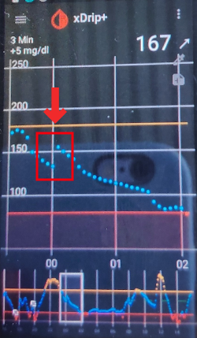
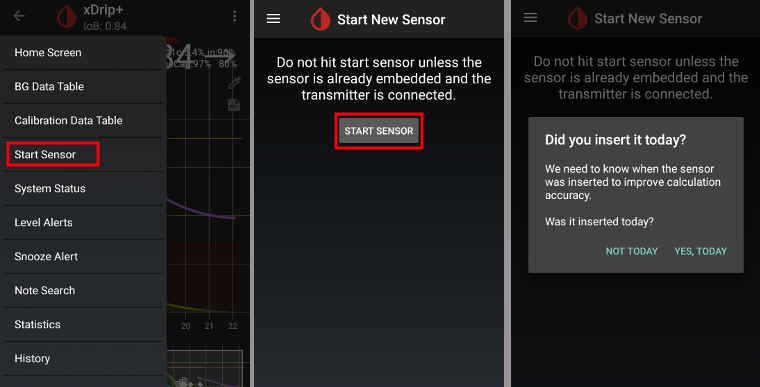

# xDrip+ ayarları

(xDrip+ ile ilgili ek bilgi için lütfen https://xdrip.readthedocs.io/en/latest/ adresine bakın)

Henüz kurulu değilse [xDrip+](https://jamorham.github.io/#xdrip-plus)'ı indirin.

**Bu dokümantasyon yalnızca Android telefonlara yüklü xDrip+ içindir.** Orjinal Android xDrip+ ile hiçbir ilgisi olmayan "iOS için xDrip" uygulaması da mevcuttur.

2018 sonbaharı/sonundan sonra üretilen G6 vericileri için (yani seri no. 80 veya 81 ile başlayanlar) [ana](https://jamorham.github.io/#xdrip-plus) sürümünü kullanabilirsiniz.

Dexcom G6 vericinizin seri numarası 8G...,8H veya 8J ile başlıyorsa [latest nightly build derlemelerinden](https://github.com/NightscoutFoundation/xDrip/releases) birini kullanabilirsiniz.

Telefonunuz Android 10 çalıştırıyorsa ve xDrip+ ana sürüm ile ilgili sorun yaşıyorsanız [nightly build 2019/12/31 veya sonrasını](https://github.com/NightscoutFoundation/xDrip/releases) deneyin.

## Tüm CGM & FGM sistemleri için temel ayarlar

* Temel URL'yi doğru ayarladığınızdan emin olun. ( http**s**:// sonunda **S** dahil olmak üzere "http:// şeklinde değil")
   
   örn. https://API_SECRET@your-app-name.herokuapp.com/api/v1/
   
   -> Hamburger Menüsü (ana ekranın sol üst kısmı) -> Ayarlar-> Buluta Yükleme-> Nightscout Senkronizasyonu (REST-API) -> Temel URL

* `Otomatik Kalibrasyon`'u devre dışı bırakın `Otomatik Kalibrasyon` onay kutusu işaretliyse, `Verileri indir` öğesini bir kez etkinleştirin, ardından `Otomatik Kalibrasyon` onay kutusunu kaldırın ve `Verileri indir` öğesini devre dışı bırakın, aksi takdirde tedaviler (insülin & karbonhidratlar) Nightscout'a iki kez eklenecektir.

* `Ek Seçenekler`'e dokunun

* `Tedavileri yükle` ve `Verileri geri doldur` seçeneğini devre dışı bırakın.
   
   **Güvenlik uyarısı : xDrip+'tan "Tedavileri yükle" seçeneğini devre dışı bırakmalısınız, aksi takdirde tedaviler AAPS'de iki katına çıkarak yanlış AKRB (aktif karbonhidrat) ve AİNS (aktif insülin) hesaplanmasına neden olabilir.**

* `Hatalarda uyarı ver` seçeneği de devre dışı bırakılmalıdır. Aksi takdirde, wifi/mobil ağın çok kötü olması veya sunucunun müsait olmaması durumunda her 5 dakikada bir alarm alırsınız.
   
   
   
   

* **Ugy.lar-arası ayarlar** (Yayın) AndroidAPS kullanacaksanız ve veriler AndroidAPS'e iletilecekse, Uygulamalar Arası ayarlarda xDrip+'da yayını etkinleştirmeniz gerekir.

* Değerlerin eşit olması için `Ekranda Görünen Glikoz Değerini Gönder` seçeneğini etkinleştirmelisiniz.

* AndroidAPS'de `Tedavileri kabul et` ve "Yerel olarak yayınla"yı da etkinleştirdiyseniz, xDrip+ AndroidAPS'den insülin, karbonhidrat ve bazal oran bilgilerini alır ve hipo tahminini vb. tahmin edebilir. Bu daha doğrudur.
   
   

(xdrip-identify-receiver)=

### Alıcı tanımlama

* Yerel yayınla ilgili sorunlar keşfederseniz (AAPS, xDrip+'dan KŞ değerleri almıyor) Ayarlar > Uygulamalar arası ayarlar > Alıcıyı tanımlayın'a gidin ve AndroidAPS derlemesi için `info.nightscout.androidaps` girin (PumpControl yapısını kullanıyorsanız `info.nightscout.aapspumpcontrol` girin!!).
* Lütfen Dikkat: Otomatik düzeltme bazen i'yi büyük harfe çevirme eğilimindedir. `info.nightscout.androidaps` yazarken **yalnızca küçük harf kullanmalısınız** (veya PumpControl için `info.nightscout.aapspumpcontrol`). I büyük harf olursa, APPS xDrip+'dan KŞ değerlerini alamaz.
   
   

## xDrip+ & Dexcom G6

* Dexcom G6 vericisi, Dexcom alıcısına (veya alternatif olarak t:slim pompasına) ve telefonunuzdaki bir uygulamaya aynı anda bağlanabilir.
* xDrip+'ı alıcı olarak kullanmadan önce Dexcom uygulamasını telefonunuzdan kaldırın. **xDrip+ ve Dexcom uygulamasını vericiye aynı anda bağlayamazsınız!**
* Dexcom clarity uygulamasını kullanıyorsanız ve xDrip+ alarmlarından yararlanmak istiyorsanız xDrip+'ta yerel yayın ile [Kendi Dexcom Uygulamanızı Oluşturun (BYODA)](DexcomG6-if-using-g6-with-build-your-own-dexcom-app) kullanın.

### G6 verici seri numarasına bağlı xDrip+ sürümü

* 2018 sonbaharı/sonundan sonra üretilen G6 vericileri için (yani seri no. 80 veya 81 ile başlayanlar) [master "ana sürüm"](https://jamorham.github.io/#xdrip-plus) kullanabilirsiniz. 
* Dexcom G6 vericinizin seri numarası 8G, 8H veya 8J ile başlıyorsa [2019/07/28 veya daha üst sürümü](https://github.com/NightscoutFoundation/xDrip/releases) deneyin.

### Dexcom'a özel ayarlar

* G5/G6 Hata Ayıklama Ayarlarını Açın -> Hamburger Menüsü (ana ekranın sol üst köşesinde) -> Ayarlar -> G5/G6 Hata Ayıklama Ayarları 

* Aşağıdaki ayarları etkinleştirin
   
   * `OB1 Toplayıcıyı kullanın`
   * `Yerel Algoritma` (SMB kullanmak istiyorsanız önemlidir)
   * `G6 Desteği`
   * `OB1 bağlantısını kes`
   * `OB1 bağlantısına izin ver`
* Diğer tüm seçenekler devre dışı bırakılmalıdır
* Pil uyarı seviyesini 280'e ayarlayın (G5/G6 Hata Ayıklama Ayarlarının alt kısmı)
   
   

### "Önleyici yeniden başlatma" önerilmez

**8G, 8H veya 8J ile başlıyan Dexcom verici numaralarında, önleyici yeniden başlatmalar çalışmıyor ve sensörü tamamen kullanılmaz hale getirebilir!**

Dexcom sensörlerinde otomatik olarak süre uzatma (`önleyici yeniden başlatma`), yeniden başlatmanın ardından 9. günde KŞ değerlerinde "atlamalara" yol açabileceğinden önerilmez.

Açık olan şu ki, G6'yı kullanmak, başlangıçta düşünülenden biraz daha karmaşık olabilir. Güvenli bir şekilde kullanmak için dikkat edilmesi gereken birkaç nokta vardır:

* xDrip+ veya Spike'ta yerel verileri kalibrasyon koduyla kullanıyorsanız, yapılacak en güvenli şey, sensörün "önleyici yeniden başlatılmasına" izin vermemektir.
* Önleyici yeniden başlatma kullanmanız gerekiyorsa, değişikliği gözlemleyebileceğiniz ve gerekirse kalibre edebileceğiniz günün bir saatinde yaptığınızdan emin olun. 
* Sensörleri yeniden başlatıyorsanız, en güvenli sonuçlar için 11. ve 12. günlerde fabrika kalibrasyonu olmadan yapın ya da kalibrasyona hazır olduğunuzdan ve sapmaları göz önünde bulundurduğunuzdan ve gerekirse kalibrasyon ile düzeltebildiğinizden emin olun.
* Fabrika kalibrasyonu ile "Pre-soaking" ön ısınma denilen sensörü daha önce verici olmadan doku sıvısına "alışacak" şekilde yerleştirmek, muhtemelen glikoz değerlerinde sapmalara yol açar. 'pre-soak' ön ısınma yapıyorsanız, en iyi sonuçları almak için muhtemelen sensörü kalibre etmeniz gerekecektir.
* Meydana gelebilecek değişiklikler konusunda dikkatli değilseniz, fabrikada kalibre edilmemiş moda dönmek ve sistemi bir G5 gibi kullanmak daha iyi olabilir.

Bu önerilerin ayrıntıları ve nedenleri hakkında daha fazla bilgi edinmek için Tim Street tarafından yayınlanan [www.diabettech.com](https://www.diabettech.com) adresindeki [makalenin tamamını](https://www.diabettech.com/artificial-pancreas/diy-looping-and-cgm/) okuyun.

(xdrip-connect-g6-transmitter-for-the-first-time)=

### G6 vericisine ilk kez bağlanma

**İkinci ve sonraki vericiler için aşağıdaki [Verici ömrünü uzatma](#extend-transmitter-life) konusuna bakın.**

2018 sonbaharı/sonundan sonra üretilen G6 vericileri için (yani seri no. 80 veya 81 ile başlayanlar) [master "ana sürüm"](https://jamorham.github.io/#xdrip-plus) kullanabilirsiniz.

Dexcom G6 vericinizin seri numarası 8G, 8H veya 8J ile başlıyorsa [2019/07/28 veya daha üst sürümü](https://github.com/NightscoutFoundation/xDrip/releases) deneyin.

* Orijinal Dexcom alıcısını kapatın (kullanılıyorsa).
* `Kaynak Sihirbazı Butonunu` etkinleştirmek için ana ekrandaki kırmızı xDrip kan damlası simgesine uzun basın.
* OB1& Yerel Mod dahil varsayılan ayarları otomatik kuran Kaynak Sihirbazı Düğmesini kullanın 
   * Bu sihirbaz ilk kurulumda size rehberlik eder.
   * İlk kez kullanıyorsanız, vericinizin seri numarasına ihtiyacınız olacaktır.

* Yeni vericinin seri numarasını girin (verici paketinin üzerinde veya vericinin arkasında). `0` (sıfır) ve `O` (büyük harf O)'yu karıştırmamaya dikkat edin.
   
   

* Yeni sensör takın (değiştiriyorsanız)

* Vericiyi sensöre yerleştirin
* "DexcomXX" ile eşleştirmeyi isteyen "XX"in verici seri numarasının son iki karakteri olduğu bir mesaj gelirse, kabul edin ("eşleştir"e dokunun)
* Sistem Durumu -> Klasik Durum Sayfası -> G5/G6 durumu -> PhoneServiceState'de aşağıdaki bilgiler gösterilmeden yeni sensör başlatmayın:
   
   * 80 veya 81 ile başlayan vericilerde: "Veri var ss:dd" (ör "Veri var 19:04")
   * 8G, 8H veya 8J ile başlayan vericilerde: "Glikoz ss:dd" (örn. "Got glucose 19:04") veya "Got no raw ss:dd" (örn. "Got no raw 19:04")
   
   

* Sensörü başlat (değiştiriyorsanız)
   
   -> Ekranın alt kısmına yakın bir yerde, birkaç dakika sonra `Isınma x,x saat kaldı` görüntülenmelidir.

-> Vericinizin seri numarası 8G, 8H veya 8J ile başlamıyorsa ve herhangi bir zaman bildirimi yoksa, birkaç dakika sonra sensörü durdurup yeniden başlatın.

* Toplayıcıyı yeniden başlatın (sistem durumu - sensörü değiştirmediyseniz)
* xDrip+ ilk okumaları göstermeden önce orijinal Dexcom alıcısını (kullanılıyorsa) açmayın.
* `Kaynak Sihirbazı Butonunu` devre dışı bırakmak için ana ekrandaki kırmızı xDrip kan damlası simgesine uzun basın.
   
   
   
   
   
   
   
   

(xdrip-transmitter-battery-status)=

### Verici pil durumu

* Verici pil durumu sistem durumunda kontrol edilebilir (Ana ekranda sol üstte Hamburger menüsü)
* İkinci ekranı görmek için bir kez sola kaydırın. 

* Vericinin pil bitmesi nedeniyle "kullanım dışı kaldığı" kesin değerler bilinmemektedir. Verici “kullanım dışı” kaldıktan sonra aşağıdaki bilgiler çevrimiçi olarak yayınlandı:
   
   * Gönderi 1: Verici günleri: 151 / Voltaj A: 297 / Voltaj B: 260 / Direnç: 2391
   * Gönderi 2: Verici günleri: 249 / Voltaj A: 275 (hata anında)

### Verici ömrünü uzatın

* Şimdiye kadar 8G, 8H veya 8J seri nosu ile başlayan vericilerin ömrü uzatılamamıştır. Aynı durum 81 seri nosu ile başlayıp yazılımı 1.6.5.27 olan vericiler için de geçerlidir. (bkz. xDrip+ Sistem Durumu - G5/G6 durumu [ekran görüntüsü](xdrip-transmitter-battery-status)nde gösterildiği gibi).
* Sensörlerin başlatılmasındaki zorlukları önlemek için verici ömrünün 100. gününden önce uzatılması şiddetle tavsiye edilir.
* 81 seri no ile başlayan ve yazılımı 1.6.5.**27**olan bir verici 100. günden sonra yalnızca [mühendislik modu](nabling-Engineering-Mode-in-xDrip) açılır ve 'yerel mod' devre dışı bırakılır ise süre uzatma mümkündür (hamburger menüsü -> ayarlar -> G5/G6 hata ayıklama ayarları -> yerel algoritma) çünkü verici hard reset mümkün DEĞİLDİR.
* Verici ömrü uzatılırken çalışan sensör oturumu durdurulacaktır. Bu nedenle vericiyi sensör değişiminden önce uzatın ve 2 saatlik yeni bir ısınma aşaması olacağını unutmayın.
* Sensörü hamburger menüsü aracılığıyla manuel olarak durdurun.
* `mühendislik moduna` geçin: 
   * şırıngayı temsil eden xDrip başlangıç ekranının sağ üstündeki karaktere dokunun
   * ardından sağ alt köşedeki mikrofon simgesine uzun dokunun
   * Açılan metin kutusuna "enable engineering mode" yazın 
   * "tamam" ı tıklayın
   * Google Konuşma motoru etkinse (ingilizce), sesli komutu da ingilizce olarak söyleyebilirsiniz: "enable engineering mode". 
* G5 hata ayıklama ayarlarına gidin ve `OB1 toplayıcısını kullan` öğesinin etkinleştirildiğinden emin olun.
* "hard reset transmitter" sesli komutunu kullanın.
* Vericinin bir sonraki veri alımıyla birlikte sesli komut yürütülecektir.
* Sistem durumuna bakarak (Hamburger menüsü -> sistem durumu) verici durumunu takip edin.
* Yaklaşık 10 dk. sonra 'Classic Status Page' sayfasına geçip (sağa kaydırın) ve 'Toplayıcıyı yeniden başlat'ı tıklayın. Bu, yeni bir sensör başlatmaya gerek kalmadan sensör günlerini 0'a ayarlayacaktır.
* Alternatif: İkinci sistem durumu ekranında "Phone Service State: Hard Reset maybe failed" mesajını görürseniz, sensörü başlatmanız yeterlidir. Bu mesaj kaybolacaktır.
   
   

* Başarılı uzatma ve sensörün başlatılmasından sonra verici günleri 0 olacaktır.

(xdrip-replace-transmitter)=

### Vericiyi değiştirme

2018 sonbaharı/sonundan sonra üretilen G6 vericileri için (yani seri no. 80 veya 81 ile başlayanlar) [master "ana sürüm"](https://jamorham.github.io/#xdrip-plus) kullanabilirsiniz.

Dexcom G6 vericinizin seri numarası 8G, 8H veya 8J ile başlıyorsa [latest nightly build derlemelerinden](https://github.com/NightscoutFoundation/xDrip/releases) birini kullanabilirsiniz.

* Orijinal Dexcom alıcısını kapatın (kullanılıyorsa).
* Sensörü Durdurun (yalnızca sensör değiştiriliyorsa)
   
   Gerçekten durdurulduğundan emin olun:
   
   İkinci "G5/G6 Status" ekranının yaklaşık yarısında `Queue Items`'a bakın - `(1) Stop Sensor` gibi bir şey göreceksiniz.
   
   Bu gidene kadar bekleyin - (genellikle birkaç dakika) Sensör Durumu "Stopped" olmalıdır (ekran görüntüsüne bakın).
   
   -> Sensörü durdurmadan vericiyi çıkarmak için bu videoyu <https://youtu.be/AAhBVsc6NZo> izleyin.
   
   
   
   

* xDrip sistem durumunda VE akıllı telefonların BT ayarlarında cihazı unutun (Dexcom?? olarak görünen ?? yerinde verici seri numarasının son iki hanesi olan)
   
   

* Vericiyi (ve sensörü değiştiriyorsanız sensörü) çıkarın

* Yeniden bağlanmayı önlemek için eski vericiyi uzağa koyun. Mikrodalga, bunun için mükemmel bir Faraday kalkanıdır - ancak kimsenin mikrodalgayı açmaması için güç kablosunu prizden çekin.
* `Kaynak Sihirbazı Butonunu` etkinleştirmek için ana ekrandaki kırmızı xDrip kan damlası simgesine uzun basın.
* OB1& Yerel Mod dahil varsayılan ayarları otomatik kuran Kaynak Sihirbazı Düğmesini kullanın 
   * Bu sihirbaz ilk kurulumda size rehberlik eder.
   * İlk kez kullanacaksanız, vericinizin seri numarasına ihtiyacınız olacaktır.
* Yeni vericinin seri numarasını girin. 0 (sıfır) ve O'yu (büyük harf o) karıştırmamaya dikkat edin.
* Yeni sensör takın (değiştiriyorsanız).
* Vericiyi sensöre yerleştirin - **Sensörü hemen başlatmayın!**
* Yeni "Firefly Vericileri" (seri numarası 8G, 8H veya 8J ile başlayanlar) yalnızca yerel modda (native mode) kullanılabilir.
* Yeni "Firefly Vericileri" için aşağıdaki seçenekler etkinleştirilmemelidir (seri numarası 8G, 8H veya 8J ile başlayanlar):
   
   * Önleyici Yeniden Başlatma (devre dışı bırakın!)
   * Sensörü Yeniden Başlat (devre dışı bırakın!)
   * xDrip algoritmasına dönüş (devre dışı bırakın!)
   
   

* Aşağıdaki bilgilerden birinin görüntülendiğini Klasik Durum Sayfası -> G5/G6 durumu -> PhoneServiceState satırında kontrol edin:
   
   * 80 veya 81 seri no ile başlayan verici için: "Got data ss:dd" (i.e. "Got data 19:04")
   * 8G, 8H veya 8J seri no ile başlayan vericiler için: "Got glucose ss:dd" (örn. "Got glucose 19:04") veya "Got no raw ss:dd" (örn. "Got now raw 19:04")
   
   

* Yeni sensör başlatılmadan önce vericinin xDrip ile birkaç kez iletişim kurması gerektiğinden 15 dakika bekleyin. Pil verileri, verici yazılımı bilgilerinin altında gösterilecektir.
   
   

* Sensörü başlatın ancak sakın "Bugün değil" butonuna BASMAYIN! Her zaman "Evet, bugün" ! butonunu kullanın.

* Toplayıcıyı yeniden başlatın (sistem durumunda - "sensörü değiştirmediyseniz")
* xDrip+ ilk okumaları göstermeden önce orijinal Dexcom alıcısını (kullanılıyorsa) açmayın.
* `Kaynak Sihirbazı Butonunu` devre dışı bırakmak için ana ekrandaki kırmızı xDrip kan damlası simgesine uzun basın.
   
   
   
   
   
   
   
   

### Yeni sensör başlatma

* Orijinal Dexcom alıcısını kapatın (kullanılıyorsa).
* Gerekirse sensörü durdurun
   
   Gerçekten durdurulduğundan emin olun:
   
   İkinci "G5/G6 Status" ekranının yaklaşık yarısında `Queue Items`'a bakın - `(1) Stop Sensor` gibi bir şey göreceksiniz.
   
   Bu gidene kadar bekleyin - (genellikle birkaç dakika)
   
   
   
   

* Kontakları (vericinin arka tarafını) alkolle temizleyin ve kurumaya bırakın.

* Yeni sensör başlatma durumunda, `Sensörü Yeniden Başlat` ve `Önleyici yeniden başlatma`'yı devre dışı bırakın (Hamburger menüsü -> Ayarlar -> G5/G6 Hata Ayıklama Ayarları). Bu adımı atlarsanız ve bu işlevler etkinse, yeni sensör düzgün başlamaz.
   
   

* Sensör Başlatma
   
   **Yeni Firefly vericileri için** (seri numarası 8G, 8H veya 8J ile başlayanlar) **için bu zorunludur, diğer tüm vericiler için ise sensörün durdurulması ve yeni sensörün başlatılması arasında yaklaşık 15 dakika beklenilmesi tavsiye edilir.(ikinci sistem durumu ekranında `Sensor Status: Stopped` "sensör durumu: durduruldu" gösterilene kadar). geri tarih ayarlaması YAPMAYIN!** her zaman sensör başlatmada "Evet, bugün" butonunu kullanın.

* Zamanı ayarla
   
   * G6 Native modunu kullanmak için 2 saatlik ısınmayı beklemeniz gerekir (yani yerleştirme zamanı şimdidir).
   * xDrip+ algoritmasını kullanıyorsanız, ısınmayı önlemek için 2 saatten daha önce bir süre ayarlayabilirsiniz. Okumalar çok düzensiz olabilir. Bu nedenle, bu tavsiye edilmez.
* Sensör kodunu girin (sensör ambalajının üzerinde) 
   * İleride gerekeceği için kodu saklayın (örn. verici değişimi ve yeniden sensör başlatma için)
   * Kod ayrıca [xDrip+ günlüklerinde](xdrip-retrieve-sensor-code) bulunabilir. xDrip+ ana ekranında 3 nokta menüsünü tıklayın ve `Olay Günlüklerini Görüntüle`'yi seçin.
* G6'yı "native mode" kullanırsanız kalibrasyon gerekmez. xDrip+, 2 saatlik ısınmadan sonra okumaları otomatik olarak gösterecektir.
* xDrip+ ilk okumaları göstermeden önce orijinal Dexcom Alıcısını (kullanılıyorsa) açmayın.
   
   
   
   

(xdrip-retrieve-sensor-code)=

### Sensör kodunu öğrenme

* 2019/05/18 tarihli master (ana) ve sonraki sürümlerde sensör kodu sistem durumunda gösterilir (Ana ekranda sol üstte Hamburger menüsü\--->Sistem durumu).
* İkinci ekranı görmek için bir kez sola kaydırın.
   
   

* Dexcom sensör kodu, xDrip+ günlüklerinde de bulunabilir.

* 3 nokta menüye dokunun (ana ekranda sağ üst taraf)
* `Olay Günlüklerini Görüntüle` öğesini seçin ve "code" olarak arama yapın.
   
   

(xdrip-troubleshooting-dexcom-g5-g6-and-xdrip)=

## Dexcom G5/G6 ve xDrip+ ile İlgili Sorunları Giderme

### Vericiyi bağlamada sorun

* Verici, akıllı telefonunuzun bluetooth ayarlarında görülmelidir.
* Verici Dexcom?? olarak gösterilir ve ?? yerinde vericinizin seri numarasının son iki hanesini temsil eder. (örn. DexcomHY).
* Sistem durumunu xDrip'te açın (ana ekranın sol üst tarafındaki hamburger menüsü).
* Vericinizin ilk durum sayfasında ('classic status page') gösterilip gösterilmediğini kontrol edin.
* Yoksa: Akıllı telefonunuzun bluetooth ayarlarından cihazı silin ve toplayıcıyı yeniden başlatın.
* Yaklaşık 5 dakika bekleyin. Dexcom vericisi otomatik olarak yeniden bağlanana kadar.

### Yeni sensör başlatılırken oluaşabilecek sorunlar

Lütfen Dexcom G6 vericinizin seri numarası 8G, 8H veya 8J ile başlıyorsa aşağıdaki yöntemin çalışmayabileceğini unutmayın.

* Sistem durumunda sensör "FAILED: Sensor Failed Start" olarak göründüğünde;
* Sensörü durdurun
* Telefonuzu yeniden başlatın
* Sensörü 0000 koduyla başlatın (dört kez sıfır)
* 15 dakika bekleyin
* Sensörü durdurun
* Sensörü "gerçek" kodla başlatın (yapışkan koruyucunun üzerine basılmıştır)

xDrip "Süre: 1 dakika" (vb.) saymaya başlarsa xDrip günlüklerini kontrol edin. Yalnızca xDrip+ günlüklerinde, xdrip+'ın bir sensörü durdurup durdurmadığını erken bir aşamada tespit edebilirsiniz. En son durum, başlangıç ekranının altında her zaman doğru gösterilmiyor.

## xDrip+ & Freestyle Libre

### Libre'ye özel ayarlar

* Bluetooth Ayarlarını Aç -> Hamburger Menüsü (ana ekranın sol üst köşesinde) -> Ayarlar -> aşağı kaydır -> Gelişmiş ayarlar -> Bluetooth Ayarları
   
   

* Aşağıdaki ayarları etkinleştirin
   
   * `Bluetooth'u aç` 
   * `Taramayı kullan`
   * `Her zaman hizmetleri keşfedin`

* Diğer tüm seçenekler devre dışı bırakılmalıdır
   
   

### Libre akıllı okuyucu pil seviyesi

* MiaoMiao 2 gibi akıllı okuyucuların pil seviyesi AAPS'de görüntülenebilir.
* Ayrıntıları [ekran görüntüleri sayfasında](Screenshots-sensor-level-battery) bulabilirsiniz.

### Libre Vericiyi Bağla & sensörü başlat

