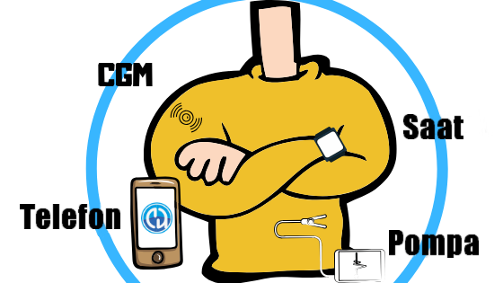

# Bileşenlere Genel Bakış

**AAPS** is not just a (self-built) application, it is but one of several modules of your closed loop system. Before deciding for components, it would be a good idea to have a look at the component documentation.



```{admonition} IMPORTANT SAFETY NOTICE
:class: important

The foundation of **AAPS** safety features discussed in this documentation is built on the safety features of the hardware used to build your system. For closing an automated insulin dosing loop, it is critically important that you only use an insulin pump and CGM that are tested, fully functioning and approved by the official instances of your country. Bu bileşenlerin donanımında veya yazılımında yapılan değişiklikler, beklenmeyen insülin iletimine ve dolayısıyla kullanıcı için önemli risklere yol açabilir. If you find or get offered broken, modified or self-made insulin pumps or CGM receivers, **do not use** these for creating an **AAPS** system.

Ek olarak, sadece orijinal aksesuarların kullanılması da bir o kadar önemlidir. Yerleştirme yardımcıları, kanüller ve rezervuarlar, pompanız veya CGM ile kullanım için üretici tarafından onaylanmalıdır. Test edilmemiş veya modifiye edilmiş aksesuarların kullanılması, CGM Sisteminin yanlış olmasına ve insülin iletim hatalarına neden olabilir. Yanlış dozda insülin çok tehlikelidir. Test edilmemiş veya modifiye edilmiş aksesuarlar kullanarak hayatınız ile oynamayın.

Last but not least, you must not take SGLT-2 inhibitors (gliflozins) as they incalculably lower blood sugar levels. Kan Şekerini artırmak için bazal oranları düşüren bir sistemle kombinasyon tehlikelidir. Çünkü gliflozin nedeniyle Kan Şekerindeki bu artış gerçekleşmeyebilir ve tehlikeli bir insülin eksikliği durumu meydana gelerek ketoasidoza sebep olabilir. [More information here](#PreparingForAaps-no-sglt-2-inhibitors).
```

## Gerekli Modüller

### Diyabet tedaviniz için iyi bir kişisel dozaj algoritması

Bu yaratılacak veya satın alınacak bir şey olmasa da, muhtemelen en hafife alınan ama en gerekli olan 'modül' budur. Bir algoritmanın diyabetinizi yönetmesine yardımcı olmasına izin verdiğinizde, ciddi hatalar yapmamak için doğru ayarları bilmesi gerekir. Even if you are still missing other modules, you can already verify and adapt your **Profile** in collaboration with your diabetes team.

The **Profile** includes:

- BR (Basal rates): provides background insulin;
- ISF (insulin sensitivity factor): how much your blood glucose level will be reduced by 1 unit of insulin;
- CR (carb ratio): how many grams of carbohydrate are covered by one unit of insulin;
- DIA (duration of insulin action).

Çoğu looper, gün boyunca hormonal insülin duyarlılığına dayanan sirkadiyen (günlük) Bazal Oran, İDF ve Karbonhidrat Oranı kullanır.

More information about your **Profile** [on the dedicated page](../SettingUpAaps/YourAapsProfile.md).

### Telefon

See the dedicated page [Phones](../Getting-Started/Phones.md).

### İnsülin pompası

See the dedicated page [Compatible Pumps](../Getting-Started/CompatiblePumps.md).

**Advantages and disadvantages of some pump models**

The Combo, the Insight and the older Medtronic are solid pumps, and loopable. The Combo has the advantage of many more infusion set types to choose from as it has a standard Luer-Lock. And the battery is a default one you can buy at any gas station, 24-hour convenience store and if you really need one, you can steal/borrow it from the remote control in the hotel room ;-).

Bununla birlikte, tercih edilen pompa olarak DanaR/RS ve Dana-i'nin Combo'ya karşı avantajları şunlardır:

- Dana-i/RS ile ilk eşleştirme daha kolaydır. Ancak bunu genellikle yalnızca bir kez yaparsınız, bu nedenle yalnızca yeni bir özelliği farklı pompalarla test etmek istediğinizde etki eder.
- Şimdiye kadar Combo, ekran ayrıştırma ile çalışıyor. Genel olarak harika çalışıyor ama yavaş. Döngü için bu çok önemli değil çünkü her şey arka planda çalışıyor. Still there is much more time you need to be connected so more time when the BT connection might break, which isn't so easy if you walk away from your phone whilst bolusing & cooking.
- Combo, GBO'larin sonunda titrer, DanaR, SMB'de titrer (veya bip sesi çıkarır). At nighttime, you are likely to be using TBRs more than SMB.  The Dana-i/RS is configurable so that it does neither beep nor vibrate.
- Reading the history on the Dana-i/RS in a few seconds with carbs makes it possible to switch phones easily while offline and continue looping as soon as some CGM values are in.
- All pumps **AAPS** can talk with are waterproof on delivery. Sızdırmaz pil bölmesi ve rezervuar doldurma sistemi sayesinde yalnızca Dana pompaları "garanti kapsamında su geçirmezdir".

### KŞ kaynağı

See the dedicated page [Compatible CGMs](../Getting-Started/CompatiblesCgms.md).

### **AAPS**-.apk file

The main component of the system. In order to install the app, you have to build the apk-file yourself first. Instructions are [here](../SettingUpAaps/BuildingAaps.md).

### Reporting server

A reporting server displays your glucose and treatment data, and creates reports for detailed analysis. There are currently two reporting servers available for use with AAPS : [Nightscout](#SettingUpTheReportingServer-nightscout) and [Tidepool](#SettingUpTheReportingServer-tidepool). They both provide ways to visualize your diabetes data over time, provide statistics about the **time in range** (TIR) and other measures.

The Reporting server is independent of the other modules. If you don’t want to use a reporting server, you should know that it is not mandatory for running **AAPS** in the long term. But you still need to set up one as it will be required to fulfill [**Objective 1**](#objectives-objective1).

Additional information on how to set up your reporting server can be found [here](../SettingUpAaps/SettingUpTheReportingServer.md).

## Opsiyonel Modüller

### Akıllı saat

You can choose any smartwatch with Android WearOS 2.x up to 4.x. **Beware, WearOS 5.x is not always compatible!**

Users are creating a [list of tested phones and watches](#Phones-list-of-tested-phones). There are different watchfaces for use with **AAPS**, which you can find [here](../WearOS/WearOsSmartwatch.md).

### xDrip+

Even if you don't need to have the xDrip+ App as **BG Source**, you can still use it for _i.e._ alarms or a different blood glucose display. You can have as many alarms as you want, specify the time when the alarm should be active, if it can override silent mode, etc. Some xDrip+ information can be found [here](../CompatibleCgms/xDrip.md). İlerlemesi oldukça hızlı olduğu için bu uygulamanın belgelerinin her zaman güncel olmadığını lütfen unutmayın.

## Modülleri beklerken yapılması gerekenler

It sometimes takes a while to get all the modules for closing the loop. Ama merak etmeyin, beklerken yapabileceğiniz çok şey var. It is **necessary** to check and (where appropriate) adapt basal rates (BR), insulin-carbratio (IC), insulin-sensitivity-factors (ISF) etc. And maybe open loop can be a good way to test the system and get familiar with **AAPS**. Using this mode, **AAPS** gives treatment recommendations you can manually execute.

You can keep on reading through the docs here, get in touch with other loopers online or offline, [read](../UsefulLinks/BackgroundReading.md) documentations or what other loopers write (even if you have to be careful, not everything is correct or good for you to reproduce).

**Done?** If you have your **AAPS** components all together (congrats!) or at least enough to start in open loop mode, you should first read through the [Objective description](../SettingUpAaps/CompletingTheObjectives.md) before each new Objective and setup up your hardware.
