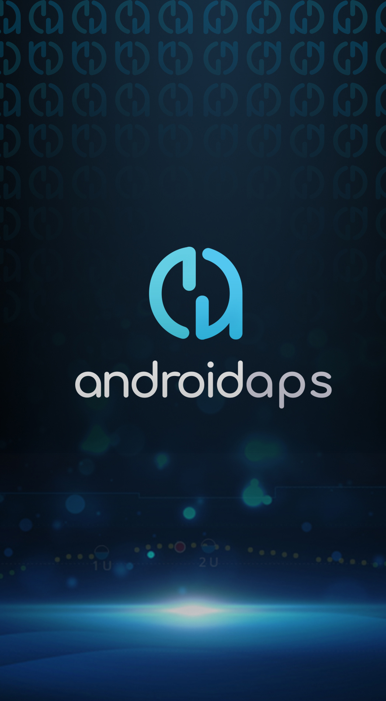

(Phones-list-of-tested-phones)=

# Omnipod Dash İnsülin Pompası Podları ile uyumlu, test edilmiş Telefonların listesi

Şu anda, AndroidAPS/OpenAPS ekosisteminde kullanım için sürekli genişleyen Bluetooth özellikli insülin pompaları ağımıza eklenen en yeni pompa sürücüsü Omnipod Dash ile Döngü Yapabilen tüm Android Telefonların/Akıllı Saatlerin Donanım Listesinin bütünlüğünü sağlamaktan sorumlu çok çalışkan bir perde arkası Bakımcımız var.

Bakım Sorumlumuz, kullanım kolaylığı için önceden doldurulmuş bilgi başlıklarına sahip bir Google Formu aracılığıyla Hesap Tablosuna veri girmenin herkes için kolay olduğundan emin olmak için çok zaman ve çaba harcadı. Bu, sayfalardaki mevcut verilerin yanlışlıkla üzerine yazılmamasını veya silinmemesini sağlar. Aynı deneyim, yine Google E-Tablolar kullanılarak ilk elde edilen başarının üzerine inşa edilebilir.

Google E-Tabloların kolaylığı, erken benimseyenler arasındaki yakın iletişim ve Dash pompa pod sürücülerinin erken test/geri bildirim aşamaları boyunca öğrenilen toplu bilgileri ve dersleri bir araya getirme yeteneği sayesinde oldukça verimli bir şekilde derlendi. Dash Bluetooth sürücülerinin her yeni sürümü hakkında adım adım geri bildirim sağlayan çok sayıda İlk kullanıcı tarafından sağlanan zaman, bilgi ve enerjinin sonuçları, şimdi açtığınızda hepsinin göründüğü kapsamlı bir Karşılaştırma listesidir. Birçok Android Telefon ve Akıllı Saat uyumluluk açısından test edilmiş ve derecelendirilmiştir. Buna ek olarak, yeni kullanıcıların bağlantı hızı veya gücü ile ilgili sorunlar nedeniyle hangi donanımdan kaçınmaları gerektiğini bilmeleri için daha uyumsuz kurulumlar da bu Elektronik Tabloya dahil edilmiştir.

İleride başka bir Donanım Uyumluluk Listesi oluşturulması zamanı geldiğinde; Bakıcı olmaktan keyif alacağını düşünen herkesi lütfen bizimle iletişime geçmeye davet ediyoruz!

Test edilen telefonların listesine aşağıdaki bağlantıdan erişilebilir [Omnipod insülin pompalı test edilmiş telefonların listesi](https://docs.google.com/spreadsheets/d/1zO-Vf3wv0jji5Gflk6pe48oi348ApF5RvMcI6NG5TnY)

CTRL-F ile Google sayfasının metninde arama yapabilirsiniz. Sayfa yazmaya karşı korumalıdır. Bir telefon testinizi kaydetmek için lütfen [formu](https://forms.gle/g7GbSkMCTfFrWKjSA) doldurun.

Form verilerini doldurduktan sonra, bakıcı verileri kontrol edecek ve yayınlamak için onaylayacaktır!

E-tabloyla ilgili herhangi bir sorun varsa, lütfen doğrudan veya openaps/AndroidAPSDocs projesi için bir GitHub sorunu aracılığıyla bizimle iletişime geçin.

(Phones-phone-background)=

# Telefon Arka Planı

   Tasarım: Tiago :)   Telefonunuzu AndroidAPS arka planı ile dekore etmek istiyorsanız, arka plan resminizi buradan indirebilirsiniz: 