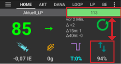
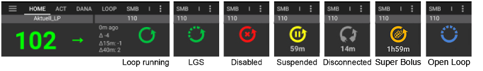
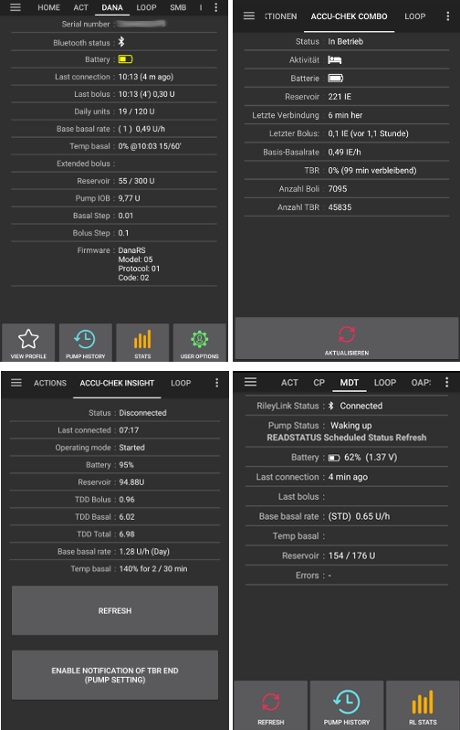
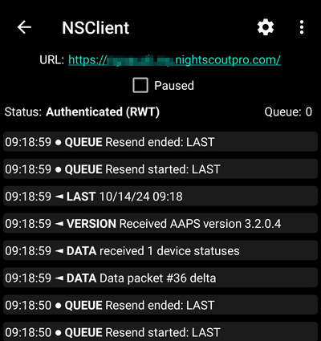

# AndroidAPS ekranları

## Giriş Ekranı

Bu AndroidAPS'i açtığınızda karşılaşacağınız ilk ekrandır ve her gün ihtiyaç duyacağınız bilgilerin çoğunu içerir.

### Bölüm A - Sekmeler

* Çeşitli AndroidAPS modülleri arasında gezinin.
* Alternatif olarak, sola veya sağa kaydırarak ekranları değiştirebilirsiniz.
* Displayed tabs can be selected in [config builder](../Configuration/Config-Builder.md#tab-or-hamburger-menu).

(section-b-profile-target)=

### Bölüm B - Profil & hedef

#### Geçerli Profil

* Mevcut profil sol çubukta görüntülenir.
* Profil çubuğuna kısa basarak profil ayrıntılarını görüntüleyebilirsiniz
* Long press profile bar to [switch between different profiles](../Usage/Profiles.md#profile-switch).
* Eğer profil geçişi yapılmışsa kalan süre parantez içinde dakika cinsinden gösterilecektir.

#### Hedef

* Mevcut hedefiniz sağ çubukta görüntülenir.
* [Geçici hedef](../Usage/temptarget.md) belirlemek için hedef çubuğuna kısa basın.
* Geçici hedef ayarlanmışsa, çubuk sarıya döner ve kalan süre parantez içinde dakika olarak gösterilir.

(visualization-of-dynamic-target-adjustment)=

#### Dinamik hedef ayarının görselleştirilmesi

* AAPS, SMB algoritması kullanıyorsanız, hedefinizi hassasiyete göre dinamik olarak ayarlayabilir.
* Enable either one or both of the [following options](../Configuration/Preferences.md#openaps-smb-settings) 
   * "Duyarlılık hedefi yükseltir" ve/veya 
   * "direnç hedefi düşürür" 
* AAPS direnç veya duyarlılık tespit ederse hedefi değiştirebilecektir. 
* Değiştirdiğinde hedef çubuğu yeşile dönecektir.

### Bölüm C - KŞ & döngü durumu

#### Geçerli kan şekeri

* CGM'nizden alınan en son kan şekeri ölçümü sol tarafta gösterilir.
* Color of the BG value reflects the status to the defined [range](../Configuration/Preferences.md#range-for-visualization). 
   * yeşil = aralık içerisinde
   * kırmızı = aralığın altında
   * sarı = aralığın üstünde
* Ortadaki grimsi blok, son okumadan bu yana geçen süreyi ve son okumadan bu yana değişim ile 15 ve 40 dakikadaki KŞ değişikliklerini gösterir.

(loop-status)=

#### Döngü durumu

* Yeni bir simge döngü durumunu gösterir:
   
   * yeşil daire = döngü çalışıyor
   * green circle with dotted line = [low glucose suspend (LGS)](../Usage/Objectives.md#objective-6-starting-to-close-the-loop-with-low-glucose-suspend)
   * kırmızı daire = döngü devre dışı (kalıcı olarak çalışmıyor)
   * sarı daire = döngü askıya alındı (geçici olarak duraklatıldı ancak bazal insülin verilecek) - kalan süre simgenin altında gösterilir
   * gri daire = pompa bağlantısı kesildi (geçici olarak hiç insülin dozu yok) - kalan süre simgenin altında gösterilir
   * Turuncu daire = süper bolus çalışıyor - kalan süre simgenin altında gösterilir
   * noktalı çizgili mavi daire = açık döngü

* Döngü diyalog kutusunu açmak ve döngü modunu değiştirmek için (Kapatmak, Düşük Glikoz süspansiyonu, Açmak veya Devre Dışı Bırakmak), döngüyü askıya almak / yeniden etkinleştirmek veya pompayı ayırmak / yeniden bağlamak için simgeye uzun ya da kısa basabilirsiniz.
   
   * Döngü simgesine kısa basarsanız, iletişim kutusundaki seçimden sonra bir onay istenecektir. (Uzun basarak diyalog penceresi açarsanız istenmez)
   
   

(bg-warning-sign)=

#### KŞ uyarı işareti

Android 3.0'dan itibaren, ana ekranda KŞ değerinizin altında bir uyarı sinyali alabilirsiniz.

*Note*: Up to 30h hours are taken into accord for AAPS calculations. So even after you solved the origin problem, it can take about 30 hours for the yellow triangle to disappear after the last irregular interval occurred.

To remove it immediately you need to manually delete a couple of entries from the Dexcom/xDrip+ tab.

However, when there are a lot of duplicates, it might be easier to

* [backup your settings](../Usage/ExportImportSettings.md),
* bakım menüsünde veritabanınızı sıfırlayın ve
* [import your settings](../Usage/ExportImportSettings.md) again

##### Kırmızı uyarı işareti: Yinelenen KŞ verileri

The red warning sign is signaling you to get active immediately: You are receiving duplicate BG data, which does avoid the loop to do its work right. Therefore your loop will be disabled until it is resolved.

You need to find out why you get duplicate BGs:

* NS sitenizde Dexcom köprüsü etkin mi? Heroku'ya (veya başka bir yer sağlayıcısına) giderek köprüyü devre dışı bırakın, "etkinleştir" değişkenini düzenleyin ve buradaki "köprü" bölümünü kaldırın. (Heroku için [ayrıntıları burada bulabilirsiniz](https://nightscout.github.io/troubleshoot/troublehoot/#heroku-settings).)
* Birden fazla kaynakKŞ'nizi NS'ye yüklüyor mu? BYODA uygulamasını kullanıyorsanız, AAPS'de yüklemeyi etkinleştirin, ancak xDrip+ kullanıyorsanız, xDrip+'da etkinleştirmeyin.
* KŞ'nizi takip eden ve aynı zamanda NS sitenize tekrar yükleyebilecek takipçileriniz var mı?
* Son çare: AAPS'de NS İstemci ayarlarınıza gidin, senkronizasyon ayarlarını seçin ve "NS'den CGM verilerini kabul et" seçeneğini devre dışı bırakın.

##### Sarı uyarı işareti

* Sarı uyarı sinyali, KŞ'nizin düzensiz zaman aralıklarında geldiğini veya bazı KŞ verilerinin eksik olduğunu gösteriyor.
   
   

* Genellikle herhangi bir işlem yapmanız gerekmez. Kapalı döngü çalışmaya devam eder!

* Bir sensör değişikliği, KŞ verilerinin sabit akışını kesintiye uğrattığından, sensör değişikliğinden sonra sarı bir uyarı işareti normaldir ve endişelenecek bir şey yoktur.
* Libre kullanıcıları için özel not:
   
   * Her libre verisi birkaç saatte bir veya iki dakika kayar, bu da düzenli KŞ aralıklarının mükemmel akışını asla elde edemeyeceğiniz anlamına gelir.
   * Ayrıca atlamalı okumalar sürekli akışı keser.
   * Bu nedenle, libre kullanıcıları için sarı uyarı işareti 'her zaman açık' olacaktır.

### Bölüm D - AİNS, AKRB, BO ve OD

* Şırınga: aktif insülin (AİNS) - vücudunuzdaki aktif insülin miktarı
   
   * Yalnızca standart bazalınız çalışıyorsa ve önceki boluslardan insülin kalmamışsa, aktif insülin rakamı sıfır olacaktır. 
   * Yakın zamanda bazalınız düşürülmüşse, (AİNS) aktif insülin negatif olabilir.
   * Bolus ve bazal insülinin ayrımını görmek için simgeye basın

* Grain: [carbs on board (COB)](../Usage/COB-calculation.md) - yet unabsorbed carbs you have eaten before -> icon pulses if carbs are required

* Mor çizgi: bazal oran - geçici bazal orandaki değişiklikleri yansıtan simge (%100'de sabit çizgi) 
   * Herhangi bir geçici bazalın (kalan süre dahil) temel bazal oranını ve ayrıntılarını görmek için simgeye basın
* Arrows up & down: indicating actual [autosens](../Usage/Open-APS-features.md#autosens) status (enabled or disabled) and value is shown below icon

#### Karbonhidrat İhtiyacı

* Algoritma, Kş'nizin çok düşmesini önlemek için bir şeyler yemeniz gerektiğini anlarsa, önerilen karbonhidrat miktarı görüntülenir.
* Bu oref algoritmasının, seni 0 (sıfır) geçici bazal oranı ile kurtaramayacağı ve düzeltmek için karbonhidrata ihtiyacın olacağı anlamına gelir.
* Karbonhidrat bildirimleri, bolus hesaplayıcılardan çok daha karmaşıktır. Bolus hesaplayıcı eksik karbonhidratları göstermezken karbonhidrat önerisi görebilirsiniz.
* İstenirse karbonhidrat ihtiyacı bildirimleri Nightscout'a iletilebilir, bu durumda bir anons gösterilir ve yayınlanır.

### Bölüm E - Durum ışıkları

* Durum ışıkları için görsel bir uyarı verir 
   * Kanül yaşı
   * İnsülin yaşı (rezervuarın kullanıldığı gün sayısı)
   * Rezervuar seviyesi (Ünite)
   * Sensör yaşı
   * Pil yaşı ve seviyesi (%)
* Eşik uyarısı aşılırsa değerler sarı renkte gösterilecektir.
* Kritik eşik aşılırsa değerler kırmızı ile gösterilir.
* Settings can be made in [preferences](../Configuration/Preferences.md#status-lights).

(section-f-main-graph)=

### Bölüm F - Ana grafik

* Grafik, glikoz monitörünüzden (CGM) okunan kan şekerinizi (KŞ) gösterir. 
* Parmak ucundan alınan kalibrasyonları ve karbonhidrat girişleri gibi işlem sekmesine girilen notların yanı sıra profil geçişleri burada gösterilir. 
* Zaman ölçeğini değiştirmek için grafiğe uzun basın. 6, 12, 18 veya 24 saat seçebilirsiniz.
* Yeşil alan hedef aralığınızı yansıtmaktadır. It can be configured in [preferences](../Configuration/Preferences.md#range-for-visualization).
* Blue triangles show [SMB](../Usage/Open-APS-features.md#super-micro-bolus-smb) - if enabled in [preferences](../Configuration/Preferences.md#openaps-smb-settings).
* İsteğe Bağlı Bilgi:
   
   * Tahminler
   * Bazallar
   * Aktivite - insülin aktivite eğrisi

#### İsteğe bağlı bilgileri etkinleştir

* Ana grafikte hangi bilgilerin görüntüleneceğini seçmek için ana grafiğin sağ tarafındaki üçgene tıklayın.
* Ana grafik için sadece "\---\---- Grafik 1 \---\----" satırının üzerindeki üç seçenek mevcuttur.
   
   

(prediction-lines)=

#### Tahmin çizgileri

* **Orange** line: [COB](../Usage/COB-calculation.md) (colour is used generally to represent COB and carbs)
   
   Tahmin çizgisi, mevcut pompa ayarlarına ve karbonhidrat emiliminden kaynaklanan sapmaların sabit kaldığı varsayılarak KŞ'nizin nereye gideceğini (Aktif karbonhidratın değil!) gösterir. Bu çizgi yalnızca bilinen AKRB (Aktif Karbonhidrat) varsa görünür.

* **Koyu mavi** çizgi: AİNS (Bu renk genellikle aktif insülin ve insülini temsil etmek için kullanılır)
   
   Tahmin çizgisi, sadece insülinin etkisi altında ne olacağını gösterir. Örneğin biraz insülin gönderip birşey yemediyseniz.

* **Açık mavi** çizgi: sıfır geçici (geçici bazal oranı %0 olarak ayarlandıysa, tahmini KŞ)
   
   Tahmin çizgisi, pompa tüm insülin iletimini (%0 GBO) durdurursa Aktif İnsülin çizgisinin nasıl değişeceğini gösterir.
   
   *This line appears only when the [SMB](../Configuration/Preferences.md#advanced-meal-assist-ama-or-super-micro-bolus-smb) algorithm is used.*

* **Dark yellow** line: [UAM](../Configuration/Sensitivity-detection-and-COB.md#sensitivity-oref1) (un-announced meals)
   
   Bildirilmemiş öğünlerin anlamı, öğün, adrenalin veya diğer etkiler nedeniyle glikoz seviyelerinde önemli bir artışın tespit edilmesidir. Tahmin çizgisi TURUNCU Aktif Karbonhidrat çizgisine benzer, ancak sapmaların sabit bir oranda (mevcut azalma oranını genişleterek) azalacağını varsayar.
   
   *This line appears only when the [SMB](../Configuration/Preferences.md#advanced-meal-assist-ama-or-super-micro-bolus-smb) algorithm is used.*

* **Dark orange** line: aCOB (accelerated carbohydrate absorption)
   
   Similar to COB, but assuming a static 10 mg/dL/5m (-0.555 mmol/l/5m) carb absorption rate. Deprecated and of limited usefulness.
   
   *This line appears only when the older [AMA](../Configuration/Preferences.md#advanced-meal-assist-ama-or-super-micro-bolus-smb) algorithm is used.*

Usually your real glucose curve ends up in the middle of these lines, or close to the one which makes assumptions that closest resemble your situation.

#### Bazallar

* **Sürekli mavi** çizgi, pompanızın bazal iletimini gösterir ve zaman içindeki gerçek iletimi yansıtır.
* **noktalı mavi** çizgi, geçici bazal ayarlamalar (GBO'lar) olmasaydı bazal oranın ne olacağıdır.
* Standart bazal oran verildiğinde eğrinin altındaki alan koyu mavi ile gösterilir.
* Bazal oran geçici olarak ayarlandığında (artırıldığında veya azaldığında) eğrinin altındaki alan açık mavi ile gösterilir.

#### Aktivite

* **İnce sarı** çizgi, insülin aktivitesini gösterir. 
* Başka hiçbir faktör (karbonhidrat gibi) mevcut değilse, sisteminizdeki insülinin KŞ'nde beklenen düşüşe dayanır.

### Bölüm G - ek grafikler

* Ana grafiğin altında en fazla dört ek grafik etkinleştirebilirsiniz.
* To open settings for additional graphs click the triangle on the right side of the [main graph](../Getting-Started/Screenshots.md#section-f-main-graph) and scroll down.

* Ek bir grafik eklemek için adının sol tarafındaki kutuyu işaretleyin (yani \---\---- Grafik 1 \---\----).

#### Mutlak insülin

* Boluslar dahil aktif insülin **ve bazal**.

#### Aktif İnsülin

* Aktif insülini gösterir (= vücudunuzdaki aktif insülin). Bolus ve geçici bazaldan alınan insülini içerir (**ancak profilinizde ayarlanan bazal oranları hariçtir**).
* If there were no [SMBs](../Usage/Open-APS-features.md#super-micro-bolus-smb), no boluses and no TBR during DIA time this would be zero.
* Daha uzun bir süre boyunca bolus kalmazsa ve sıfır/düşük geçici bazal devam ederse AİNS negatif olabilir.
* Decaying depends on your [DIA and insulin profile settings](../Configuration/Config-Builder.md#local-profile). 

#### (AKRB) Aktif Karbonhidrat

* Aktif karbonhidratları gösterir (= vücudunuzdaki aktif, henüz bozulmamış karbonhidratlar). 
* Bozulma, algoritmanın algıladığı sapmalara bağlıdır. 
* Beklenenden daha yüksek bir karbonhidrat emilimi tespit edilirse, insülin verilecek ve bu aktif insülini artıracaktır (güvenlik ayarlarınıza bağlı olarak daha fazla veya daha az). 

#### Sapmalar

* **GRİ** çubuklar, karbonhidrat nedeniyle bir sapma gösterir. 
* **YEŞİL** çubuklar, KŞ'nin algoritmanın beklediğinden daha yüksek olduğunu gösterir. Green bars are used to increase resistance in [Autosens](../Usage/Open-APS-features.md#autosens).
* **KIRMIZI** çubuklar, KŞ'nin algoritmanın beklediği değerden daha düşük olduğunu gösterir. Red bars are used to increase sensitivity in [Autosens](../Usage/Open-APS-features.md#autosens).
* **SARI** çubuklar UAM (bildirilmemiş öğünler) nedeniyle bir sapma gösterir.
* **SİYAH** çubuklar, hassasiyet için dikkate alınmayan küçük sapmaları gösterir

#### Duyarlılık

* Shows the sensitivity that [Autosens](../Usage/Open-APS-features.md#autosens) has detected. 
* Duyarlılık, egzersiz, hormonlar vb. sonucunda insüline duyarlılığın hesaplanmasıdır.

#### Aktivite

* İnsülin profiliniz tarafından hesaplanan insülin aktivitesini gösterir (Aktif insülin türevi değildir). 
* İnsülin zirve zamanına daha yakın olduğunda değer daha yüksektir.
* AİNS azalırken negatif olmak anlamına gelir. 

#### Sapma eğimi

* Algoritmada kullanılan iç değer.

### Bölüm H - Butonlar

* İnsülin, karbonhidrat ve hesap makinesi butonları neredeyse her zaman açıktır.
   
   * Pompa bağlantısı kesilirse insülin düğmesi görünmez.

* Other Buttons have to be setup in [preferences](../Configuration/Preferences.md#buttons).

#### İnsülin

* [Bolus hesaplayıcı](#bolus-wizard) kullanmadan belirli miktarda insülin vermek için kullanılır.
* By checking the box you can automatically start your [eating soon temp target](../Configuration/Preferences.md#default-temp-targets).
* Pompadan bolus yapmadan sadece insülin miktarını kaydetmek istiyorsanız "Bolusu sadece kayıt altına al" kutusunu işaretleyin.

#### Karbonhidrat

* Karbonhidratları bolus olmadan kaydetmek için kullanılır.
* Certain [pre-set temporary targets](../Configuration/Preferences.md#default-temp-targets) can be set directly by checking the box.
* Zaman farkı: Ne zaman karbonhidrat yediniz / yiyeceksiniz (dakika olarak).
* Duration: To be used for ["extended carbs"](../Usage/Extended-Carbs.md)
* Karbonhidrat miktarını hızlı bir şekilde artırmak için butonları kullanabilirsiniz.
* Notes will be uploaded to Nightscout - depending on your settings for [NS client](../Configuration/Preferences.md#nsclient).

#### Hesap makinesi

* Bolus Sihirbazı için [aşağıdaki bölüme](#bolus-wizard) bakın

#### Kalibrasyonlar

* xDrip+'a bir kalibrasyon gönderir veya Dexcom kalibrasyon diyalog penceresini açar.
* Must be activated in [preferences](../Configuration/Preferences.md#buttons).

#### CGM

* xDrip+'ı açmak için kullanılır.
* Geri düğmesi AAPS'e döner.
* Must be activated in [preferences](../Configuration/Preferences.md#buttons).

#### Hızlı Asistan

* Karbonhidrat miktarını kolayca girin ve temel hesaplamaları ayarlayın.
* Details are setup in [preferences](../Configuration/Preferences.md#quick-wizard).

(bolus-wizard)=

## Bolus Sihirbazı

When you want to make a meal bolus this is where you will normally make it from.

### Bölüm I

* KŞ alanında normalde zaten CGM'nizden gelen en son okuma bulunur. Çalışan bir CGM'niz yoksa boş olacaktır. 
* Karbonhidrat alanına, bolus yapmak istediğiniz karbonhidrat - veya eşdeğeri - hesapladığınız tahmini miktarı girersiniz. 
* Düzeltme alanı, herhangi bir nedenle son dozu değiştirmek istiyorsanız ilave edebilir ya da azaltabilirsiniz.
* Karbonhidrat zamanı alanı ön bolus içindir, böylece sisteme karbonhidratların yenmesi için bir gecikme olacağını söyleyebilirsiniz. Yenmiş karbonhidratlar için bolus yapıyorsanız, bu alana negatif bir sayı girebilirsiniz.

(eating-reminder)=

#### Yemek hatırlatıcısı

* Yenecek karbonhidratlar için alarm onay kutusu işaretlenebilir. Böylece AndroidAPS'e girdiğiniz karbonhidratları ne zaman yemeniz gerektiği size hatırlatılabilir. (Girilen süre sonunda karbonhidratlar sisteme ilave edilir.)
   
   

### Bölüm J

* SÜPER BOLUS, sonraki iki saat için bazal insülinin bolusa ilave edildiği ve sıfır GBO olacak sonraki iki saati telafi etmek için kullanılır. The option only shows when "Enable [superbolus](../Configuration/Preferences.md#superbolus) in wizard" is set in the [preferences overview](../Configuration/Preferences.md#overview).
* Buradaki ana fikir, bazal insülini erkenden vererek ani artışları azaltmaktır.
* Ayrıntılar için [diabetesnet.com](https://www.diabetesnet.com/diabetes-technology/blue-skying/super-bolus/) adresini ziyaret edin.

### Bölüm K

* Hesaplanan bolusu gösterir. 
* Aktif insülin miktarı hesaplanan bolusu aşarsa, o zaman sadece gerekli olan karbonhidrat miktarını gösterecektir.
* Notes will be uploaded to Nightscout - depending on your settings for [NS client](../Configuration/Preferences.md#nsclient).

### Bölüm L

* Sihirbazın bolus hesaplamasının ayrıntıları.
* Dahil etmek istemediğiniz herhangi bir hesaplamanın seçimini kaldırabilirsiniz.
* Bolus sihirbazının mevcut bir geçici hedefe göre hesaplama yapmasını istiyorsanız, güvenlik nedenleriyle **TT kutusunun manuel olarak işaretlenmesi gerekir**.

#### AKRB ve AİNS kombinasyonları ve ne anlama geldikleri

* Güvenlik nedenleriyle, AKRB (Aktif karbonhidrat) kutusu işaretlendiğinde AİNS (Aktif insülin) kutusunun işareti kaldırılamaz, çünkü AAPS halihazırda mevcut insülini hesaba katmadığı için çok fazla insülin riskiyle karşı karşıya kalabilirsiniz.
* AKRB ve AİNS'i işaretlerseniz, mevcut emilmemiş karbonhidratlar + GBO veya SMB olarak verilen tüm insülinler dikkate alınacaktır.
* AKRB işaretlemeden AİNS'İ işaretlerseniz, AAPS iletilen insülini hesaba katar, ancak bu hesaba hala emilecek karbonhidratlar dahil edilmez. Bu işareleme 'eksik karbonhidrat' bildirimine yol açar.
* Yemek bolusundan kısa bir süre sonra **ek gıda** için (örn. ilave tatlı) bolus yaparsanız, **tüm kutuların işaretini kaldırmak** yararlı olabilir. Bu şekilde, ana öğün henüz tam olarak emilmemiş olduğundan yalnızca yeni karbonhidratlar ilave edilir, bu nedenle aktif insülin, yemek bolusundan kısa bir süre sonra aktif karbonhidrat ile tam olarak eşleşmeyecektir.

(wrong-cob-detection)=

#### Yanlış Aktif Karbonhidrat tespiti

* Bolus sihirbazını kullandıktan sonra yukarıdaki uyarıyı görüyorsanız, AndroidAPS hesaplanan AKRB değerinin yanlış olabileceğini algılamıştır. 
* Bu nedenle, mevcut Aktif Karbonhidrat ile bir yemekten sonra tekrar bolus yapmak istiyorsanız, aşırı dozun farkında olmalısınız! 
* For details see the hints on [COB calculation page](../Usage/COB-calculation.md#detection-of-wrong-cob-values).

(action-tab)=

## Eylem Sekmesi

### Eylemler - bölüm M

* Button [profile switch](../Usage/Profiles.md#profile-switch) as an alternative to pressing the [current profile](../Getting-Started/Screenshots.md#section-b-profile-target) on homescreen.
* Button [temporary target](../Usage/temptarget.md#temp-targets) as an alternative to pressing the [current target](../Getting-Started/Screenshots.md#section-b-profile-target) on homescreen.
* Geçici bir bazal oranı başlatma veya iptal etme düğmesi. Geçici bir bazal oranı ayarlandığında düğmenin "GEÇICIBAZAL" yerine "İPTAL x%" olarak değiştiğini lütfen unutmayın.
* Even though [extended boluses](../Usage/Extended-Carbs.md#extended-bolus-and-why-they-wont-work-in-closed-loop-environment) do not really work in a closed loop environment some people were asking for an option to use extended bolus anyway.
   
   * Bu seçenek yalnızca Dana RS ve Insight pompaları için mevcuttur. 
   * Kapalı döngü otomatik olarak durdurulacak ve yayma bolus çalıştığı süre boyunca açık döngü moduna geçecektir.
   * Make sure to read the [details](../Usage/Extended-Carbs.md) before using this option.

### Bakım portalı - bölüm N

* İçinde görüntülebilir bilgiler
   
   * sensör yaşı & seviyesi (yüzdelik pil)
   * insülin yaşı & seviyesi (ünite bazında)
   * kanül yaşı
   * pompa pil yaşı & seviyesi (yüzdelik bazda

* Less information will be shown if [low resolution skin](../Configuration/Preferences.md#skin) is used.

(sensor-level-battery)=

#### Sensör seviyesi (pil)

* xDrip+'ın güncel veya en eski 10 Aralık 2020 sürümü gerekiyor.
* Libre sensör için MiaoMiao 2 gibi ek verici ile CGM gibi çalışır. (Teknik olarak sensör pil seviyesi bilgilerini xDrip+'a göndermesi gerekir.)
* Thresholds can be set in [preferences](../Configuration/Preferences.md#status-lights).
* Sensör seviyesi, telefonun pil seviyesiyle aynıysa, xDrip+ sürümünüz muhtemelen çok eskidir ve güncellenmesi gerekir.
   
   

### Bakım portalı - bölüm O

* [Bölüm N](#careportal-section-n)'de görüntülenen KŞ kontrolü, hazırlama/doldurma, sensör yerleştirme ve pompa pil değişimi gibi verilerin temel dayanağı olan butonlardır.
* Hazırlama/Doldurma, pompa set değişimi, insülin kartuş değişimi ve sensör değişimini kaydetmenizi sağlar.
* Bölüm O, Nightscout portalını yansıtır. Yani alıştırma, duyuru ve soru notların özel biçimleridir.

### Araçlar - bölüm P

#### Geçmiş Tarayıcısı

* AAPS geçmişinde geri dönmenizi sağlar.

#### GTD

* Toplam günlük doz = bolus + günlük bazal
* Doktorlar özellikle yeni pompaya başlayanlar için % 50:50'lik bir bazal bolus oranı kullanır. 
* Bu nedenle oran GTD / 2 * TTB (Temel Toplam Bazal = 24 saat içindeki bazal oranın toplamı) olarak hesaplanır. 
* Diğerleri, TTB için GTD'nin %32 ila %37 aralığını tercih eder. 
* Bu genel kuralların çoğu gibi, geçerliliği sınırlıdır. Not: Diyabetiniz değişiklik gösterebilir!

(insulin-profile))=

## İnsülin Profili

* This shows the activity profile of the insulin you have chosen in [config builder](../Configuration/Config-Builder.md#insulin). 
* MOR çizgi zamanla bozulduğu için enjekte edildikten sonra ne kadar insülin kaldığını, MAVİ çizgi ise ne kadar aktif olduğunu gösterir.
* Sürecin genel olarak varsayıldığından çok daha uzun sürdüğünü not etmek önemlidir. 
* Pompa ile elle bolus gönderiyorsanız, muhtemelen insülinin yaklaşık 3.5 saat içinde azaldığını varsayıyorsunuz. 
* Ancak, döngü ile pompa kullanırken uzun insülin zamanı önemlidir. Çünkü hesaplamalar çok daha kesindir ve bu küçük miktarlar, AndroidAPS algoritmasındaki hesaplamalara eklenirler.

For a more detailed discussion of the different types of insulin, their activity profiles and why all this matters you can read an article here on [Understanding the New IOB Curves Based on Exponential Activity Curves](https://openaps.readthedocs.io/en/latest/docs/While%20You%20Wait%20For%20Gear/understanding-insulin-on-board-calculations.html#understanding-the-new-iob-curves-based-on-exponential-activity-curves)

And you can read an excellent blog article about it here: [Why we are regularly wrong in the duration of insulin action (DIA) times we use, and why it matters…](https://www.diabettech.com/insulin/why-we-are-regularly-wrong-in-the-duration-of-insulin-action-dia-times-we-use-and-why-it-matters/)

And even more at: [Exponential Insulin Curves + Fiasp](https://seemycgm.com/2017/10/21/exponential-insulin-curves-fiasp/)

## Pompa Durumu

* Pompa durumu hakkında farklı bilgiler. Görüntülenen bilgiler pompa modelinize bağlıdır.
* Ayrıntılar için [pompalar sayfasına](../Hardware/pumps.md) bakın.

## Bakım portalı

Careportal replicated the functions you will find on your Nightscout screen under the “+” symbol which allows you to add notes to your records.

### Karbonhidrat hesaplamasını inceleyin

* If you have used the [Bolus Wizard](../Getting-Started/Screenshots.md#bolus-wizard) to calculate insulin dosage you can review this calculation later on ts tab.
* Sadece yeşil Hesap bağlantısına basın. (Depending on pump used insulin and carbs can also be shown in one single line in ts.)

(carb-correction)=

### Karbonhidrat düzeltme

Treatment tab can be used to correct faulty carb entries (i.e. you over- or underestimated carbs).

1. Ana ekranda güncel AKRB ve AİNS'i kontrol edin ve unutmayın.
2. Tedavi sekmesinde pompaya bağlı olarak karbonhidratlar insülinle birlikte tek satırda veya ayrı bir giriş olarak (örn. Dana RS ile) gösterilebilir.
3. Hatalı karbonhidrat girişini kaldırın.
4. Ana ekranda AKRB'ı tekrar kontrol ederek karbonhidratların başarıyla kaldırıldığından emin olun.
5. Tedavi sekmesinde karbonhidrat ve insülin için yalnızca bir satır varsa, AİNS için de aynısını yapın.
   
   -> Karbonhidratlar anlatıldığı gibi çıkarılmazsa ve burada (6.madde) açıklandığı gibi ilave karbonhidrat eklerseniz, AKRB çok yüksek olur ve bu da çok yüksek insülin iletimine yol açabilir.

6. Ana ekrandaki karbonhidrat butonu aracılığıyla doğru karbonhidrat miktarını girin ve doğru etkinlik zamanını ayarladığınızdan emin olun.

7. Tedavi sekmesinde karbonhidrat ve insülin içeren tek satır varsa, insülin miktarını da eklemeniz gerekir. Doğru etkinlik saatini ayarladığınızdan emin olun ve yeni girişi onayladıktan sonra ana ekranda AİNS'İ kontrol edin.

## Döngü, AMA / SMB

* Bu sekmeler, algoritmanın hesaplamaları ve AAPS'nin neden böyle davrandığı hakkında ayrıntıları gösterir.
* Sistemin CGM'den yeni bir okuma aldığı her sefer yeniden hesaplama yapılır.
* For more details see [APS section on config builder page](../Configuration/Config-Builder.md#aps).

## Profil

* Profil, kişisel diyabet ayarlarınız hakkında bilgiler içerir:
   
   * İES (İnsülin Etki Süresi)
   * IC veya I:C: Karbonhidrat insülin oranı
   * IDF: İnsülin Duyarlılık Faktörü
   * Bazal oranı
   * HDF: AAPS'in hedeflemesini istediğiniz kan şekeri seviyesi

* As of version 3.0 only [local profile](../Configuration/Config-Builder.md#local-profile) is possible. Yerel profil akıllı telefonunuzda düzenlenebilir ve Nightscout sitenizle senkronize edilebilir.

(treatment)=

## Tedavi

History of the following treatments:

* Bolus & carbs -> option to [remove entries](../Getting-Started/Screenshots.md#carb-correction) to correct history
* [Yayma Bolus](../Usage/Extended-Carbs.md#extended-bolus-and-switch-to-open-loop-dana-and-insight-pump-only)
* Geçici bazal oranı
* [Geçici hedef](../Usage/temptarget.md)
* [Profil değiştir](../Usage/Profiles.md)
* [Careportal](../Usage/CPbefore26.md#careportal-discontinued) - notes entered through action tab and notes in dialogues

## KŞ Kaynağı - xDrip+, BYODA...

* KŞ kaynağı ayarlarınıza bağlı olarak bu sekme farklı şekilde adlandırılır.
* CGM okumalarının geçmişini gösterir ve arıza durumunda (örn. sıkıştırma düşük) okumayı kaldırma seçeneği sunar.

## NSClient

* Nightscout sitenizle bağlantının durumunu görüntüler.
* Settings are made in [preferences](../Configuration/Preferences.md#nsclient). Ekranın sağ üst köşesindeki dişli çarka tıklayarak ilgili bölümü açabilirsiniz.
* Sorun giderme için bu [sayfaya](../Usage/Troubleshooting-NSClient.md) bakın.