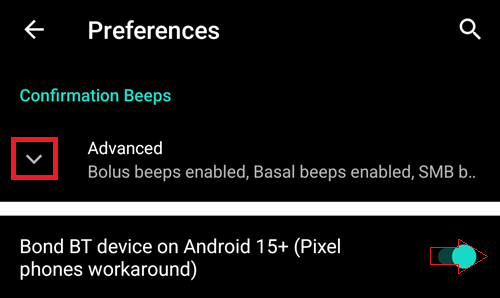
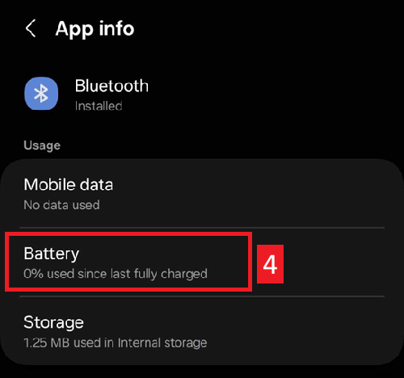

# Troubleshooting

Sorun giderme bilgilerini viki'deki birçok sayfada bulabilirsiniz. Bu sayfa, sorununuzu çözecek bilgileri bulmanıza yardımcı olacak bir bağlantılar topluluğudur.

Additional useful information might also be available in the [FAQ](../UsefulLinks/FAQ.md).

## AAPS app

### Yapım & güncelleme

* [Kayıp keystore](#troubleshooting_androidstudio-lost-keystore)
* [Android Studio'da Sorun Giderme](TroubleshootingAndroidStudio)

### Installing

You may see a Google Play Protect warning that the app is unsafe, was built for older Android versions and doesn't include latest privacy protections.

Ignore it: More details, Install anyway.

### Ayarlar
* Profile

  

* [Pompa - farklı pompadan alınan veriler](#update30-failure-message-data-from-different-pump)

  

* [Nightscout Client](../GettingHelp/TroubleshootingNsClient.md)

### Kullanım
* [Yanlış karbonhidrat değerleri](#CobCalculation-detection-of-wrong-cob-values)

   

* [SMS Komutları](#SMSCommands-troubleshooting)

### Cannot start Omnipod with Android 16

Upgrade to minimum version of AndroidAPS: 3.3.2.1.

### Frequent Bluetooth connection problems

#### Android 15

After upgrading Android or moving to a recent phone, **AAPS** frequently loses Bluetooth connection to the pump. The problem disappears temporarily when restarting the phone. If the phone runs Android 15, you can try to enable the following:

1) **Open preferences** by clicking the three-dot menu on the top right side of the home screen.

2. Scroll down and open the **Confirmation beeps** / **Advanced** submenu. Enable **Bond BT device on Android 15+**.

   

3. If the pump asks for a pairing request, accept it.

4. Restart your phone.

#### Battery optimization

Bu, çeşitli pompalarda olabilir. Apart from excluding AAPS from any battery optimization, you can also exclude the system Bluetooth app from battery optimization. Bu, bazı durumlarda yardımcı olabilir. Depending on the phone you use, you will find the Bluetooth app differently.

Bunları belirli android telefonlarda nasıl bulacağınıza dair örnekler aşağıda verilmiştir.

##### Pixel phones (stock Android)

* Android ayarlarına gidin, "Uygulamalar" ı seçin.

  

* "Tüm uygulamaları gör" seçeneğini seçin

  

* Sağdaki menüden "Sistemi göster" uygulamalarını seçin.

  

* Şimdi "Bluetooth" uygulamasını arayın ve seçin.

  

* "Uygulama pil kullanımı"na tıklayın ve "Optimize edilmedi"yi seçin.

  

##### Samsung telefonlar

* Android ayarlarına gidin, "Uygulamalar" ı seçin

* Sıralama algoritmasını değiştiren simgede (1), "Sistem uygulamalarını göster"i (2) seçin.

  

  

* Şimdi bluetooth uygulamasını arayın ve ayarları görmek için seçin.

  

* "Pil"i seçin

  

* "Optimize edilmedi" olarak ayarlayın

  

## CGM

* [General](#general-cgm-troubleshooting)
* [Dexcom G6](#DexcomG6-troubleshooting-g6)
* [Libre 3](#libre3-experiences-and-troubleshooting)
* [Libre 2](#Libre2-experiences-and-troubleshooting)
* [xDrip - CGM verisi yok](#xdrip-identify-receiver)
* [xDrip - Dexcom sorun giderme](#xdrip-troubleshooting-dexcom-g5-g6-and-xdrip)

## Pompalar

* [DanaRS](#DanaRS-Insulin-Pump-dana-rs-specific-errors)
* [Accu-Chek Combo genel](../CompatiblePumps/Accu-Chek-Combo-Tips-for-Basic-usage.md)
* [Accu-Chek Insight](#Accu-Chek-Insight-Pump-insight-specific-errors)
* [Medtronic + RileyLink](#MedtronicPump-what-to-do-if-i-loose-connection-to-rileylink-and-or-pump)

## Telefonlar

* [Jelly](../CompatiblePhones/Jelly.md)
* [Huawei bluetooth & pil optimizasyonu](../CompatiblePhones/Huawei.md)

## Akıllı saatler

* [Troubleshooting Wear app](#Watchfaces-troubleshooting-the-wear-app)
