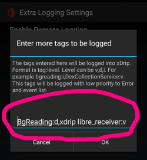

# Freestyle Libre 2

Freestyle Libre 2 sistemi, tehlikeli kan şekeri düzeylerini otomatik olarak bildirebilir. Libre2 Sensörü, mevcut kan şekeri seviyesini her dakika bir alıcıya (okuyucu veya akıllı telefon) gönderir. Alıcı, gerekirse bir alarmı tetikler. Yamalı bir LibreLink uygulaması ve xDrip+ uygulaması ile kan şekeri seviyenizi akıllı telefonunuzda sürekli olarak alabilir ve görüntüleyebilirsiniz.

Sensör, glikometre ölçümleri ve sensör okumaları arasındaki farkları ayarlamak için -40 mg/dl ila +20 mg/dl (-2,2 mmol/l ila +1,1 mmol/l) aralığında kalibre edilebilir.

KŞ okumaları, Libre1'deki gibi bir BT vericisi kullanılarak da yapılabilir.

Önemli not: Bu, Freestyle 2 sensörünün ABD versiyonuyla çalışmaz! ABD versiyonu bir telefona değil, yalnızca bir okuyucuya bağlanabilir.

## Adım 1: Kendi yamalı LibreLink-Uygulamanızı oluşturun

Yasal nedenlerle, yama işlemini kendiniz yapmanız gerekir. İlgili bağlantıları bulmak için arama motorlarını kullanın. Esas olarak iki çeşidi vardır: Önerilen izlemeyi önlemek için tüm internet trafiğini engelleyen orijinal yamalı uygulamadır. Diğer varyant, doktorunuzun ihtiyaç duyabileceği LibreView'u destekler.

Orijinal uygulama yerine yamalı uygulama yüklenmelidir. Onunla başlatılan bir sonraki sensör, mevcut KŞ değerlerini Bluetooth aracılığıyla akıllı telefonunuzda çalışan xDrip+ uygulamasına iletecektir.

Önemli: Olası sorunları önlemek için orijinal uygulamayı NFC özellikli bir akıllı telefona yüklemek ve kaldırmak yardımcı olabilir. NFC etkinleştirilmelidir. Bu ekstra güç gerektirmez. Ardından yamalı uygulamayı yükleyin.

Yama uygulanmış uygulama, ön plan yetkilendirme bildirimi ile tanımlanabilir. Ön plan yetkilendirme hizmeti, bu hizmeti kullanmayan orijinal uygulamaya kıyasla bağlantı kararlılığını artırır.

Diğer göstergeler, Linux penguen logosu üç nokta menüsü -> Bilgi veya yamalı uygulamanın yazı tipi olabilir. Bu kriterler, seçtiğiniz uygulama kaynağına bağlı olarak isteğe bağlıdır.

NFC'nin etkinleştirildiğinden emin olun, yamalı uygulama için bellek ve konum iznini etkinleştirin, otomatik saat ve saat dilimini etkinleştirin ve yamalı uygulamada en az bir alarm ayarlayın.

Şimdi, sadece sensörü tarayarak yamalı uygulama ile Libre2 sensörünü başlatın. Tüm ayarların doğru yapıldığından emin olun.

Başarılı sensör başlatma için zorunlu ayarlar:

-   NFC etkin / BT etkin
-   hafıza ve konum izni etkin
-   konum hizmeti etkin
-   otomatik saat ve saat dilimi ayarı
-   yamalı uygulamada en az bir alarm ayarlayın

Konum hizmetinin merkezi bir ayar olduğunu lütfen unutmayın. Bu, ayrıca ayarlanması gereken uygulama konumu izni değildir!

Sensör, başlatıldığı cihazı hatırlar. Yalnızca bu cihaz gelecekte alarm alabilir.

Sensöre ilk bağlantı kurulumu kritiktir. LibreLink uygulaması, sensörle her 30 saniyede bir kablosuz bağlantı kurmaya çalışır. Bir veya daha fazla zorunlu ayar eksikse, bunların ayarlanması gerekir. Bunu yapmak için zaman sınırınız yok. Sensör sürekli olarak bağlantı kurmaya çalışır. Birkaç saat sürse bile. Sabırlı olun ve sensörü değiştirmeyi düşünmeden önce farklı ayarlar deneyin.

LibreLink'in başlangıç ekranının sol üst köşesinde kırmızı bir ünlem işareti ("!") gördüğünüz sürece, bağlantı yoktur veya LibreLink'in alarm sinyali vermesini engelleyen başka bir ayar yoktur. Lütfen sesin etkin olup olmadığını ve her türlü uygulama engelleme bildiriminin devre dışı bırakılıp bırakılmadığını kontrol edin. Ünlem işareti kaybolduğunda bağlantı kurulmalı ve akıllı telefona kan şekeri değerleri gönderilmelidir. Bu en fazla 5 dakika içerisinde gerçekleşmelidir.

Ünlem işareti kalıyorsa veya bir hata mesajı alıyorsanız, bunun birkaç nedeni olabilir:

-   Android konum hizmeti verilmedi - lütfen sistem ayarlarında etkinleştirin
-   Otomatik saat ve saat dilimi ayarlanmadı - lütfen ayarları uygun şekilde değiştirin
-   Alarmları etkinleştirin - LibreLink'te üç alarmdan en az biri etkinleştirilmelidir
-   Bluetooth kapalı - lütfen açın
-   Ses engellenmiş
-   Uygulama bildirimleri engellenmiş
-   Kilit ekranı bildirimleri engellenmiş
-   LOT numarası 'K' ile başlayan 8 basamaklı Libre 2 sensörünüz hatalı. Bunu sensörün sarı ambalajının üzerinde basılı olarak bulabilirsiniz. Bu sensörler bluetooth üzerinde çalışmadıkları için değiştirilmeleri gerekiyor.

Telefonu yeniden başlatmak yardımcı olabilir, bunu birkaç kez yapmanız gerekebilir. Bağlantı kurulur kurulmaz kırmızı ünlem işareti kaybolur ve en önemli adım aşılmış olur. Sistem ayarlarına bağlı olarak ünlem işareti kalabilir ancak yine de okumalar alabilirsiniz. Her iki durumda da sıkıntı yok endişelenmeyin. Sensör ve telefon artık bağlı, her dakikada bir kan şekeri değeri iletiliyor.

Nadir durumlarda, bluetooth önbelleğini boşaltma ve/veya sistem menüsü aracılığıyla tüm ağ bağlantılarını sıfırlama yardımcı olabilir. Bu, uygun bir bluetooth bağlantısı kurmaya yardımcı olabilecek tüm bağlı bluetooth cihazlarını kaldırır. Bu prosedür, yamalı LibreLink uygulaması tarafından başlatılan sensör hatırlandığından kaydedilir. Burada ek bir şey yapılması gerekmez. Yamalı uygulamanın sensöre bağlanmasını bekleyin.

Başarılı bir bağlantıdan sonra gerekirse akıllı telefon ayarları değiştirilebilir. Bu önerilmez, ancak güç tasarruf modunu açmak isteyebilirsiniz. Konum servisi kapatılabilir, ses seviyesi sıfırlanabilir veya alarmlar tekrar kapatılabilir. Kan şekeri seviyeleri yine de aktarılır.

Ancak bir sonraki sensör başlatılırken tüm ayarlar yeniden yapılmalıdır!

Açıklama: Yamalı uygulama, bir bağlantıyı etkinleştirmek için bir saat ısınmadan sonra belirlenen zorunlu ayarlara ihtiyaç duyar. 14 günlük çalışma süresi içinde bunlara ihtiyaç yoktur. Çoğu durumda, bir sensörü başlatmakla ilgili sorunlarınız olduğunda, konum hizmeti kapatılmıştır. Android telefonlarda, bağlanmak için uygun bluetooth prosedürü(!) gereklidir. Lütfen Google'ın Android dokümantasyonuna bakın.

14 gün boyunca, NFC ile tarama için orijinal LibreLink uygulamasını çalıştıran bir veya daha fazla NFC özellikli akıllı telefonu (okuyucu cihazı değil!) paralel olarak kullanabilirsiniz. Bunu başlatmak için herhangi bir zaman sınırlaması yoktur. Örneğin, 5. gün ya da sonrasına bir paralel telefon kullanabilirsiniz. Paralel telefon(lar) kan şekeri değerlerini Abbott Cloud'a (LibreView) yükleyebilir. LibreView, diyabet ekibiniz için raporlar oluşturabilir. Buna ihtiyacı olan birçok ebeveyn olduğunu biliyoruz.

İzlemeyi önlemek için orijinal yamalı uygulamanın **internet bağlantısı** olmadığını lütfen unutmayın.

Ancak, etkin internet erişimi ile LibreView'ı destekleyen yamalı uygulamanın bir çeşidi vardır. Lütfen verilerinizin buluta aktarıldığını unutmayın. Ancak diadoc aracınız ve raporlama zinciriniz o zaman tam olarak desteklenir. Bu varyantla, çalışan bir sensörün alarmlarını, sensörü başlatmamış farklı bir cihaza taşımak da mümkündür. Google'dan diyabetle ilgili Alman forumlarında bunun nasıl yapılabileceğini araştırabilirsiniz.

## 2. Adım: xDrip+ uygulamasını kurun ve yapılandırın

Kan şekeri değerleri akıllı telefonda xDrip+ uygulaması tarafından alınır.

-   Henüz kurmadıysanız, xDrip+ uygulamasını indirin ve [buradan](https://github.com/NightscoutFoundation/xDrip/releases) en son derlemelerden birini yükleyin.
-   xDrip+'da veri kaynağı olarak "Libre2 yamalı" ya da "Libre 2 (yamalı Uygulama)"yı seçin
-   Gerekirse, Gelişmiş Ayarlar-> Ekstra Günlük Ayarları-> Günlük için ekstra etiketler altında "BgReading:d,xdrip libre_receiver:v" girin. Bu, sorun giderme için ek hata mesajlarını günlüğe kaydeder.
-   xdrip'te Ayarlar > Yerel-Uygulama ayarlarına gidin ve > Verileri Yerel Olarak Yayınlayını AÇIK seçin.
-   xDrip+'da Ayarlar > Uyg.lar-arası ayarlar > Tedaviyi Kabul Et'e gidin ve KAPALI'yı seçin.
-   AAPS'nin xDrip+'tan kan şekeri düzeylerini (sürüm 2.5.x ve üstü) almasını sağlamak için lütfen xdrip+'ta şu ayarı yapın: [Ayarlar > Uyg.lar-arası ayarlar > Alıcıyı Tanımla "info.nightscout.androidaps"](xdrip-identify-receiver)
-   Kalibre etmek için AndroidAPS'yi kullanabilmek istiyorsanız, xdrip'te Ayarlar > Uygulamalar Arası Uyumluluğu > Kalibrasyonları Kabul Et'e gidin ve  AÇIK'ı seçin. Ayarlar > Daha Az Ortak Ayarlar> Gelişmiş Kalibrasyon Ayarları'ndaki seçenekleri de gözden geçirmek isteyebilirsiniz.

## Adım 3: Sensörü başlatın

xDrip'te sensörü "Sensörü başlat" ve "bugün değil" ile başlatın.

Aslında bu, herhangi bir Libre2 sensörünü fiziksel olarak başlatmaz (sensörü ya kendi cihazı ya da nfc özellikli bi telefon ve librelink uygulaması ile başlatmanız gerekir.) Bu sadece xDrip+'ın yeni bir sensörün kan şekeri seviyelerini ilettiğini anlamak içindir. Varsa, ilk kalibrasyon için iki ölçümlü glikometre değeri girin. Şimdi kan şekeri değerleri her 5 dakikada bir xDrip+'da görüntülenmelidir. Atlanan değerler, ör. telefonunuzdan çok uzakta olduğunuz zamanlar için, doldurulmayabilr.

Bir sensör değişikliğinden sonra xDrip+ yeni sensörü otomatik olarak algılar ve tüm kalibrasyon verilerini siler. Aktivasyondan sonra kanlı KŞ'nizi kontrol edebilir ve yeni bir başlangıç kalibrasyonu yapabilirsiniz.

## Adım 4: AndroidAPS'i yapılandırın (döngü için)

-   AndroidAPS'de Konfigürasyon ayarları > KŞ Kaynağı'na gidin ve 'xDrip+' seçeneğini işaretleyin
-   AAPS, telefon uçak modundayken KŞ değerlerini almıyorsa, [xDrip+ ayarlar sayfasında](xdrip-identify-receiver) açıklandığı gibi 'Alıcıyı tanımla'yı kullanın.

Halihazırda, Libre 2'i KŞ kaynağı olarak kullanıyorsanız, SMB algoritmasında "SMB'yi her zaman etkinleştir" ve "Karbonhidrattan sonra SMB'yi etkinleştir"i işaretleyemezsiniz. Libre 2'in KŞ değerleri, bu seçenekleri güvenle kullanmak için yeterince düzgün değildir. Daha fazla ayrıntı için [Kan şekeri verilerini yumuşatma](../Usage/Smoothing-Blood-Glucose-Data-in-xDrip.md) konusuna bakın.

(Libre2-experiences-and-troubleshooting)=
## Deneyimler ve Sorun Giderme

### Bağlantı

Bağlantı son derecede iyi. Huawei cep telefonları hariç, mevcut tüm akıllı telefonlar iyi çalışıyor gibi görünüyor. Bağlantı kaybı durumunda yeniden bağlanma oranı harika görünüyor. Cep telefonu sensörün karşısındaki cepteyse veya dışarıdaysanız bağlantı kopabilir. Bahçe ile uğraşırken, telefonu sensörlü taraftaki cebe koyarım. Bluetooth'un yansımalar üzerinden yayıldığı odalarda herhangi bir sorun yaşanmamalıdır. Bağlantı sorunlarınız varsa lütfen başka bir telefonda test edin. Sensörü dahili BT anteni aşağı bakacak şekilde ayarlamak da yardımcı olabilir. Sensörü ayarlarken aplikatör üzerindeki yarık aşağıyı göstermelidir.

### Değer yumuşatma & ham değerler

Teknik olarak mevcut kan şekeri değeri her dakika xDrip+'a iletilir. Ağırlıklı ortalama bir filtre, son 25 dakika boyunca düzleştirilmiş bir değer hesaplar. Bu döngü için zorunludur. Eğriler pürüzsüz görünüyor ve döngü sonuçları harika. Alarmların dayandığı ham değerler biraz daha oynak olabilir, ancak okuyucunun gösterdiği değerlere karşılık gelir. Ayrıca hızlı değişimlere zamanında tepki verebilmek için ham değerler xDrip+ grafiğinde görüntülenebilir. Lütfen Xdrip+'ta Ayarlar \> Gelişmiş Ayarlar \> Libre2 için Gelişmiş Ayarlar "Ham değerleri göster" ve "Sensör Bilgilerini göster"i açın. Daha sonra ham değerler grafikte küçük beyaz noktalar olarak görüntülenir ve sistem menüsünde ek sensör bilgileri bulunur.

Kan şekeri hızlı hareket ettiğinde ham değerler çok faydalıdır. Noktalar daha atlamalı olsa bile, doğru tedavi kararlarını vermek için düzleştirilmiş çizgiyi kullanarak eğilimi çok daha iyi saptarsınız.

### Sensör çalışma zamanı

Sensör çalışma süresi 14 gün olarak sabitlenmiştir. Libre1'deki 12 ekstra saat artık mevcut değil. xDrip+, başlangıç zamanı gibi sistem menüsünde Libre2 için Gelişmiş Ayarlar \> "Sensör Bilgilerini Göster"i etkinleştirdikten sonra ek sensör bilgilerini gösterir. Kalan sensör süresi, yamalı LibreLink uygulamasında da görülebilir. Ya ana ekranda kalan gün sayısı olarak ya da "Yeni sensör bulundu" altındaki üç noktalı menü->Yardım->Olay günlüğü altında sensör başlangıç zamanı olarak görebilirsiniz.

### Yeni sensör

Anında sensör değişimi gerçekleştirmek için: Aktivasyondan kısa bir süre önce yeni sensör ayarlayın. xDrip+ eski sensörden daha fazla veri alamadığı zaman, yamalı uygulama ile yeni sensörü başlatın. Bir saat sonra xDrip+'ta yeni değerler otomatik olarak görünmelidir.

Değilse, lütfen telefon ayarlarını kontrol edin ve ilk başlatmada olduğu gibi devam edin. Zaman sınırınız yok. Doğru ayarları bulmaya çalışın. Farklı kombinasyonları denemeden önce sensörü hemen değiştirmenize gerek yok. Sensörler sağlamdır ve kalıcı olarak bir bağlantı kurmaya çalışır. Lütfen acele etmeyin. Çoğu durumda, daha önce değiştirdiğiniz bir ayar şimdi sorunlara neden oluyor.

Başarılı okumalardan sonra lütfen xDrip'te "Sensör Durdurma" ve "Yalnızca kalibrasyonu sil"i seçin. Bunu, xDrip+ için yeni bir sensörün kan şekeri seviyelerini ayarlamak ve eski kalibrasyonların artık geçerli olmadığı ve bu nedenle silinmeleri gerektiği için yaparız. Burada Libre2 sensörü ile fiziksel bir etkileşim yapılmaz! Sensörü xDrip+'da başlatmanız gerekmez.

### Kalibrasyon

Libre2'yi -40 mg/dl ila +20 mg/dL [-2,2 mmol/l ila +1,1 mmol/l] ile kalibre edebilirsiniz. Libre2, Libe1'e kıyasla çok daha doğru olduğu için eğimi değiştiremezsiniz. Lütfen yeni bir sensör yerleştirdikten sonra glikometre ile parmaktan ölçüm yapın. Kan ölçümlerinde büyük farklılıklar olabileceği bilinmektedir. Güvenilir olması için her 24 - 48 saatte bir kalibre edin. Ölçümler sensörün bitimine kadar doğrudur ve Libre1'de olduğu gibi titreme yapmaz. Ancak sensör tamamen kapandıysa bu değişmeyecektir. Sensör derhal değiştirilmelidir.

### Olası kontroller

Libre2 sensörleri, hatalı sensör değerlerini tespit etmek için uygunluk kontrolleri içerir. Sensör kol üzerinde hareket ettiğinde veya hafifçe kaldırıldığında değerler dalgalanmaya başlayabilir. Libre2 sensörü daha sonra güvenlik nedenleriyle kapanacaktır. Ne yazık ki, Uygulama ile tarama yapılırken ek kontroller yapılır. Sensör iyi durumda olsa bile uygulama sensörü devre dışı bırakabilir. Şu anda dahili test çok katı. Taramayı (kendi uygulaması ile) tamamen durdurdum ve o zamandan beri bir hata yaşamadım.

### Zaman diliminde seyahat

Diğer [zaman dilimlerine](../Usage/Timezone-traveling.md) seyahatte döngü için iki strateji vardır:

Bunlar,

1.  Akıllı telefon saatini değiştirmeden bırakın ve bazal profili değiştirin (akıllı telefon uçuş modunda) veya
2.  Pompa geçmişini silin ve akıllı telefon saatini yerel saatle değiştirin.

Yöntem 1 seyahat ettiğiniz yerde yeni bir Libre2 sensörü ayarlamak zorunda olmadığınız sürece harikadır. Şüpheniz varsa veya özellikle seyahatiniz daha uzun sürecekse yöntem 2'yi seçin. Yeni bir sensör ayarlarsanız, otomatik saat dilimi ayarlanmalıdır, bu nedenle 1. yöntem uygun olmaz. Eğer başka bir yere seyahat ettiyseniz, lütfen bu kontrolleri seyahat esnasında ya da daha önce yapın, aksi takdirde hızlı bir şekilde problemlerle karşılaşabilirsiniz.

### Deneyimler

Sonuçta, piyasadaki en küçük CGM sistemlerinden biridir. Küçük, verici gerekmez ve çoğunlukla dalgalanmalar olmadan doğru değerlere ulaşırsınız. Yaklaşık 12 saatlik alıştırma aşamasından sonra, sapmalar tipik olarak 30 mg/dl'den (1,7 mmol/l), 10 mg/dl'ye (0,6 mmol/l) düşer. En iyi sonuçlar kolun arka kısmında alınır, vücudun diğer noktalarında dikkatli olun! Islatma için bir gün önceden yeni bir sensör yerleştirmenize gerek yok. Bu, sensörün iç seviyeleme mekanizmasını bozar.

Zaman zaman kan değerlerinden yanlış ölçen kötü sensörler var gibi görünüyor. Bu şekilde kalırsa bu sensörler derhal değiştirilmelidir.

Sensör cilt üzerinde biraz hareket ederse veya bir şekilde kaldırılırsa bu kötü sonuçlara neden olabilir. Dokuya oturan filament dokudan biraz dışarı çıkar ve o zaman sensör farklı sonuçlar ölçecektir. Büyük olasılıkla, xDrip+'da atlama değerler göreceksiniz. Ya da KŞ değerleri farklı olacaktır. Lütfen en kısa sürede sensörü değiştirin! Yanlış KŞ değerleri alıyorsunuz.

## Bluetooth verici ve OOP kullanma

Bluetooth vericisi, Libre2 ile en son xDrip sürümü ve Libre2 OOP uygulaması ile kullanılabilir. Libre 1'de olduğu gibi her 5 dakikada bir kan şekeri ölçümleri alabilirsiniz. Açıklama için lütfen miaomiao web sitesine bakın. Bu, Bubble cihazıyla ve gelecekte diğer verici cihazlarıyla da çalışacaktır. Bluconun da çalışması gerekir, ancak henüz test edilmemiştir.

Eski Libre1 verici cihazları, Libre2 OOP ile kullanılamaz. Düzgün çalışması için daha yeni bir sürümle değiştirilmeleri veya bir ürün yazılımı yükseltmesine sahip olmaları gerekir. En yeni bellenime sahip MM1 ne yazık ki henüz çalışmıyor - şu anda temel neden aranıyor.

Libre2 OOP, NFC taraması yoluyla orijinal okuyucu veya LibreLink uygulaması ile aynı KŞ okumalarını oluşturuyor. Libre 2 ile AAPS, belirli atlamaları önlemek için 25 dakikalık bir yumuşatma yapar. OOP, son 5 dakikanın ortalaması ile her 5 dakikada bir okuma üretir. Bu nedenle, KŞ okumaları o kadar düzgün değildir, ancak orijinal okuyucu cihazla eşleşir ve "gerçek" KŞ okumalarını daha hızlı takip eder. OOP ile döngü yapmaya çalışırsanız, lütfen xDrip+'daki tüm yumuşatma ayarlarını etkinleştirin.

Droplet vericisi de Libre2 ile çalışıyor ancak bunun yerine bir internet hizmeti kullanıyor. Daha fazla bilgi almak için lütfen facebook veya bir arama motoruna bakın. Tomato uygulamasına sahip MM2 de bir internet hizmeti kullanıyor gibi görünüyor. Her iki cihazda da KŞ ölçümlerinizi almak için uygun bir internet bağlantınızın olmasına dikkat etmelisiniz.

Yamalı LibreLink uygulaması yaklaşımı daha akla yatkın olsa bile, bir bluetooth vericisi kullanmak için bazı nedenler olabilir:

-   KŞ okumaları kendi okuyucusu ile aynıdır
-   Libre2 sensörü, daha önce Libre1'de olduğu gibi 14.5 gün kullanılabilir
-   8 saatlik geriye dönük ölçümler eklenir.
-   Yeni bir sensörün bir saatlik başlatma süresi boyunca KŞ okumaları alınabilir.

Açıklama: Verici, LibreLink uygulamasına paralel olarak kullanılabilir. Yamalı LibreLink uygulamasının çalışmasını bozmaz.

Açıklama 2: OOP algoritması henüz kalibre edilemez. Bu gelecekte değiştirilecektir.

# Libre 2 sensörünü kalibre etmek için en iyi yöntemler

Bir libre 2 sensörünü kalibre ederken en iyi sonuçları elde etmek için izlemeniz gereken bazı “kurallar” vardır. Libre 2 değerlerini işlemek için kullanılan (örn. yamalı libre-app, oop2, …) yazılım kombinasyonundan bağımsız olarak uygulanırlar.

1.  En önemli kural, sensörü yalnızca en az 15 dakika boyunca düz bir KŞ seviyeniz olduğunda kalibre etmektir. Son üç okuma arasındaki delta 10 mg/dl'yi geçmemelidir (her okuma arasında 15 dakikadan fazla olmamalıdır). Libre 2, kan şekeri seviyenizi değil, deri altı glikoz seviyenizi ölçtüğünden, özellikle kan şekeri seviyesi yükselirken veya düşerken biraz gecikme olur. Bu zaman gecikmesi, KŞ seviyesi yükselme/düşüş o kadar fazla olmasa bile, elverişsiz durumlarda çok büyük kalibrasyon farklarına yol açabilir. Bu nedenle, mümkün olduğunca, yükselen veya düşen durumlarda kalibrasyon yapmaktan kaçının. ->Düz bir KŞ seviyeniz olmadığında bir kalibrasyon eklemeniz gerekiyorsa (örn. yeni bir sensör başlatırken) bu kalibrasyonu/kalibrasyonları mümkün olan en kısa sürede kaldırmanız ve düz KŞ seviyelerindeyken yeni bir tane eklemeniz önerilir.
2.  Aslında bu, kural 1'in bir benzeridir ve otomatik olarak dikkate alınması gerekir, ancak emin olmak için: Karşılaştırma ölçümleri yaparken (parmaktan glikometre ile) KŞ seviyeniz yaklaşık 15 dakika boyunca düz olmalıdır. Yükselirken veya düşerken karşılaştırma yapmayın. Önemli: Yine de şüpheye düştüğünüz zamanlarda kan şekeri ölçümleri yapacaksınız, sadece yükselirken veya düşerken sonuçları kalibrasyon için kullanmayın!
3.  Sensörü düz KŞ seviyelerinde kalibre etmek çok iyi bir başlangıç noktası olduğundan, sensörü yalnızca 70 mg/dl ila 160 mg/dl gibi istediğiniz hedef aralığında kalibre etmeniz şiddetle tavsiye edilir. Libre 2, 50 mg/dl ila 350 mg/dl (en azından doğrusal bir şekilde değil) gibi çok büyük bir aralıkta çalışacak şekilde optimize edilmemiştir, bu nedenle yalnızca hedef aralığınız dahilinde kalibre etmeye çalışın. -> Hedef aralığınızın dışındaki kalibrasyon değerlerinin kan şekeri seviyelerine tam olarak uymayacağını kabul edin.
4.  Çok sık kalibrasyon yapmayın. Sensörü çok sık kalibre etmek daha kötü sonuçlara yol açar. Sensör düz KŞ koşullarında iyi sonuçlar verdiğinde, herhangi bir -yararlı- etkisi olmadığı için yeni kalibrasyon eklemeyin. Her 3-5 günde bir durumu tekrar kontrol etmek yeterli olmalıdır (elbette düz KŞ koşullarında).
5.  Gerekli olmadığında kalibrasyondan kaçının. Bu size saçma gelebilir ancak kan şekeri ile deri altı glikoz seviyesi farkı sadece ±10 mg/dl ise (örn. kan şekeri seviyesi: 95, Libre sensörü 100 --> 9mg/DL'yi EKLEMEYİN, kan şekeri seviyesi: 95, Libre sensörü 115 --> kalibrasyon için dikkate alınacak 95'i ekleyin)

Bazı genel notlar: Sensörün kullanım ömrü sona erdiğinde yeni bir sensörü etkinleştirdikten sonra kural no. 4 yerine 3-5 günden daha sık karşılaştırma ölçümleri yapmak mantıklıdır. Yeni ve eski sensörler için ham değerlerin değişmesi olasıdır ve yeniden kalibrasyonun gereklidir. Zaman zaman bir sensör geçerli değerler sağlamaz. Büyük olasılıkla sensör değeri, gerçek kan şekeri düzeyine kıyasla çok düşüktür (örn. sensör: 50 mg/dl, bg: 130 mg/dl) kalibrasyondan sonra bile. Bu durumda sensör, faydalı sonuçları rapor edecek şekilde kalibre edilemez. Ör. yamalı libre uygulamasını kullanırken, maksimum +20 mg/dl'lik bir sapma eklenebilir. Sensör çok düşük değerler verdiğinde, daha iyi olmayacağı için değiştirmekten çekinmeyin. Arızalı bir sensör olsa bile, değiştirdiğiniz sensörler sürekli çok sık düşük değerler veriyorsa, sensörünüzü yerleştirmek için farklı alanlar kullanmayı deneyin. Tavsiye edilen alanda (üst kol) bile sensörlerin geçerli değerler sağlamadığı bazı yerler olabilir. Bu, sizin için işe yarayan alanları bulmada bir tür deneme yanılmadır.
