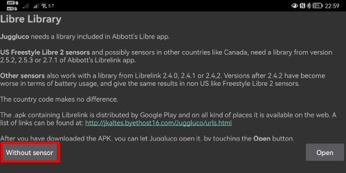

Freestyle Libre 3
**************************************************

Freestyle Libre 3 sistemi, tehlikeli kan şekeri düzeylerini otomatik olarak bildirebilir. Libre3 Sensörü, mevcut kan şekeri seviyesini her dakika bir alıcıya (okuyucu veya akıllı telefon) gönderir. Alıcı, gerekirse bir alarmı tetikler. With a modified LibreLink app, Juggluco app and the xDrip+ app, you can continuously receive and display your blood sugar level on your smartphone. It's even possible to receives older data out of the sensor memory (two hours minutely glucose and two weeks once per 5 minute history data.) This is sendt to Juggluco.

Sensör, glikometre ölçümleri ve sensör okumaları arasındaki farkları ayarlamak için -40 mg/dl ila +20 mg/dl (-2,2 mmol/l ila +1,1 mmol/l) aralığında kalibre edilebilir.

Current limitations
~~~~~~~~~~~~~~~~~~~~~~~~~~~~~~~~~~~~~~~~~~~~~~~~~~

-  It's currently not confirmed if this solution is working with US version of the Freestyle Libre 3 sensors!
-  The app will only work for arm64 systems (64 bit systems). Most modern phones are supported. If you are unsure, just try to install the patch and try to start the app.
-  If you have a rooted system, you need to cover the root. Here you got some instructions: `link <https://www.reddit.com/r/Freestylelibre/comments/s22vlr/comment/hw2p4th/?utm_source=share&utm_medium=web2x&context=3>`_.
-  Juggluco (required app to receive the libre3 readings) does only support English, Dutch and Italian languages. The patched Libre3 app does support: ar, de, es, fr, hi, in, it, ja, ko, my, nl, pt, ru, th, tr and vi.

Step 1: Download and setup the patched LibreLink-App
==================================================

Download the patched .apk file `here <https://github.com/maheini/FreeStyle-Libre-3-patch/raw/main/Patched%20Apk/Libre%203_v3.3.0_apkfab.com.apk>`_ or `here <https://apkfab.com/libre-3/com.freestylelibre3.app.de/apk?h=142cfbb2e0b1f10cd280408b10c5a5127e46e00e78d7775dae382529921487e9>`_ and install it on your phone.

After you successfully installed the app on your phone, open the app. If you see any warning like the one below, you can ignore it. (The app is working with any EU sensor)

.. image:: ../images/libre3/step_1.jpg
   :alt: LibreLink warning

If you are on the screen “Create an Account”, you got the option to create a LibreView account. This might be a good option, as you got the possibility to re-enable a sensor with a different app. It also allows you to share the BG data to LibreView. I you don’t like to, just press “Skip” at the top right.

.. image:: ../images/libre3/step_2.jpg
   :alt: LibreView account

Plese select your Unit of Messurement on this screen. You can change it later as well.

.. image:: ../images/libre3/step_3.jpg
   :alt: Measurement Unit selection

If you got a Popup, asking for “Ignore battery optimisation?”, click “ALLOW”. This will keep the Libre3 app running in the background.

.. image:: ../images/libre3/step_4.jpg
   :alt: Disable battery optimisations

Now you should have set up the Libre3 app. Let’s continue with the connection to Juggluco

Step 2: Connect Libre3 with Juggluco
==================================================

Open the Libre3 sidebar and select Juggluco.

.. image:: ../images/libre3/step_5.jpg
   :alt: Juggluco menu

Within the Juggluco menu, ensure "Port" is set to 7117 and click “Add Connection” on the bottom.

.. image:: ../images/libre3/step_6.jpg
   :alt: Juggluco overview

Now, fill in everything, according to the image below:

.. image:: ../images/libre3/step_7.jpg
   :alt: Libre Juggluco setup

It you are done, click on “Save” to confirm your setttings. Awesome, you can close the Libre3 app now!

Step 3: Setup Juggluco
==================================================

Download and install `Juggluco app from
GooglePlay <https://play.google.com/store/apps/details?id=tk.glucodata&pcampaignid=pcampaignidMKT-Other-global-all-co-prtnr-py-PartBadge-Mar2515-1>`_.

Now let’s open the app. You will be greeted with this screen below. Just click the “Without sensor” button.

After that, you get a short introduction text. Click on “OK”.

.. image:: ../images/libre3/step_9.jpg
   :alt: Juggluco instroduction screen

Ok, let’s setup Juggluco! The app itself doesn’t have the best Interface, but it’s a very useful app. To open the settings, click anywhere on the top left screen. Now you should see this menu below. Select “Settings”.

.. image:: ../images/libre3/step_10.jpg
   :alt: Juggluco settings menu

Within the settings, you can configure the data-connection to xDrip. Click on “Send to xDrip” and press “OK”.

.. image:: ../images/libre3/step_11.jpg
   :alt: Juggluco settings

Press on the top left center within the Juggluco app. A new menu should pop up. Please select “Mirror”.

.. image:: ../images/libre3/step_12.jpg
   :alt: Juggluco connection menu

You should see this screen. Please check the port settings on the top right corner, which should be set to "8795" and after that, tap on "Add Connection". (Keep in mind, within the Juggluco app the ports are switched) 

.. image:: ../images/libre3/step_13.jpg
   :alt: Juggluco connection screen

Now let’s fill in all the settings as shown below and your password according to your Libre3 password. If you did that - press “Save” to confirm.

.. image:: ../images/libre3/step_14.jpg
   :alt: Juggluco connection settings

Well done! You can now try to press the “Sync” button within the previous menu. After some time, Juggluco should receive the blood glucose values automatically from Libre3 app.

Now start the Libre3 sensor with the patched app by simply scanning the sensor. Tüm ayarların doğru yapıldığından emin olun. You can use a sensor that was already used with the original Libre3 app if you specify the same LibreView account name. You have to press "Start New Sensor" and  scan the sensor. If you want to go back to the unpatched Libre 3 app, you have to do the same.

Başarılı sensör başlatma için zorunlu ayarlar:

-  NFC etkin / BT etkin
-  memory and location permission enabled
-  location service enabled
-  automatic time and time zone setting
-  set at least one alarm in the patched app

Konum hizmetinin merkezi bir ayar olduğunu lütfen unutmayın. Bu, ayrıca ayarlanması gereken uygulama konumu izni değildir!

Step 4: Finally set up xDrip
==================================================

Kan şekeri değerleri akıllı telefonda xDrip+ uygulaması tarafından alınır. 

* Henüz kurmadıysanız, xDrip+ uygulamasını indirin ve `buradan <https://github.com/NightscoutFoundation/xDrip/releases>`_ en son derlemelerden birini yükleyin.
* xDrip+'da veri kaynağı olarak "Libre2 (Yamalı uyg)" öğesini seçin
* Gerekirse, Gelişmiş Ayarlar->Ekstra Günlük Ayarları->Günlük için ekstra etiketler altında "BgReading:d,xdrip libre_receiver:v" girin. Bu, sorun giderme için ek hata mesajlarını günlüğe kaydeder.
* xDrip+'da Ayarlar > Uyg.lar-arası ayarlar > Verileri Yerel Olarak Yayınla'ya gidin ve AÇ'ı seçin.
* xDrip+'da Ayarlar > Uyg.lar-arası ayarlar > Tedaviyi Kabul Et'e gidin ve KAPALI'yı seçin.
* AAPS'nin xDrip+'tan kan şekeri düzeylerini (sürüm 2.5.x ve üstü) almasını sağlamak için lütfen `Ayarlar > Uyg.lar-arası ayarlar > Alıcıyı Tanımla "info.nightscout.androidaps" öğesini ayarlayın <../Configuration/xdrip.html#identify-receiver> `_
* AndroidAPS'i kalibre etmek için kullanmak istiyorsanız, xdrip'te Ayarlar > Uyg.lar-arası ayarlar > Kalibrasyonları Kabul Et'e gidin ve AÇIK'ı seçin.  Ayarlar > Daha Az Ortak Ayarlar > Gelişmiş Kalibrasyon Ayarları'ndaki seçeneklerini de gözden geçirmek isteyebilirsiniz.

.. image:: ../images/Libre2_Tags.jpg
  :alt: xDrip LibreLink oturum açma

Step 5: Start sensor within xDrip
==================================================

xDrip'te sensörü "Sensörü başlat" ve "bugün değil" ile başlatın. 

Aslında bu, herhangi bir Libre2 sensörünü fiziksel olarak başlatmaz (sensörü ya kendi cihazı ya da nfc özellikli bi telefon ve librelink uygulaması ile başlatmanız gerekir.) Bu sadece xDrip+'ın yeni bir sensörün kan şekeri seviyelerini ilettiğini anlamak içindir. Varsa, ilk kalibrasyon için iki ölçümlü glikometre değeri girin. Şimdi kan şekeri değerleri her 5 dakikada bir xDrip+'da görüntülenmelidir. Atlanan değerler, ör. telefonunuzdan çok uzakta olduğunuz zamanlar için, doldurulmayabilr.

Bir sensör değişikliğinden sonra xDrip+ yeni sensörü otomatik olarak algılar ve tüm kalibrasyon verilerini siler. Aktivasyondan sonra kanlı KŞ'nizi kontrol edebilir ve yeni bir başlangıç kalibrasyonu yapabilirsiniz.

Step 6: Configure AndroidAPS (for looping only)
==================================================

* AndroidAPS'de Konfigürasyon ayarları > KŞ Kaynağı'na gidin ve 'xDrip+' seçeneğini işaretleyin 
* Telefon uçak modundayken AndroidAPS KŞ değerlerini almıyorsa, 'xDrip+ ayarlar sayfasında <../Configuration/xdrip.html#identify-receiver>'_ açıklandığı gibi 'Alıcıyı tanımla'yı kullanın.

Halihazırda, Libre 2'i KŞ kaynağı olarak kullanıyorsanız, SMB algoritmasında "SMB'yi her zaman etkinleştir" ve "Karbonhidrattan sonra SMB'yi etkinleştir"i işaretleyemezsiniz. Libre 2'in KŞ değerleri, bu seçenekleri güvenle kullanmak için yeterince düzgün değildir. Daha fazla ayrıntı için `Kan şekeri verilerini yumuşatma <../Usage/Smoothing-Blood-Glucose-Data-in-xDrip.html>`_ bölümüne bakın.

Deneyimler ve Sorun Giderme
==================================================

Troubleshooting Libre3 no readings
--------------------------------------------------

-  Android location service is not granted - please enable it in the system settings
-  automatic time and time zone not set - please change the settings accordingly
-  Bluetooth is switched off - please switch on

Troubleshooting Libre3 -> Juggluco connection
--------------------------------------------------

-  Ensure if Libre3 is receiving any readings
-  Check your settings & password again
-  Click “Sync” within Libre3->Juggluco and “Sync” and “Reinit” button within Juggluco->Mirror
-  It is possible that sometimes after configuring everything, you have to force close Libre3 and restart it.
-  Wait some time or try to force close Juggluco
-  Older versions of Juggluco (below 2.9.6) will not send back-filled data from the Libre3 sensor to connected devices (for example Juggluco on WearOS.) It is possible that you have to press "Resend Data" on within the patched Libre 3 app (Juggluco menu) for this.

Further help
--------------------------------------------------

Original instructions: `jkaltes website <http://jkaltes.byethost16.com/Juggluco/libre3/>`_

Additional Github repo: `Github link <https://github.com/maheini/FreeStyle-Libre-3-patch>`_