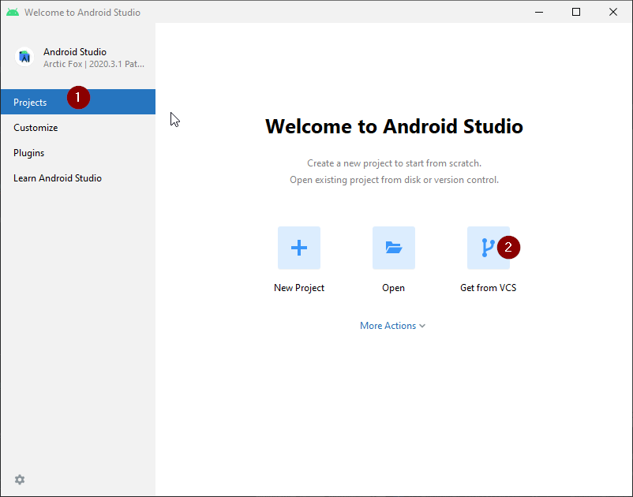
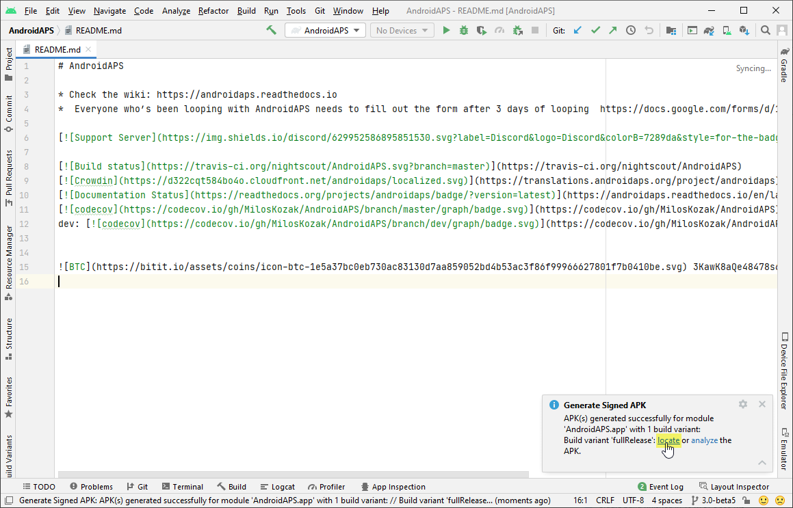

# APK oluşturma

## Programı İndirmek yerine kendiniz oluşturun...

**AndroidAPS, tıbbi cihazlarla ilgili düzenlemeler nedeniyle indirilebilen bir uygulama değildir. Uygulamayı kendi kullanımınız için oluşturmak yasaldır, ancak bir kopyasını başkasına vermemelisiniz! Ayrıntılar için [SSS sayfasına](../Getting-Started/FAQ.md) bakın.**

## Önemli notlar

* Apk'yi oluşturmak için lütfen **[Android Studio Sürüm 2020.3.1](https://developer.android.com/studio/)** veya daha yenisini kullanın.
* [Windows 10 32-bit systems](troubleshooting_androidstudio-unable-to-start-daemon-process) are not supported by Android Studio 2020.3.1

(Building-APK-recommended-specification-of-computer-for-building-apk-file)=

## apk dosyası oluşturmak için önerilen bilgisayar özellikleri

<table class="tg">
  
<thead>
  <tr>
    <th class="tg-baqh">İşletim Sistemi (Sadece 64 bit)</th>
    <th class="tg-baqh">Windows 8 veya üstü</th>
    <th class="tg-baqh">Mac OS 10.14 veya üstü</th>
    <th class="tg-baqh">Herhangi bir Linux, Gnome, KDE veya Unity DE;&nbsp;&nbsp;GNU C Library 2.31 veya sonraki sürümünü destekler</th>
  </tr>
</thead>
<tbody>
  <tr>
    <td class="tg-baqh"><p align="center">CPU (Sadece 64 bit)</td>
    <td class="tg-baqh">x86_64 2. nesil CPU mimarisi Intel Core veya daha yenisi ya da<br><a href="https://developer.android.com/studio/run/emulator-acceleration#vm-windows" target="_blank" rel="noopener noreferrer"><span style="text-decoration:var(--devsite-link-text-decoration,none)">Windows Hypervisor</span></a> desteğine sahip AMD CPU</td>
    <td class="tg-baqh">ARM tabanlı yongalar veya <br><a href="https://developer.android.com/studio/run/emulator-acceleration#vm-mac" target="_blank" rel="noopener noreferrer"><span style="text-decoration:var(--devsite-link-text-decoration,none)">Hypervisor.Framework</span></a> desteğine sahip 2. nesil Intel Core veya daha yenisi</td>
    <td class="tg-baqh">x86_64 CPU mimarisi; 2. nesil Intel Core veya daha yenisi veya AMD Sanallaştırma (Virtualization) (AMD-V) ve SSSE3 desteğine sahip AMD işlemci</td>
  </tr>
  <tr>
    <td class="tg-baqh"><p align="center">Bellek(RAM)</td>
    <td class="tg-baqh" colspan="3"><p align="center">8Gb veya daha fazla</td>
  </tr>
  <tr>
    <td class="tg-baqh"><p align="center">Depolama alanı</td>
    <td class="tg-baqh" colspan="3"><p align="center">En az 30GB boş alan. SSD önerilir.</td>
  </tr>
  <tr>
    <td class="tg-baqh"><p align="center">Çözünürlük</td>
    <td class="tg-baqh" colspan="3"><p align="center">Minimum 1280 x 800 <br></td>
  </tr>
  <tr>
    <td class="tg-baqh"><p align="center">İnternet</td>
    <td class="tg-baqh" colspan="3"><p align="center">Geniş bant</td>
  </tr>
</tbody>
</table>

Please be in mind that both **64 bit CPU and 64 bit OS are mandatory condition.** If your system DOES NOT meet this condition, you have to change affected hardware or software or the whole system. **It is strongly recommended to use SSD (Solid State Disk) instead of HDD (Hard Disk Drive) because it will take less time when you are building the APS installation apk file.** Recommended is just recommended and it is not a mandatory. However, you may still use a HDD when you are building apk file but note that the building process can take a long time to complete, although once started, you can leave it running unattended.

* * *

### Bu makale iki bölüme ayrılmıştır.

* Genel bakış bölümünde, APK dosyasını oluşturmak için hangi adımların gerekli olduğuna dair bir açıklama vardır.
* Adım adım izleme bölümünde, somut bir kurulumun ekran görüntülerini bulacaksınız. APK'yı oluşturmak için kullanacağımız yazılım geliştirme ortamı olan Android Studio'nun sürümleri çok hızlı değişeceğinden, bu sizin kurulumunuzla aynı olmayacak ancak size iyi bir başlangıç noktası sunacaktır. Android Studio ayrıca Windows, Mac OS X ve Linux üzerinde çalışır ve her platform arasında bazı yönlerden küçük farklılıklar olabilir. Önemli bir şeyin yanlış veya eksik olduğunu fark ederseniz, lütfen "AndroidAPS kullanıcıları" facebook grubuna haber verin veya Discord chat sohbet grubu altında [Android APS](https://discord.gg/4fQUWHZ4Mw)'a bir göz atabilirsiniz.

## Genel Bakış

In general, the steps necessary to build the APK file:

1. [Git yükleyin](../Installing-AndroidAPS/git-install.md)
2. [Android Studio'yu yükleyin](Building-APK-install-android-studio)
3. [Android Studio tercihlerinde git yolunu ayarlayın](Building-APK-set-git-path-in-preferences)
4. [AndroidAPS kodlarını indirin](Building-APK-download-androidaps-code)
5. [Android SDK'i indirin](Building-APK-download-android-sdk)
6. [Build the app](Building-APK-generate-signed-apk) (generate signed apk)
7. [Telefonunuza apk dosyasını aktarın](Building-APK-transfer-apk-to-smartphone)
8. [Eğer xDrip+ kullanıyorsanız, alıcıyı tanımlayın](xdrip-identify-receiver)

## Adım adım izlenecek yol

Detailed description of the steps necessary to build the APK file.

## Git'i kurun (eğer yüklü değilse)

Follow the manual on the [git installation page](../Installing-AndroidAPS/git-install.md).

(Building-APK-install-android-studio)=

## Android Studio'yu yükleyin

The following screenshots have been taken from Android Studio Version Arctic Fox | 2020.3.1. Screens can change in future versions of Android Studio. But you should be able to find your way through. [Help from the community](../Where-To-Go-For-Help/Connect-with-other-users.md) is provided.

One of the most important things when installing Android Studio: **Be patient!** During installation and setup Android Studio is downloading a lot of stuff which will take its time.

Download [Android Studio from here](https://developer.android.com/studio/install.html) and install it on your computer.

On first start you will find the setup wizard:

Select "Do not import settings" as you have not used it before.


Decide whether you want to share data with Google or not.


On the following screen click "Next".


Select "Standard" installation and click "Next".


Select the theme for the user interface you like. (In this manual we used "Light".) Then click "Next".

> ***Not:*** Bu yalnızca renk şemasıdır. İstediğinizi seçebilirsiniz (yani karanlık mod için "Darcula"). Bu seçimin APK oluşturma üzerinde hiçbir etkisi yoktur, ancak aşağıdaki ekran görüntüleri farklı görünebilir.


Click "Finish" on the "Verify Settings" dialog.


Wait while Android Studio downloads additional components and be patient. Once everything is downloaded button "Finish" turns blue. Click the button now.


(Building-APK-set-git-path-in-preferences)=

## Git yolunu tercihlerde ayarla

Make sure [git is installed](../Installing-AndroidAPS/git-install.md) on your computer and you have restarted your computer after installing.

On the Android Studio welcome screen click "Customize" (1) on the left and then select the link "All settings..." (2):


### Windows

* As windows user, make sure you have restarted your computer after [installing Git](../Installing-AndroidAPS/git-install.md).

* Alt menüyü açmak için "Version Control" (1) (Sürüm Kontrolü) üzerine çift tıklayın.

* Git (2)'e tıklayın.
* Güncelleme yönteminin "Merge" (3) (Birleştir) seçili olduğundan emin olun.
* "Test" (4) düğmesini tıklayarak Android Studio'nun git.exe yolunu otomatik olarak bulup bulamayacağını kontrol edin.
    
    

* Otomatik ayar başarılı olursa, yolun yanında git sürümü görüntülenecektir.
    
    

* Sonunda git.exe otomatik olarak bulunamaz veya Test bir hatayla (error) (1) sonuçlanır :
    
    
    
    Bu durumda klasör simgesine (2) tıklayın.

* Git'in nereye kurulduğundan emin değilseniz, "git.exe"yi bulmak için Windows Gezgini'nde [arama işlevini](https://www.tenforums.com/tutorials/94452-search-file-explorer-windows-10-a.html) kullanın. **\bin** klasöründe bulunan "git.exe" adlı bir dosya arıyorsunuz.

* git.exe yolunu seçin ve ** \bin\ ** klasöründe (3) olanı seçtiğinizden emin olun ve "OK" (4) Tamam'a tıklayın.
    
    

* Seçtiğiniz git yolunu yukarıda açıklandığı gibi "Test" düğmesiyle tekrar kontrol edin.

* Yolun yanında git sürümü görüntülendiğinde (yukarıdaki ekran görüntüsüne bakın), "OK" düğmesini (5) tıklayarak ayarlar penceresini kapatın.

### Mac

* Herhangi bir git sürümü çalışması gerekir. Örneğin <https://git-scm.com/download/mac>.
* Git'i kurabilmek için homebrew kullanın: ```$ brew install git```.
* Git'i yüklemeyle ilgili ayrıntılar için [resmi git belgelerine](https://git-scm.com/book/en/v2/Getting-Started-Installing-Git) bakın.
* Git'i homebrew aracılığıyla kurarsanız, herhangi bir tercihi değiştirmenize gerek yoktur. Her ihtimale karşı: Android Studio - Tercihler altında bulabilirsiniz.

(Building-APK-download-androidaps-code)=

## AndroidAPS kodlarını indirin

* Android Studio karşılama ekranında soldaki "Projects" (1) projeler ve ardından "Get from VCS" (2) VCS'den Alın öğesini seçin.
    
    
    
    * Android Studio'yu zaten açtıysanız ve artık hoş geldiniz ekranını görmüyorsanız, Sürüm Kontrolünden Dosya (1) > Yeni (2) > Proje'yi seçin... (3)
        
        
    
    * Şimdi Android Studio'ya kodu nereden alacağını söyleyeceğiz:
    
    * Solda (1) taraftaki "Repository URL"ni seçtiğinizden emin olun.
    
    * Versiyon kontrolü (2) olarak "Git"in seçili olup olmadığını kontrol edin.
    * URL'yi kopyalayıp yapıştırın ```https://github.com/nightscout/AndroidAPS``` ana AndroidAPS deposuna URL metin kutusuna (3) kopyalayıp yapıştırın.
    * Klonlanmış kodu (4) kaydetmek istediğiniz dizini seçin.
        
        

* "Klonla" (5) düğmesine tıklayın.
    
    

* Depo klonlanırken "Arka Plan"a tıklamayın!

* Depo başarıyla klonlandıktan sonra, Android Studio klonlanan projeyi açacaktır.

* Projeye güvenmek isteyip istemediğiniz sorulacak. "Trust project" (Projeye güven) üzerine tıklayın!
    
    

* Alttaki durum çubuğunda, Android Studio'nun arka plan görevlerini çalıştırdığı bilgisini göreceksiniz.
    
    

* Güvenlik duvarınız izin istiyorsa erişim izni verin.
    
    

* Arka plan görevleri bittiğinde, muhtemelen (1) veya (2) veya (3) hataların oluştuğunu söyleyen bir hata göreceksiniz.
    
    
    
    Endişelenmeyin, bu yakında çözülecek!

(Building-APK-download-android-sdk)=

## Android SDK'i indirin

* Menüde File (1) > Settings (2)'ye gidin.
    
    

* Alt menüsünü (1) açmak için "Appearance & Behaviour" üzerine çift tıklayın.

* System Settings'e (2) çift tıklayın ve Android SDK'yı (3) seçin.
* "Android 9.0 (Pie)" (4) (API Level 28) öğesinin solundaki kutuyu işaretleyin.
    
    

* Ok tıklatarak değişiklikleri onaylayın.
    
    

* Lisans sözleşmesini (1) kabul edin ve "Next"ye (2) tıklayın.
    
    

* SDK indirmesi ve kurulumu tamamlanana kadar bekleyin.
    
    

* SDK kurulumu tamamlandığında "Finish" düğmesi maviye döner. Bu düğmeye tıklayın.
    
    

* Android Studio, gradle sistemini güncellemenizi önerebilir. **Gradle'ı asla güncellemeyin!** Bu zorluklara yol açacaktır!

* Android Studio pencerenizin sağ alt tarafında Android Gradle Plugin'in güncellemeye hazır olduğuna dair bir bilgi görürseniz, "güncelleme" (1) metnine tıklayın.
    
    

* İletişim kutusunda "Bana bu proje için bir daha hatırlatma" (2) öğesini seçin.
    
    

* Devam etmeden önce Android Studio'yu yeniden başlatın.

(Building-APK-generate-signed-apk)=

## İmzalı APK oluştur

Signing means that you indicate your app to be your own creation but in a digital way as a kind of digital fingerprint within the app itself. That is necessary because Android has a rule that it only accepts signed code to run for security reasons. For more information on this topic, follow [this link](https://developer.android.com/studio/publish/app-signing.html#generate-key).

* Android Studio başlatıldıktan sonra tüm arka plan görevleri bitene kadar bekleyin.
    
    
    
    * ***Uyarı:*** Hata oluşursa, aşağıdaki adımlara devam etmeyin. \ Bilinen sorunlar için [sorun giderme bölümüne](../Installing-AndroidAPS/troubleshooting_androidstudio) bakın!
    
    

* Menü çubuğunda "Build"a (1) tıklayın ve "Generate Signed Bundle / APK..." (2) öğesini seçin.
    
    

* "Android App Bundle" yerine "APK"yı (1) seçin ve "İleri"ye (2) tıklayın.
    
    

* Modülün "AndroidAPS.app" (1) olarak ayarlandığından emin olun.

* Kendi "key store" oluşturmaya başlamak için "Create new..." (2) öğesini tıklayın.
    
    ***Not:*** Bu durumda bir key store imzalama bilgilerinin depolandığı bir dosyadan başka bir şey değildir. Şifrelenir ve bilgiler şifrelerle güvence altına alınır.
    
    

* Anahtar deponuz için bilgisayarınızda bir yol seçmek için klasör sembolüne tıklayın.
    
    

* Key store'un kaydedileceği yolu seçin (1).
    
    
    
    ***Uyarı: Proje ile aynı klasöre kaydetmeyin. Farklı bir dizin kullanmalısınız!*** İyi bir konum, Ev klasörünüz olacaktır.

* Key store (2) için bir dosya adı yazın ve "OK" (3) ile onaylayın.

* Key store parolasına girin (2) ve onaylayın(3). 
    
    ***Not:*** key store ve key için parolaların çok karmaşık olması gerekmez. Bunları hatırladığınızdan veya güvenli bir yere not aldığınızdan emin olun. In case you will not remember your passwords in the future, see [troubleshooting for lost key store](troubleshooting_androidstudio-lost-keystore).

* Key için bir takma ad alias (4) girin. Ne isterseniz seçebilirsiniz.

* Girin (5) ve key parolasını onaylayın (6)

* Geçerlilik Validity (7) varsayılan olarak 25 yıldır. Varsayılan değeri değiştirmeniz gerekmez.

* Adı ve soyadı girilmelidir (8). Diğer tüm bilgiler isteğe bağlıdır.

* İşiniz bittiğinde "OK"yi (9) tıklayın.

* Şifreleri hatırlama kutusunun işaretli olduğundan emin olun (1). Böylece, apk'yi bir sonraki oluşturduğunuzda (yani yeni bir AndroidAPS sürümüne güncelleme yaparken) bunları tekrar girmeniz gerekmez.

* "Next"i (2) tıklayın.
    
    

* Derleme varyantını seçin "fullRelease" (1) seçin ve "Finish"e basın.
    
    

* Android Studio, altta "Gradle Build running" gösterecektir. Bu, bilgisayarınıza ve internet bağlantınıza bağlı olarak biraz zaman alır. **Sabırlı olun!**
    
    

* Android Studio, derleme tamamlandıktan sonra "Generate Signed APK" bilgisini görüntüler.
    
    

* Derlemenin başarılı olmaması durumunda [sorun giderme bölümüne](../Installing-AndroidAPS/troubleshooting_androidstudio) bakın.

* Genişletmek için bildirime tıklayın.

* "Bul" bağlantısını tıklayın.
    
    
    
    * Bildirim kaybolursa, her zaman "Olay günlüğü"nü açabilir ve orada aynı bağlantıyı seçebilirsiniz. 

* Dosya yöneticiniz (Windows Gezgini) açılacaktır. "full" (1) > "release" (2) dizinine gidin.
    
    

* "app-full-release.apk" (3) aradığınız dosyadır!

(Building-APK-transfer-apk-to-smartphone)=

## APK'yı akıllı telefona aktarın

Easiest way to transfer app-full-release.apk to your phone is via [USB cable or Google Drive](https://support.google.com/android/answer/9064445?hl=en). Please note that transfer by mail might cause difficulties and is not the preferred way.

On your phone you have to allow installation from unknown sources. Manuals how to do this can be found on the internet (i.e. [here](https://www.expressvpn.com/de/support/vpn-setup/enable-apk-installs-android/) or [here](https://www.androidcentral.com/unknown-sources)).

## Sorun giderme

See separate page [troubleshooting Android Studio](../Installing-AndroidAPS/troubleshooting_androidstudio).